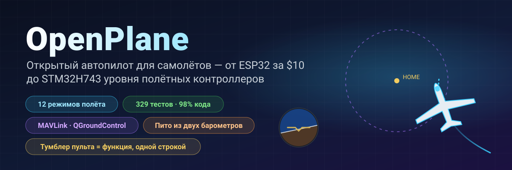
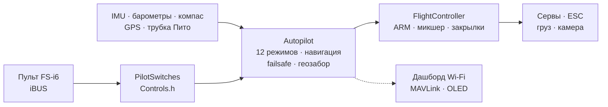

<p align="center">
  
</p>

<p align="center">
  
  
  
  <br>
  
  
  
</p>

<h3 align="center">Выключили пульт — самолёт сам вернулся домой и кружит над вами.</h3>
<p align="center">Это не мультфильм: <b>вся прошивка</b> ведёт модель самолёта в замкнутом контуре — те же байты iBUS на входе, тот же ШИМ на выходе.</p>

<p align="center">
  
</p>

---

## ⚡ За 30 секунд

| | |
|---|---|
| **Что это** | Открытый полётный контроллер и автопилот для радиоуправляемых самолётов. Сегодня — ESP32-S3 за ~$10, следующий шаг — STM32H743 (класс плат Pixhawk): полная прошивка прогоняется тестами и уже запущена на голой плате DevEBox — с чёрным ящиком на SD-карте. |
| **Что умеет** | 12 режимов полёта — от стабилизации до возврата домой, кругов по GPS, запуска с руки, автопосадки и **парения в термиках**. Трубка Пито из двух дешёвых барометров. Телеметрия MAVLink в QGroundControl и Mission Planner. |
| **Главная фишка** | Любой тумблер или крутилка пульта = любая функция. **Одна строка** в `Controls.h` — и SwD уже не RTH, а сброс груза. |
| **Почему можно верить** | 387 автотестов (плюс 9 на самой плате с настоящей SD-картой), 98 % кода под тестами, 24 сборки «плата × датчики» без единого предупреждения, замкнутые симуляции каждого режима. |
| **Честно** | В воздухе пока был ручной режим (первый прототип). Автопилот проверен на стенде, тестами и симуляциями и ждёт лётных испытаний — [статус ниже](#-честный-статус). |

---

## 🎛️ Тумблер = функция. Одна строка.

```cpp
// include/config/Controls.h
constexpr Binding BINDINGS[] = {
    Bind::modes  (Channels::SWC, MODE_MANUAL, MODE_STABILIZE, MODE_AUTO_TAKEOFF),
    Bind::feature(Channels::SWB, Feature::FLAPS),
    Bind::mode   (Channels::SWD, MODE_RTH),              // домой, пока включён
    Bind::knob   (Channels::VRA, Knob::STAB_GAIN),       // "мягче / жёстче" прямо в полёте
    Bind::knob   (Channels::VRB, Knob::CRUISE_SPEED),
};
```

Хотите на SwD парение в термиках вместо RTH? `Bind::mode(Channels::SWD, MODE_SOARING)`. Сброс груза на SwB? `Bind::feature(Channels::SWB, Feature::PAYLOAD_DROP)`. Ошиблись — например, повесили два режима на один тумблер или заняли стик — **сборка не пройдёт**: таблицу проверяет компилятор (`static_assert`). При включении борт сам печатает, что на каком тумблере.

**12 режимов · 10 функций · 7 крутилок** — всё с примерами в [справочнике автопилота](docs/AUTOPILOT_GUIDE.md).

---

## ✈️ Что умеет автопилот

| | Режим | Суть |
|---|---|---|
| 🕹️ | **MANUAL** | рули = стики, как без полётника |
| 🧭 | **STABILIZE** | стик задаёт угол; отпустил — самолёт сам в горизонте |
| 📏 | **ALT_HOLD** | + держит высоту по барометру |
| 🌀 | **ACRO** | стик задаёт скорость вращения — для фигур |
| 🛣️ | **CRUISE** | курс, высота и скорость держатся сами; стики только поправляют |
| ⭕ | **LOITER** | круги над точкой по GPS (радиус — крутилкой) |
| 🏠 | **RTH** | домой на 40 м и круги над головой; сам включается при потере связи |
| 🛫 | **AUTO_TAKEOFF** | взлёт с полосы по газу пилота |
| 🤾 | **LAUNCH** | запуск с руки: мотор после броска, набор высоты |
| 🛬 | **AUTO_LAND** | планирование и выравнивание у земли |
| 🦅 | **SOARING** | мотор выключен, находит термики и кружит в них |
| 🆘 | **RESCUE** | «спасите»: крылья ровно, нос вверх — из любой спирали |

Плюс: геозабор, автотриммер «кривого» самолёта, координация разворота, защита от сваливания по трубке Пито, закрылки и воздушный тормоз, сброс груза, стабилизированная камера, пищалка «ищите меня в траве».

---

## 📈 Каждый режим летает — в замкнутом контуре

Не «функция вернула число», а **полёт**: пульт → кадр iBUS → прошивка → ШИМ → отклонения рулей → модель самолёта с подъёмной силой, сваливанием, ветром и термиками → датчики → снова прошивка. 14 таких полётов — часть обычных тестов (`pio test -e native`).

<p align="center"></p>

<table>
  <tr>
    <td width="50%"></td>
    <td width="50%"></td>
  </tr>
  <tr>
    <td>🦅 Нашёл термик сам и набрал высоту <b>с выключенным мотором</b> — вариометр полной энергии не путает «ручку на себя» с восходящим потоком.</td>
    <td>🆘 Крен 60° — и через секунды горизонт. RESCUE вытаскивает из спирали с креном 70° и носом −40°.</td>
  </tr>
  <tr>
    <td></td>
    <td></td>
  </tr>
  <tr>
    <td>🤾 Бросок с руки → мотор только после того, как рука ушла от винта → набор. 🛬 Посадка: планирование и выравнивание на 3 м.</td>
    <td>🌬️ Скорость по трубке из двух <b>шумных</b> барометров со сдвигом 150 Па между чипами — ошибка меньше 0.5 м/с.</td>
  </tr>
</table>

---

## 🌬️ Трубка Пито за копейки

Нормальный датчик воздушной скорости стоит как половина полётника. Здесь — **два барометра**: BMP581 в трубке (полное давление) и основной барометр в фюзеляже (статика). Прошивка сама обнуляет разницу чипов на земле, фильтрует, считает плотность воздуха по высоте и температуре и замечает перепутанные шланги. Что это даёт: CRUISE держит **воздушную** скорость, а не газ; защита от сваливания; честная скорость в телеметрии. Сборка — в [справочнике](docs/AUTOPILOT_GUIDE.md#трубка-пито-своими-руками).

---

## 📡 Наземная станция: браузер или QGroundControl

<table>
  <tr>
    <td width="46%"></td>
    <td>
      <b>ESP32 — веб-дашборд прямо с борта.</b> Точка доступа <code>OpenPlane-Debug</code>, адрес <code>192.168.4.1</code>: каналы пульта, выходы, все датчики, режим, навигация, смена режима и ПИД на лету. Без приложений и лишнего железа.<br><br>
      <b>STM32H743 — MAVLink по радиомодему.</b> QGroundControl и Mission Planner видят борт как самолёт ArduPilot: горизонт, карта с домом, скорость по трубке, режимы именами ArduPlane, ПИД из окна параметров, смена режима кнопкой. ARM с земли — нельзя, только тумблером: так безопаснее.<br><br>
      Кадры MAVLink побайтно сверены с эталонной <code>pymavlink</code>.
    </td>
  </tr>
</table>

---

## 📼 Чёрный ящик

Плата пишет каждый полёт: IMU на 500 Гц, углы и решения автопилота, ПИД, все выходы, стики, барометр, компас, GPS, батарея и события — с ARM и газа до посадки, с 10 секундами до старта. **ESP32-S3** — во встроенный флеш (13.9 МБ, около 11 минут), **STM32H743** — на SD-карту (64 МБ — около часа; карта остаётся обычной FAT32, прошивка пишет в заранее созданный файл `BLACKBOX.BIN`). Стирание — только на земле. После полёта `python tools/blackbox.py download` скачивает полёт по USB и раскладывает в CSV; с SD-карты полёты разбираются и без платы: `python tools/blackbox.py ring E:/BLACKBOX.BIN`. Подробно — [BLACKBOX.md](docs/BLACKBOX.md).

---

## 🔩 Железо: одна прошивка — четыре платы, двенадцать датчиков

| Плата | Статус | Что проверено |
|---|---|---|
| **ESP32-S3 N16R8** | ✅ основная, на стенде | все датчики, сервы, iBUS, OLED, дашборд вживую; прошивка целиком — в тестах |
| **ESP32 38-pin** | 🧪 тесты | прошивка целиком в тестах с набором ICM-45686 |
| **ESP32-C3 SuperMini** | ✈️ летал (ручной) | первый прототип; сборка всех наборов |
| **STM32H743VIT6** | 🔧 голая плата DevEBox + 🧪 тесты | на плате: загрузка, консоль по USB, **SD-карта и чёрный ящик** (тесты на плате); на ПК — вся прошивка: задачи FreeRTOS, флеш, MAVLink, I2C и SPI. Датчиков и серв на плате пока нет |

| Датчик | Что это | Шины |
|---|---|---|
| **LSM6DSV** + **QMC6309** | IMU + компас (модуль) | I2C / SPI |
| **ICM-45686** + **QMC6309** | IMU + компас (замена) | I2C / SPI |
| **SPL06-001** | барометр фюзеляжа | I2C / SPI |
| **BMP581** | барометр в трубке Пито (или основной) | I2C / SPI |
| MPU6050/6500, ICM-42688, BMP388, BME280, QMC5883P/L | стендовые и прежние | I2C / SPI |
| **u-blox M10** | GPS, 10 Гц, UBX | UART |

Датчик меняется одной строкой (`SENSOR_KIT_LSM6DSV_PITOT`), плата — одним флагом сборки. Все 4 платы × 6 наборов датчиков собираются без предупреждений: [`tools/build_matrix.sh`](tools/build_matrix.sh).

<table>
  <tr>
    <td width="50%"></td>
    <td width="50%"></td>
  </tr>
  <tr>
    <td>Стенд на ESP32-S3: IMU, барометр, компас, OLED, сервы, приёмник.</td>
    <td>Тест винтомоторной группы.</td>
  </tr>
</table>

---

## 🧪 Качество, которое можно проверить

| | |
|---|---|
| **387 автотестов** | модули, драйверы по регистрам чипов, замкнутые полёты, прошивка ESP32 и STM32 **целиком** на ПК; плюс 9 тестов на самой плате STM32 с настоящей SD-картой |
| **98.3 % строк, 87.7 % ветвлений** | покрытие `gcovr`, включая код STM32 |
| **24/24 сборки** | 4 платы × 6 наборов датчиков, `-Wall -Wextra`, ноль предупреждений |
| **0 замечаний** | cppcheck и clang-tidy по всему коду |
| **Эталоны, а не копии кода** | формулы датчиков — по датащитам (Bosch, ST, TDK, Goertek), MAVLink — по pymavlink |

```bash
pio test -e native -e native-stm32   # все тесты, ~1.5 минуты, железо не нужно
```

Подробно — [TESTING.md](docs/TESTING.md).

---

## 🧠 Как устроено



- **Header-only C++**, одна единица трансляции, никакой динамической памяти в полётном контуре. Любитель `.h/.cpp`? Для вас — параллельная ветка [`feature/split-headers`](https://github.com/damir-lebedev/OpenPlaneProject/tree/feature/split-headers): генерируется из этой скриптом, прошивка с LTO того же размера.
- **HAL** — единственный слой, знающий MCU: новая плата — это новый `Board`, а не переписанный автопилот.
- **Драйвер датчика не знает шину**: один класс работает по I2C и по SPI.
- **Безопасность — порядком операций**: потеря связи > ARM > режим > газ; ни один режим не протащит газ мимо ARM.

Подробно — [ARCHITECTURE.md](docs/ARCHITECTURE.md).

---

## 🚀 Быстрый старт

```bash
pip install platformio
git clone https://github.com/damir-lebedev/OpenPlaneProject && cd OpenPlaneProject
pio run -e esp32-s3 -t upload && pio device monitor     # ESP32-S3
pio run -e stm32h743 -t upload                            # STM32H743 (ST-Link)
pio run -e stm32h743-devebox -t upload                    # DevEBox H743: USB DFU, консоль по USB
```

DevEBox: на плате нет кнопки BOOT0 — перед первой заливкой соедините пин BT0 с 3V3 и нажмите RST; потом клавиша `D` в консоли сама перезагружает плату в загрузчик ([подробно](docs/DEVELOPER_GUIDE.md#stm32h743)).

В мониторе порта: `h` — меню, `b` — какие чипы видны на шинах, `s` — датчики, `p` — проверка выходов (пропеллер снять!). Дальше — [гайд пилота](docs/PILOT_GUIDE.md).

---

## 🟢 Честный статус

| Что | Где проверено |
|---|---|
| Ручное управление, микшер | ✈️ в полёте (первый прототип, C3) |
| ARM, failsafe, закрылки, сервы, мотор | 🔧 на стенде (S3) |
| STABILIZE | 🔧 на стенде: рули отвечают на наклоны в правильную сторону |
| Датчики стенда (MPU6500, BMP388, QMC5883P), OLED, дашборд | 🔧 на стенде |
| Остальные режимы, навигация, трубка Пито, MAVLink | 🧪 тесты и замкнутые симуляции |
| Новые датчики (LSM6DSV, ICM-45686, QMC6309, SPL06, BMP581) | 🧪 регистровые эмуляторы по датащитам |
| STM32H743: SD-карта, чёрный ящик, консоль по USB | 🔧 на голой плате DevEBox (тесты на плате) |
| STM32H743: датчики, ШИМ на серво, iBUS | 🧪 вся прошивка на ПК; на плате ещё не проверялось |

Модель самолёта в симуляциях упрощённая, коэффициенты — стартовые. Каждый новый режим сначала пробуется на высоте, с пальцем на тумблере MANUAL.

---

## 🗺️ Дорожная карта

- [x] Ручное управление, ARM, failsafe, объектная прошивка, веб-дашборд
- [x] Стенд ESP32-S3 со всеми датчиками — вживую
- [x] 12 режимов, навигация по GPS, RTH при потере связи, геозабор
- [x] Тумблеры и крутилки одной строкой, сброс груза, камера, автотриммер
- [x] Трубка Пито из двух барометров, защита от сваливания
- [x] Новые датчики: LSM6DSV, ICM-45686, QMC6309, SPL06, BMP581
- [x] STM32H743: полная прошивка, MAVLink, настройки во флеше
- [x] Замкнутые симуляции всех режимов, прошивка целиком в тестах
- [x] Чёрный ящик: полёт во флеш (ESP32-S3) и на SD-карту (STM32H743), выгрузка и разбор в CSV
- [ ] Лётные испытания автопилота на новом планере
- [ ] Своя плата полётника ([FC_BOARD.md](docs/FC_BOARD.md)) на STM32H743
- [ ] Полёт по маршрутным точкам, миссии MAVLink
- [ ] Адаптивная обратная связь (заготовка уже проверена в симуляции)
- [ ] Датчик тока и батареи, телеметрия на пульт (iBUS-SENS)
- [ ] Автономная доставка: маршрут → сброс груза → домой

Подробно — [ROADMAP.md](docs/ROADMAP.md).

---

## 💼 Для партнёров и инвесторов

Небольшие самолёты-доставщики и мониторинговые борта — это либо закрытые дорогие платформы, либо разрозненные хобби-проекты. OpenPlane целится в середину: **открытый, проверяемый автопилот на массовом железе**, где каждая функция покрыта тестами и может быть адаптирована под задачу — доставка медикаментов в труднодоступные места, мониторинг полей и лесов, поисковые работы.

Что уже сделано на свои: архитектура, которая переносится между платами без переписывания; автопилот с полным набором режимов; инфраструктура тестов, на которой новые функции появляются быстро и не ломают старые. Что ускорят ресурсы: лётные испытания, своя плата полётника на STM32H743, полёт по маршруту и сброс груза. Куда и зачем — [ROADMAP.md](docs/ROADMAP.md).

---

## 📚 Документация

| Документ | Для кого |
|---|---|
| [AUTOPILOT_GUIDE.md](docs/AUTOPILOT_GUIDE.md) | пилоту: каждый режим, функция и крутилка, как повесить на тумблер, трубка Пито, наземная станция |
| [PILOT_GUIDE.md](docs/PILOT_GUIDE.md) | сборка, распиновка, пульт, failsafe, первый полёт |
| [DEVELOPER_GUIDE.md](docs/DEVELOPER_GUIDE.md) | разработчику: файлы, знаки, API, как добавить датчик, режим, плату |
| [ARCHITECTURE.md](docs/ARCHITECTURE.md) | слои, задачи, такт управления, автоматы |
| [TESTING.md](docs/TESTING.md) | тесты, симуляции, покрытие, анализ |
| [reference/](docs/reference/README.md) | справочник по каждому классу |
| [FC_BOARD.md](docs/FC_BOARD.md) · [ROADMAP.md](docs/ROADMAP.md) | плата полётника · куда движется проект |

> **Связанный проект:** [esp32-rc-joystick](https://github.com/damir-lebedev/esp32-rc-joystick) — пульт FS-i6 как USB-джойстик для симулятора на той же ESP32-S3: сначала налетать часы в симуляторе, потом — в поле.

---

## 🤝 Участие и лицензия

Нужны руки и головы: аэродинамика и авиамоделизм, 3D-печать и прочность, встраиваемый C++, датчики и автопилоты, наземные интерфейсы. Issues и pull request'ы — в ветку `main`; начать — с [DEVELOPER_GUIDE.md](docs/DEVELOPER_GUIDE.md).

Лицензия пока не выбрана — это открытый вопрос, а не забытая деталь.

<p align="center"><i>Первый прототип сломался в первом же полёте — поэтому здесь всё на виду: код, тесты, проблемы. Собирайте, ломайте, чините вместе с нами.</i></p>
