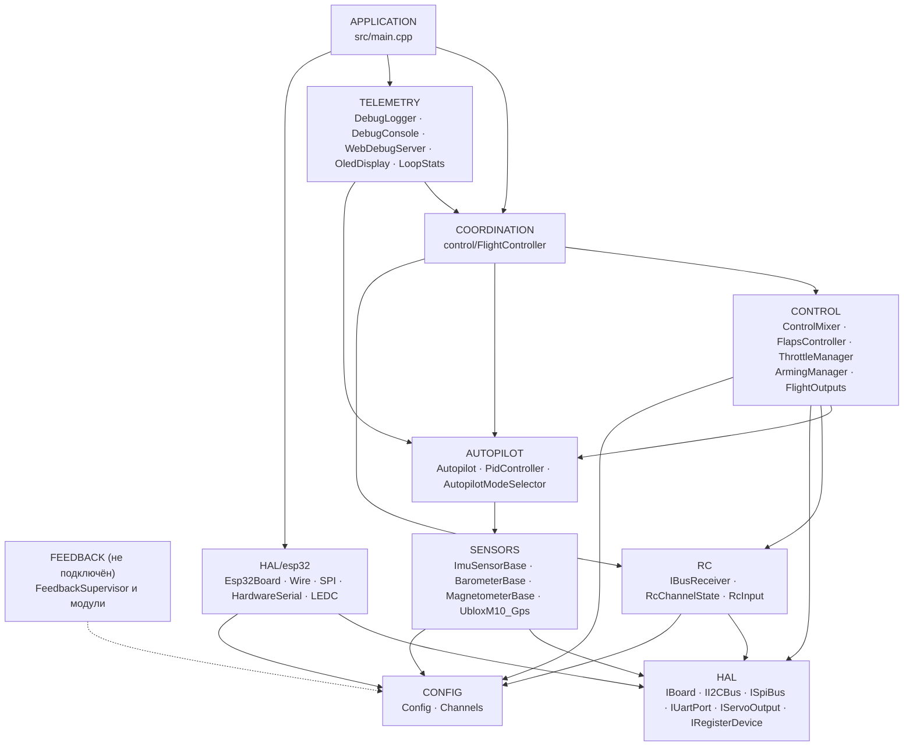
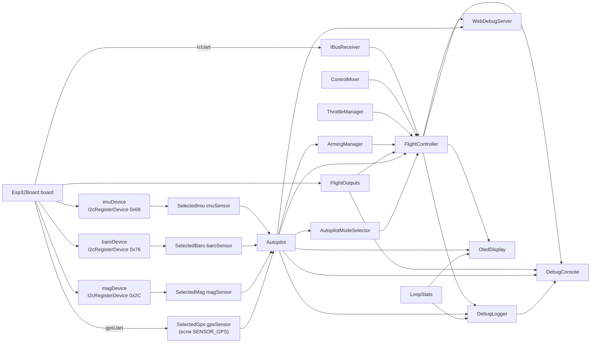
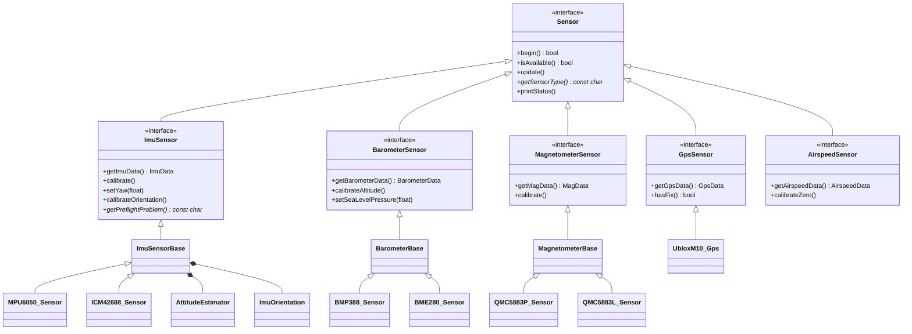
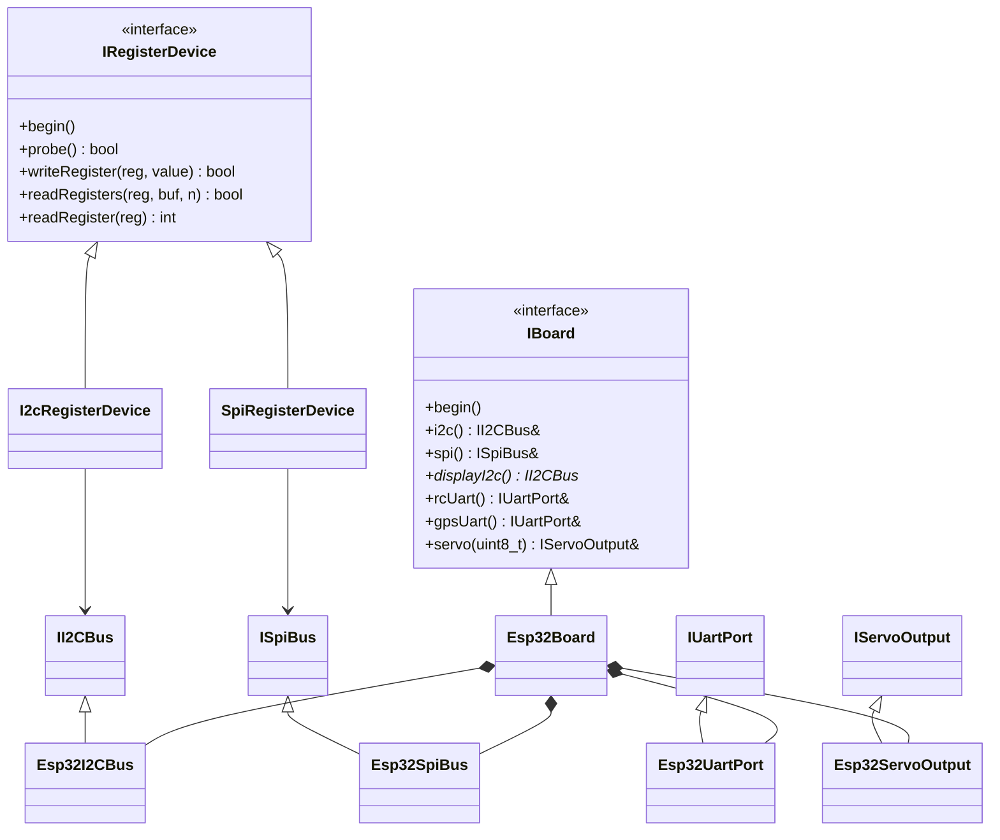
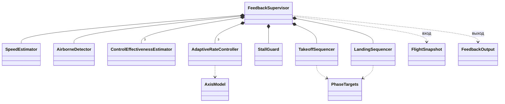
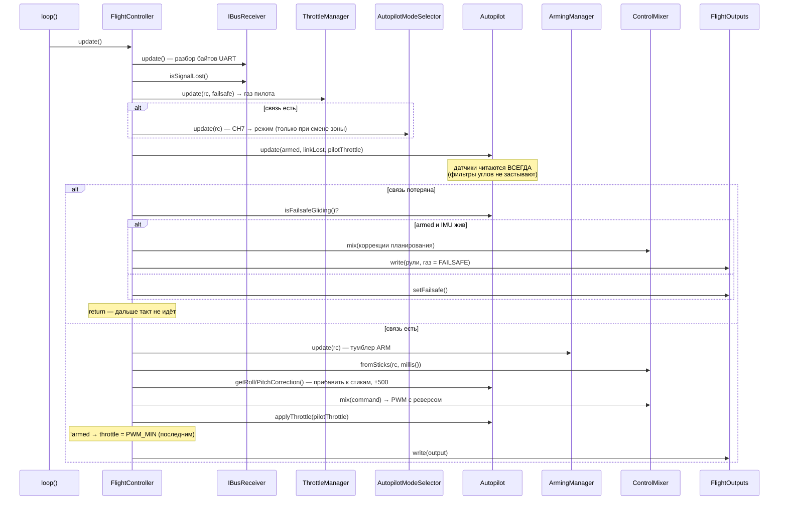
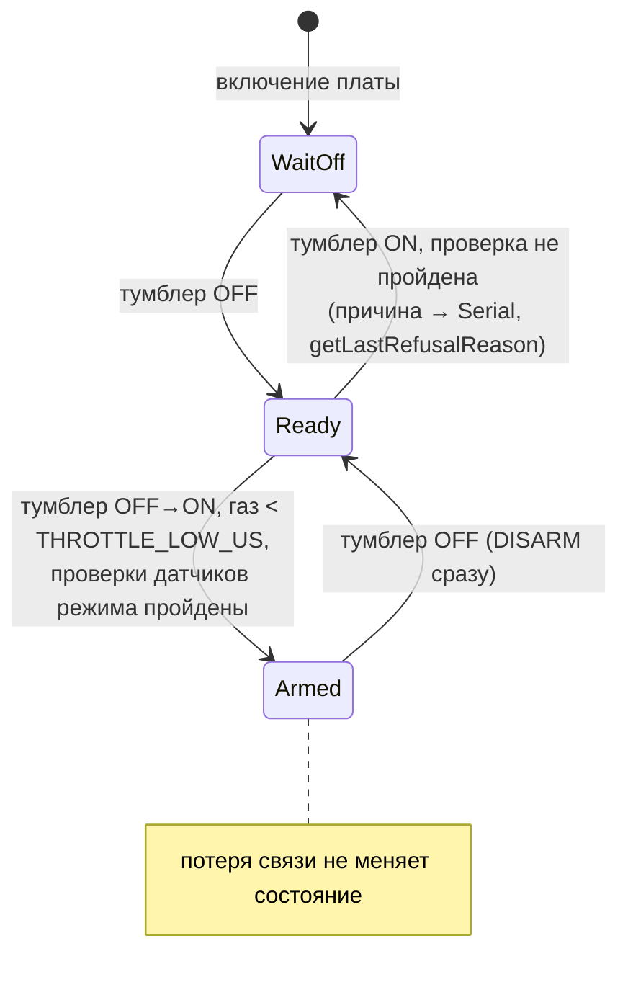
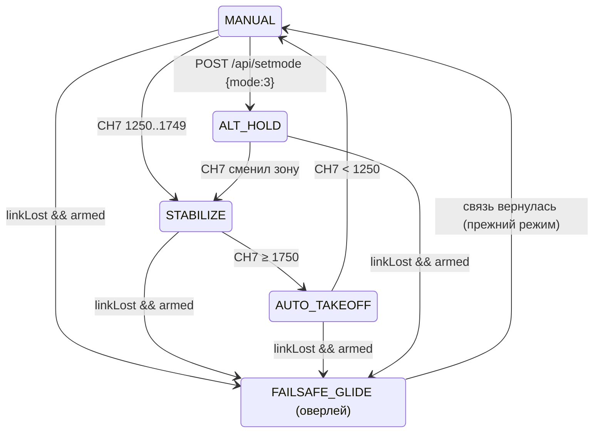
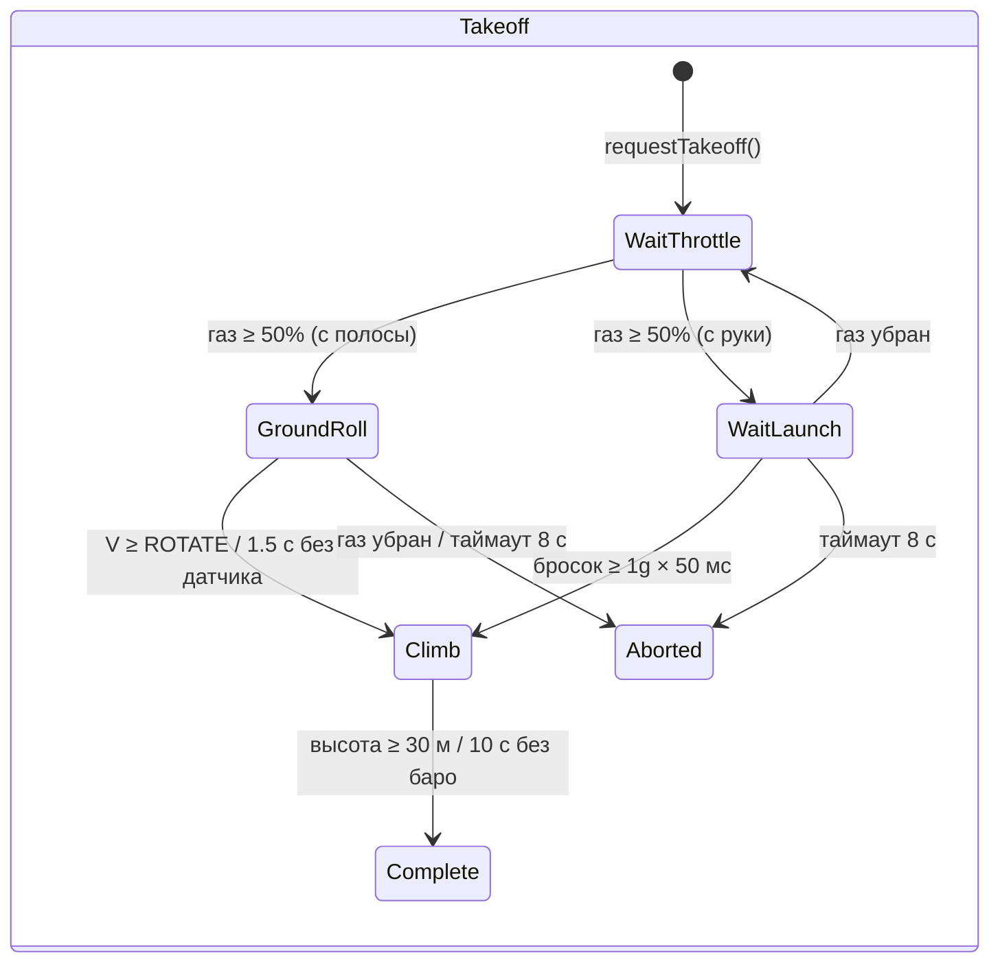
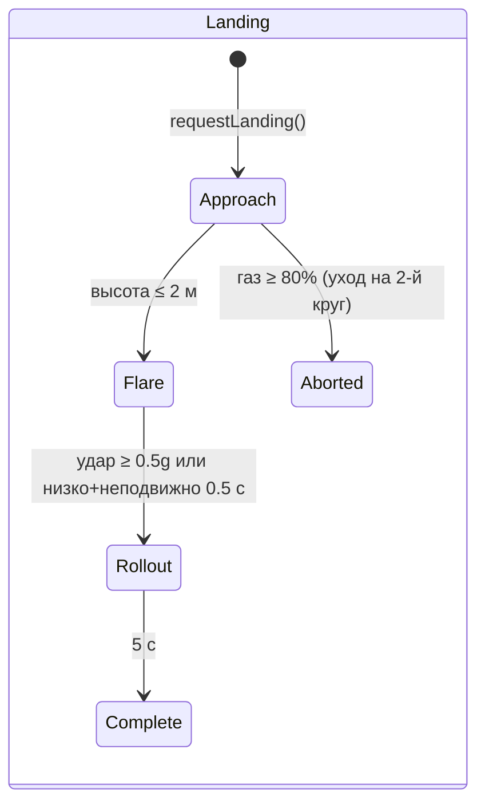

# ARCHITECTURE.md — архитектура прошивки OpenPlaneProject

Этот документ описывает, **как устроена прошивка целиком**: слои и правила
зависимостей между ними, граф объектов, модель потоков FreeRTOS, порядок
операций за такт, конечные автоматы, стратегию отказоустойчивости датчиков и
точки расширения. Подробный справочник по каждому классу (публичный API,
поля, инварианты) — в [`reference/`](reference/README.md).

Связанные документы:

| Документ | О чём |
|---|---|
| [`DEVELOPER_GUIDE.md`](DEVELOPER_GUIDE.md) | Практическое руководство: соглашение о знаках, HTTP API, консоль, как добавить датчик/режим/плату |
| [`reference/`](reference/README.md) | Справочник по всем классам, структурам и пространствам имён |
| [`TESTING.md`](TESTING.md) | Тесты: нативные (на ПК, с покрытием) и на плате |
| [`PILOT_GUIDE.md`](PILOT_GUIDE.md) | Сборка, распиновка, пульт, первый полёт |
| [`ROADMAP.md`](ROADMAP.md) | Куда движется проект |

> Статус: стенд на ESP32-S3 проверен со всеми датчиками, **автопилот в полёте
> не испытан**, контур обратной связи (`autopilot/feedback/`) в прошивку **не
> подключён** и проверяется только симуляцией.

---

## Содержание

1. [Принципы](#1-принципы)
2. [Слои и правила зависимостей](#2-слои-и-правила-зависимостей)
3. [Граф объектов (composition root)](#3-граф-объектов-composition-root)
4. [Иерархии классов](#4-иерархии-классов)
5. [Потоки FreeRTOS и разделение данных](#5-потоки-freertos-и-разделение-данных)
6. [Такт управления: `FlightController::update()`](#6-такт-управления-flightcontrollerupdate)
7. [Конечные автоматы](#7-конечные-автоматы)
8. [Отказоустойчивость: датчики, связь, выходы](#8-отказоустойчивость-датчики-связь-выходы)
9. [Конфигурация и варианты сборки](#9-конфигурация-и-варианты-сборки)
10. [Контур обратной связи (не подключён)](#10-контур-обратной-связи-не-подключён)
11. [Точки расширения](#11-точки-расширения)
12. [Тестируемость](#12-тестируемость)

---

## 1. Принципы

| Принцип | Как реализован |
|---|---|
| **Header-only C++** | Все классы определены в заголовках `include/<слой>/`. Единственная единица трансляции прошивки — `src/main.cpp`. Никакой динамической памяти в полётном контуре (строки `String` — только в веб-сервере и OLED). |
| **Composition root** | `src/main.cpp` — единственное место, где создаются объекты и связываются ссылками/указателями. Логики полёта в нём нет. |
| **Dependency inversion** | Верхние слои зависят от интерфейсов (`IBoard`, `IRegisterDevice`, `ImuSensor*`, …), а не от конкретных чипов и MCU. |
| **Nullable-зависимости** | Автопилот, селектор режима и все датчики передаются указателями и могут быть `nullptr`: без датчика — нулевые коррекции, а не падение. |
| **Безопасность по приоритету** | Порядок операций в такте и есть приоритет: потеря связи > ARM > стики/автопилот > газ. Проверка ARM на газ стоит последней. |
| **Одна система знаков** | От IMU до сервопривода — авиационные знаки; направление каждой сервы задаётся ровно в одном месте (`Config::*_REVERSED`). |
| **Время — параметром** | Где это возможно (закрылки, модули обратной связи), время передаётся аргументом, а не читается из `millis()` — это делает классы детерминированными и тестируемыми. |
| **Честная диагностика** | Каждый датчик и выход различает «нет в сборке» (`attached`) и «есть, но не отвечает» (`available`); это видно в JSON, логе и на OLED. |

---

## 2. Слои и правила зависимостей



Правила:

1. **HAL — единственный слой, знающий MCU.** Только `include/hal/esp32/`
   включает `<Wire.h>`, `<SPI.h>`, `HardwareSerial`, вызывает `ledc*`.
   Исключение, осознанное: `SpiRegisterDevice` переключает CS стандартными
   `pinMode/digitalWrite` Arduino (одинаковы на ESP32 и STM32).
2. **Драйверы датчиков не знают шину.** Они получают `IRegisterDevice&`
   (I2C-адрес или SPI-CS) или `IUartPort&`. Шина выбирается в
   `sensors/SensorSelection.h`.
3. **RC и Outputs не знают про самолёт**: байты iBUS → каналы; значения PWM →
   выходы.
4. **Control и Autopilot** — чистая логика над данными: без UART, PWM и Wi-Fi.
5. **Coordination** (`FlightController`) — единственный класс, который видит
   сразу несколько нижних слоёв и решает порядок операций.
6. **Telemetry** только читает состояние через константные геттеры; команды с
   дашборда проходят через «почтовый ящик» и применяются полётным циклом.
7. **Нижний слой никогда не включает верхний.** Если нижнему классу нужен
   верхний — логика поднимается в `FlightController`.

`ArmingManager` (CONTROL) читает режим из `Autopilot` — это единственная
горизонтальная зависимость CONTROL → AUTOPILOT: проверки ARM зависят от того,
каким датчикам нужен выбранный режим.

---

## 3. Граф объектов (composition root)

Все объекты — глобальные со статическим временем жизни, созданные в
`src/main.cpp`. Ссылки и указатели между ними **невладеющие**; порядок
конструирования совпадает с порядком объявления (единая единица трансляции).



Порядок инициализации в `setup()`:

```
Serial (буфер TX 4 КБ, 115200) → баннер
board.begin()               — шины I2C/SPI (вторая I2C — если есть)
flightOutputs.begin()       — PWM-каналы; сразу setFailsafe()
setupSensors()              — begin() каждого датчика; калибровка ответивших:
                              IMU (2 с неподвижно + предполётная проверка),
                              баро (нулевая высота), компас (начальный курс → IMU yaw)
autopilot.begin()
flightController.begin()    — setFailsafe() + UART iBUS
oledDisplay.begin(board.displayI2c())  — своя задача на ядре 0
webDebugServer.begin()                 — точка доступа + своя задача на ядре 0
debugLogger.begin()         — настройки лога из NVS
```

---

## 4. Иерархии классов

### Датчики



Базовые классы (`ImuSensorBase`, `BarometerBase`, `MagnetometerBase`)
реализуют паттерн **Template Method**: публичные `update()`/`calibrate()`
написаны один раз, а драйвер чипа реализует только защищённые «примитивы»
(`readSample()`, `isNewSampleReady()`, `readRaw()`, масштабы).

### HAL



### Контур обратной связи



---

## 5. Потоки FreeRTOS и разделение данных

| Ядро | Задача | Что делает | Период |
|---|---|---|---|
| 1 | Arduino `loopTask` → `loop()` | `WebDebugServer::applyPendingCommands()` → `FlightController::update()` → `DebugLogger::update()` → `DebugConsole::update()` → `LoopStats::record()` | `Config::LOOP_PERIOD_MS` = 2 мс (500 Гц), `vTaskDelayUntil` |
| 0 | `web` (8 КБ стека, приоритет 1) | `WebServer::handleClient()` | каждые 2 мс (`vTaskDelay`) |
| 0 | `oled` (4 КБ стека, приоритет 1) | `OledDisplay::draw()` по второй шине I2C | 200 мс (`vTaskDelayUntil`) |
| 0 | стек Wi-Fi ESP-IDF | точка доступа | — |

**Правила разделения данных:**

- Задачи `web` и `oled` **только читают** состояние (`FlightController`,
  `Autopilot`, `LoopStats`, датчики) через константные геттеры. Поля —
  отдельные 16/32-битные значения, «рваного» чтения нет; в худшем случае
  видны значения соседних тактов.
- **Команды** с дашборда (`/api/setmode`, `/api/setpid`) из задачи `web`
  напрямую **не применяются**: они кладутся в `PendingCommands` под
  спинлоком `portMUX` и забираются полётным циклом в
  `applyPendingCommands()` — изменение автопилота всегда происходит в
  контексте задачи, которая им владеет.
- `LoopStats::hz/avgUs/maxUs` — `volatile uint32_t`; `takePeakUs()` вызывается
  только из `loop()`.
- `OledDisplay` хранит указатель на шину в статической переменной (C-колбэк
  U8g2 не принимает контекст); экран на борту один.

**Реальное время:**

- Период держится `vTaskDelayUntil`, а не `delay()` после работы. После
  долгой блокировки (калибровка из консоли, > 100 мс) отсчёт начинается
  заново — пропущенные такты пачкой не догоняются.
- Таймаут транзакции I2C — 5 мс (штатный у `Wire` — 50 мс).
- `Serial` с буфером передачи 4 КБ — строка лога не блокирует цикл.
- Запись во флеш (NVS, настройки Wi-Fi) останавливает оба ядра на ~0.3–0.4 с,
  поэтому: Wi-Fi — `persistent(false)`; настройки лога сохраняются только
  без ARM; калибровки (запись NVS) доступны только без ARM.

---

## 6. Такт управления: `FlightController::update()`



Ключевые инварианты такта:

- **Потеря связи** — мотор всегда `FAILSAFE_THROTTLE`; режим с CH7 не
  переключается; ARM не читается и не сбрасывается.
- **Ни один режим не протащит газ мимо ARM**: принудительный `PWM_MIN` при
  `!armed` стоит после `Autopilot::applyThrottle()`.
- **Коррекции автопилота и стики складываются до микшера** в одних знаках
  (`ControlCommand`), поэтому гарантированно крутят рули в одну сторону.

---

## 7. Конечные автоматы

### ARM (`ArmingManager`)



`WaitOff` = `armed == false && switchSeenOff == false`; `Ready` =
`armed == false && switchSeenOff == true`.

### Режимы автопилота (`Autopilot` + `AutopilotModeSelector`)



Селектор вызывает `setMode()` только при **смене зоны** CH7 — поэтому
ALT_HOLD, выбранный с дашборда, держится, пока пилот не переключит SwC.
`FAILSAFE_GLIDE` — не отдельный `AutopilotMode`, а флаг поверх текущего
режима; после восстановления связи продолжается прежний режим (автовзлёт —
только заново).

**AUTO_TAKEOFF** (по времени от старта, когда armed и газ ≥ 1500 мкс):

| Время | Газ (программа) | Тангаж |
|---|---|---|
| 0–1 с | плавно 0 → 100 % | 0° |
| 1–3 с | 100 % | +15° |
| > 3 с | 100 % | +10° |

### Взлёт и посадка (контур обратной связи, не подключён)





---

## 8. Отказоустойчивость: датчики, связь, выходы

### Датчики

| Датчик | `isAvailable()` становится `false` | Что при сбое чтения |
|---|---|---|
| IMU (`ImuSensorBase`) | `begin()` не опознал чип, **или** 50 ошибок чтения подряд (~0.1 с при 500 Гц) | данные не затираются, `errorCount++`; восстановилось — снова доступен |
| Барометр (`BarometerBase`) | 100 ошибок подряд (~0.5 с при опросе раз в 5 мс) | то же |
| Компас (`MagnetometerBase`) | 25 ошибок подряд (~0.5 с при 50 Гц) | то же |
| GPS (`UbloxM10_Gps`) | ни одного валидного NAV-PVT **или** последний старше `GPS_TIMEOUT_US` (2 с) | — |

Дополнительно у IMU есть **предполётная проверка** (`getPreflightProblem()`):
неподвижность при калибровке гироскопа, |a| ≈ 1g, «верх» совпадает с
сохранённой установкой. Не прошла — `Autopilot::imuReady() == false` (нулевые
коррекции во всех режимах, включая планирование), а `ArmingManager` не армит
режимы со стабилизацией.

Потребители реагируют одинаково: **нет датчика (`nullptr`) или он недоступен —
никаких эффектов**, самолёт управляется как в MANUAL.

### Связь (`IBusReceiver::isSignalLost()`)

Два независимых признака:

1. нет корректных кадров дольше `RX_TIMEOUT_US` (500 мс) — или не было ни
   одного с момента включения;
2. газ в кадре ниже `RX_FAILSAFE_THROTTLE_US` (950 мкс) — failsafe,
   запрограммированный в пульте (FS-iA6B при потере пульта кадры не
   прекращает).

Кадры с неверной CRC отбрасываются и считаются (`getBadFrameCount()`).

### Выходы

`FlightOutputs::begin()` сразу за ним `setFailsafe()` — рули в нейтраль, мотор
выключен ещё до чтения датчиков. Выход с пином `-1` (руль направления на C3)
просто не подключается; `attached` в JSON показывает, выделен ли канал LEDC.
Реальный импульс на каждом пине проверяет `printPulseSelfTest()` (консоль `p`).

---

## 9. Конфигурация и варианты сборки

| Что | Где | Как выбирается |
|---|---|---|
| Плата (пины) | `include/config/Config.h` | макрос `BOARD_ESP32_S3` / `BOARD_ESP32_C3` / `BOARD_ESP32_CLASSIC` из `[env:*]` в `platformio.ini` |
| Все настройки (таймауты, ходы рулей, реверсы, failsafe, Wi-Fi) | `Config.h`, namespace `Config` | `constexpr`, правка файла |
| Назначение RC-каналов | `include/config/Channels.h` | правка файла |
| Датчики и шины | `include/sensors/SensorSelection.h` | `#define SENSOR_IMU/BARO/MAG/GPS`, можно флагом `-D` |
| Константы обратной связи | `include/autopilot/feedback/FeedbackConfig.h` | при подключении переедут в `Config.h` |
| Установка IMU | NVS (`imu_mpu6050` / `imu_icm42688`) или `Config::IMU_ROTATION_CW_DEG` | команда консоли `o` |
| Калибровка компаса | NVS (`qmc5883p` / `qmc5883l`) | команда консоли `m` |
| Настройки лога | NVS (`debuglog`) | меню консоли `l` |

Окружения PlatformIO:

| `env` | Назначение |
|---|---|
| `esp32-s3` (по умолчанию) | Основной лётный контроллер |
| `esp32-c3` | Старый прототип |
| `esp32-dev` | Классическая ESP32, стенд |
| `native` | Сборка и тесты на ПК с фейками Arduino/ESP-IDF и покрытием — см. [`TESTING.md`](TESTING.md) |

---

## 10. Контур обратной связи (не подключён)

`include/autopilot/feedback/` — будущая замена ПИД-стабилизации: модель оси
`ε = b·u + a·ω + c` изучается в полёте рекурсивным МНК
(`ControlEffectivenessEstimator`), регулятор — каскад угол → угловая скорость →
угловое ускорение → руль через изученную модель (`AdaptiveRateController`),
сверху — защита от сваливания (`StallGuard`) и этапы взлёта/посадки.

Единственный вход — `FlightSnapshot` (снимок за такт), единственный выход —
`FeedbackOutput`. Модули не читают датчики и RC напрямую, поэтому
проверяются замкнутой симуляцией (`test/test_feedback`) и на ПК, и на плате.

Порядок за такт в `FeedbackSupervisor::update()`:

1. скорость и продольное ускорение (`SpeedEstimator`), в воздухе ли (`AirborneDetector`);
2. обучение модели по каждой оси (только в воздухе, IMU жив, закрылки не движутся, не сваливание);
3. защита от сваливания (выключена у земли при посадке);
4. цели этапа взлёта/посадки;
5. цели ← ограничения защиты от сваливания;
6. регуляторы осей → отклонения рулей; газ (только при живой связи).

План подключения — в [`DEVELOPER_GUIDE.md`](DEVELOPER_GUIDE.md#план-подключения).

---

## 11. Точки расширения

| Задача | Что менять | Что не менять |
|---|---|---|
| Новый чип существующей категории | новый `*_Sensor.h` от базового класса + ветка в `SensorSelection.h` | `main.cpp`, `Autopilot` |
| Новая категория датчиков | интерфейс в `SensorInterface.h`, nullable-указатель в `Autopilot`, поля `attached/available` в JSON | остальной код |
| Новый режим автопилота | `AutopilotMode`, `handle*Mode()`, `applyThrottle()`, селектор/дашборд, `ArmingManager::checkFailureReason()` | `FlightController` |
| Новый выход (серво) | строка в `FlightOutputs::outputInfo()`, поле `FlightOutputState`, индекс `ServoChannel`, пин и канал LEDC в `Esp32Board` | цикл записи/статуса |
| Новая плата ESP32 | `#elif` в `Config.h`, `[env:*]` в `platformio.ini` | весь остальной код |
| Другой MCU | `hal/<mcu>/<Mcu>Board.h`, реализующий `IBoard` | датчики, логика полёта |
| Другой протокол приёмника | замена `IBusReceiver` с тем же API (`getState()`, `isSignalLost()`) | `FlightController` |
| Новый канал лога | `LogChannel`, строка в `LogSettings::info()`, `DebugLogger::format*()`, `VERSION++` | — |

---

## 12. Тестируемость

Благодаря HAL-интерфейсам и передаче времени параметром большая часть логики
проверяется без железа:

- **Нативные тесты** (`pio test -e native`) собирают заголовки прошивки на ПК с
  фейками Arduino, FreeRTOS, Wire/SPI/UART/LEDC, Preferences, WebServer/WiFi и
  U8g2 (`test/native/support/`). Покрытие считается `gcovr`.
- **Тесты на плате** (`pio test -e esp32-s3`): те же `test_feedback` и
  `test_imu_orientation` запускаются и на реальном ESP32-S3.

Подробности, структура тестов и команды — в [`TESTING.md`](TESTING.md).
