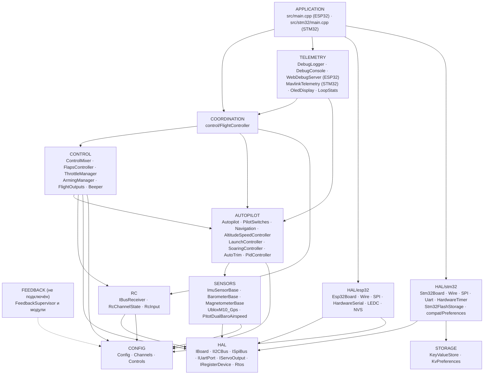
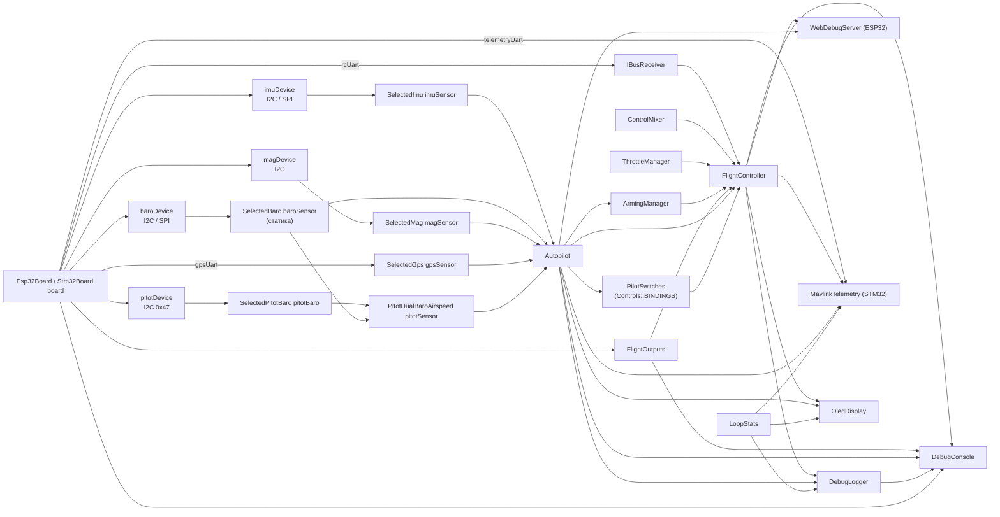
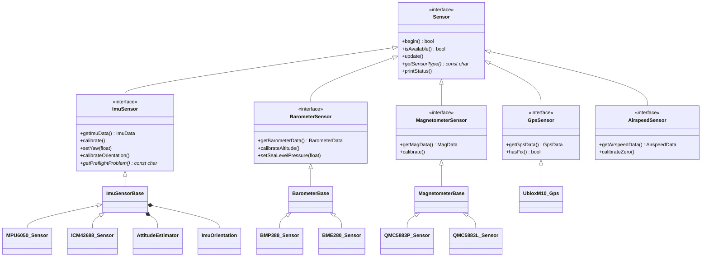
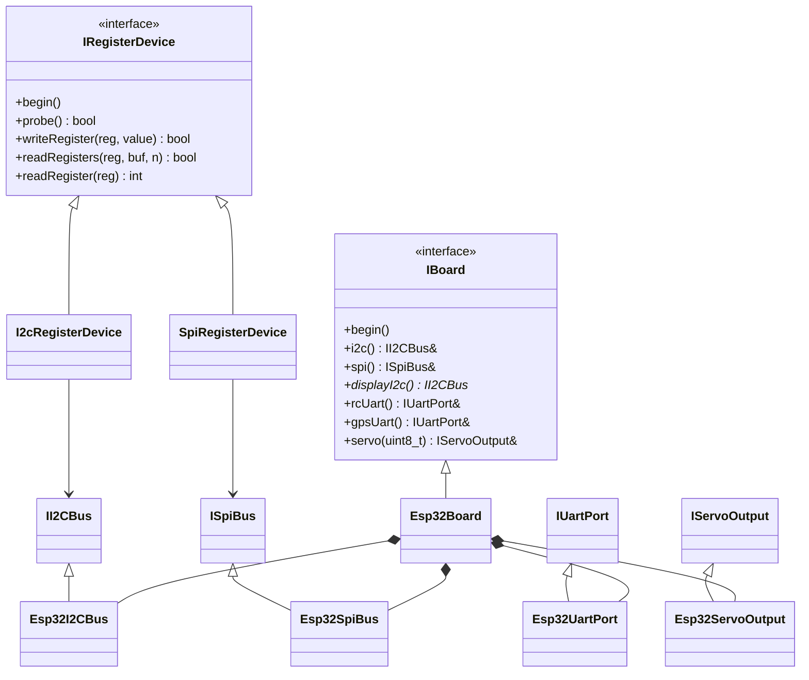
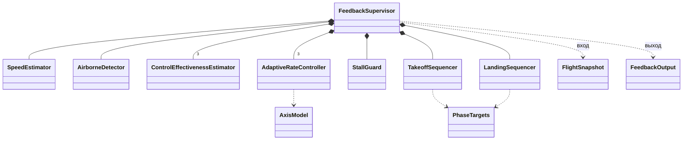
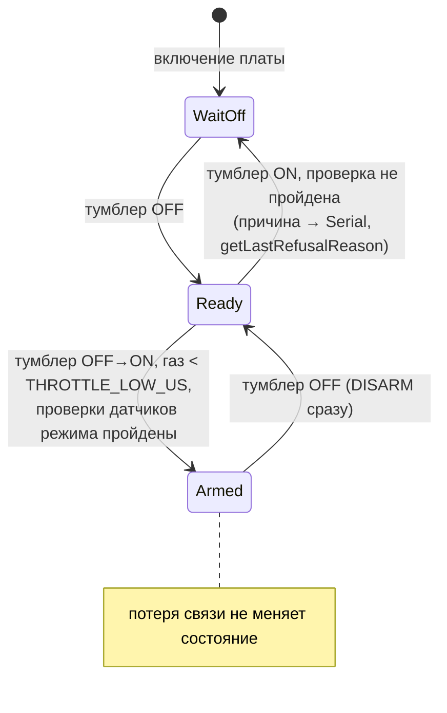
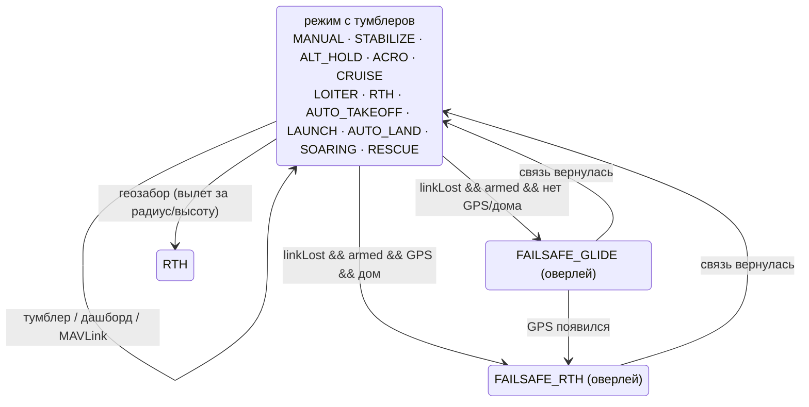
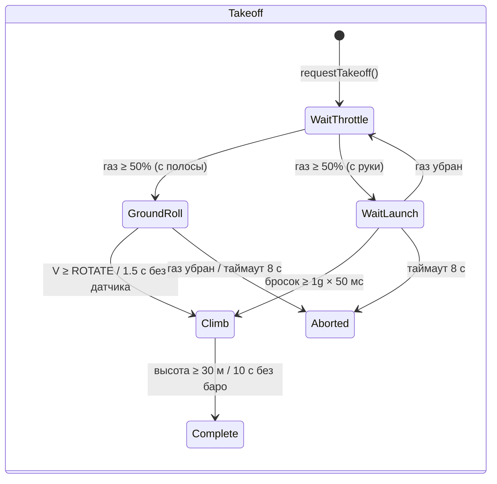
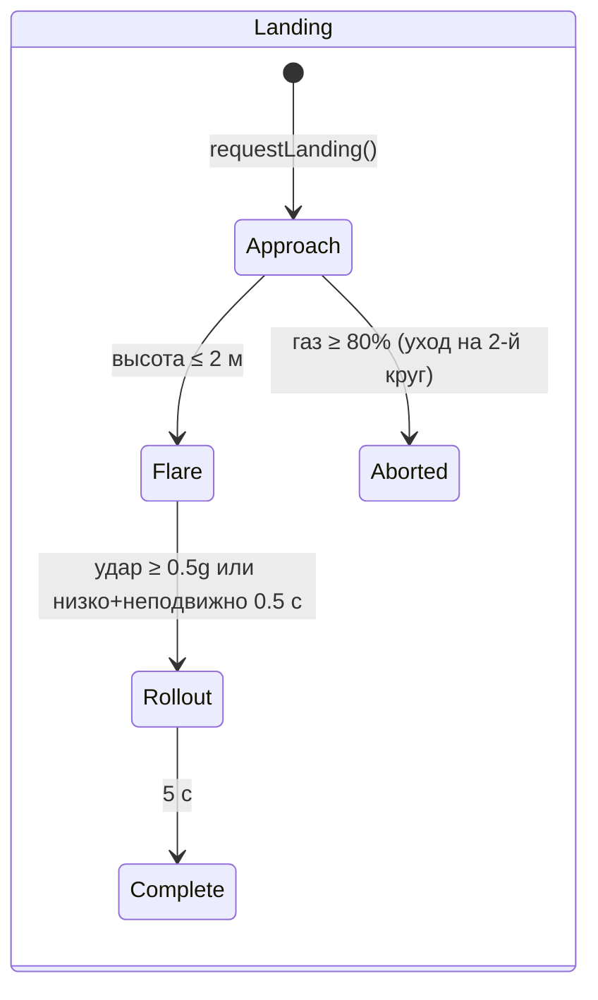

# ARCHITECTURE.md — архитектура прошивки OpenPlaneProject

Этот документ описывает, **как устроена прошивка целиком**: слои и правила
зависимостей между ними, граф объектов, модель потоков FreeRTOS, порядок
операций за такт, конечные автоматы, стратегию отказоустойчивости датчиков и
точки расширения. Подробный справочник по каждому классу (публичный API,
поля, инварианты) — в [`reference/`](reference/README.md).

Связанные документы:

| Документ | О чём |
|---|---|
| [`DEVELOPER_GUIDE.md`](DEVELOPER_GUIDE.md) | Практическое руководство: соглашение о знаках, HTTP API, консоль, как добавить датчик/режим/плату |
| [`reference/`](reference/README.md) | Справочник по всем классам, структурам и пространствам имён |
| [`TESTING.md`](TESTING.md) | Тесты: нативные (на ПК, с покрытием) и на плате |
| [`PILOT_GUIDE.md`](PILOT_GUIDE.md) | Сборка, распиновка, пульт, первый полёт |
| [`ROADMAP.md`](ROADMAP.md) | Куда движется проект |

> Статус: стенд на ESP32-S3 проверен со всеми датчиками, **автопилот в полёте
> не испытан**, контур обратной связи (`autopilot/feedback/`) в прошивку **не
> подключён** и проверяется только симуляцией.

---

## Содержание

1. [Принципы](#1-принципы)
2. [Слои и правила зависимостей](#2-слои-и-правила-зависимостей)
3. [Граф объектов (composition root)](#3-граф-объектов-composition-root)
4. [Иерархии классов](#4-иерархии-классов)
5. [Потоки FreeRTOS и разделение данных](#5-потоки-freertos-и-разделение-данных)
6. [Такт управления: `FlightController::update()`](#6-такт-управления-flightcontrollerupdate)
7. [Конечные автоматы](#7-конечные-автоматы)
8. [Отказоустойчивость: датчики, связь, выходы](#8-отказоустойчивость-датчики-связь-выходы)
9. [Конфигурация и варианты сборки](#9-конфигурация-и-варианты-сборки)
10. [Контур обратной связи (не подключён)](#10-контур-обратной-связи-не-подключён)
11. [Точки расширения](#11-точки-расширения)
12. [Тестируемость](#12-тестируемость)

---

## 1. Принципы

| Принцип | Как реализован |
|---|---|
| **Header-only C++** | Все классы определены в заголовках `include/<слой>/`. Единственная единица трансляции прошивки — `src/main.cpp` (ESP32) или `src/stm32/main.cpp` (STM32). Никакой динамической памяти в полётном контуре (строки `String` — только в веб-сервере и OLED). Вариант с разделением на `.h/.cpp` — в отдельной ветке `feature/split-headers` (см. её README). |
| **Composition root** | `src/main.cpp` / `src/stm32/main.cpp` — единственное место, где создаются объекты и связываются ссылками/указателями. Логики полёта в нём нет. |
| **Одна строка — один тумблер** | Что делает каждый канал пульта — таблица `config/Controls.h` (`Bind::modes/mode/feature/knob`), проверяемая `static_assert` при сборке. |
| **Dependency inversion** | Верхние слои зависят от интерфейсов (`IBoard`, `IRegisterDevice`, `ImuSensor*`, …), а не от конкретных чипов и MCU. |
| **Nullable-зависимости** | Автопилот, тумблеры (`PilotSwitches`) и все датчики передаются указателями и могут быть `nullptr`: без датчика — безопасное поведение режима, а не падение. |
| **Безопасность по приоритету** | Порядок операций в такте и есть приоритет: потеря связи > ARM > стики/автопилот > газ. Проверка ARM на газ стоит последней. |
| **Одна система знаков** | От IMU до сервопривода — авиационные знаки; направление каждой сервы задаётся ровно в одном месте (`Config::*_REVERSED`). |
| **Время — параметром** | Где это возможно (закрылки, модули обратной связи), время передаётся аргументом, а не читается из `millis()` — это делает классы детерминированными и тестируемыми. |
| **Честная диагностика** | Каждый датчик и выход различает «нет в сборке» (`attached`) и «есть, но не отвечает» (`available`); это видно в JSON, логе и на OLED. |

---

## 2. Слои и правила зависимостей


```mermaid
flowchart TD
    APP["APPLICATION<br/>src/main.cpp (ESP32) · src/stm32/main.cpp (STM32)"]
    COORD["COORDINATION<br/>control/FlightController"]
    TELE["TELEMETRY<br/>DebugLogger · DebugConsole · WebDebugServer (ESP32)<br/>MavlinkTelemetry (STM32) · OledDisplay · LoopStats"]
    CTRL["CONTROL<br/>ControlMixer · FlapsController · ThrottleManager<br/>ArmingManager · FlightOutputs · Beeper"]
    AP["AUTOPILOT<br/>Autopilot · PilotSwitches · Navigation · AltitudeSpeedController<br/>LaunchController · SoaringController · AutoTrim · PidController"]
    FB["FEEDBACK (не подключён)<br/>FeedbackSupervisor и модули"]
    RC["RC<br/>IBusReceiver · RcChannelState · RcInput"]
    SENS["SENSORS<br/>ImuSensorBase · BarometerBase · MagnetometerBase<br/>UbloxM10_Gps · PitotDualBaroAirspeed"]
    HAL["HAL<br/>IBoard · II2CBus · ISpiBus · IUartPort · IServoOutput · IRegisterDevice · Rtos"]
    STORE["STORAGE<br/>KeyValueStore · KvPreferences"]
    ESP["HAL/esp32<br/>Esp32Board · Wire · SPI · HardwareSerial · LEDC · NVS"]
    STM["HAL/stm32<br/>Stm32Board · Wire · SPI · Uart · HardwareTimer<br/>Stm32FlashStorage · compat/Preferences"]
    CFG["CONFIG<br/>Config · Channels · Controls"]

    APP --> COORD
    APP --> TELE
    APP --> ESP
    APP --> STM
    TELE --> COORD
    TELE --> AP
    COORD --> CTRL
    COORD --> AP
    COORD --> RC
    CTRL --> AP
    CTRL --> RC
    CTRL --> HAL
    AP --> SENS
    RC --> HAL
    SENS --> HAL
    ESP --> HAL
    STM --> HAL
    STM --> STORE
    FB -.-> CFG
    AP --> CFG
    CTRL --> CFG
    RC --> CFG
    SENS --> CFG
    ESP --> CFG
```

Правила:

1. **HAL — единственный слой, знающий MCU.** Только `include/hal/esp32/`
   и `include/hal/stm32/` включают `<Wire.h>`, `<SPI.h>`,
   `HardwareSerial`, вызывают `ledc*` / `HardwareTimer` / флеш. Задачи
   FreeRTOS создаются через `hal/Rtos.h` (ядро 0 на ESP32, приоритет на STM32).
   Хранилище настроек: код пишет `<Preferences.h>` — на ESP32 это NVS, на
   STM32 — `hal/stm32/compat/Preferences.h` поверх `storage/KeyValueStore.h`.
   Исключение, осознанное: `SpiRegisterDevice` переключает CS стандартными
   `pinMode/digitalWrite` Arduino (одинаковы на ESP32 и STM32).
2. **Драйверы датчиков не знают шину.** Они получают `IRegisterDevice&`
   (I2C-адрес или SPI-CS) или `IUartPort&`. Шина выбирается в
   `sensors/SensorSelection.h`.
3. **RC и Outputs не знают про самолёт**: байты iBUS → каналы; значения PWM →
   выходы.
4. **Control и Autopilot** — чистая логика над данными: без UART, PWM и Wi-Fi.
5. **Coordination** (`FlightController`) — единственный класс, который видит
   сразу несколько нижних слоёв и решает порядок операций.
6. **Telemetry** только читает состояние через константные геттеры; команды с
   дашборда проходят через «почтовый ящик» и применяются полётным циклом;
   MAVLink (`MavlinkTelemetry`) работает прямо в полётном цикле и применяет
   команды сам.
7. **Нижний слой никогда не включает верхний.** Если нижнему классу нужен
   верхний — логика поднимается в `FlightController`.

`ArmingManager` (CONTROL) читает режим из `Autopilot` — это единственная
горизонтальная зависимость CONTROL → AUTOPILOT: проверки ARM зависят от того,
каким датчикам нужен выбранный режим.

---

## 3. Граф объектов (composition root)

Все объекты — глобальные со статическим временем жизни, созданные в
`src/main.cpp`. Ссылки и указатели между ними **невладеющие**; порядок
конструирования совпадает с порядком объявления (единая единица трансляции).


```mermaid
flowchart LR
    board["Esp32Board / Stm32Board board"]
    imuDev["imuDevice<br/>I2C / SPI"]
    baroDev["baroDevice<br/>I2C / SPI"]
    magDev["magDevice<br/>I2C"]
    pitotDev["pitotDevice<br/>I2C 0x47"]
    imu["SelectedImu imuSensor"]
    baro["SelectedBaro baroSensor<br/>(статика)"]
    mag["SelectedMag magSensor"]
    gps["SelectedGps gpsSensor"]
    pitotBaro["SelectedPitotBaro pitotBaro"]
    pitot["PitotDualBaroAirspeed pitotSensor"]
    rx["IBusReceiver"]
    mixer["ControlMixer"]
    thr["ThrottleManager"]
    outs["FlightOutputs"]
    ap["Autopilot"]
    sw["PilotSwitches<br/>(Controls::BINDINGS)"]
    arm["ArmingManager"]
    fc["FlightController"]
    stats["LoopStats"]
    log["DebugLogger"]
    con["DebugConsole"]
    web["WebDebugServer (ESP32)"]
    mav["MavlinkTelemetry (STM32)"]
    oled["OledDisplay"]

    board --> imuDev & baroDev & magDev & pitotDev
    imuDev --> imu
    baroDev --> baro
    magDev --> mag
    pitotDev --> pitotBaro
    pitotBaro & baro --> pitot
    board -- gpsUart --> gps
    board -- rcUart --> rx
    board -- telemetryUart --> mav
    board --> outs
    imu & baro & mag & gps & pitot --> ap
    ap --> sw
    ap --> arm
    rx & mixer & thr & arm & outs & ap & sw --> fc
    fc & ap & stats --> log
    fc & outs & ap & log & board --> con
    fc & ap --> web
    fc & ap & stats --> mav
    fc & ap & stats --> oled
```

Порядок инициализации в `setup()`:

```
Serial (ESP32: буфер TX 4 КБ; STM32: SERIAL_TX_BUFFER_SIZE=1024), 115200 → баннер
board.begin()               — шины I2C/SPI (вторая I2C — если есть)
flightOutputs.begin()       — PWM-каналы; сразу setFailsafe()
[STM32] настройки из флеша  — KeyValueStore::mount(), CRC образа
setupSensors()              — begin() каждого датчика; калибровка ответивших:
                              IMU (2 с неподвижно + предполётная проверка),
                              баро (нулевая высота), компас (начальный курс → IMU yaw),
                              трубка Пито (ноль набирается в первую секунду цикла)
autopilot.begin()           — триммер из NVS/флеша
flightController.begin()    — setFailsafe() + UART iBUS
oledDisplay.begin(...)      — своя задача (hal/Rtos.h)
[ESP32] webDebugServer.begin() — точка доступа + своя задача на ядре 0
[STM32] mavlink.begin()     — UART4 радиомодема
pilotSwitches.printBindings() — что на каком тумблере
debugLogger.begin()         — настройки лога
[STM32] задачи flight / storage → vTaskStartScheduler()
```

---

## 4. Иерархии классов

### Датчики


```mermaid
classDiagram
    class Sensor {
        <<interface>>
        +begin() bool
        +isAvailable() bool
        +update()
        +getSensorType() const char*
        +printStatus()
    }
    class ImuSensor {
        <<interface>>
        +getImuData() ImuData
        +calibrate()
        +setYaw(float)
        +calibrateOrientation()
        +getPreflightProblem() const char*
    }
    class BarometerSensor {
        <<interface>>
        +getBarometerData() BarometerData
        +calibrateAltitude()
        +setSeaLevelPressure(float)
    }
    class MagnetometerSensor {
        <<interface>>
        +getMagData() MagData
        +calibrate()
    }
    class GpsSensor {
        <<interface>>
        +getGpsData() GpsData
        +hasFix() bool
    }
    class AirspeedSensor {
        <<interface>>
        +getAirspeedData() AirspeedData
        +calibrateZero()
    }
    Sensor <|-- ImuSensor
    Sensor <|-- BarometerSensor
    Sensor <|-- MagnetometerSensor
    Sensor <|-- GpsSensor
    Sensor <|-- AirspeedSensor
    ImuSensor <|-- ImuSensorBase
    ImuSensorBase <|-- MPU6050_Sensor
    ImuSensorBase <|-- ICM42688_Sensor
    BarometerSensor <|-- BarometerBase
    BarometerBase <|-- BMP388_Sensor
    BarometerBase <|-- BME280_Sensor
    MagnetometerSensor <|-- MagnetometerBase
    MagnetometerBase <|-- QMC5883P_Sensor
    MagnetometerBase <|-- QMC5883L_Sensor
    GpsSensor <|-- UbloxM10_Gps
    ImuSensorBase *-- AttitudeEstimator
    ImuSensorBase *-- ImuOrientation
```

Базовые классы (`ImuSensorBase`, `BarometerBase`, `MagnetometerBase`)
реализуют паттерн **Template Method**: публичные `update()`/`calibrate()`
написаны один раз, а драйвер чипа реализует только защищённые «примитивы»
(`readSample()`, `isNewSampleReady()`, `readRaw()`, масштабы).

### HAL


```mermaid
classDiagram
    class IBoard {
        <<interface>>
        +begin()
        +i2c() II2CBus&
        +spi() ISpiBus&
        +displayI2c() II2CBus*
        +rcUart() IUartPort&
        +gpsUart() IUartPort&
        +servo(uint8_t) IServoOutput&
    }
    class IRegisterDevice {
        <<interface>>
        +begin()
        +probe() bool
        +writeRegister(reg, value) bool
        +readRegisters(reg, buf, n) bool
        +readRegister(reg) int
    }
    IBoard <|-- Esp32Board
    II2CBus <|-- Esp32I2CBus
    ISpiBus <|-- Esp32SpiBus
    IUartPort <|-- Esp32UartPort
    IServoOutput <|-- Esp32ServoOutput
    IRegisterDevice <|-- I2cRegisterDevice
    IRegisterDevice <|-- SpiRegisterDevice
    I2cRegisterDevice --> II2CBus
    SpiRegisterDevice --> ISpiBus
    Esp32Board *-- Esp32I2CBus
    Esp32Board *-- Esp32SpiBus
    Esp32Board *-- Esp32UartPort
    Esp32Board *-- Esp32ServoOutput
```

### Контур обратной связи


```mermaid
classDiagram
    FeedbackSupervisor *-- SpeedEstimator
    FeedbackSupervisor *-- AirborneDetector
    FeedbackSupervisor *-- "3" ControlEffectivenessEstimator
    FeedbackSupervisor *-- "3" AdaptiveRateController
    FeedbackSupervisor *-- StallGuard
    FeedbackSupervisor *-- TakeoffSequencer
    FeedbackSupervisor *-- LandingSequencer
    FeedbackSupervisor ..> FlightSnapshot : вход
    FeedbackSupervisor ..> FeedbackOutput : выход
    TakeoffSequencer ..> PhaseTargets
    LandingSequencer ..> PhaseTargets
    AdaptiveRateController ..> AxisModel
```

---

## 5. Потоки FreeRTOS и разделение данных

**ESP32** (два ядра, FreeRTOS встроен в ядро Arduino):

| Ядро | Задача | Что делает | Период |
|---|---|---|---|
| 1 | Arduino `loopTask` → `loop()` | `WebDebugServer::applyPendingCommands()` → `FlightController::update()` → `DebugLogger::update()` → `DebugConsole::update()` → `LoopStats::record()` | `Config::LOOP_PERIOD_MS` = 2 мс (500 Гц), `vTaskDelayUntil` |
| 0 | `web` (8 КБ стека, приоритет 1) | `WebServer::handleClient()` | каждые 2 мс (`vTaskDelay`) |
| 0 | `oled` (4 КБ стека, приоритет 1) | `OledDisplay::draw()` по второй шине I2C | 200 мс (`vTaskDelayUntil`) |
| 0 | стек Wi-Fi ESP-IDF | точка доступа | — |

**STM32H743** (одно ядро, STM32duino FreeRTOS, вытеснение по приоритету):

| Приоритет | Задача | Что делает | Период |
|---|---|---|---|
| 5 | `flight` (16 КБ) | `FlightController::update()` → `MavlinkTelemetry::update()` → `DebugLogger::update()` → `DebugConsole::update()` → `LoopStats::record()` | 2 мс, `vTaskDelayUntil` |
| 1 | `oled` (4 КБ) | `OledDisplay::draw()` по второй шине I2C | 200 мс |
| 1 | `storage` (2 КБ) | `Stm32FlashStorage::service()` — стирание и запись сектора настроек | 100 мс |

**Правила разделения данных:**

- Задачи `web` и `oled` **только читают** состояние (`FlightController`,
  `Autopilot`, `LoopStats`, датчики) через константные геттеры. Поля —
  отдельные 16/32-битные значения, «рваного» чтения нет; в худшем случае
  видны значения соседних тактов.
- **Команды** с дашборда (`/api/setmode`, `/api/setpid`) из задачи `web`
  напрямую **не применяются**: они кладутся в `PendingCommands` под
  спинлоком `portMUX` и забираются полётным циклом в
  `applyPendingCommands()` — изменение автопилота всегда происходит в
  контексте задачи, которая им владеет.
- `LoopStats::hz/avgUs/maxUs` — `volatile uint32_t`; `takePeakUs()` вызывается
  только из `loop()`.
- `OledDisplay` хранит указатель на шину в статической переменной (C-колбэк
  U8g2 не принимает контекст); экран на борту один.

**Реальное время:**

- Период держится `vTaskDelayUntil`, а не `delay()` после работы. После
  долгой блокировки (калибровка из консоли, > 100 мс) отсчёт начинается
  заново — пропущенные такты пачкой не догоняются.
- Таймаут транзакции I2C — 5 мс (штатный у `Wire` — 50 мс).
- `Serial` с буфером передачи 4 КБ — строка лога не блокирует цикл.
- ESP32: запись во флеш (NVS, настройки Wi-Fi) останавливает оба ядра на
  ~0.3–0.4 с, поэтому: Wi-Fi — `persistent(false)`; настройки лога
  сохраняются только без ARM; калибровки — только без ARM; автотриммер —
  после DISARM и только когда самолёт стоит (`Autopilot::looksLanded()`).
- STM32: `Preferences::end()` лишь копирует образ (микросекунды), а стирание
  сектора (секунды) идёт в задаче `storage`. Сектор настроек — в банке 2
  флеша, код — в банке 1: полётная задача вытесняет запись и продолжает
  работать.
- MAVLink не блокирует цикл: кадр отправляется, только если в буфере UART
  есть место (`IUartPort::availableForWrite()`), иначе ждёт следующего такта.

---

## 6. Такт управления: `FlightController::update()`

```mermaid
sequenceDiagram
    participant L as flight loop
    participant FC as FlightController
    participant RX as IBusReceiver
    participant SW as PilotSwitches
    participant TM as ThrottleManager
    participant MX as ControlMixer
    participant AP as Autopilot
    participant AM as ArmingManager
    participant OUT as FlightOutputs

    L->>FC: update()
    FC->>RX: update() — разбор байтов UART, isSignalLost()
    alt связь есть
        FC->>SW: update(rc) — режим (при смене положения), функции, крутилки
    end
    FC->>TM: update(rc, failsafe) → газ пилота
    FC->>MX: fromSticks(rc) (+ Knob::RATES), updateFlaps(цель по функциям)
    FC->>AP: update(armed, linkLost, газ пилота, стики)
    Note over AP: датчики читаются ВСЕГДА;<br/>навигация, failsafe, геозабор,<br/>режим, координация, автотриммер
    FC->>OUT: setBuzzer(Beeper)
    alt связь потеряна
        alt armed и failsafe автопилота (RTH / GLIDE)
            FC->>MX: mix(команда автопилота)
            FC->>OUT: write(рули, газ автопилота, AUX как были)
        else
            FC->>OUT: setFailsafe()
        end
        Note over FC: return — ARM и тумблеры не читаются
    else связь есть
        FC->>AM: update(rc) — тумблер ARM
        FC->>AP: getCommand() — итоговая команда рулей
        FC->>MX: mix(command) → PWM с реверсом
        FC->>AP: applyThrottle(газ пилота)
        Note over FC: !armed или MOTOR_KILL → throttle = PWM_MIN (последним)
        FC->>OUT: write(output + AUX1 груз, AUX2 камера)
    end
```

Ключевые инварианты такта:

- **Потеря связи** — режим и функции с тумблеров не меняются; ARM не
  читается и не сбрасывается; мотор — только по решению failsafe автопилота
  (RTH с мотором) или `FAILSAFE_THROTTLE`.
- **Ни один режим не протащит газ мимо ARM**: принудительный `PWM_MIN` при
  `!armed` и `MOTOR_KILL` стоит после `Autopilot::applyThrottle()`.
- **Автопилот выдаёт итоговую команду** (`getCommand()`), в режимах со
  стабилизацией стики — это желаемые углы; коррекции = команда − стики
  (для лога и дашборда). Всё в одних знаках (`ControlCommand`) до микшера.

---

## 7. Конечные автоматы

### ARM (`ArmingManager`)


```mermaid
stateDiagram-v2
    [*] --> WaitOff : включение платы
    WaitOff --> Ready : тумблер OFF
    Ready --> Armed : тумблер OFF→ON, газ < THROTTLE_LOW_US,<br/>проверки датчиков режима пройдены
    Ready --> WaitOff : тумблер ON, проверка не пройдена<br/>(причина → Serial, getLastRefusalReason)
    Armed --> Ready : тумблер OFF (DISARM сразу)
    note right of Armed : потеря связи не меняет состояние
```

`WaitOff` = `armed == false && switchSeenOff == false`; `Ready` =
`armed == false && switchSeenOff == true`.

### Режимы автопилота (`Autopilot` + `PilotSwitches`)

Двенадцать режимов (`AutopilotTypes.h`), что делает каждый — в
[AUTOPILOT_GUIDE.md](AUTOPILOT_GUIDE.md#режимы). Режим выбирает
`PilotSwitches` по таблице `config/Controls.h`: тумблер режимов
(`Bind::modes`) и тумблеры «режим поверх» (`Bind::mode`, верхняя строка
главнее). `setMode()` вызывается только когда **изменился итог** тумблеров —
поэтому режим, выбранный с дашборда или GCS, держится, пока пилот не щёлкнет
тумблером.


```mermaid
stateDiagram-v2
    state "режим с тумблеров<br/>MANUAL · STABILIZE · ALT_HOLD · ACRO · CRUISE<br/>LOITER · RTH · AUTO_TAKEOFF · LAUNCH · AUTO_LAND · SOARING · RESCUE" as MODE
    state "FAILSAFE_RTH (оверлей)" as FRTH
    state "FAILSAFE_GLIDE (оверлей)" as GLIDE
    MODE --> MODE : тумблер / дашборд / MAVLink
    MODE --> RTH_MODE : геозабор (вылет за радиус/высоту)
    state "RTH" as RTH_MODE
    MODE --> FRTH : linkLost && armed && GPS && дом
    MODE --> GLIDE : linkLost && armed && нет GPS/дома
    FRTH --> MODE : связь вернулась
    GLIDE --> MODE : связь вернулась
    GLIDE --> FRTH : GPS появился
```

Failsafe — не отдельный `AutopilotMode`, а флаг поверх текущего режима;
начатый возврат не бросается в планирование от короткой потери GPS; после
восстановления связи продолжается режим с тумблеров (автовзлёт и запуск с
руки — только заново). Внутренние автоматы: `LaunchController`
(IDLE → READY → THROWN → CLIMB → DONE) и `SoaringController`
(GLIDE → THERMAL → MOTOR_CLIMB → RETURN).

**AUTO_TAKEOFF** (по времени от старта, когда armed и газ ≥ 1500 мкс):

| Время | Газ (программа) | Тангаж |
|---|---|---|
| 0–1 с | плавно 0 → 100 % | 0° |
| 1–3 с | 100 % | +15° |
| > 3 с | 100 % | +10° |

### Взлёт и посадка (контур обратной связи, не подключён)


```mermaid
stateDiagram-v2
    direction LR
    state Takeoff {
        [*] --> WaitThrottle : requestTakeoff()
        WaitThrottle --> GroundRoll : газ ≥ 50% (с полосы)
        WaitThrottle --> WaitLaunch : газ ≥ 50% (с руки)
        WaitLaunch --> Climb : бросок ≥ 1g × 50 мс
        WaitLaunch --> WaitThrottle : газ убран
        GroundRoll --> Climb : V ≥ ROTATE / 1.5 с без датчика
        Climb --> Complete : высота ≥ 30 м / 10 с без баро
        GroundRoll --> Aborted : газ убран / таймаут 8 с
        WaitLaunch --> Aborted : таймаут 8 с
    }
```


```mermaid
stateDiagram-v2
    direction LR
    state Landing {
        [*] --> Approach : requestLanding()
        Approach --> Flare : высота ≤ 2 м
        Approach --> Aborted : газ ≥ 80% (уход на 2-й круг)
        Flare --> Rollout : удар ≥ 0.5g или низко+неподвижно 0.5 с
        Rollout --> Complete : 5 с
    }
```

---

## 8. Отказоустойчивость: датчики, связь, выходы

### Датчики

| Датчик | `isAvailable()` становится `false` | Что при сбое чтения |
|---|---|---|
| IMU (`ImuSensorBase`) | `begin()` не опознал чип, **или** 50 ошибок чтения подряд (~0.1 с при 500 Гц) | данные не затираются, `errorCount++`; восстановилось — снова доступен |
| Барометр (`BarometerBase`) | 100 ошибок подряд (~0.5 с при опросе раз в 5 мс) | то же |
| Компас (`MagnetometerBase`) | 25 ошибок подряд (~0.5 с при 50 Гц) | то же |
| GPS (`UbloxM10_Gps`) | ни одного валидного NAV-PVT **или** последний старше `GPS_TIMEOUT_US` (2 с) | — |

Дополнительно у IMU есть **предполётная проверка** (`getPreflightProblem()`):
неподвижность при калибровке гироскопа, |a| ≈ 1g, «верх» совпадает с
сохранённой установкой. Не прошла — `Autopilot::imuReady() == false` (нулевые
коррекции во всех режимах, включая планирование), а `ArmingManager` не армит
режимы со стабилизацией.

Потребители реагируют одинаково: **нет датчика (`nullptr`) или он недоступен —
никаких эффектов**, самолёт управляется как в MANUAL.

### Связь (`IBusReceiver::isSignalLost()`)

Два независимых признака:

1. нет корректных кадров дольше `RX_TIMEOUT_US` (500 мс) — или не было ни
   одного с момента включения;
2. газ в кадре ниже `RX_FAILSAFE_THROTTLE_US` (950 мкс) — failsafe,
   запрограммированный в пульте (FS-iA6B при потере пульта кадры не
   прекращает).

Кадры с неверной CRC отбрасываются и считаются (`getBadFrameCount()`).

### Выходы

`FlightOutputs::begin()` сразу за ним `setFailsafe()` — рули в нейтраль, мотор
выключен ещё до чтения датчиков. Выход с пином `-1` (руль направления на C3)
просто не подключается; `attached` в JSON показывает, выделен ли канал LEDC.
Реальный импульс на каждом пине проверяет `printPulseSelfTest()` (консоль `p`).

---

## 9. Конфигурация и варианты сборки

| Что | Где | Как выбирается |
|---|---|---|
| Плата (пины) | `include/config/Config.h` | макрос `BOARD_ESP32_S3` / `BOARD_ESP32_C3` / `BOARD_ESP32_CLASSIC` / `BOARD_STM32H743` из `[env:*]` в `platformio.ini` |
| Все настройки (таймауты, ходы рулей, реверсы, failsafe, Wi-Fi) | `Config.h`, namespace `Config` | `constexpr`, правка файла |
| Назначение RC-каналов | `include/config/Channels.h` | правка файла |
| Датчики и шины | `include/sensors/SensorSelection.h` | `#define SENSOR_IMU/BARO/MAG/GPS`, можно флагом `-D` |
| Константы обратной связи | `include/autopilot/feedback/FeedbackConfig.h` | при подключении переедут в `Config.h` |
| Установка IMU | NVS (`imu_mpu6050` / `imu_icm42688`) или `Config::IMU_ROTATION_CW_DEG` | команда консоли `o` |
| Калибровка компаса | NVS (`qmc5883p` / `qmc5883l`) | команда консоли `m` |
| Настройки лога | NVS (`debuglog`) | меню консоли `l` |

Окружения PlatformIO:

| `env` | Назначение |
|---|---|
| `esp32-s3` (по умолчанию) | Основной лётный контроллер |
| `esp32-c3` | Старый прототип |
| `esp32-dev` | Классическая ESP32, стенд |
| `stm32h743` | STM32H743VIT6: полная прошивка (`src/stm32/main.cpp`), настройки во флеше, MAVLink, FreeRTOS; на железе не проверялась — см. [reference/hal.md](reference/hal.md#реализация-для-stm32h743) |
| `native` | Сборка и тесты на ПК с фейками Arduino/ESP-IDF и покрытием — см. [`TESTING.md`](TESTING.md) |

---

## 10. Контур обратной связи (не подключён)

`include/autopilot/feedback/` — будущая замена ПИД-стабилизации: модель оси
`ε = b·u + a·ω + c` изучается в полёте рекурсивным МНК
(`ControlEffectivenessEstimator`), регулятор — каскад угол → угловая скорость →
угловое ускорение → руль через изученную модель (`AdaptiveRateController`),
сверху — защита от сваливания (`StallGuard`) и этапы взлёта/посадки.

Единственный вход — `FlightSnapshot` (снимок за такт), единственный выход —
`FeedbackOutput`. Модули не читают датчики и RC напрямую, поэтому
проверяются замкнутой симуляцией (`test/test_feedback`) и на ПК, и на плате.

Порядок за такт в `FeedbackSupervisor::update()`:

1. скорость и продольное ускорение (`SpeedEstimator`), в воздухе ли (`AirborneDetector`);
2. обучение модели по каждой оси (только в воздухе, IMU жив, закрылки не движутся, не сваливание);
3. защита от сваливания (выключена у земли при посадке);
4. цели этапа взлёта/посадки;
5. цели ← ограничения защиты от сваливания;
6. регуляторы осей → отклонения рулей; газ (только при живой связи).

План подключения — в [`DEVELOPER_GUIDE.md`](DEVELOPER_GUIDE.md#план-подключения).

---

## 11. Точки расширения

| Задача | Что менять | Что не менять |
|---|---|---|
| Новый чип существующей категории | новый `*_Sensor.h` от базового класса + ветка в `SensorSelection.h` | `main.cpp`, `Autopilot` |
| Новая категория датчиков | интерфейс в `SensorInterface.h`, nullable-указатель в `Autopilot`, поля `attached/available` в JSON | остальной код |
| Новый режим автопилота | `AutopilotMode`, `handle*Mode()`, `applyThrottle()`, селектор/дашборд, `ArmingManager::checkFailureReason()` | `FlightController` |
| Новый выход (серво) | строка в `FlightOutputs::outputInfo()`, поле `FlightOutputState`, индекс `ServoChannel`, пин и канал LEDC в `Esp32Board` | цикл записи/статуса |
| Новая плата ESP32 | `#elif` в `Config.h`, `[env:*]` в `platformio.ini` | весь остальной код |
| Другой MCU | `hal/<mcu>/<Mcu>Board.h`, реализующий `IBoard` (пример — `hal/stm32/`), блок пинов в `Config.h`, `[env:*]` | датчики, логика полёта |
| Другой протокол приёмника | замена `IBusReceiver` с тем же API (`getState()`, `isSignalLost()`) | `FlightController` |
| Новый канал лога | `LogChannel`, строка в `LogSettings::info()`, `DebugLogger::format*()`, `VERSION++` | — |

---

## 12. Тестируемость

Благодаря HAL-интерфейсам и передаче времени параметром большая часть логики
проверяется без железа:

- **Нативные тесты** (`pio test -e native`) собирают заголовки прошивки на ПК с
  фейками Arduino, FreeRTOS, Wire/SPI/UART/LEDC, Preferences, WebServer/WiFi и
  U8g2 (`test/native/support/`). Покрытие считается `gcovr`.
- **Прошивка целиком на ПК** — `src/main.cpp` на распиновке S3 и 38-pin с
  каждым набором датчиков (регистровые эмуляторы чипов), `src/stm32/main.cpp`
  (`pio test -e native-stm32`) поверх слоя фейков STM32duino.
- **Замкнутые симуляции полёта** (`test/native/test_sim`): вся прошивка
  управляет моделью самолёта — каждый режим автопилота летает, а не только
  «выдаёт числа».
- **Матрица сборок** (`tools/build_matrix.sh`): все платы × все датчики, без
  предупреждений.
- **Тесты на плате** (`pio test -e esp32-s3`): те же `test_feedback` и
  `test_imu_orientation` запускаются и на реальном ESP32-S3.

Подробности, структура тестов и команды — в [`TESTING.md`](TESTING.md).
