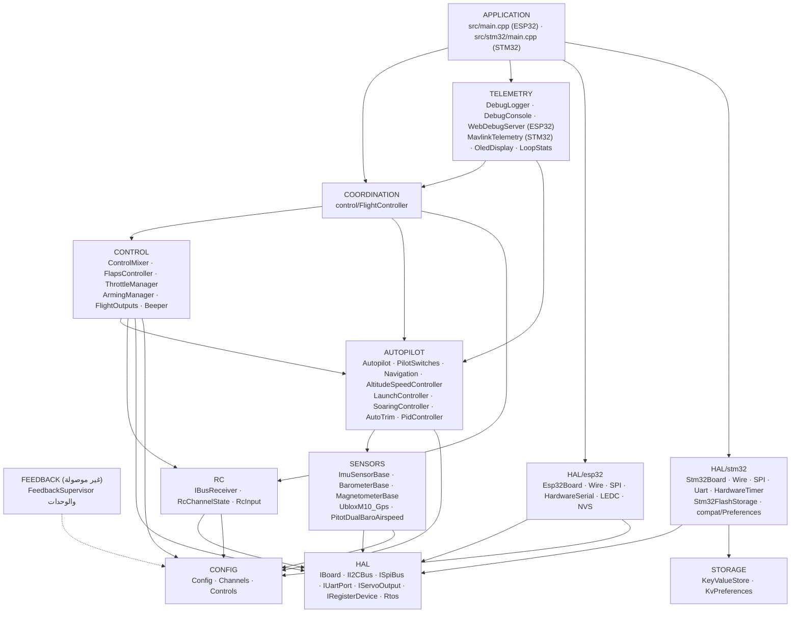
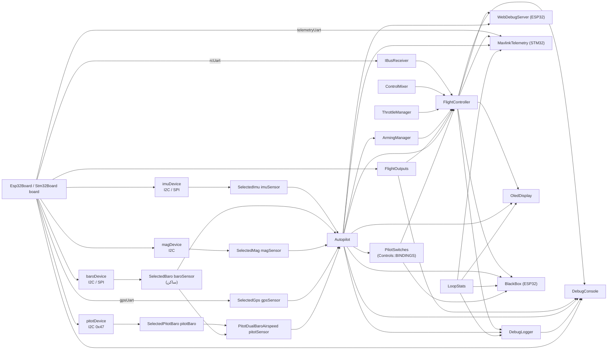
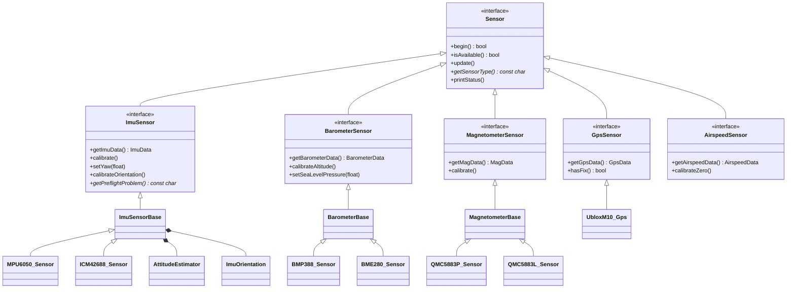
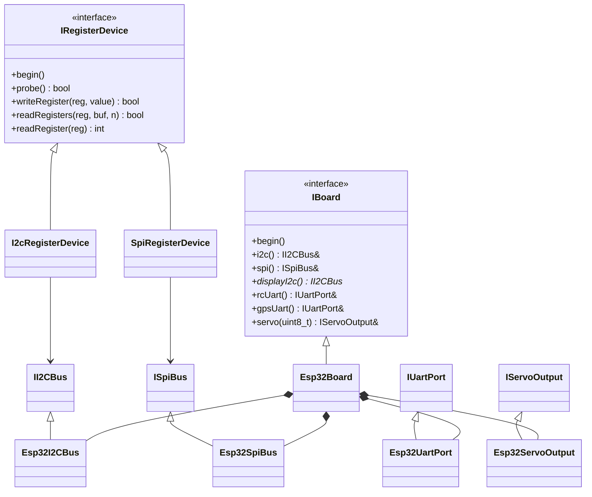
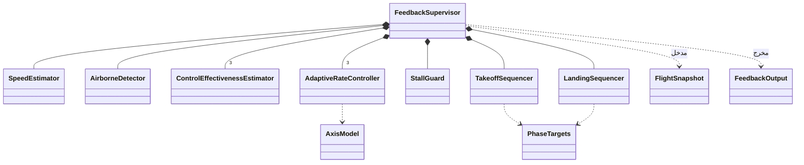
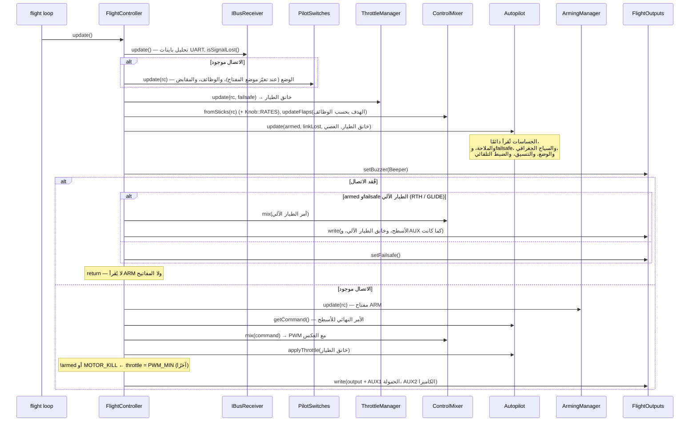
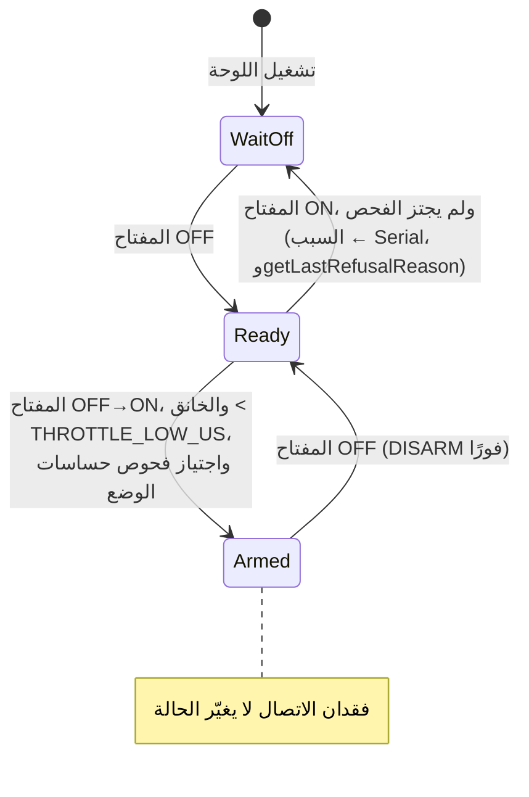
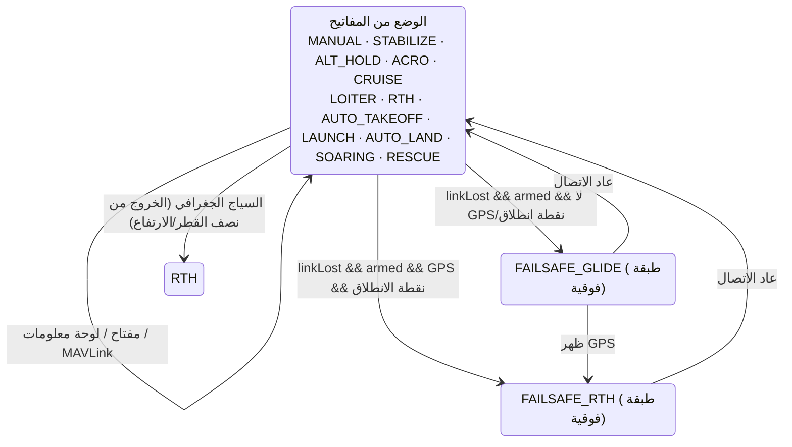
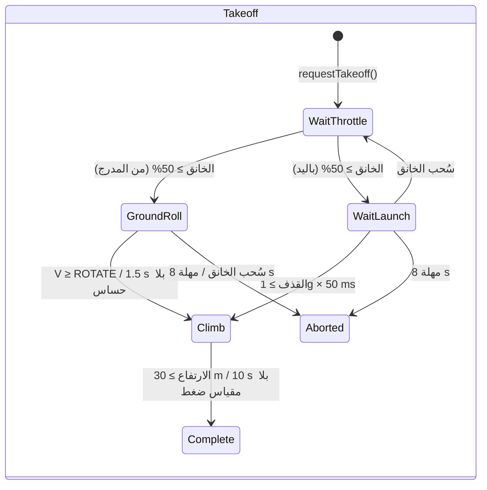
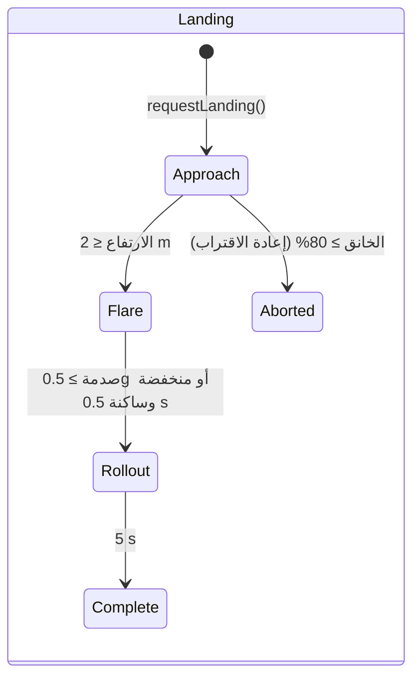

<div dir="rtl">

# ‏ARCHITECTURE.md — بنية البرنامج الثابت لـ OpenPlaneProject

> 🌐 هذه الصفحة ترجمة لـ[الأصل الروسي](../../ARCHITECTURE.md). إذا اختلفت الترجمة عن الأصل فالعبرة بالأصل. يعرض البرنامج الثابت رسائل وحدة التحكم (الكونسول) بالروسية، لذلك تُقتبس هنا كما هي.

تصف هذه الوثيقة **كيف بُني البرنامج الثابت كله**: الطبقات وقواعد الاعتماد بينها، ومخطط الكائنات، ونموذج خيوط FreeRTOS، وترتيب العمليات في كل دورة، وآلات الحالات، واستراتيجية تحمّل أعطال الحساسات، ونقاط التوسعة. وللمرجع المفصّل لكل فئة (الواجهة البرمجية العامة، والحقول، والثوابت) انظر [`reference/`](reference/README.md).

الوثائق ذات الصلة:

| الوثيقة | موضوعها |
|---|---|
| [`DEVELOPER_GUIDE.md`](DEVELOPER_GUIDE.md) | دليل عملي: اتفاقية الإشارات، وواجهة HTTP البرمجية، والكونسول، وكيفية إضافة حساس أو وضع أو لوحة |
| [`reference/`](reference/README.md) | مرجع لجميع الفئات والبُنى ومساحات الأسماء |
| [`TESTING.md`](TESTING.md) | الاختبارات: الأصلية (على الحاسوب، مع التغطية) وعلى اللوحة |
| [`PILOT_GUIDE.md`](PILOT_GUIDE.md) | التجميع، وتوزيع الأطراف، وجهاز التحكم، وأول رحلة |
| [`ROADMAP.md`](ROADMAP.md) | إلى أين يتجه المشروع |

> الحالة: فُحصت منصة ESP32-S3 مع جميع الحساسات، و**لم يُجرَّب الطيار الآلي في الطيران**، وحلقة التغذية الراجعة (`autopilot/feedback/`) **غير موصولة** بالبرنامج الثابت وتُفحص بالمحاكاة وحدها.

---

## المحتويات

1. [المبادئ](#1-المبادئ)
2. [الطبقات وقواعد الاعتماد](#2-الطبقات-وقواعد-الاعتماد)
3. [مخطط الكائنات (composition root)](#3-مخطط-الكائنات-composition-root)
4. [تسلسلات الفئات الهرمية](#4-تسلسلات-الفئات-الهرمية)
5. [مهام FreeRTOS وفصل البيانات](#5-مهام-freertos-وفصل-البيانات)
6. [دورة التحكم: `FlightController::update()`](#6-دورة-التحكم-flightcontrollerupdate)
7. [آلات الحالات](#7-آلات-الحالات)
8. [تحمّل الأعطال: الحساسات والاتصال والمخارج](#8-تحمّل-الأعطال-الحساسات-والاتصال-والمخارج)
9. [الإعداد وصيغ البناء](#9-الإعداد-وصيغ-البناء)
10. [حلقة التغذية الراجعة (غير موصولة)](#10-حلقة-التغذية-الراجعة-غير-موصولة)
11. [نقاط التوسعة](#11-نقاط-التوسعة)
12. [قابلية الاختبار](#12-قابلية-الاختبار)

---

## 1. المبادئ

| المبدأ | كيف يُطبَّق |
|---|---|
| **C++ بالترويسات فقط** | تُعرَّف جميع الفئات في ترويسات `include/<الطبقة>/`. ووحدة الترجمة الوحيدة للبرنامج الثابت هي `src/main.cpp` (ESP32) أو `src/stm32/main.cpp` (STM32). ولا ذاكرة ديناميكية في حلقة الطيران (سلاسل `String` فقط في خادم الويب وشاشة OLED). وتوجد نسخة مقسَّمة إلى `.h/.cpp` في فرع مستقل هو `feature/split-headers`: يولّدها `tools/split_headers.py`، وتوجد الفروق وأحجام البرنامج الثابت في ملف `docs/SPLIT_HEADERS.md` الخاص بها. |
| **Composition root** | `src/main.cpp` / `src/stm32/main.cpp` هو المكان الوحيد الذي تُنشأ فيه الكائنات وتُربط بالمراجع والمؤشرات. وليس فيه منطق طيران. |
| **سطر واحد — مفتاح واحد** | ما تفعله كل قناة في جهاز التحكم يحدده الجدول `config/Controls.h` (`Bind::modes/mode/feature/knob`) الذي يفحصه `static_assert` وقت البناء. |
| **عكس الاعتماد** | تعتمد الطبقات العليا على الواجهات (`IBoard` و`IRegisterDevice` و`ImuSensor*` …) لا على شرائح ومتحكمات بعينها. |
| **اعتمادات تقبل القيمة الفارغة** | يُمرَّر الطيار الآلي والمفاتيح (`PilotSwitches`) وجميع الحساسات مؤشراتٍ ويجوز أن تكون `nullptr`: فعند غياب الحساس يسلك الوضع سلوكًا آمنًا بدل أن ينهار. |
| **الأمان بالأولوية** | ترتيب العمليات في الدورة هو الأولوية: فقدان الإشارة > ARM > العصي/الطيار الآلي > الخانق. وفحص ARM على الخانق يأتي أخيرًا. |
| **نظام إشارات واحد** | من IMU حتى السيرفو — إشارات الطيران؛ واتجاه كل سيرفو يُحدَّد في موضع واحد بالضبط (`Config::*_REVERSED`). |
| **الزمن معاملًا** | حيثما أمكن (الفلابات، وحدات التغذية الراجعة) يُمرَّر الزمن وسيطًا ولا يُقرأ من `millis()` — وهذا يجعل الفئات حتمية وقابلة للاختبار. |
| **تشخيص صريح** | يميّز كل حساس وكل مخرج بين «غير موجود في البناء» (`attached`) و«موجود لكنه لا يستجيب» (`available`)؛ ويظهر هذا في JSON والسجل وعلى OLED. |

---

## 2. الطبقات وقواعد الاعتماد

<div dir="ltr">



</div>

القواعد:

1. **‏HAL هي الطبقة الوحيدة التي تعرف المتحكم الدقيق.** فقط `include/hal/esp32/` و`include/hal/stm32/` تضمّنان `<Wire.h>` و`<SPI.h>` و`HardwareSerial`، وتستدعيان `ledc*` / `HardwareTimer` / الفلاش. وتُنشأ مهام FreeRTOS عبر `hal/Rtos.h` (النواة 0 في ESP32، وأولوية في STM32). تخزين الإعدادات: تكتب الشيفرة `<Preferences.h>` — وهو في ESP32 NVS، وفي STM32 الملف `hal/stm32/compat/Preferences.h` فوق `storage/KeyValueStore.h`. استثناء مقصود: يبدّل `SpiRegisterDevice` الطرف CS بالدالتين القياسيتين في Arduino `pinMode/digitalWrite` (وهما متطابقتان في ESP32 وSTM32).
2. **مشغّلات الحساسات لا تعرف الناقل.** تتلقى `IRegisterDevice&` (عنوان I2C أو CS لـ SPI) أو `IUartPort&`. ويُختار الناقل في `sensors/SensorSelection.h`.
3. **‏RC وOutputs لا يعرفان شيئًا عن الطائرة**: بايتات iBUS ← قنوات؛ قيم PWM ← مخارج.
4. **‏Control وAutopilot** منطق خالص فوق البيانات: بلا UART أو PWM أو Wi-Fi.
5. **‏Coordination** (`FlightController`) هي الفئة الوحيدة التي ترى عدة طبقات سفلية معًا وتقرر ترتيب العمليات.
6. **‏Telemetry** تقرأ الحالة فقط عبر دوال جلب ثابتة؛ وتمرّ الأوامر القادمة من لوحة المعلومات عبر «صندوق بريد» وتطبّقها حلقة الطيران؛ أما MAVLink (`MavlinkTelemetry`) فيعمل مباشرة داخل حلقة الطيران ويطبّق الأوامر بنفسه.
7. **الطبقة السفلى لا تضمّ العليا أبدًا.** وإذا احتاجت فئة سفلية إلى فئة عليا رُفع المنطق إلى `FlightController`.

يقرأ `ArmingManager` (CONTROL) الوضع من `Autopilot` — وهذا هو الاعتماد الأفقي الوحيد CONTROL ← AUTOPILOT: فحوص ARM تتوقف على الحساسات التي يحتاج إليها الوضع المختار.

---

## 3. مخطط الكائنات (composition root)

جميع الكائنات عامّة ذات مدة تخزين ساكنة، وتُنشأ في `src/main.cpp`. والمراجع والمؤشرات بينها **غير مالكة**؛ وترتيب الإنشاء يطابق ترتيب التصريح (وحدة ترجمة واحدة).

<div dir="ltr">



</div>

ترتيب التهيئة في `setup()`:

<div dir="ltr">

```
Serial (ESP32: مخزن الإرسال 4 KB; STM32: SERIAL_TX_BUFFER_SIZE=1024), 115200 → اللافتة
board.begin()               — نواقل I2C/SPI (وI2C الثانية إن وُجدت)
flightOutputs.begin()       — قنوات PWM; ثم setFailsafe() فورًا
[STM32] الإعدادات من الفلاش — KeyValueStore::mount(), CRC الصورة
setupSensors()              — begin() لكل حساس; ومعايرة التي استجابت:
                              IMU (2 s ساكنة + فحص قبل الإقلاع),
                              مقياس الضغط (ارتفاع صفر), البوصلة (الاتجاه الابتدائي → yaw في IMU),
                              أنبوب بيتو (يُؤخذ الصفر خلال الثانية الأولى من الحلقة)
autopilot.begin()           — الضبط (trim) من NVS/الفلاش
flightController.begin()    — setFailsafe() + UART iBUS
oledDisplay.begin(...)      — مهمة خاصة (hal/Rtos.h)
[ESP32] webDebugServer.begin() — نقطة الوصول + مهمة خاصة على النواة 0
[ESP32] blackBox.begin()   — قسم blackbox, وطابور في PSRAM, ومهمة bbox على النواة 0
[STM32] mavlink.begin()     — UART4 الخاص بمودم الراديو
[STM32] setupBlackBox()    — بطاقة SD, والملف BLACKBOX.BIN, وblackBox.begin(), ومهمة bbox
pilotSwitches.printBindings() — ما الذي على كل مفتاح
debugLogger.begin()         — إعدادات السجل
[STM32] مهمتا flight / storage → vTaskStartScheduler()
```

</div>

---

## 4. تسلسلات الفئات الهرمية

### الحساسات

<div dir="ltr">



</div>

تنفّذ الفئات الأساسية (`ImuSensorBase` و`BarometerBase` و`MagnetometerBase`) نمط **Template Method**: تُكتب الدالتان العامتان `update()`/`calibrate()` مرة واحدة، ولا ينفّذ مشغّل الشريحة إلا «الدوال الأولية» المحمية (`readSample()` و`isNewSampleReady()` و`readRaw()` والمقاييس).

### ‏HAL

<div dir="ltr">



</div>

### حلقة التغذية الراجعة

<div dir="ltr">



</div>

---

## 5. مهام FreeRTOS وفصل البيانات

**‏ESP32** (نواتان، وFreeRTOS مدمج في نواة Arduino):

| النواة | المهمة | ما الذي تفعله | الدورة |
|---|---|---|---|
| 1 | Arduino `loopTask` ← `loop()` | `WebDebugServer::applyPendingCommands()` ← `FlightController::update()` ← `DebugLogger::update()` ← `DebugConsole::update()` ← `LoopStats::record()` ← `BlackBox::update()` | `Config::LOOP_PERIOD_MS` = 2 ms (500 Hz)، `vTaskDelayUntil` |
| 0 | `web` (8 KB مكدّس، أولوية 1) | `WebServer::handleClient()` | كل 2 ms (`vTaskDelay`) |
| 0 | `oled` (4 KB مكدّس، أولوية 1) | `OledDisplay::draw()` عبر ناقل I2C الثاني | 200 ms (`vTaskDelayUntil`) |
| 0 | `bbox` (6 KB مكدّس، أولوية 2) | `BlackBox::writerStep()`: صفحة من الطابور إلى الفلاش؛ وعلى الأرض — المسح | إشعار من `loop()` بعد كل دورة (وإلا مرة كل 20 ms) |
| 0 | مكدّس Wi-Fi في ESP-IDF | نقطة الوصول | — |

**‏STM32H743** (نواة واحدة، وFreeRTOS الخاص بـ STM32duino، مع استباق بحسب الأولوية):

| الأولوية | المهمة | ما الذي تفعله | الدورة |
|---|---|---|---|
| 5 | `flight` (16 KB) | `FlightController::update()` ← `MavlinkTelemetry::update()` ← `DebugLogger::update()` ← `DebugConsole::update()` ← `LoopStats::record()` | 2 ms، `vTaskDelayUntil` |
| 1 | `oled` (4 KB) | `OledDisplay::draw()` عبر ناقل I2C الثاني | 200 ms |
| 1 | `storage` (2 KB) | `Stm32FlashStorage::service()` — مسح قطاع الإعدادات وكتابته | 100 ms |
| 2 | `bbox` (8 KB) | `BlackBox::writerStep()`: صفحة من الطابور إلى بطاقة SD؛ وعلى الأرض — المسح. تستبقها مهمة الطيران | إشعار بعد كل دورة (وإلا مرة كل 20 ms) |

**قواعد فصل البيانات:**

- تقتصر مهمتا `web` و`oled` على **قراءة** الحالة (`FlightController` و`Autopilot` و`LoopStats` والحساسات) عبر دوال جلب ثابتة. والحقول قيم منفردة بعرض 16/32 بت، فلا توجد قراءة «ممزّقة»؛ وفي أسوأ الأحوال تظهر قيم من دورات متجاورة.
- **الأوامر** القادمة من لوحة المعلومات (`/api/setmode` و`/api/setpid`) **لا تُطبَّق** مباشرة من مهمة `web`: بل توضع في `PendingCommands` تحت قفل دوّار `portMUX` وتلتقطها حلقة الطيران في `applyPendingCommands()` — فتغيير الطيار الآلي يحدث دائمًا في سياق المهمة التي تملكه.
- ‏`LoopStats::hz/avgUs/maxUs` من النوع `volatile uint32_t`؛ ولا تُستدعى `takePeakUs()` إلا من `loop()`.
- يحتفظ `OledDisplay` بمؤشر الناقل في متغير ساكن (فدالة الاستدعاء الخلفي بلغة C في U8g2 لا تقبل سياقًا)؛ وعلى متن الطائرة شاشة واحدة.

**الزمن الحقيقي:**

- تُحفظ الدورة بـ `vTaskDelayUntil` لا بـ `delay()` بعد العمل. وبعد حجب طويل (معايرة من الكونسول، أكثر من 100 ms) يبدأ العدّ من جديد — ولا تُستدرك الدورات الفائتة دفعة واحدة.
- مهلة معاملة I2C هي 5 ms (والمعتادة في `Wire` هي 50 ms).
- ‏`Serial` بمخزن إرسال 4 KB — فسطر السجل لا يعطّل الحلقة.
- الصندوق الأسود: تضع الحلقة لقطة في الطابور فقط (قفل دوّار، ميكروثوانٍ)؛ أما الصفحة إلى الفلاش (وتوقف النواتين نحو 0.6–0.9 ms) فتكتبها مهمة `bbox` فور انتهاء الدورة — في فجوة الحلقة. ولا يجري مسح الفلاش إلا دون ARM ودون تسجيل، ولا يجري في الجو أبدًا.
- ‏ESP32: كتابة الفلاش (NVS وإعدادات Wi-Fi) توقف النواتين نحو 0.3–0.4 s، ولذلك: Wi-Fi مضبوط على `persistent(false)`؛ وتُحفظ إعدادات السجل دون ARM فقط؛ والمعايرات دون ARM فقط؛ والضبط التلقائي (auto-trim) — بعد DISARM وعندما تكون الطائرة واقفة فقط (`Autopilot::looksLanded()`).
- ‏STM32: لا تفعل `Preferences::end()` سوى نسخ الصورة (ميكروثوانٍ)، أما مسح القطاع (ثوانٍ) فيجري في مهمة `storage`. وقطاع الإعدادات في البنك 2 من الفلاش والشيفرة في البنك 1: فتستبق مهمة الطيران الكتابة وتواصل العمل.
- لا يعطّل MAVLink الحلقة: يُرسل الإطار فقط إذا كان في مخزن UART مكان (`IUartPort::availableForWrite()`)، وإلا انتظر الدورة التالية.

---

## 6. دورة التحكم: `FlightController::update()`

<div dir="ltr">



</div>

الثوابت الأساسية للدورة:

- **فقدان الاتصال** — لا يتغير الوضع ولا الوظائف القادمة من المفاتيح؛ ولا يُقرأ ARM ولا يُعاد ضبطه؛ ولا يعمل المحرك إلا بقرار failsafe الطيار الآلي (RTH مع المحرك) أو بـ `FAILSAFE_THROTTLE`.
- **لا يستطيع أي وضع تمرير الخانق متجاوزًا ARM**: فرض `PWM_MIN` عند `!armed` و`MOTOR_KILL` يأتي بعد `Autopilot::applyThrottle()`.
- **يُصدر الطيار الآلي الأمر النهائي** (`getCommand()`)؛ وفي أوضاع التثبيت تمثل العصي الزوايا المطلوبة؛ التصحيحات = الأمر − العصي (للسجل ولوحة المعلومات). وكل شيء بنظام إشارات واحد (`ControlCommand`) حتى الخلّاط.

---

## 7. آلات الحالات

### ‏ARM (`ArmingManager`)

<div dir="ltr">



</div>

‏`WaitOff` = `armed == false && switchSeenOff == false`; `Ready` =
`armed == false && switchSeenOff == true`.

### أوضاع الطيار الآلي (`Autopilot` + `PilotSwitches`)

12 وضعًا (`AutopilotTypes.h`)؛ وما يفعله كل منها في [AUTOPILOT_GUIDE.md](AUTOPILOT_GUIDE.md#الأوضاع). يختار `PilotSwitches` الوضع بحسب جدول `config/Controls.h`: مفتاح الأوضاع (`Bind::modes`) ومفاتيح «الوضع الفوقي» (`Bind::mode`، والصف الأعلى أقوى). ولا يُستدعى `setMode()` إلا عندما **تغيّرت حصيلة** المفاتيح — ولذلك يبقى الوضع المختار من لوحة المعلومات أو GCS ثابتًا حتى ينقر الطيار مفتاحًا.

<div dir="ltr">



</div>

الـ failsafe ليس `AutopilotMode` مستقلًّا بل علم فوق الوضع الحالي؛ والعودة التي بدأت لا تتحول إلى انسياب بسبب فقدان قصير لـ GPS؛ وبعد عودة الاتصال يستمر الوضع الذي حدّدته المفاتيح (الإقلاع الآلي والإطلاق باليد — من جديد فقط). آلات الحالات الداخلية: `LaunchController` (IDLE → READY → THROWN → CLIMB → DONE) و`SoaringController` (GLIDE → THERMAL → MOTOR_CLIMB → RETURN).

**‏AUTO_TAKEOFF** (بحسب الزمن منذ البدء، عند armed والخانق ≥ 1500 µs):

| الزمن | الخانق (برنامجي) | الميل |
|---|---|---|
| 0–1 s | تدريجيًّا من 0 إلى 100 % | 0° |
| 1–3 s | 100 % | +15° |
| > 3 s | 100 % | +10° |

### الإقلاع والهبوط (حلقة التغذية الراجعة، غير موصولة)

<div dir="ltr">



</div>

<div dir="ltr">



</div>

---

## 8. تحمّل الأعطال: الحساسات والاتصال والمخارج

### الحساسات

| الحساس | متى تصبح `isAvailable()` مساويةً لـ `false` | ما يحدث عند فشل القراءة |
|---|---|---|
| IMU (`ImuSensorBase`) | لم تتعرّف `begin()` على الشريحة، **أو** 50 خطأ قراءة متتاليًا (نحو 0.1 s عند 500 Hz) | لا تُمحى البيانات، و`errorCount++`؛ وعند التعافي يصبح متاحًا من جديد |
| مقياس الضغط (`BarometerBase`) | 100 خطأ متتالٍ (نحو 0.5 s عند الاستعلام كل 5 ms) | الأمر نفسه |
| البوصلة (`MagnetometerBase`) | 25 خطأ متتاليًا (نحو 0.5 s عند 50 Hz) | الأمر نفسه |
| GPS (`UbloxM10_Gps`) | لا رسالة NAV-PVT صالحة واحدة، **أو** آخر رسالة أقدم من `GPS_TIMEOUT_US` (2 s) | — |

وإضافةً إلى ذلك فلـ IMU **فحص قبل الإقلاع** (`getPreflightProblem()`): السكون أثناء معايرة الجيروسكوب، و|a| ≈ 1g، وتطابق اتجاه «الأعلى» مع التركيب المحفوظ. وإن لم يُجتز الفحص — `Autopilot::imuReady() == false` (تصحيحات صفرية في جميع الأوضاع، بما فيها الانسياب)، ولا يُسلِّح `ArmingManager` الأوضاع ذات التثبيت.

وتتفاعل الجهات المستهلِكة بالطريقة نفسها: **لا حساس (`nullptr`) أو حساس غير متاح — لا أثر**، وتُقاد الطائرة كما في MANUAL.

### الاتصال (`IBusReceiver::isSignalLost()`)

مؤشران مستقلان:

1. لا إطارات صحيحة لمدة أطول من `RX_TIMEOUT_US` (500 ms) — أو لم يصل أي إطار منذ التشغيل؛
2. الخانق في الإطار أدنى من `RX_FAILSAFE_THROTTLE_US` (950 µs) — وضع الأمان المبرمج في جهاز التحكم (فالمستقبل FS-iA6B لا يكفّ عن إرسال الإطارات عند فقدان جهاز التحكم).

تُهمَل الإطارات ذات CRC الخاطئ وتُعدّ (`getBadFrameCount()`).

### المخارج

يتبع `FlightOutputs::begin()` فورًا `setFailsafe()` — أسطح التحكم إلى الوضع المحايد والمحرك مطفأ حتى قبل قراءة الحساسات. أما المخرج ذو الطرف `-1` (دفة الاتجاه على C3) فلا يُوصَل ببساطة؛ ويبيّن `attached` في JSON ما إذا خُصِّصت له قناة LEDC. وتفحص `printPulseSelfTest()` النبضة الفعلية على كل طرف (أمر الكونسول `p`).

---

## 9. الإعداد وصيغ البناء

| ماذا | أين | كيف يُختار |
|---|---|---|
| اللوحة (الأطراف) | `include/config/Config.h` | الماكرو `BOARD_ESP32_S3` / `BOARD_ESP32_C3` / `BOARD_ESP32_CLASSIC` / `BOARD_STM32H743` من `[env:*]` في `platformio.ini` |
| جميع الإعدادات (المهل، وأشواط الأسطح، والعكوس، وfailsafe، وWi-Fi) | `Config.h`، ومساحة الأسماء `Config` | `constexpr`، بتعديل الملف |
| تعيين قنوات RC | `include/config/Channels.h` | بتعديل الملف |
| الحساسات والنواقل | `include/sensors/SensorSelection.h` | `#define SENSOR_IMU/BARO/MAG/GPS`، ويمكن تمريره بعلم `-D` |
| ثوابت التغذية الراجعة | `include/autopilot/feedback/FeedbackConfig.h` | ستنتقل إلى `Config.h` عند التوصيل |
| تركيب IMU | NVS (`imu_mpu6050` / `imu_icm42688`) أو `Config::IMU_ROTATION_CW_DEG` | أمر الكونسول `o` |
| معايرة البوصلة | NVS (`qmc5883p` / `qmc5883l`) | أمر الكونسول `m` |
| إعدادات السجل | NVS (`debuglog`) | قائمة الكونسول `l` |
| الصندوق الأسود | `Config.h` (`BLACKBOX_*`)، والقسم `blackbox` في `partitions_blackbox.csv` | الرحلات — `tools/blackbox.py`، وقائمة الكونسول `k` |

بيئات PlatformIO:

| `env` | الغرض |
|---|---|
| `esp32-s3` (الافتراضية) | وحدة التحكم الرئيسية في الطيران |
| `esp32-c3` | النموذج الأولي القديم |
| `esp32-dev` | ESP32 الكلاسيكية، منصة |
| `stm32h743` | STM32H743VIT6: برنامج ثابت كامل (`src/stm32/main.cpp`)، والإعدادات في الفلاش، وMAVLink، والصندوق الأسود على SD، وFreeRTOS؛ فُحص على لوحة عارية — انظر [reference/hal.md](reference/hal.md#التنفيذ-لمعالج-stm32h743) |
| `stm32h743-devebox` | DevEBox H743: الأمر نفسه، والكونسول عبر USB CDC، والرفع عبر DFU ([DEVELOPER_GUIDE](DEVELOPER_GUIDE.md#stm32h743)) |
| `native` | بناء واختبارات على الحاسوب مع بدائل Arduino/ESP-IDF المحاكية والتغطية — انظر [`TESTING.md`](TESTING.md) |

---

## 10. حلقة التغذية الراجعة (غير موصولة)

‏`include/autopilot/feedback/` بديل مستقبلي للتثبيت بـ PID: يُتعلَّم نموذج المحور `ε = b·u + a·ω + c` أثناء الطيران بالمربعات الصغرى التكرارية (`ControlEffectivenessEstimator`)، والمنظِّم تعاقب: الزاوية ← السرعة الزاوية ← التسارع الزاوي ← السطح عبر النموذج المتعلَّم (`AdaptiveRateController`)، وفوق ذلك الحماية من الانهيار الهوائي (`StallGuard`) ومراحل الإقلاع والهبوط.

المدخل الوحيد هو `FlightSnapshot` (لقطة لكل دورة)، والمخرج الوحيد هو `FeedbackOutput`. ولا تقرأ الوحدات الحساسات ولا RC مباشرة، ولذلك تُفحص بمحاكاة بحلقة مغلقة (`test/test_feedback`) على الحاسوب وعلى اللوحة معًا.

الترتيب في كل دورة داخل `FeedbackSupervisor::update()`:

1. السرعة والتسارع الطولي (`SpeedEstimator`)، وهل الطائرة في الجو (`AirborneDetector`)؛
2. تدريب النموذج لكل محور (في الجو فقط، وIMU حية، والفلابات ثابتة، ودون انهيار هوائي)؛
3. الحماية من الانهيار الهوائي (تُعطَّل قرب الأرض عند الهبوط)؛
4. أهداف مرحلة الإقلاع أو الهبوط؛
5. الأهداف ← قيود الحماية من الانهيار الهوائي؛
6. منظِّمات المحاور ← انحرافات الأسطح؛ والخانق (مع اتصال حي فقط).

وخطة التوصيل في [`DEVELOPER_GUIDE.md`](DEVELOPER_GUIDE.md#خطة-الربط).

---

## 11. نقاط التوسعة

| المهمة | ما يُغيَّر | ما لا يُغيَّر |
|---|---|---|
| شريحة جديدة من فئة قائمة | ملف `*_Sensor.h` جديد مشتق من الفئة الأساسية + فرع في `SensorSelection.h` | `main.cpp` و`Autopilot` |
| فئة حساسات جديدة | واجهة في `SensorInterface.h`، ومؤشر يقبل القيمة الفارغة في `Autopilot`، وحقلا `attached/available` في JSON | بقية الشيفرة |
| وضع جديد للطيار الآلي | `AutopilotMode` و`handle*Mode()` و`applyThrottle()` والمحدِّد/لوحة المعلومات و`ArmingManager::checkFailureReason()` | `FlightController` |
| مخرج جديد (سيرفو) | سطر في `FlightOutputs::outputInfo()` وحقل في `FlightOutputState` وفهرس في `ServoChannel` وطرف وقناة LEDC في `Esp32Board` | حلقة الكتابة/الحالة |
| لوحة ESP32 جديدة | `#elif` في `Config.h` و`[env:*]` في `platformio.ini` | كل بقية الشيفرة |
| متحكم دقيق آخر | `hal/<mcu>/<Mcu>Board.h` ينفّذ `IBoard` (مثال — `hal/stm32/`)، وكتلة أطراف في `Config.h`، و`[env:*]` | الحساسات ومنطق الطيران |
| بروتوكول مستقبِل آخر | استبدال `IBusReceiver` بآخر له الواجهة نفسها (`getState()` و`isSignalLost()`) | `FlightController` |
| قناة سجل جديدة | `LogChannel` وسطر في `LogSettings::info()` و`DebugLogger::format*()` و`VERSION++` | — |

---

## 12. قابلية الاختبار

بفضل واجهات HAL وتمرير الزمن معاملًا يمكن فحص معظم المنطق دون عتاد:

- **الاختبارات الأصلية** (`pio test -e native`) تبني ترويسات البرنامج الثابت على الحاسوب مع بدائل محاكية لـ Arduino وFreeRTOS وWire/SPI/UART/LEDC وPreferences وWebServer/WiFi وU8g2 (`test/native/support/`). وتحسب `gcovr` التغطية.
- **البرنامج الثابت كاملًا على الحاسوب** — `src/main.cpp` على توزيع أطراف S3 والنسخة ذات 38 طرفًا مع كل عدّة حساسات (محاكيات الشرائح على مستوى السجلات)، و`src/stm32/main.cpp` (`pio test -e native-stm32`) فوق طبقة بدائل STM32duino المحاكية.
- **محاكاة طيران بحلقة مغلقة** (`test/native/test_sim`): البرنامج الثابت كله يقود نموذج طائرة — فكل وضع للطيار الآلي يطير فعلًا ولا يكتفي بـ«إخراج أرقام».
- **مصفوفة البناء** (`tools/build_matrix.sh`): كل اللوحات × كل الحساسات، دون تحذيرات.
- **الاختبارات على اللوحة** (`pio test -e esp32-s3`): يعمل `test_feedback` و`test_imu_orientation` نفسهما على ESP32-S3 حقيقية أيضًا.

التفاصيل وبنية الاختبارات والأوامر في [`TESTING.md`](TESTING.md).

</div>
