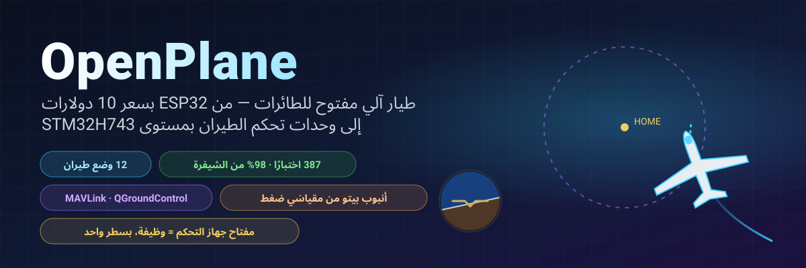
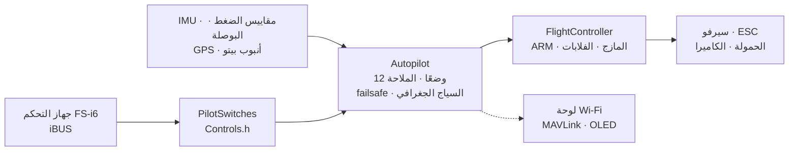

<!-- i18n-bar:start -->
  <p align="center">
    <a href="../../../README.md"> Читать на русском</a>
    &nbsp;·&nbsp;
    <a href="../en/README.md"> Read this in English</a>
    &nbsp;·&nbsp;
    <a href="../zh-CN/README.md"> 阅读中文版</a>
    &nbsp;·&nbsp;
    <a href="../es/README.md"> Lee esto en español</a>
  </p>
  <p align="center">
    <a href="../hi/README.md"> हिन्दी में पढ़ें</a>
    &nbsp;·&nbsp;
     <b>اقرأ بالعربية</b>
    &nbsp;·&nbsp;
    <a href="../pt-BR/README.md"> Leia em português</a>
    &nbsp;·&nbsp;
    <a href="../fr/README.md"> Lire en français</a>
  </p>
  <p align="center">
    <a href="../de/README.md"> Auf Deutsch lesen</a>
    &nbsp;·&nbsp;
    <a href="../ja/README.md"> 日本語で読む</a>
    &nbsp;·&nbsp;
    <a href="../ko/README.md"> 한국어로 읽기</a>
  </p>
<!-- i18n-bar:end -->

<p align="center" dir="rtl"><sub>🌐 ترجمة لملف <a href="../../../README.md">README الروسي</a>. الوثائق التفصيلية مترجمة أيضًا، والروابط أدناه تقود إلى الصفحات المترجمة. إذا اختلفت الترجمة عن الأصل فالعبرة بالأصل. لا تزال رسائل وحدة التحكم (الكونسول) ولقطات الشاشة والرسوم البيانية تحمل نصوصًا بالروسية. أُنجزت الترجمة بالذكاء الاصطناعي ولم يراجعها ناطقون أصليون. إذا وجدت أخطاءً فراسل <a href="https://github.com/damir-lebedev">Damir Lebedev</a> أو أبلغ عنها في <a href="https://github.com/damir-lebedev/OpenPlaneProject/issues">متتبّع المشكلات</a>.</sub></p>

<div dir="rtl">

<p align="center" dir="ltr">
  
</p>

<p align="center" dir="ltr">
  
  
  
  <br>
  
  
  
  <a href="LICENSE.md"></a>
</p>

<h3 align="center">أطفئ جهاز التحكم عن بُعد، فتعود الطائرة إلى المنزل وحدها وتدور فوق رأسك.</h3>
<p align="center">هذا ليس رسومًا متحركة: <b>البرنامج الثابت كله</b> يقود نموذج طائرة في حلقة مغلقة — بايتات iBUS نفسها عند الدخل، وإشارة PWM نفسها عند الخرج.</p>

<p align="center" dir="ltr">
  
</p>

---

## ⚡ في 30 ثانية

| | |
|---|---|
| **ما هذا** | وحدة تحكم في الطيران وطيار آلي مفتوحان للطائرات اللاسلكية. اللوحة الرئيسية هي STM32H743 (لوحة من فئة Pixhawk): على لوحة DevEBox **يعمل البرنامج الثابت فعلًا ويُقاد بجهاز التحكم عن بُعد** — [يوجد فيديو](#-stm32h743-تدبّ-فيها-الحياة-على-اللوحة)، والحساسات تُوصَل الآن. أما الأساس السابق فهو ESP32-S3 بنحو 10 دولارات، وقد اجتاز منصة الاختبار بكل الحساسات. |
| **ماذا يستطيع** | 12 وضع طيران — من التثبيت إلى العودة إلى المنزل، والدوران حول نقطة GPS، والإطلاق باليد، والهبوط الآلي، و**التحليق الشراعي في التيارات الحرارية**. أنبوب بيتو مصنوع من مقياسَي ضغط رخيصين. قياس عن بُعد عبر MAVLink إلى QGroundControl وMission Planner. |
| **الميزة الأساسية** | أي مفتاح أو مقبض في جهاز التحكم = أي وظيفة. **سطر واحد** في `Controls.h` — ولا يعود SwD وضع RTH بل إسقاطًا للحمولة. |
| **لماذا يمكن الوثوق به** | 387 اختبارًا آليًا (إضافة إلى 9 على اللوحة نفسها ببطاقة SD حقيقية)، و98% من الشيفرة مغطاة بالاختبارات، و24 عملية بناء «لوحة × حساسات» دون تحذير واحد، ومحاكاة بحلقة مغلقة لكل وضع. |
| **بصراحة** | حتى الآن طار الوضع اليدوي فقط (النموذج الأولي الأول). واختُبرت STM32H743 حتى الآن على منصة الاختبار فقط ودون حساسات. أما الطيار الآلي فقد جرى التحقق منه على المنصة وبالاختبارات والمحاكاة، وهو بانتظار اختبارات الطيران — [الوضع الحالي أدناه](#-الوضع-الحقيقي). |

---

## 🎛️ مفتاح = وظيفة. سطر واحد.

<div dir="ltr">

```cpp
// include/config/Controls.h
constexpr Binding BINDINGS[] = {
    Bind::modes  (Channels::SWC, MODE_MANUAL, MODE_STABILIZE, MODE_AUTO_TAKEOFF),
    Bind::feature(Channels::SWB, Feature::FLAPS),
    Bind::mode   (Channels::SWD, MODE_RTH),              // إلى المنزل ما دام المفتاح مفعّلًا
    Bind::knob   (Channels::VRA, Knob::STAB_GAIN),       // «أنعم / أكثر صلابة» أثناء الطيران مباشرة
    Bind::knob   (Channels::VRB, Knob::CRUISE_SPEED),
};
```

</div>

تريد التحليق الشراعي في التيارات الحرارية على SwD بدل RTH؟ اكتب `Bind::mode(Channels::SWD, MODE_SOARING)`. وإسقاط الحمولة على SwB؟ `Bind::feature(Channels::SWB, Feature::PAYLOAD_DROP)`. وإن أخطأت، كأن تضع وضعين على مفتاح واحد أو تشغل إحدى العصيّ، **فلن ينجح البناء**: المترجم هو الذي يفحص الجدول (`static_assert`). وعند التشغيل تطبع الطائرة بنفسها ما الذي يقوم به كل مفتاح.

**12 وضعًا · 10 وظائف · 7 مقابض** — كلها مع أمثلة في [مرجع الطيار الآلي](AUTOPILOT_GUIDE.md).

---

## ✈️ ما الذي يستطيعه الطيار الآلي

| | الوضع | الفكرة |
|---|---|---|
| 🕹️ | **MANUAL** | أسطح التحكم = العصيّ، كما لو لم يكن هناك جهاز تحكم في الطيران |
| 🧭 | **STABILIZE** | تحدد العصا الزاوية؛ وإذا تركتها اعتدلت الطائرة بنفسها |
| 📏 | **ALT_HOLD** | + يحافظ على الارتفاع بواسطة مقياس الضغط |
| 🌀 | **ACRO** | تحدد العصا معدل الدوران — للحركات البهلوانية |
| 🛣️ | **CRUISE** | يحافظ على الاتجاه والارتفاع والسرعة وحده؛ والعصيّ تصحح فقط |
| ⭕ | **LOITER** | دوائر فوق نقطة GPS (يُضبط نصف القطر بمقبض) |
| 🏠 | **RTH** | إلى المنزل على ارتفاع 40 m ودوائر فوق الرأس؛ ويُفعَّل تلقائيًا عند فقدان الاتصال |
| 🛫 | **AUTO_TAKEOFF** | إقلاع من المدرج بدفعة الخانق التي يعطيها الطيار |
| 🤾 | **LAUNCH** | إطلاق باليد: يدور المحرك بعد الرمي، ثم يبدأ الصعود |
| 🛬 | **AUTO_LAND** | انسياب ثم تسوية قرب الأرض |
| 🦅 | **SOARING** | المحرك مطفأ، ويجد التيارات الحرارية ويدور فيها |
| 🆘 | **RESCUE** | «النجدة»: الجناحان مستويان والأنف إلى الأعلى — للخروج من أي حلزون |

إضافة إلى ذلك: السياج الجغرافي، والضبط التلقائي (auto-trim) للطائرة «المائلة»، وتنسيق الانعطاف، والحماية من الانهيار الهوائي (stall) بواسطة أنبوب بيتو، والفلابات ومكبح الهواء، وإسقاط الحمولة، وكاميرا مثبَّتة، وصافرة «ابحث عني في العشب».

---

## 📈 كل وضع يطير — في حلقة مغلقة

ليس «دالة أعادت رقمًا»، بل **رحلة طيران**: جهاز التحكم عن بُعد، ثم إطار iBUS، ثم البرنامج الثابت، ثم PWM، ثم انحراف أسطح التحكم، ثم نموذج طائرة بقوة رفع وانهيار هوائي ورياح وتيارات حرارية، ثم الحساسات، ثم البرنامج الثابت من جديد. وتشكل 14 رحلة كهذه جزءًا من الاختبارات المعتادة (`pio test -e native`).

<p align="center" dir="ltr"></p>

<table>
  <tr>
    <td width="50%"></td>
    <td width="50%"></td>
  </tr>
  <tr>
    <td>🦅 عثرت على تيار حراري بنفسها وكسبت ارتفاعًا <b>والمحرك مطفأ</b> — فمقياس معدل الصعود بالطاقة الكلية لا يخلط بين «سحب العصا» وبين تيار صاعد.</td>
    <td>🆘 ميل بزاوية 60° — وبعد ثوانٍ يعود الأفق مستويًا. يخرج RESCUE الطائرة من حلزون بميل 70° وأنف منخفض بزاوية −40°.</td>
  </tr>
  <tr>
    <td></td>
    <td></td>
  </tr>
  <tr>
    <td>🤾 رمي باليد، ولا يدور المحرك إلا بعد ابتعاد اليد عن المروحة، ثم صعود. 🛬 الهبوط: انسياب وتسوية على ارتفاع 3 m.</td>
    <td>🌬️ السرعة الجوية من أنبوب مصنوع من مقياسَي ضغط <b>كثيري الضجيج</b> مع انزياح 150 Pa بين الشريحتين — الخطأ أقل من 0.5 m/s.</td>
  </tr>
</table>

---

## 🌬️ أنبوب بيتو بأقل التكاليف

جهاز قياس السرعة الجوية الجيد يكلف نصف وحدة التحكم في الطيران تقريبًا. وهنا **مقياسا ضغط**: BMP581 في الأنبوب (الضغط الكلي) والمقياس الرئيسي في جسم الطائرة (الضغط الساكن). يصفّر البرنامج الثابت الفرق بين الشريحتين على الأرض، ويرشّح القراءات، ويحسب كثافة الهواء من الارتفاع ودرجة الحرارة، ويلاحظ إن بُدِّلت الخراطيم. والنتيجة: يحافظ CRUISE على **السرعة الجوية** لا على الخانق؛ وحماية من الانهيار الهوائي؛ وسرعة صادقة في القياس عن بُعد. طريقة التجميع في [المرجع](AUTOPILOT_GUIDE.md#أنبوب-بيتو-من-صنع-يديك).

---

## 📡 محطة التحكم الأرضية: المتصفح أو QGroundControl

<table>
  <tr>
    <td width="46%"></td>
    <td>
      <b>ESP32 — لوحة معلومات ويب من الطائرة مباشرة.</b> نقطة الوصول <code>OpenPlane-Debug</code> والعنوان <code>192.168.4.1</code>: قنوات جهاز التحكم عن بُعد، والمخارج، وجميع الحساسات، والوضع، والملاحة، وتغيير الوضع وضبط PID أثناء الطيران. بلا تطبيقات ولا أجهزة إضافية.<br><br>
      <b>STM32H743 — MAVLink عبر مودم راديو.</b> يرى QGroundControl وMission Planner الطائرة على أنها طائرة ArduPilot: الأفق، وخريطة عليها نقطة المنزل، والسرعة من أنبوب بيتو، والأوضاع بأسماء ArduPlane، وPID من نافذة المعاملات، وتغيير الوضع بزر. لا يمكن التسليح (ARM) من الأرض، بل بمفتاح فقط: فهذا أأمن.<br><br>
      أُطر MAVLink مطابَقة بايتًا ببايت مع المرجع <code>pymavlink</code>.
    </td>
  </tr>
</table>

---

## 📼 الصندوق الأسود

تسجّل اللوحة كل رحلة: IMU بتردد 500 Hz، والزوايا وقرارات الطيار الآلي، وPID، وكل المخارج، والعصيّ، ومقياس الضغط، والبوصلة، وGPS، والبطارية، والأحداث — من التسليح (ARM) ورفع الخانق حتى الهبوط، مع 10 ثوانٍ قبل البداية. يسجّل **ESP32-S3** في الفلاش المدمج (13.9 MB، نحو 11 دقيقة)، ويسجّل **STM32H743** على بطاقة SD (64 MB، نحو ساعة؛ وتبقى البطاقة FAT32 عادية، ويكتب البرنامج الثابت في ملف أُنشئ مسبقًا اسمه `BLACKBOX.BIN`). ولا يجري المسح إلا على الأرض. وبعد الرحلة ينزّل الأمر `python tools/blackbox.py download` الرحلة عبر USB ويقسمها إلى ملفات CSV؛ ويمكن أيضًا فك رحلات بطاقة SD دون اللوحة: `python tools/blackbox.py ring E:/BLACKBOX.BIN`. التفاصيل في [BLACKBOX.md](BLACKBOX.md).

---

## 🔩 العتاد: برنامج ثابت واحد — أربع لوحات واثنا عشر حساسًا

| اللوحة | الحالة | ما الذي جرى التحقق منه |
|---|---|---|
| **STM32H743VIT6** | ✅ الرئيسية · 🔧 DevEBox، الحساسات قيد التوصيل + 🧪 اختبارات | على اللوحة: الإقلاع ووحدة التحكم النصية عبر USB و**بطاقة SD والصندوق الأسود** (اختبارات على اللوحة) و**استقبال iBUS والتسليح (ARM) والتحكم في السيرفو والمحرك بجهاز التحكم عن بُعد** (الإطلاق موثَّق بالفيديو)؛ وعلى الحاسوب: البرنامج الثابت كله — مهام FreeRTOS والفلاش وMAVLink وI2C وSPI. ولم تُوصَّل حساسات باللوحة بعد |
| **ESP32-S3 N16R8** | ✅ الرئيسية السابقة، على المنصة | جميع الحساسات والسيرفو وiBUS وOLED ولوحة المعلومات مباشرة؛ والبرنامج الثابت كله في الاختبارات |
| **ESP32 38-pin** | 🧪 اختبارات | البرنامج الثابت كله في الاختبارات مع طقم ICM-45686 |
| **ESP32-C3 SuperMini** | ✈️ طارت (يدويًا) | النموذج الأولي الأول؛ وبناء جميع الأطقم |

| الحساس | ما هو | الناقل |
|---|---|---|
| **LSM6DSV** + **QMC6309** | IMU + بوصلة (وحدة) | I2C / SPI |
| **ICM-45686** + **QMC6309** | IMU + بوصلة (بديل) | I2C / SPI |
| **SPL06-001** | مقياس ضغط جسم الطائرة | I2C / SPI |
| **BMP581** | مقياس الضغط الرئيسي ومقياس الضغط في أنبوب بيتو | I2C / SPI |
| MPU6050/6500, ICM-42688, BMP388, BME280, QMC5883P/L | حساسات المنصة والقديمة | I2C / SPI |
| **u-blox M10** | GPS، 10 Hz، UBX | UART |

يُغيَّر الحساس بسطر واحد (`SENSOR_KIT_LSM6DSV_PITOT`)، وتُغيَّر اللوحة بعلَم بناء واحد. وتُبنى كل اللوحات الأربع × 6 أطقم حساسات دون تحذيرات: [`tools/build_matrix.sh`](../../../tools/build_matrix.sh).

<table>
  <tr>
    <td width="50%"></td>
    <td width="50%"></td>
  </tr>
  <tr>
    <td>منصة ESP32-S3: IMU ومقياس الضغط والبوصلة وOLED والسيرفو والمستقبل.</td>
    <td>اختبار مجموعة المحرك والمروحة.</td>
  </tr>
</table>

### ‏🎥 STM32H743 تدبّ فيها الحياة على اللوحة

يعمل البرنامج الثابت الخاص بـ STM32H743 على لوحة DevEBox **دون أي حساس** ويُقاد بجهاز تحكم عادي: مستقبل iBUS والتسليح (ARM) والسيرفو والمحرك تستجيب للعصيّ والمفاتيح في الوضع اليدوي. وقد صُوّر الإطلاق كله بالفيديو.

▶️ **[شاهد الإطلاق بالفيديو](https://t.me/lisnmylife/420)**

ما الذي يثبته هذا: أن السلسلة «جهاز التحكم عن بُعد، ثم iBUS، ثم البرنامج الثابت، ثم PWM» تعمل على عتاد حقيقي لا في الاختبارات فقط. وما لم يثبت بعد: لم تُوصَّل بهذه اللوحة أي حساسات (IMU أو مقياس ضغط أو GPS)، ولذلك لم تُجرَّب عليها أوضاع الطيار الآلي حتى الآن.

---

## 🧪 جودة يمكن التحقق منها

| | |
|---|---|
| **387 اختبارًا آليًا** | الوحدات، وبرامج تشغيل الشرائح المفحوصة على مستوى السجلات، ورحلات بحلقة مغلقة، والبرنامج الثابت لـ ESP32 وSTM32 **بالكامل** على الحاسوب؛ إضافة إلى 9 اختبارات على لوحة STM32 نفسها ببطاقة SD حقيقية |
| **98.3% من الأسطر، 87.7% من الفروع** | تغطية `gcovr`، بما فيها شيفرة STM32 |
| **24/24 عملية بناء** | 4 لوحات × 6 أطقم حساسات، `-Wall -Wextra`، دون أي تحذير |
| **0 ملاحظات** | cppcheck وclang-tidy على الشيفرة كلها |
| **مراجع لا نسخ شيفرة** | معادلات الحساسات وفق أوراق البيانات (Bosch وST وTDK وGoertek)، وMAVLink وفق pymavlink |

<div dir="ltr">

```bash
pio test -e native -e native-stm32   # جميع الاختبارات، نحو 1.5 دقيقة، دون حاجة إلى عتاد
```

</div>

التفاصيل في [TESTING.md](TESTING.md).

---

## 🧠 كيف هو مبنيّ

<div dir="ltr">



</div>

- **‏C++ على ملفات الترويسة فقط (header-only)**، ووحدة ترجمة واحدة، ودون ذاكرة ديناميكية في حلقة الطيران. تفضّل `.h/.cpp`؟ لك فرع موازٍ هو [`feature/split-headers`](https://github.com/damir-lebedev/OpenPlaneProject/tree/feature/split-headers): يُولَّد من هذا الفرع بسكربت، ويأتي البرنامج الثابت مع LTO بالحجم نفسه.
- **‏HAL** — الطبقة الوحيدة التي تعرف المتحكم الدقيق: اللوحة الجديدة تعني `Board` جديدًا، لا طيارًا آليًا أُعيدت كتابته.
- **برنامج تشغيل الحساس لا يعرف الناقل**: فالفئة نفسها تعمل عبر I2C وSPI.
- **الأمان بترتيب العمليات**: فقدان الاتصال > ARM > الوضع > الخانق؛ ولا يستطيع أي وضع تمرير الخانق متجاوزًا ARM.

التفاصيل في [ARCHITECTURE.md](ARCHITECTURE.md).

---

## 🚀 بداية سريعة

<div dir="ltr">

```bash
pip install platformio
git clone https://github.com/damir-lebedev/OpenPlaneProject && cd OpenPlaneProject
pio run -e stm32h743-devebox -t upload                    # DevEBox H743: USB DFU، ووحدة التحكم النصية عبر USB
pio run -e esp32-s3 -t upload && pio device monitor     # ESP32-S3
pio run -e stm32h743 -t upload                            # STM32H743 (ST-Link)
```

</div>

‏DevEBox: لا يوجد في اللوحة زر BOOT0 — قبل أول رفع صِل الطرف BT0 بـ 3V3 واضغط RST؛ وبعد ذلك يعيد الزر `D` في وحدة التحكم النصية تشغيل اللوحة إلى المحمّل بنفسه ([التفاصيل](DEVELOPER_GUIDE.md#stm32h743)).

في مراقب المنفذ التسلسلي: `h` — القائمة، `b` — أي الشرائح ظاهرة على النواقل، `s` — الحساسات، `p` — فحص المخارج (انزع المروحة!). ثم — [دليل الطيار](PILOT_GUIDE.md).

---

## 🟢 الوضع الحقيقي

| ماذا | أين جرى التحقق |
|---|---|
| التحكم اليدوي، المازج | ✈️ في الطيران (النموذج الأولي الأول، C3) |
| ARM وfailsafe والفلابات والسيرفو والمحرك | 🔧 على المنصة (S3) |
| STABILIZE | 🔧 على المنصة: تستجيب أسطح التحكم للميلان في الاتجاه الصحيح |
| حساسات المنصة (MPU6500 وBMP388 وQMC5883P) وOLED ولوحة المعلومات | 🔧 على المنصة |
| بقية الأوضاع والملاحة وأنبوب بيتو وMAVLink | 🧪 اختبارات ومحاكاة بحلقة مغلقة |
| الحساسات الجديدة (LSM6DSV وICM-45686 وQMC6309 وSPL06 وBMP581) | 🧪 محاكيات سجلات وفق أوراق البيانات |
| STM32H743: بطاقة SD والصندوق الأسود ووحدة التحكم النصية عبر USB | 🔧 على لوحة DevEBox (اختبارات على اللوحة) |
| STM32H743: iBUS وARM وPWM للسيرفو والمحرك والتحكم اليدوي | 🔧 على لوحة دون حساسات، موثَّق بالفيديو |
| STM32H743: الحساسات (IMU ومقياس الضغط والبوصلة وGPS) وأوضاع الطيار الآلي | 🧪 البرنامج الثابت كله على الحاسوب؛ ولم تُوصَّل حساسات باللوحة بعد |

نموذج الطائرة في المحاكاة مبسَّط، والمعاملات قيم ابتدائية. وكل وضع جديد يُجرَّب أولًا على ارتفاع، وإصبعك على مفتاح MANUAL.

---

## 🗺️ خارطة الطريق

- [x] ‏التحكم اليدوي وARM وfailsafe وبرنامج ثابت كائني التوجه ولوحة معلومات ويب
- [x] ‏منصة ESP32-S3 مع جميع الحساسات — مباشرة
- [x] ‏12 وضعًا، وملاحة GPS، وRTH عند فقدان الاتصال، وسياج جغرافي
- [x] ‏المفاتيح والمقابض بسطر واحد، وإسقاط الحمولة، والكاميرا، والضبط التلقائي
- [x] ‏أنبوب بيتو من مقياسَي ضغط، وحماية من الانهيار الهوائي
- [x] ‏حساسات جديدة: LSM6DSV وICM-45686 وQMC6309 وSPL06 وBMP581
- [x] ‏STM32H743: برنامج ثابت كامل وMAVLink وإعدادات في الفلاش
- [x] ‏محاكاة بحلقة مغلقة لجميع الأوضاع، والبرنامج الثابت كله في الاختبارات
- [x] ‏الصندوق الأسود: الرحلة في الفلاش (ESP32-S3) وعلى بطاقة SD (STM32H743)، والتنزيل والفك إلى CSV
- [x] ‏STM32H743 تعمل على اللوحة: جهاز التحكم عن بُعد، ثم iBUS، ثم السيرفو والمحرك (دون حساسات، بالفيديو)
- [ ] ‏STM32H743: توصيل الحساسات واجتياز منصة الاختبار كما جرى مع ESP32-S3
- [ ] اختبارات طيران للطيار الآلي على هيكل الطائرة الجديد
- [ ] لوحة وحدة تحكم في الطيران خاصة ([FC_BOARD.md](FC_BOARD.md)) على STM32H743
- [ ] الطيران عبر نقاط الطريق ومهام MAVLink
- [ ] تغذية راجعة تكيفية (المسودة الأولى جرى التحقق منها في المحاكاة)
- [ ] مستشعر للتيار والبطارية، وقياس عن بُعد إلى جهاز التحكم (iBUS-SENS)
- [ ] توصيل ذاتي: المسار، ثم إسقاط الحمولة، ثم العودة إلى المنزل

التفاصيل في [ROADMAP.md](ROADMAP.md).

---

## 💼 للشركاء والمستثمرين

الطائرات الصغيرة للتوصيل ومراقبة المناطق إما منصات مغلقة باهظة وإما مشاريع هواة متفرقة. تستهدف OpenPlane المنطقة الوسطى: **طيارًا آليًا مفتوحًا قابلًا للتحقق على عتاد واسع الانتشار**، تغطي الاختبارات كل وظيفة فيه ويمكن تكييفه مع المهمة — توصيل الأدوية إلى الأماكن التي يصعب الوصول إليها، ومراقبة الحقول والغابات، وأعمال البحث.

ما أُنجز حتى الآن بإمكانياتنا الذاتية: معمارية تنتقل بين اللوحات دون إعادة كتابة؛ وطيار آلي بمجموعة كاملة من الأوضاع؛ وبنية اختبارات تظهر عليها الميزات الجديدة بسرعة دون أن تكسر القديمة. وما ستسرّعه الموارد: اختبارات الطيران، ولوحة وحدة تحكم في الطيران خاصة على STM32H743، والطيران عبر نقاط الطريق وإسقاط الحمولة. إلى أين ولماذا — في [ROADMAP.md](ROADMAP.md).

---

## 📚 الوثائق

| الوثيقة | لمن |
|---|---|
| [AUTOPILOT_GUIDE.md](AUTOPILOT_GUIDE.md) | للطيار: كل وضع ووظيفة ومقبض، وكيف تُربط بمفتاح، وأنبوب بيتو، والمحطة الأرضية |
| [PILOT_GUIDE.md](PILOT_GUIDE.md) | التجميع، وتوزيع الأطراف، وجهاز التحكم، وfailsafe، والرحلة الأولى |
| [DEVELOPER_GUIDE.md](DEVELOPER_GUIDE.md) | للمطوّر: الملفات، واصطلاحات الإشارات، وواجهة API، وكيف تضيف حساسًا أو وضعًا أو لوحة |
| [ARCHITECTURE.md](ARCHITECTURE.md) | الطبقات والمهام ودورة التحكم وآلات الحالات |
| [TESTING.md](TESTING.md) | الاختبارات والمحاكاة والتغطية والتحليل |
| [reference/](reference/README.md) | مرجع لكل فئة |
| [FC_BOARD.md](FC_BOARD.md) · [ROADMAP.md](ROADMAP.md) | لوحة وحدة التحكم في الطيران · إلى أين يتجه المشروع |
| [airframe/](airframe/README.md) | هيكل Astro-Cargo: مشروع Fusion 360 وملفات STL للطباعة، والعيوب المعروفة في الإصدار v2 |

> **مشروع ذو صلة:** [esp32-rc-joystick](https://github.com/damir-lebedev/esp32-rc-joystick) — جهاز التحكم FS-i6 كذراع تحكم USB للمحاكي على ESP32-S3 نفسها: تدرّب ساعات في المحاكي أولًا، ثم في الحقل.

---

## 🤝 المشاركة

نحتاج إلى أيدٍ وعقول: الديناميكا الهوائية وهواية صنع النماذج الطائرة، والطباعة ثلاثية الأبعاد ومتانة المواد، ولغة C++ للأنظمة المدمجة، والحساسات والطيارات الآلية، وواجهات المحطة الأرضية. أرسلوا القضايا (Issues) وطلبات الدمج (pull requests) إلى الفرع `main`؛ وابدؤوا بـ [DEVELOPER_GUIDE.md](DEVELOPER_GUIDE.md).

## 📜 الرخصة

‏[OpenPlane License](LICENSE.md) رخصة مبنية على MIT مع شروط إضافية. يجوز استخدام الشيفرة والوثائق وملفات النموذج ونسخها وتعديلها وبيعها، بما في ذلك في المنتجات التجارية. والشروط هي:

1. **اذكر المؤلف — Damir Lebedev (Damn / Проклятый).** يجب أن يظهر الاسم في مكان يراه مستخدمو منتجك: في الوثائق أو README أو صفحة «حول». واترك نص الرخصة مع الشيفرة.
2. **الاستخدام العسكري محظور.** لا يجوز استخدام المشروع لصالح الجيوش والتنظيمات شبه العسكرية، ولا في الحرب، ولا لصنع الأسلحة والذخائر وأنظمة إيصالها وتصويبها.
3. **لا تُلحق الضرر بالأشخاص أو الممتلكات عمدًا دون موافقتهم الكتابية المسبقة على هذا الضرر.** يجوز لك إتلاف معداتك أنت إن لم يكن في ذلك خطر على أحد: مثل إطلاق النار من مسدس هوائي على طائرتك المسيّرة الخاصة. أما إيذاء الناس أو قتلهم فلا يجوز.
4. **التزم بقواعد السلامة والقانون** عند التجميع والاختبار والطيران.

إذا خُرقت الشروط انتهى الإذن باستخدام المشروع. وبسبب حظر بعض أنواع الاستخدام فهذه ليست رخصة «مفتوحة» بمفهوم OSI: الشيفرة متاحة للقراءة والنسخ والتعديل، لكن المشروع رسميًا من النوع source-available لا open source.

النص الإنجليزي في ملف [LICENSE](LICENSE.md) هو وحده ذو القوة القانونية: أما ترجمات الرخصة إلى اللغات الأخرى فمقدَّمة للتسهيل.

يتحكم البرنامج الثابت في طائرة وهو غير معتمد. وكل ما تفعله به فعلى مسؤوليتك؛ ولا يتحمل المؤلف أي مسؤولية.

<div dir="ltr">

```text
OpenPlane © 2026 Damir Lebedev (Damn / Проклятый) — https://github.com/damir-lebedev/OpenPlaneProject
```

</div>

<p align="center"><i>تعطّل النموذج الأولي الأول في أول رحلة له — ولهذا فكل شيء هنا مكشوف: الشيفرة والاختبارات والمشكلات. ابنوه، واكسروه، وأصلحوه معنا.</i></p>

</div>
