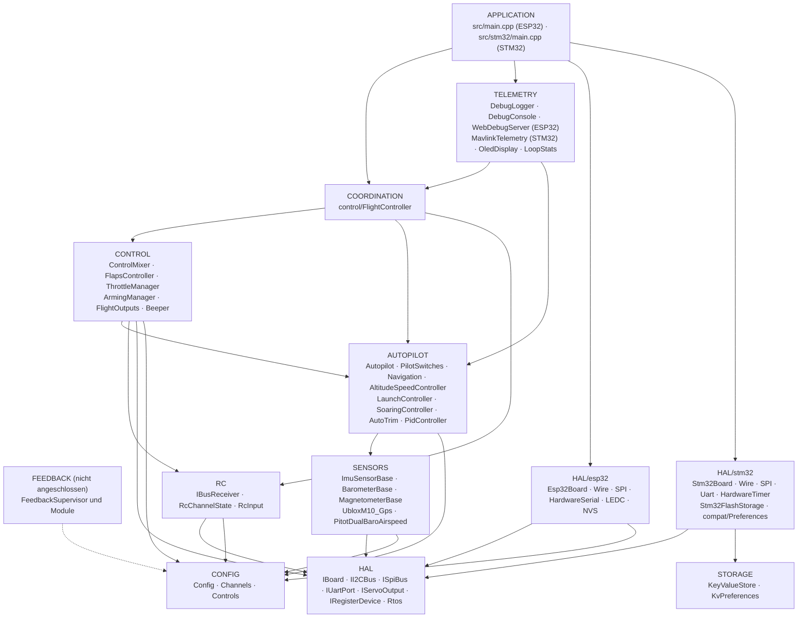
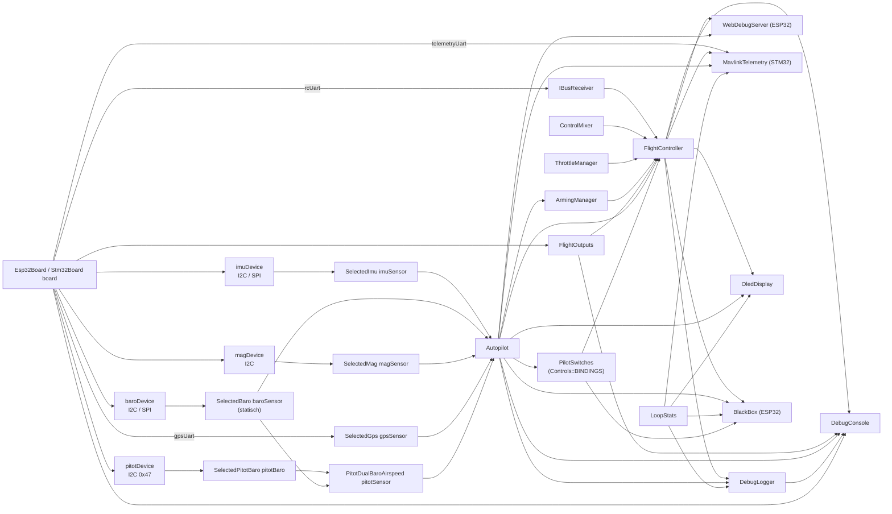
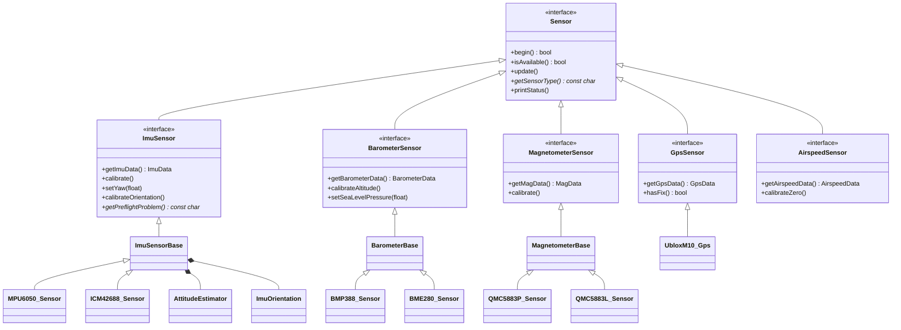
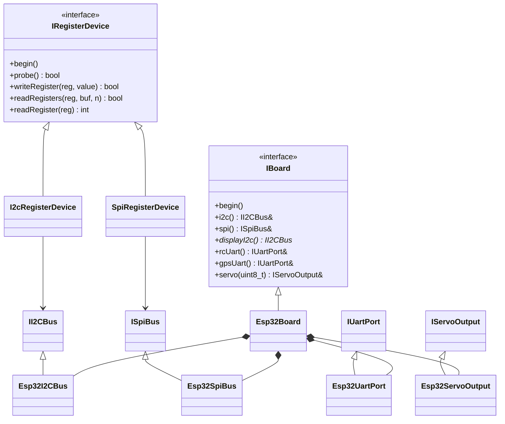
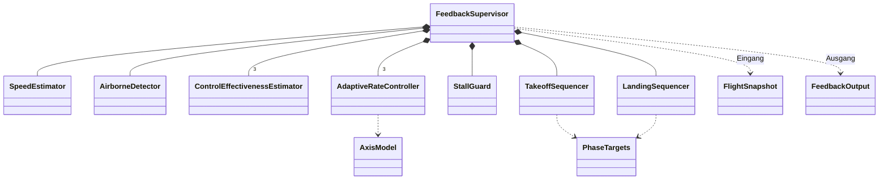
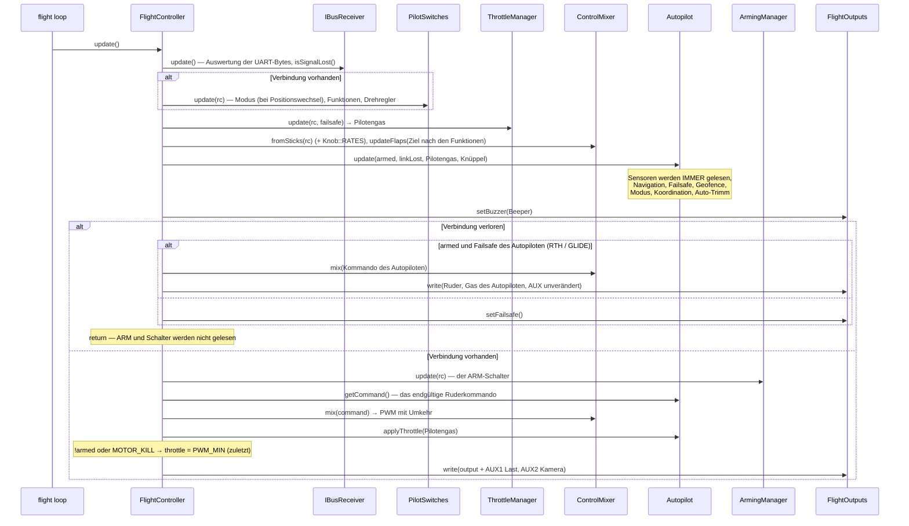
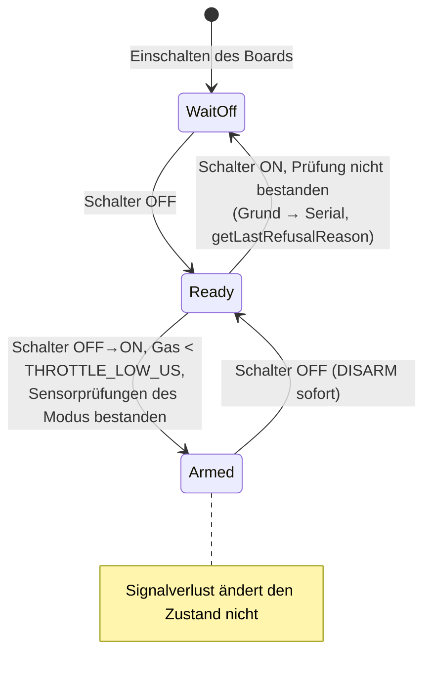
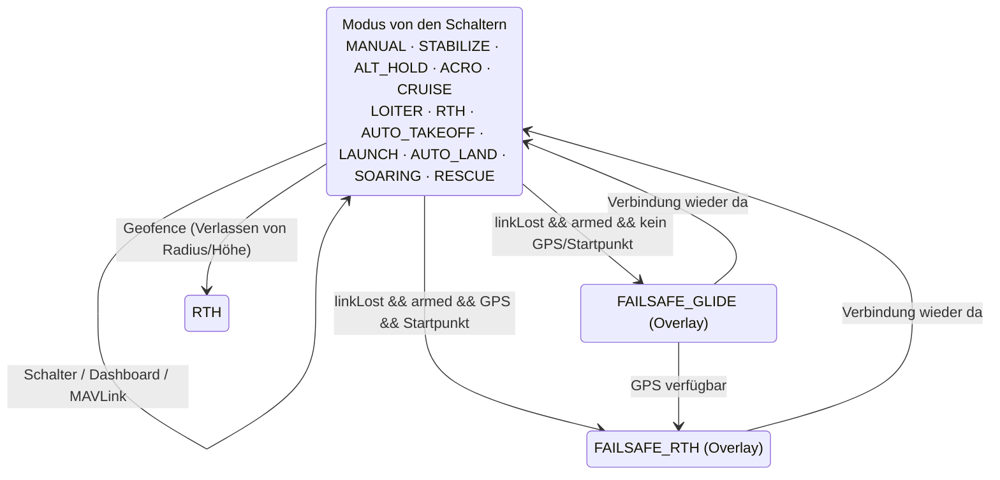
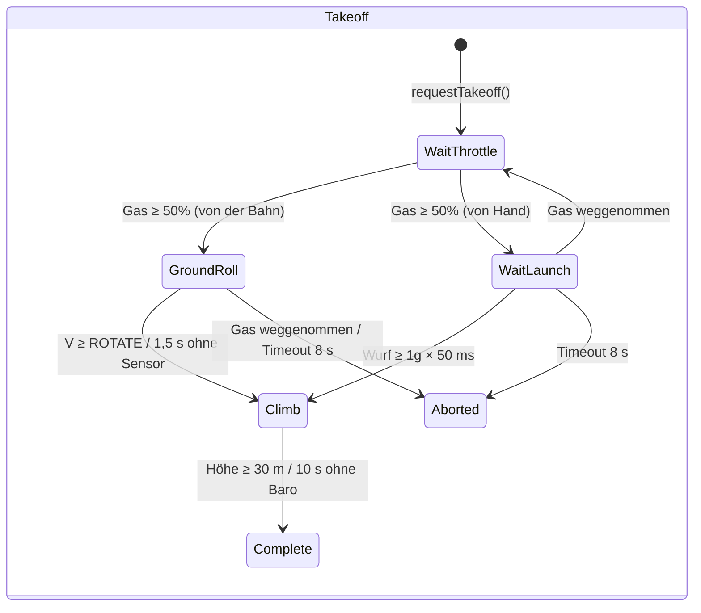
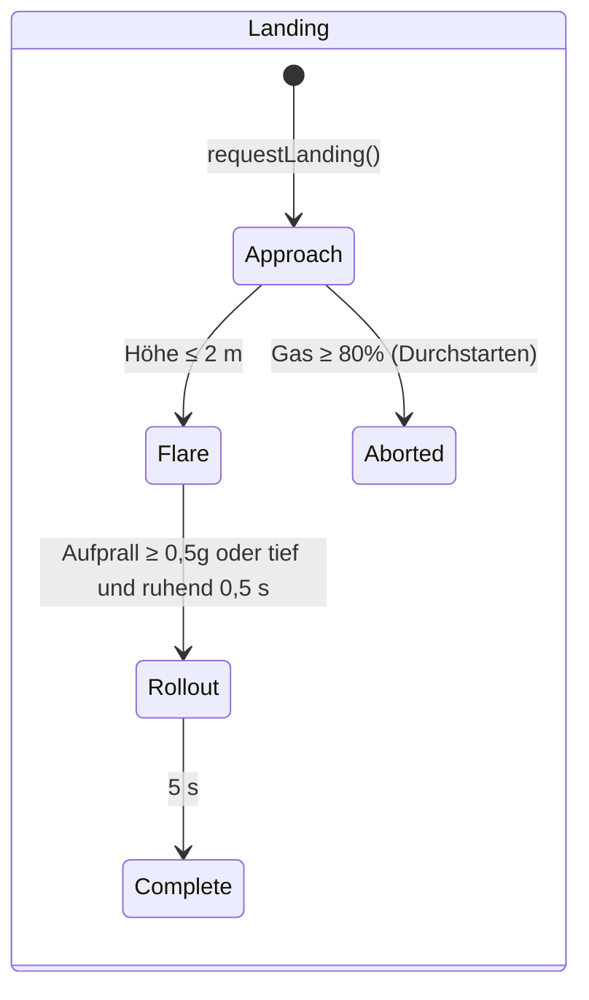

# ARCHITECTURE.md – die Architektur der OpenPlaneProject-Firmware

> 🌐 Diese Seite ist die Übersetzung des [russischen Originals](../../ARCHITECTURE.md). Weichen Übersetzung und Original voneinander ab, gilt das Original. Die Firmware gibt ihre Konsolenmeldungen auf Russisch aus; sie werden daher unverändert zitiert.

Dieses Dokument beschreibt, **wie die gesamte Firmware aufgebaut ist**: die Schichten und die Abhängigkeitsregeln zwischen ihnen, den Objektgraphen, das FreeRTOS-Threadmodell, die Reihenfolge der Operationen pro Zyklus, die Zustandsautomaten, die Strategie zur Ausfallsicherheit der Sensoren und die Erweiterungspunkte. Eine ausführliche Referenz zu jeder Klasse (öffentliche API, Felder, Invarianten) steht in [`reference/`](reference/README.md).

Verwandte Dokumente:

| Dokument | Worum es geht |
|---|---|
| [`DEVELOPER_GUIDE.md`](DEVELOPER_GUIDE.md) | Praxisleitfaden: die Vorzeichenkonvention, die HTTP-API, die Konsole, wie man einen Sensor, einen Modus oder ein Board hinzufügt |
| [`reference/`](reference/README.md) | Referenz zu allen Klassen, Strukturen und Namensräumen |
| [`TESTING.md`](TESTING.md) | Tests: nativ (auf dem PC, mit Abdeckung) und auf dem Board |
| [`PILOT_GUIDE.md`](PILOT_GUIDE.md) | Aufbau, Pinbelegung, Sender, erster Flug |
| [`ROADMAP.md`](ROADMAP.md) | Wohin sich das Projekt entwickelt |

> Stand: Der ESP32-S3-Prüfstand ist mit allen Sensoren geprüft, **der Autopilot ist im Flug nicht erprobt**, und der Rückführungskreis (`autopilot/feedback/`) ist **nicht an die Firmware angeschlossen** und wird nur durch Simulation geprüft.

---

## Inhalt

1. [Prinzipien](#1-prinzipien)
2. [Schichten und Abhängigkeitsregeln](#2-schichten-und-abhängigkeitsregeln)
3. [Der Objektgraph (Composition Root)](#3-der-objektgraph-composition-root)
4. [Klassenhierarchien](#4-klassenhierarchien)
5. [FreeRTOS-Tasks und Datentrennung](#5-freertos-tasks-und-datentrennung)
6. [Der Regelzyklus: `FlightController::update()`](#6-der-regelzyklus-flightcontrollerupdate)
7. [Zustandsautomaten](#7-zustandsautomaten)
8. [Ausfallsicherheit: Sensoren, Verbindung, Ausgänge](#8-ausfallsicherheit-sensoren-verbindung-ausgänge)
9. [Konfiguration und Build-Varianten](#9-konfiguration-und-build-varianten)
10. [Der Rückführungskreis (nicht angeschlossen)](#10-der-rückführungskreis-nicht-angeschlossen)
11. [Erweiterungspunkte](#11-erweiterungspunkte)
12. [Testbarkeit](#12-testbarkeit)

---

## 1. Prinzipien

| Prinzip | Wie es umgesetzt ist |
|---|---|
| **Reines Header-C++** | Alle Klassen sind in den Headern unter `include/<Schicht>/` definiert. Die einzige Übersetzungseinheit der Firmware ist `src/main.cpp` (ESP32) oder `src/stm32/main.cpp` (STM32). Kein dynamischer Speicher in der Flugschleife (`String`-Zeichenketten nur im Webserver und im OLED). Eine in `.h/.cpp` aufgeteilte Variante liegt in einem eigenen Branch, `feature/split-headers`: Sie wird von `tools/split_headers.py` erzeugt, die Unterschiede und die Firmware-Größen stehen in deren `docs/SPLIT_HEADERS.md`. |
| **Composition Root** | `src/main.cpp` / `src/stm32/main.cpp` ist die einzige Stelle, an der Objekte erzeugt und über Referenzen/Zeiger verbunden werden. Flug-Logik enthält sie nicht. |
| **Eine Zeile – ein Schalter** | Was jeder Senderkanal tut, legt die Tabelle `config/Controls.h` (`Bind::modes/mode/feature/knob`) fest, die beim Build per `static_assert` geprüft wird. |
| **Dependency Inversion** | Die oberen Schichten hängen von Schnittstellen ab (`IBoard`, `IRegisterDevice`, `ImuSensor*`, …), nicht von konkreten Chips und MCUs. |
| **Nullable-Abhängigkeiten** | Der Autopilot, die Schalter (`PilotSwitches`) und alle Sensoren werden als Zeiger übergeben und dürfen `nullptr` sein: Ohne Sensor verhält sich der Modus sicher, statt abzustürzen. |
| **Sicherheit durch Priorität** | Die Reihenfolge der Operationen im Zyklus ist die Priorität: Signalverlust > ARM > Knüppel/Autopilot > Gas. Die ARM-Prüfung auf das Gas steht zuletzt. |
| **Ein Vorzeichensystem** | Von der IMU bis zum Servo – luftfahrttypische Vorzeichen; die Richtung jedes Servos wird an genau einer Stelle festgelegt (`Config::*_REVERSED`). |
| **Zeit als Parameter** | Wo immer möglich (Klappen, Rückführungsmodule) wird die Zeit als Argument übergeben und nicht aus `millis()` gelesen – das macht die Klassen deterministisch und testbar. |
| **Ehrliche Diagnose** | Jeder Sensor und jeder Ausgang unterscheidet „nicht im Build“ (`attached`) von „vorhanden, antwortet aber nicht“ (`available`); das ist im JSON, im Log und auf dem OLED sichtbar. |

---

## 2. Schichten und Abhängigkeitsregeln



Die Regeln:

1. **Die HAL ist die einzige Schicht, die die MCU kennt.** Nur `include/hal/esp32/` und `include/hal/stm32/` binden `<Wire.h>`, `<SPI.h>`, `HardwareSerial` ein und rufen `ledc*` / `HardwareTimer` / Flash auf. FreeRTOS-Tasks werden über `hal/Rtos.h` erzeugt (Kern 0 beim ESP32, eine Priorität beim STM32). Speicherung der Einstellungen: Der Code schreibt `<Preferences.h>` – beim ESP32 ist das NVS, beim STM32 `hal/stm32/compat/Preferences.h` über `storage/KeyValueStore.h`. Eine bewusste Ausnahme: `SpiRegisterDevice` schaltet CS mit den Standard-Arduino-Funktionen `pinMode/digitalWrite` (auf ESP32 und STM32 identisch).
2. **Sensortreiber kennen den Bus nicht.** Sie erhalten ein `IRegisterDevice&` (eine I2C-Adresse oder ein SPI-CS) oder ein `IUartPort&`. Der Bus wird in `sensors/SensorSelection.h` gewählt.
3. **RC und Outputs wissen nichts vom Flugzeug**: iBUS-Bytes → Kanäle; PWM-Werte → Ausgänge.
4. **Control und Autopilot** sind reine Logik über Daten: kein UART, kein PWM, kein WLAN.
5. **Coordination** (`FlightController`) ist die einzige Klasse, die mehrere untere Schichten gleichzeitig sieht und die Reihenfolge der Operationen festlegt.
6. **Telemetry** liest den Zustand nur über konstante Getter; Befehle vom Dashboard laufen über ein „Postfach“ und werden von der Flugschleife angewendet; MAVLink (`MavlinkTelemetry`) arbeitet direkt in der Flugschleife und wendet Befehle selbst an.
7. **Eine untere Schicht bindet nie eine obere ein.** Braucht eine untere Klasse eine obere, wird die Logik in den `FlightController` hochgezogen.

`ArmingManager` (CONTROL) liest den Modus aus `Autopilot` – das ist die einzige horizontale Abhängigkeit CONTROL → AUTOPILOT: Die ARM-Prüfungen hängen davon ab, welche Sensoren der gewählte Modus braucht.

---

## 3. Der Objektgraph (Composition Root)

Alle Objekte sind Globale mit statischer Speicherdauer, erzeugt in `src/main.cpp`. Die Referenzen und Zeiger zwischen ihnen sind **nicht besitzend**; die Konstruktionsreihenfolge entspricht der Deklarationsreihenfolge (eine einzige Übersetzungseinheit).



Die Initialisierungsreihenfolge in `setup()`:

```
Serial (ESP32: TX-Puffer 4 KB; STM32: SERIAL_TX_BUFFER_SIZE=1024), 115200 → Banner
board.begin()               — I2C/SPI-Busse (der zweite I2C, falls vorhanden)
flightOutputs.begin()       — PWM-Kanäle; sofort setFailsafe()
[STM32] Einstellungen aus dem Flash — KeyValueStore::mount(), CRC des Abbilds
setupSensors()              — begin() jedes Sensors; Kalibrierung derer, die geantwortet haben:
                              IMU (2 s ruhig + Vorflugprüfung),
                              Baro (Nullhöhe), Kompass (Anfangskurs → IMU-Yaw),
                              Pitotrohr (der Nullpunkt wird in der ersten Sekunde der Schleife erfasst)
autopilot.begin()           — Trimmung aus NVS/Flash
flightController.begin()    — setFailsafe() + UART iBUS
oledDisplay.begin(...)      — eigener Task (hal/Rtos.h)
[ESP32] webDebugServer.begin() — Zugangspunkt + eigener Task auf Kern 0
[ESP32] blackBox.begin()   — die Blackbox-Partition, eine Queue im PSRAM, der Task bbox auf Kern 0
[STM32] mavlink.begin()     — UART4 des Funkmodems
[STM32] setupBlackBox()    — SD-Karte, die Datei BLACKBOX.BIN, blackBox.begin(), der Task bbox
pilotSwitches.printBindings() — was auf welchem Schalter liegt
debugLogger.begin()         — Log-Einstellungen
[STM32] Tasks flight / storage → vTaskStartScheduler()
```

---

## 4. Klassenhierarchien

### Sensoren



Die Basisklassen (`ImuSensorBase`, `BarometerBase`, `MagnetometerBase`) implementieren das Muster **Template Method**: Die öffentlichen `update()`/`calibrate()` sind einmal geschrieben, und der Chip-Treiber implementiert nur die geschützten „Primitive“ (`readSample()`, `isNewSampleReady()`, `readRaw()`, die Skalen).

### HAL



### Der Rückführungskreis



---

## 5. FreeRTOS-Tasks und Datentrennung

**ESP32** (zwei Kerne, FreeRTOS ist im Arduino-Core eingebaut):

| Kern | Task | Was er tut | Periode |
|---|---|---|---|
| 1 | Arduino `loopTask` → `loop()` | `WebDebugServer::applyPendingCommands()` → `FlightController::update()` → `DebugLogger::update()` → `DebugConsole::update()` → `LoopStats::record()` → `BlackBox::update()` | `Config::LOOP_PERIOD_MS` = 2 ms (500 Hz), `vTaskDelayUntil` |
| 0 | `web` (8 KB Stack, Priorität 1) | `WebServer::handleClient()` | alle 2 ms (`vTaskDelay`) |
| 0 | `oled` (4 KB Stack, Priorität 1) | `OledDisplay::draw()` über den zweiten I2C-Bus | 200 ms (`vTaskDelayUntil`) |
| 0 | `bbox` (6 KB Stack, Priorität 2) | `BlackBox::writerStep()`: eine Seite aus der Queue in den Flash; am Boden – Löschen | Benachrichtigung aus `loop()` nach jedem Zyklus (sonst einmal alle 20 ms) |
| 0 | der WLAN-Stack von ESP-IDF | der Zugangspunkt | — |

**STM32H743** (ein Kern, FreeRTOS von STM32duino, Verdrängung nach Priorität):

| Priorität | Task | Was er tut | Periode |
|---|---|---|---|
| 5 | `flight` (16 KB) | `FlightController::update()` → `MavlinkTelemetry::update()` → `DebugLogger::update()` → `DebugConsole::update()` → `LoopStats::record()` | 2 ms, `vTaskDelayUntil` |
| 1 | `oled` (4 KB) | `OledDisplay::draw()` über den zweiten I2C-Bus | 200 ms |
| 1 | `storage` (2 KB) | `Stm32FlashStorage::service()` – Löschen und Schreiben des Einstellungssektors | 100 ms |
| 2 | `bbox` (8 KB) | `BlackBox::writerStep()`: eine Seite aus der Queue auf die SD-Karte; am Boden – Löschen. Wird vom Flug-Task verdrängt | Benachrichtigung nach jedem Zyklus (sonst einmal alle 20 ms) |

**Regeln der Datentrennung:**

- Die Tasks `web` und `oled` **lesen den Zustand nur** (`FlightController`, `Autopilot`, `LoopStats`, die Sensoren), und zwar über konstante Getter. Die Felder sind einzelne 16/32-Bit-Werte, ein „zerrissenes“ Lesen gibt es also nicht; im ungünstigsten Fall sind die Werte benachbarter Zyklen zu sehen.
- **Befehle** vom Dashboard (`/api/setmode`, `/api/setpid`) werden **nicht** direkt aus dem Task `web` angewendet: Sie werden unter einem `portMUX`-Spinlock in `PendingCommands` abgelegt und von der Flugschleife in `applyPendingCommands()` abgeholt – eine Änderung am Autopiloten geschieht immer im Kontext des Tasks, dem er gehört.
- `LoopStats::hz/avgUs/maxUs` sind `volatile uint32_t`; `takePeakUs()` wird nur aus `loop()` aufgerufen.
- `OledDisplay` hält einen Zeiger auf den Bus in einer statischen Variablen (der C-Callback von U8g2 nimmt keinen Kontext entgegen); an Bord gibt es ein einziges Display.

**Echtzeit:**

- Die Periode wird durch `vTaskDelayUntil` gehalten, nicht durch ein `delay()` nach der Arbeit. Nach einer langen Blockade (eine Kalibrierung von der Konsole aus, > 100 ms) beginnt die Zählung von vorn – verpasste Zyklen werden nicht in einem Schwung nachgeholt.
- Das Timeout einer I2C-Transaktion beträgt 5 ms (das Standard-Timeout von `Wire` ist 50 ms).
- `Serial` mit 4-KB-Sendepuffer – eine Logzeile blockiert die Schleife nicht.
- Blackbox: Die Schleife legt nur einen Schnappschuss in die Queue (Spinlock, Mikrosekunden); die Seite in den Flash (die beide Kerne für ~0,6–0,9 ms anhält) schreibt der Task `bbox` gleich nach dem Zyklus – in der Lücke der Schleife. Das Löschen des Flashs geschieht nur ohne ARM und ohne Aufzeichnung, niemals in der Luft.
- ESP32: Ein Schreibvorgang in den Flash (NVS, WLAN-Einstellungen) hält beide Kerne für ~0,3–0,4 s an, deshalb: WLAN ist `persistent(false)`; die Log-Einstellungen werden nur ohne ARM gespeichert; Kalibrierungen nur ohne ARM; der Auto-Trimm – nach DISARM und nur, wenn das Flugzeug steht (`Autopilot::looksLanded()`).
- STM32: `Preferences::end()` kopiert lediglich das Abbild (Mikrosekunden), während das Löschen des Sektors (Sekunden) im Task `storage` läuft. Der Einstellungssektor liegt in Bank 2 des Flashs, der Code in Bank 1: Der Flug-Task verdrängt den Schreibvorgang und arbeitet weiter.
- MAVLink blockiert die Schleife nicht: Ein Frame wird nur gesendet, wenn im UART-Puffer Platz ist (`IUartPort::availableForWrite()`), andernfalls wartet er auf den nächsten Zyklus.

---

## 6. Der Regelzyklus: `FlightController::update()`



Zentrale Invarianten des Zyklus:

- **Signalverlust** – der Modus und die Funktionen von den Schaltern ändern sich nicht; ARM wird weder gelesen noch zurückgesetzt; der Motor läuft nur auf Entscheidung des Autopilot-Failsafe (RTH mit Motor) oder über `FAILSAFE_THROTTLE`.
- **Kein Modus kann das Gas am ARM vorbeischleusen**: das erzwungene `PWM_MIN` bei `!armed` und `MOTOR_KILL` steht nach `Autopilot::applyThrottle()`.
- **Der Autopilot gibt das endgültige Kommando aus** (`getCommand()`); in den Modi mit Stabilisierung sind die Knüppel die gewünschten Winkel; Korrekturen = Kommando − Knüppel (für Log und Dashboard). Bis zum Mischer ist alles in einem einzigen Vorzeichensystem (`ControlCommand`).

---

## 7. Zustandsautomaten

### ARM (`ArmingManager`)



`WaitOff` = `armed == false && switchSeenOff == false`; `Ready` =
`armed == false && switchSeenOff == true`.

### Autopilot-Modi (`Autopilot` + `PilotSwitches`)

Zwölf Modi (`AutopilotTypes.h`); was jeder tut, steht im [AUTOPILOT_GUIDE.md](AUTOPILOT_GUIDE.md#modi). Den Modus wählt `PilotSwitches` nach der Tabelle `config/Controls.h`: der Modusschalter (`Bind::modes`) und die Schalter für „Modus obendrauf“ (`Bind::mode`, die obere Zeile hat Vorrang). `setMode()` wird nur aufgerufen, wenn sich **das Ergebnis** der Schalter **geändert hat** – deshalb bleibt ein vom Dashboard oder von der GCS gewählter Modus bestehen, bis der Pilot einen Schalter umlegt.



Failsafe ist kein eigener `AutopilotMode`, sondern ein Flag über dem aktuellen Modus; eine begonnene Rückkehr wird bei einem kurzen GPS-Verlust nicht in den Gleitflug abgebrochen; nach der Wiederherstellung der Verbindung läuft der Modus von den Schaltern weiter (automatischer Start und Handstart – nur neu). Interne Zustandsautomaten: `LaunchController` (IDLE → READY → THROWN → CLIMB → DONE) und `SoaringController` (GLIDE → THERMAL → MOTOR_CLIMB → RETURN).

**AUTO_TAKEOFF** (nach der Zeit ab dem Start, wenn armed und Gas ≥ 1500 µs):

| Zeit | Gas (Programm) | Nick |
|---|---|---|
| 0–1 s | sanft von 0 → 100 % | 0° |
| 1–3 s | 100 % | +15° |
| > 3 s | 100 % | +10° |

### Start und Landung (Rückführungskreis, nicht angeschlossen)





---

## 8. Ausfallsicherheit: Sensoren, Verbindung, Ausgänge

### Sensoren

| Sensor | `isAvailable()` wird `false` | Was bei einem Lesefehler geschieht |
|---|---|---|
| IMU (`ImuSensorBase`) | `begin()` hat den Chip nicht erkannt, **oder** 50 Lesefehler in Folge (~0,1 s bei 500 Hz) | die Daten werden nicht überschrieben, `errorCount++`; erholt er sich, ist er wieder verfügbar |
| Barometer (`BarometerBase`) | 100 Fehler in Folge (~0,5 s bei Abfrage alle 5 ms) | dasselbe |
| Kompass (`MagnetometerBase`) | 25 Fehler in Folge (~0,5 s bei 50 Hz) | dasselbe |
| GPS (`UbloxM10_Gps`) | kein einziges gültiges NAV-PVT **oder** das letzte ist älter als `GPS_TIMEOUT_US` (2 s) | — |

Zusätzlich hat die IMU eine **Vorflugprüfung** (`getPreflightProblem()`): Ruhe während der Gyroskop-Kalibrierung, |a| ≈ 1g, die Richtung „oben“ stimmt mit dem gespeicherten Einbau überein. Besteht sie nicht — `Autopilot::imuReady() == false` (Korrekturen null in allen Modi, auch im Gleitflug), und `ArmingManager` armt die Modi mit Stabilisierung nicht.

Die Verbraucher reagieren gleich: **kein Sensor (`nullptr`) oder er ist nicht verfügbar — keinerlei Wirkung**, das Flugzeug wird wie in MANUAL gesteuert.

### Verbindung (`IBusReceiver::isSignalLost()`)

Zwei unabhängige Merkmale:

1. keine korrekten Frames länger als `RX_TIMEOUT_US` (500 ms) — oder überhaupt keiner seit dem Einschalten;
2. das Gas im Frame liegt unter `RX_FAILSAFE_THROTTLE_US` (950 µs) — das im Sender programmierte Failsafe (der FS-iA6B hört bei Verlust des Senders nicht auf, Frames zu senden).

Frames mit falschem CRC werden verworfen und gezählt (`getBadFrameCount()`).

### Ausgänge

Auf `FlightOutputs::begin()` folgt sofort `setFailsafe()` — Ruder in Neutral, Motor aus, noch bevor die Sensoren gelesen werden. Ein Ausgang mit Pin `-1` (das Seitenruder beim C3) wird einfach nicht angeschlossen; `attached` im JSON zeigt, ob ein LEDC-Kanal belegt wurde. Den realen Impuls an jedem Pin prüft `printPulseSelfTest()` (Konsole `p`).

---

## 9. Konfiguration und Build-Varianten

| Was | Wo | Wie es gewählt wird |
|---|---|---|
| Board (Pins) | `include/config/Config.h` | das Makro `BOARD_ESP32_S3` / `BOARD_ESP32_C3` / `BOARD_ESP32_CLASSIC` / `BOARD_STM32H743` aus `[env:*]` in `platformio.ini` |
| Alle Einstellungen (Timeouts, Ruderwege, Umkehrungen, Failsafe, WLAN) | `Config.h`, Namensraum `Config` | `constexpr`, durch Bearbeiten der Datei |
| Zuordnung der RC-Kanäle | `include/config/Channels.h` | durch Bearbeiten der Datei |
| Sensoren und Busse | `include/sensors/SensorSelection.h` | `#define SENSOR_IMU/BARO/MAG/GPS`, auch per `-D`-Flag möglich |
| Konstanten der Rückführung | `include/autopilot/feedback/FeedbackConfig.h` | wandern beim Anschließen nach `Config.h` |
| Einbau der IMU | NVS (`imu_mpu6050` / `imu_icm42688`) oder `Config::IMU_ROTATION_CW_DEG` | Konsolenbefehl `o` |
| Kompass-Kalibrierung | NVS (`qmc5883p` / `qmc5883l`) | Konsolenbefehl `m` |
| Log-Einstellungen | NVS (`debuglog`) | Konsolenmenü `l` |
| Blackbox | `Config.h` (`BLACKBOX_*`), die Partition `blackbox` in `partitions_blackbox.csv` | Flüge — `tools/blackbox.py`, Konsolenmenü `k` |

PlatformIO-Umgebungen:

| `env` | Zweck |
|---|---|
| `esp32-s3` (Standard) | Die Haupt-Flugsteuerung |
| `esp32-c3` | Der alte Prototyp |
| `esp32-dev` | Der klassische ESP32, Prüfstand |
| `stm32h743` | STM32H743VIT6: vollständige Firmware (`src/stm32/main.cpp`), Einstellungen im Flash, MAVLink, Blackbox auf SD, FreeRTOS; auf einem blanken Board geprüft — siehe [reference/hal.md](reference/hal.md#implementierung-für-den-stm32h743) |
| `stm32h743-devebox` | DevEBox H743: dasselbe, Konsole über USB CDC, Flashen per DFU ([DEVELOPER_GUIDE](DEVELOPER_GUIDE.md#stm32h743)) |
| `native` | Build und Tests auf dem PC mit Arduino-/ESP-IDF-Fakes und Abdeckung — siehe [`TESTING.md`](TESTING.md) |

---

## 10. Der Rückführungskreis (nicht angeschlossen)

`include/autopilot/feedback/` ist der künftige Ersatz der PID-Stabilisierung: Das Achsenmodell `ε = b·u + a·ω + c` wird im Flug durch rekursive kleinste Quadrate gelernt (`ControlEffectivenessEstimator`), und der Regler ist eine Kaskade Winkel → Winkelgeschwindigkeit → Winkelbeschleunigung → Ruder über das gelernte Modell (`AdaptiveRateController`), darüber der Schutz vor Strömungsabriss (`StallGuard`) und die Phasen von Start und Landung.

Der einzige Eingang ist `FlightSnapshot` (ein Schnappschuss pro Zyklus), der einzige Ausgang ist `FeedbackOutput`. Die Module lesen weder Sensoren noch RC direkt, deshalb werden sie durch eine geschlossene Simulation (`test/test_feedback`) sowohl auf dem PC als auch auf dem Board geprüft.

Die Reihenfolge pro Zyklus in `FeedbackSupervisor::update()`:

1. Geschwindigkeit und Längsbeschleunigung (`SpeedEstimator`), ob in der Luft (`AirborneDetector`);
2. Training des Modells für jede Achse (nur in der Luft, IMU lebt, Klappen bewegen sich nicht, kein Strömungsabriss);
3. Schutz vor Strömungsabriss (bei der Landung in Bodennähe abgeschaltet);
4. die Ziele der Start- bzw. Landephase;
5. Ziele ← die Beschränkungen des Strömungsabrissschutzes;
6. die Achsenregler → Ruderausschläge; Gas (nur bei intakter Verbindung).

Der Plan zum Anschließen steht in [`DEVELOPER_GUIDE.md`](DEVELOPER_GUIDE.md#anschlussplan).

---

## 11. Erweiterungspunkte

| Aufgabe | Was zu ändern ist | Was nicht zu ändern ist |
|---|---|---|
| Ein neuer Chip einer bestehenden Kategorie | ein neues `*_Sensor.h` von der Basisklasse + ein Zweig in `SensorSelection.h` | `main.cpp`, `Autopilot` |
| Eine neue Sensorkategorie | eine Schnittstelle in `SensorInterface.h`, ein Nullable-Zeiger in `Autopilot`, die Felder `attached/available` im JSON | der übrige Code |
| Ein neuer Autopilot-Modus | `AutopilotMode`, `handle*Mode()`, `applyThrottle()`, der Wähler/das Dashboard, `ArmingManager::checkFailureReason()` | `FlightController` |
| Ein neuer Ausgang (Servo) | eine Zeile in `FlightOutputs::outputInfo()`, ein Feld in `FlightOutputState`, ein Index in `ServoChannel`, ein Pin und ein LEDC-Kanal in `Esp32Board` | die Schreib-/Statusschleife |
| Ein neues ESP32-Board | ein `#elif` in `Config.h`, `[env:*]` in `platformio.ini` | der gesamte übrige Code |
| Eine andere MCU | `hal/<mcu>/<Mcu>Board.h`, das `IBoard` implementiert (ein Beispiel: `hal/stm32/`), ein Pin-Block in `Config.h`, `[env:*]` | die Sensoren, die Flug-Logik |
| Ein anderes Empfängerprotokoll | `IBusReceiver` durch eine Klasse mit derselben API (`getState()`, `isSignalLost()`) ersetzen | `FlightController` |
| Ein neuer Log-Kanal | `LogChannel`, eine Zeile in `LogSettings::info()`, `DebugLogger::format*()`, `VERSION++` | — |

---

## 12. Testbarkeit

Dank der HAL-Schnittstellen und der Übergabe der Zeit als Parameter lässt sich der größte Teil der Logik ohne Hardware prüfen:

- **Native Tests** (`pio test -e native`) bauen die Header der Firmware auf dem PC mit Fakes für Arduino, FreeRTOS, Wire/SPI/UART/LEDC, Preferences, WebServer/WiFi und U8g2 (`test/native/support/`). Die Abdeckung berechnet `gcovr`.
- **Die gesamte Firmware auf dem PC** – `src/main.cpp` auf der Pinbelegung von S3 und 38-Pin mit jedem Sensorsatz (Chip-Emulatoren auf Registerebene) und `src/stm32/main.cpp` (`pio test -e native-stm32`) über der Fake-Schicht von STM32duino.
- **Geschlossene Flugsimulationen** (`test/native/test_sim`): Die gesamte Firmware steuert ein Flugzeugmodell – jeder Autopilot-Modus fliegt tatsächlich, statt nur „Zahlen auszugeben“.
- **Die Build-Matrix** (`tools/build_matrix.sh`): alle Boards × alle Sensoren, ohne Warnungen.
- **Tests auf dem Board** (`pio test -e esp32-s3`): dieselben `test_feedback` und `test_imu_orientation` laufen auch auf einem echten ESP32-S3.

Einzelheiten, die Struktur der Tests und die Befehle stehen in [`TESTING.md`](TESTING.md).
