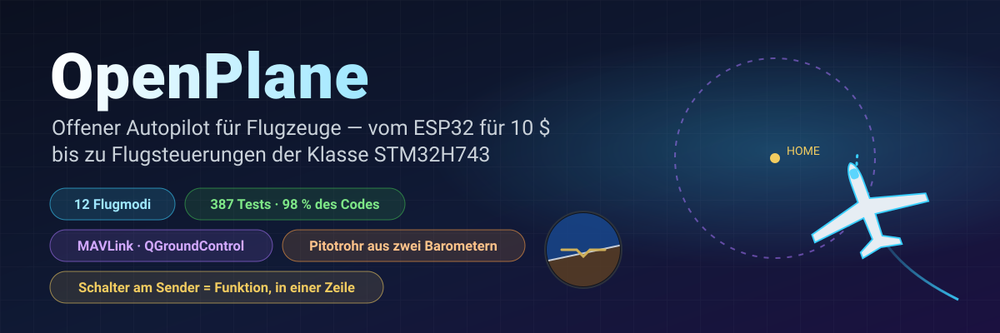
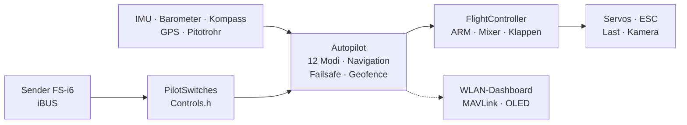

<!-- i18n-bar:start -->
  <p align="center">
    <a href="../../../README.md"> Читать на русском</a>
    &nbsp;·&nbsp;
    <a href="../en/README.md"> Read this in English</a>
    &nbsp;·&nbsp;
    <a href="../zh-CN/README.md"> 阅读中文版</a>
    &nbsp;·&nbsp;
    <a href="../es/README.md"> Lee esto en español</a>
  </p>
  <p align="center">
    <a href="../hi/README.md"> हिन्दी में पढ़ें</a>
    &nbsp;·&nbsp;
    <a href="../ar/README.md"> اقرأ بالعربية</a>
    &nbsp;·&nbsp;
    <a href="../pt-BR/README.md"> Leia em português</a>
    &nbsp;·&nbsp;
    <a href="../fr/README.md"> Lire en français</a>
  </p>
  <p align="center">
     <b>Auf Deutsch lesen</b>
    &nbsp;·&nbsp;
    <a href="../ja/README.md"> 日本語で読む</a>
    &nbsp;·&nbsp;
    <a href="../ko/README.md"> 한국어로 읽기</a>
  </p>
<!-- i18n-bar:end -->

<p align="center"><sub>🌐 Übersetzung der <a href="../../../README.md">russischen README</a>. Die ausführliche Dokumentation ist ebenfalls übersetzt, und die Links unten führen zu den übersetzten Seiten. Weichen Übersetzung und Original voneinander ab, gilt das Original. Konsolenmeldungen, Screenshots und Diagramme enthalten noch russische Beschriftungen. Die Übersetzung wurde von einer KI erstellt und nicht von Muttersprachlern geprüft. Fehler bitte an <a href="https://github.com/damir-lebedev">Damir Lebedev</a> melden oder im <a href="https://github.com/damir-lebedev/OpenPlaneProject/issues">Issue-Tracker</a> eintragen.</sub></p>

<p align="center">
  
</p>

<p align="center">
  
  
  
  <br>
  
  
  
  <a href="LICENSE.md"></a>
</p>

<h3 align="center">Sender aus – und das Flugzeug fliegt von selbst nach Hause und kreist über Ihnen.</h3>
<p align="center">Das ist kein Zeichentrickfilm: <b>die gesamte Firmware</b> fliegt ein Flugzeugmodell im geschlossenen Regelkreis – dieselben iBUS-Bytes am Eingang, dasselbe PWM am Ausgang.</p>

<p align="center">
  
</p>

---

## ⚡ In 30 Sekunden

| | |
|---|---|
| **Was es ist** | Eine offene Flugsteuerung und ein Autopilot für ferngesteuerte Flugzeuge. Heute ist das ein ESP32-S3 für rund 10 $; der nächste Schritt ist der STM32H743 (ein Board der Pixhawk-Klasse): Die vollständige Firmware läuft durch die Tests, und auf einem DevEBox-Board **läuft sie bereits und lässt sich per Sender steuern** – [es gibt ein Video](#-der-stm32h743-erwacht-auf-dem-board-zum-leben). |
| **Was er kann** | 12 Flugmodi – von der Stabilisierung bis zur Rückkehr nach Hause, Kreisen per GPS, Handstart, Autolandung und **Thermikfliegen**. Ein Pitotrohr aus zwei billigen Barometern. MAVLink-Telemetrie für QGroundControl und Mission Planner. |
| **Der Clou** | Jeder Schalter oder Drehregler am Sender = jede beliebige Funktion. **Eine Zeile** in `Controls.h` – und SwD ist nicht mehr RTH, sondern ein Lastabwurf. |
| **Warum man dem trauen kann** | 387 automatische Tests (dazu 9 auf dem Board selbst mit einer echten SD-Karte), 98 % des Codes durch Tests abgedeckt, 24 Builds „Board × Sensoren“ ohne eine einzige Warnung, Simulationen jedes Modus im geschlossenen Regelkreis. |
| **Ehrlich gesagt** | Bisher ist nur der manuelle Modus geflogen (der erste Prototyp). Der STM32H743 wurde bisher nur auf dem Prüfstand und ohne Sensoren getestet. Der Autopilot wurde auf dem Prüfstand, durch Tests und in Simulationen überprüft und wartet auf die Flugerprobung – [Stand weiter unten](#-ehrlicher-stand). |

---

## 🎛️ Ein Schalter = eine Funktion. Eine Zeile.

```cpp
// include/config/Controls.h
constexpr Binding BINDINGS[] = {
    Bind::modes  (Channels::SWC, MODE_MANUAL, MODE_STABILIZE, MODE_AUTO_TAKEOFF),
    Bind::feature(Channels::SWB, Feature::FLAPS),
    Bind::mode   (Channels::SWD, MODE_RTH),              // nach Hause, solange eingeschaltet
    Bind::knob   (Channels::VRA, Knob::STAB_GAIN),       // „weicher / härter“ direkt im Flug
    Bind::knob   (Channels::VRB, Knob::CRUISE_SPEED),
};
```

Sie möchten auf SwD statt RTH das Thermikfliegen haben? `Bind::mode(Channels::SWD, MODE_SOARING)`. Einen Lastabwurf auf SwB? `Bind::feature(Channels::SWB, Feature::PAYLOAD_DROP)`. Unterläuft Ihnen ein Fehler – etwa zwei Modi auf einem Schalter oder ein bereits belegter Knüppel –, **schlägt der Build fehl**: Die Tabelle prüft der Compiler (`static_assert`). Beim Einschalten gibt das Flugzeug selbst aus, was auf welchem Schalter liegt.

**12 Modi · 10 Funktionen · 7 Drehregler** – alles mit Beispielen in der [Autopilot-Referenz](AUTOPILOT_GUIDE.md).

---

## ✈️ Was der Autopilot kann

| | Modus | Kurz gesagt |
|---|---|---|
| 🕹️ | **MANUAL** | Ruder = Knüppel, wie ohne Flugsteuerung |
| 🧭 | **STABILIZE** | der Knüppel gibt den Winkel vor; loslassen, und das Flugzeug richtet sich von selbst waagerecht aus |
| 📏 | **ALT_HOLD** | + hält die Höhe per Barometer |
| 🌀 | **ACRO** | der Knüppel gibt die Drehrate vor – für Kunstflug |
| 🛣️ | **CRUISE** | Kurs, Höhe und Geschwindigkeit halten sich selbst; die Knüppel korrigieren nur |
| ⭕ | **LOITER** | Kreise über einem GPS-Punkt (der Radius wird mit einem Drehregler eingestellt) |
| 🏠 | **RTH** | nach Hause auf 40 m und Kreise über Ihrem Kopf; schaltet sich bei Verbindungsverlust selbst ein |
| 🛫 | **AUTO_TAKEOFF** | Start von der Piste mit dem Gas des Piloten |
| 🤾 | **LAUNCH** | Handstart: Der Motor läuft nach dem Wurf an, dann folgt der Steigflug |
| 🛬 | **AUTO_LAND** | Gleitflug und Abfangen dicht über dem Boden |
| 🦅 | **SOARING** | Motor aus, findet Thermik und kreist darin |
| 🆘 | **RESCUE** | „Hilfe“: Flügel waagerecht, Nase hoch – aus jeder Spirale heraus |

Dazu: Geofence, Auto-Trimmung für ein „schiefes“ Flugzeug, Kurvenkoordination, Überziehschutz per Pitotrohr, Klappen und Luftbremse, Lastabwurf, stabilisierte Kamera und ein Summer „Such mich im Gras“.

---

## 📈 Jeder Modus fliegt – im geschlossenen Regelkreis

Nicht „eine Funktion hat eine Zahl zurückgegeben“, sondern ein **Flug**: Sender → iBUS-Frame → Firmware → PWM → Ruderausschläge → Flugzeugmodell mit Auftrieb, Strömungsabriss, Wind und Thermik → Sensoren → wieder die Firmware. 14 solcher Flüge gehören zu den gewöhnlichen Tests (`pio test -e native`).

<p align="center"></p>

<table>
  <tr>
    <td width="50%"></td>
    <td width="50%"></td>
  </tr>
  <tr>
    <td>🦅 Hat die Thermik selbst gefunden und Höhe gewonnen – <b>bei abgeschaltetem Motor</b>. Das Gesamtenergie-Variometer hält „Knüppel ziehen“ nicht für einen Aufwind.</td>
    <td>🆘 60° Schräglage – und nach wenigen Sekunden ist der Horizont wieder waagerecht. RESCUE holt das Flugzeug aus einer Spirale mit 70° Schräglage und −40° Nasenlage heraus.</td>
  </tr>
  <tr>
    <td></td>
    <td></td>
  </tr>
  <tr>
    <td>🤾 Handwurf → der Motor läuft erst an, wenn die Hand vom Propeller weg ist → Steigflug. 🛬 Landung: Gleitflug und Abfangen auf 3 m.</td>
    <td>🌬️ Fluggeschwindigkeit aus einem Rohr mit zwei <b>verrauschten</b> Barometern und 150 Pa Versatz zwischen den Chips – der Fehler liegt unter 0,5 m/s.</td>
  </tr>
</table>

---

## 🌬️ Ein Pitotrohr für ein paar Cent

Ein ordentlicher Fahrtmesser kostet so viel wie eine halbe Flugsteuerung. Hier sind es **zwei Barometer**: ein BMP581 im Rohr (Gesamtdruck) und das Hauptbarometer im Rumpf (statischer Druck). Die Firmware gleicht den Unterschied zwischen den Chips am Boden selbst auf null ab, filtert, berechnet die Luftdichte aus Höhe und Temperatur und bemerkt vertauschte Schläuche. Das bringt: CRUISE hält die **Luft**geschwindigkeit statt des Gases; Überziehschutz; eine ehrliche Geschwindigkeit in der Telemetrie. Der Aufbau steht in der [Referenz](AUTOPILOT_GUIDE.md#ein-pitotrohr-zum-selberbauen).

---

## 📡 Bodenstation: Browser oder QGroundControl

<table>
  <tr>
    <td width="46%"></td>
    <td>
      <b>ESP32 – ein Web-Dashboard direkt vom Flugzeug.</b> Zugangspunkt <code>OpenPlane-Debug</code>, Adresse <code>192.168.4.1</code>: Senderkanäle, Ausgänge, alle Sensoren, Modus, Navigation, Moduswechsel und PID-Einstellung im laufenden Betrieb. Ohne Apps und ohne zusätzliche Hardware.<br><br>
      <b>STM32H743 – MAVLink über ein Funkmodem.</b> QGroundControl und Mission Planner sehen das Flugzeug als ArduPilot-Flugzeug: Horizont, Karte mit dem Startpunkt, Geschwindigkeit vom Pitotrohr, Modi unter ihren ArduPlane-Namen, PID aus dem Parameterfenster, Moduswechsel per Schaltfläche. ARM vom Boden aus ist nicht möglich, nur per Schalter: So ist es sicherer.<br><br>
      Die MAVLink-Frames wurden Byte für Byte mit der Referenz <code>pymavlink</code> abgeglichen.
    </td>
  </tr>
</table>

---

## 📼 Blackbox

Das Board zeichnet jeden Flug auf: IMU mit 500 Hz, Winkel und Entscheidungen des Autopiloten, PID, alle Ausgänge, Knüppel, Barometer, Kompass, GPS, Akku und Ereignisse – ab ARM und Gas bis zur Landung, mit 10 Sekunden Vorlauf. Der **ESP32-S3** schreibt in den eingebauten Flash (13,9 MB, etwa 11 Minuten), der **STM32H743** auf eine SD-Karte (64 MB, etwa eine Stunde; die Karte bleibt eine gewöhnliche FAT32-Karte, und die Firmware schreibt in eine vorab angelegte Datei `BLACKBOX.BIN`). Gelöscht wird nur am Boden. Nach dem Flug lädt `python tools/blackbox.py download` den Flug per USB herunter und zerlegt ihn in CSV-Dateien; Flüge von der SD-Karte lassen sich auch ohne das Board auswerten: `python tools/blackbox.py ring E:/BLACKBOX.BIN`. Details – in [BLACKBOX.md](BLACKBOX.md).

---

## 🔩 Hardware: eine Firmware – vier Boards, zwölf Sensoren

| Board | Status | Was geprüft wurde |
|---|---|---|
| **ESP32-S3 N16R8** | ✅ Hauptboard, auf dem Prüfstand | alle Sensoren, Servos, iBUS, OLED, Dashboard live; die ganze Firmware in den Tests |
| **ESP32 38-pin** | 🧪 Tests | die ganze Firmware in den Tests mit dem ICM-45686-Set |
| **ESP32-C3 SuperMini** | ✈️ ist geflogen (manuell) | der erste Prototyp; Build aller Sets |
| **STM32H743VIT6** | 🔧 DevEBox-Board ohne Sensoren + 🧪 Tests | auf dem Board: Start, Konsole über USB, **SD-Karte und Blackbox** (Tests auf dem Board), **iBUS-Empfang, ARM und Steuerung von Servos und Motor per Sender** (der Start ist auf Video); auf dem PC: die ganze Firmware – FreeRTOS-Tasks, Flash, MAVLink, I2C und SPI. Sensoren wurden noch nicht an das Board angeschlossen |

| Sensor | Was es ist | Busse |
|---|---|---|
| **LSM6DSV** + **QMC6309** | IMU + Kompass (Modul) | I2C / SPI |
| **ICM-45686** + **QMC6309** | IMU + Kompass (Ersatz) | I2C / SPI |
| **SPL06-001** | Rumpfbarometer | I2C / SPI |
| **BMP581** | Hauptbarometer und Barometer im Pitotrohr | I2C / SPI |
| MPU6050/6500, ICM-42688, BMP388, BME280, QMC5883P/L | Prüfstands- und ältere Sensoren | I2C / SPI |
| **u-blox M10** | GPS, 10 Hz, UBX | UART |

Ein Sensor wird mit einer Zeile gewechselt (`SENSOR_KIT_LSM6DSV_PITOT`), ein Board mit einem Build-Flag. Alle 4 Boards × 6 Sensorsets bauen ohne Warnungen: [`tools/build_matrix.sh`](../../../tools/build_matrix.sh).

<table>
  <tr>
    <td width="50%"></td>
    <td width="50%"></td>
  </tr>
  <tr>
    <td>Prüfstand mit dem ESP32-S3: IMU, Barometer, Kompass, OLED, Servos, Empfänger.</td>
    <td>Test der Antriebsgruppe aus Motor und Propeller.</td>
  </tr>
</table>

### 🎥 Der STM32H743 erwacht auf dem Board zum Leben

Die Firmware für den STM32H743 läuft auf einem DevEBox-Board **ohne einen einzigen Sensor** und lässt sich mit einem gewöhnlichen Sender steuern: iBUS-Empfänger, ARM, Servos und Motor reagieren im manuellen Modus auf Knüppel und Schalter. Der gesamte Start wurde auf Video festgehalten.

▶️ **[Den Start auf Video ansehen](https://t.me/lisnmylife/420)**

Was das beweist: Die Kette „Sender → iBUS → Firmware → PWM“ funktioniert auf echter Hardware und nicht nur in den Tests. Was noch nicht bewiesen ist: An dieses Board wurden keine Sensoren (IMU, Barometer, GPS) angeschlossen, daher wurden die Autopilot-Modi darauf noch nicht ausprobiert.

---

## 🧪 Nachprüfbare Qualität

| | |
|---|---|
| **387 automatische Tests** | Module, Treiber auf Ebene der Chipregister, Flüge im geschlossenen Regelkreis, die Firmware für ESP32 und STM32 **vollständig** auf dem PC; dazu 9 Tests auf dem STM32-Board selbst mit einer echten SD-Karte |
| **98,3 % der Zeilen, 87,7 % der Verzweigungen** | `gcovr`-Abdeckung, einschließlich des STM32-Codes |
| **24/24 Builds** | 4 Boards × 6 Sensorsets, `-Wall -Wextra`, null Warnungen |
| **0 Beanstandungen** | cppcheck und clang-tidy über den gesamten Code |
| **Referenzen statt Code-Kopien** | die Sensorformeln folgen den Datenblättern (Bosch, ST, TDK, Goertek), MAVLink folgt pymavlink |

```bash
pio test -e native -e native-stm32   # alle Tests, ~1,5 Minuten, keine Hardware nötig
```

Details – in [TESTING.md](TESTING.md).

---

## 🧠 Wie es aufgebaut ist



- **Header-only-C++**, eine einzige Übersetzungseinheit, kein dynamischer Speicher in der Flugschleife. Lieber `.h/.cpp`? Für Sie gibt es einen parallelen Branch, [`feature/split-headers`](https://github.com/damir-lebedev/OpenPlaneProject/tree/feature/split-headers): Er wird per Skript aus diesem erzeugt, und die Firmware mit LTO ist genauso groß.
- **HAL** – die einzige Schicht, die den Mikrocontroller kennt: Ein neues Board ist ein neues `Board`, kein umgeschriebener Autopilot.
- **Ein Sensortreiber kennt den Bus nicht**: Dieselbe Klasse arbeitet über I2C und über SPI.
- **Sicherheit durch die Reihenfolge der Operationen**: Verbindungsverlust > ARM > Modus > Gas; kein Modus kann das Gas an ARM vorbeischleusen.

Details – in [ARCHITECTURE.md](ARCHITECTURE.md).

---

## 🚀 Schnellstart

```bash
pip install platformio
git clone https://github.com/damir-lebedev/OpenPlaneProject && cd OpenPlaneProject
pio run -e esp32-s3 -t upload && pio device monitor     # ESP32-S3
pio run -e stm32h743 -t upload                            # STM32H743 (ST-Link)
pio run -e stm32h743-devebox -t upload                    # DevEBox H743: USB-DFU, Konsole über USB
```

DevEBox: Auf dem Board gibt es keine BOOT0-Taste – verbinden Sie vor dem ersten Flashen den Pin BT0 mit 3V3 und drücken Sie RST; danach startet die Taste `D` in der Konsole das Board selbstständig im Bootloader neu ([Details](DEVELOPER_GUIDE.md#stm32h743)).

Im seriellen Monitor: `h` – Menü, `b` – welche Chips auf den Bussen sichtbar sind, `s` – Sensoren, `p` – Ausgangstest (Propeller abnehmen!). Weiter – im [Pilotenleitfaden](PILOT_GUIDE.md).

---

## 🟢 Ehrlicher Stand

| Was | Wo geprüft |
|---|---|
| Manuelle Steuerung, Mixer | ✈️ im Flug (erster Prototyp, C3) |
| ARM, Failsafe, Klappen, Servos, Motor | 🔧 auf dem Prüfstand (S3) |
| STABILIZE | 🔧 auf dem Prüfstand: Die Ruder reagieren auf Neigungen in die richtige Richtung |
| Prüfstandssensoren (MPU6500, BMP388, QMC5883P), OLED, Dashboard | 🔧 auf dem Prüfstand |
| Übrige Modi, Navigation, Pitotrohr, MAVLink | 🧪 Tests und Simulationen im geschlossenen Regelkreis |
| Neue Sensoren (LSM6DSV, ICM-45686, QMC6309, SPL06, BMP581) | 🧪 Registeremulatoren nach den Datenblättern |
| STM32H743: SD-Karte, Blackbox, Konsole über USB | 🔧 auf dem DevEBox-Board (Tests auf dem Board) |
| STM32H743: iBUS, ARM, PWM für Servos und Motor, manuelle Steuerung | 🔧 auf dem Board ohne Sensoren, auf Video festgehalten |
| STM32H743: Sensoren (IMU, Barometer, Kompass, GPS) und Autopilot-Modi | 🧪 die ganze Firmware auf dem PC; Sensoren wurden noch nicht an das Board angeschlossen |

Das Flugzeugmodell in den Simulationen ist vereinfacht, die Koeffizienten sind Startwerte. Jeder neue Modus wird zuerst in der Höhe erprobt, den Finger auf dem MANUAL-Schalter.

---

## 🗺️ Fahrplan

- [x] Manuelle Steuerung, ARM, Failsafe, objektorientierte Firmware, Web-Dashboard
- [x] ESP32-S3-Prüfstand mit allen Sensoren – live
- [x] 12 Modi, GPS-Navigation, RTH bei Verbindungsverlust, Geofence
- [x] Schalter und Drehregler in einer Zeile, Lastabwurf, Kamera, Auto-Trimmung
- [x] Pitotrohr aus zwei Barometern, Überziehschutz
- [x] Neue Sensoren: LSM6DSV, ICM-45686, QMC6309, SPL06, BMP581
- [x] STM32H743: vollständige Firmware, MAVLink, Einstellungen im Flash
- [x] Simulationen aller Modi im geschlossenen Regelkreis, die ganze Firmware in den Tests
- [x] Blackbox: Flug im Flash (ESP32-S3) und auf einer SD-Karte (STM32H743), Download und Auswertung als CSV
- [x] STM32H743 läuft auf dem Board: Sender → iBUS → Servos und Motor (ohne Sensoren, auf Video)
- [ ] STM32H743: Sensoren anschließen und den Prüfstand so durchlaufen wie beim ESP32-S3
- [ ] Flugerprobung des Autopiloten an der neuen Flugzeugzelle
- [ ] Eine eigene Flugsteuerungsplatine ([FC_BOARD.md](FC_BOARD.md)) auf dem STM32H743
- [ ] Flug über Wegpunkte, MAVLink-Missionen
- [ ] Adaptive Rückführung (ein Entwurf ist bereits in der Simulation geprüft)
- [ ] Strom- und Akkusensor, Telemetrie zum Sender (iBUS-SENS)
- [ ] Autonome Zustellung: Route → Lastabwurf → nach Hause

Details – in [ROADMAP.md](ROADMAP.md).

---

## 💼 Für Partner und Investoren

Kleine Lieferflugzeuge und Überwachungsflugzeuge sind entweder geschlossene, teure Plattformen oder verstreute Hobbyprojekte. OpenPlane zielt auf die Mitte: **ein offener, überprüfbarer Autopilot auf Massenhardware**, bei dem jede Funktion durch Tests abgedeckt ist und an eine Aufgabe angepasst werden kann – Medikamentenlieferung an schwer erreichbare Orte, Überwachung von Feldern und Wäldern, Suchaktionen.

Was bereits aus eigener Kraft geschafft wurde: eine Architektur, die sich ohne Umschreiben zwischen Boards übertragen lässt; ein Autopilot mit vollständigem Modussatz; eine Testinfrastruktur, auf der neue Funktionen schnell entstehen und die alten nicht kaputtmachen. Was zusätzliche Mittel beschleunigen würden: die Flugerprobung, eine eigene Flugsteuerungsplatine auf dem STM32H743, der Flug über Wegpunkte und der Lastabwurf. Wohin und wozu – in [ROADMAP.md](ROADMAP.md).

---

## 📚 Dokumentation

| Dokument | Für wen |
|---|---|
| [AUTOPILOT_GUIDE.md](AUTOPILOT_GUIDE.md) | für Piloten: jeder Modus, jede Funktion und jeder Drehregler, wie man sie auf einen Schalter legt, das Pitotrohr, die Bodenstation |
| [PILOT_GUIDE.md](PILOT_GUIDE.md) | Aufbau, Pinbelegung, Sender, Failsafe, erster Flug |
| [DEVELOPER_GUIDE.md](DEVELOPER_GUIDE.md) | für Entwickler: Dateien, Vorzeichenkonventionen, API, wie man einen Sensor, einen Modus oder ein Board hinzufügt |
| [ARCHITECTURE.md](ARCHITECTURE.md) | Schichten, Tasks, der Regeltakt, Zustandsautomaten |
| [TESTING.md](TESTING.md) | Tests, Simulationen, Abdeckung, Analyse |
| [reference/](reference/README.md) | eine Referenz zu jeder Klasse |
| [FC_BOARD.md](FC_BOARD.md) · [ROADMAP.md](ROADMAP.md) | die Flugsteuerungsplatine · wohin sich das Projekt bewegt |
| [airframe/](airframe/README.md) | die Zelle der Astro-Cargo: Fusion-360-Projekt und STL-Dateien zum Drucken, bekannte Mängel der Version v2 |

> **Verwandtes Projekt:** [esp32-rc-joystick](https://github.com/damir-lebedev/esp32-rc-joystick) – der FS-i6-Sender als USB-Joystick für den Simulator, auf demselben ESP32-S3: erst im Simulator Stunden sammeln, dann im Feld.

---

## 🤝 Mitmachen

Wir brauchen Hände und Köpfe: Aerodynamik und Flugmodellbau, 3D-Druck und Festigkeit, Embedded-C++, Sensoren und Autopiloten, Bodenschnittstellen. Issues und Pull Requests gehen in den Branch `main`; beginnen Sie mit [DEVELOPER_GUIDE.md](DEVELOPER_GUIDE.md).

## 📜 Lizenz

Die [OpenPlane License](LICENSE.md) ist eine Lizenz auf Grundlage der MIT-Lizenz mit zusätzlichen Bedingungen. Code, Dokumentation und Modelldateien dürfen genutzt, kopiert, verändert und verkauft werden, auch in kommerziellen Produkten. Die Bedingungen:

1. **Nennen Sie den Urheber – Damir Lebedev (Damn / Проклятый).** Der Name muss dort stehen, wo die Nutzer Ihres Produkts ihn sehen: in der Dokumentation, in der README oder auf einer „Über“-Seite. Behalten Sie den Lizenztext zusammen mit dem Code bei.
2. **Militärische Nutzung ist verboten.** Das Projekt darf nicht für Armeen und paramilitärische Organisationen, im Krieg oder zum Bau von Waffen, Munition sowie Waffenträger- und Zielsystemen verwendet werden.
3. **Schädigen Sie Menschen und Sachen nicht vorsätzlich ohne ihre vorherige schriftliche Einwilligung in diesen Schaden.** Ihr eigenes Gerät dürfen Sie kaputt machen, wenn es niemanden gefährdet: zum Beispiel mit einer Luftpistole auf die eigene Drohne schießen. Menschen zu verstümmeln oder zu töten ist nicht erlaubt.
4. **Halten Sie Sicherheitsvorschriften und Gesetze ein** – beim Bauen, Testen und Fliegen.

Werden die Bedingungen verletzt, erlischt die Erlaubnis zur Nutzung des Projekts. Wegen der Verbote bestimmter Nutzungen ist dies keine „offene“ Lizenz im Sinne der OSI: Der Code kann gelesen, kopiert und verändert werden, formal ist das Projekt aber Source-available und kein Open Source.

Rechtskraft hat nur der englische Text in der Datei [LICENSE](LICENSE.md): Übersetzungen der Lizenz in andere Sprachen dienen lediglich der Bequemlichkeit.

Die Firmware steuert ein Luftfahrzeug und ist nicht zertifiziert. Alles, was Sie damit tun, geschieht auf eigene Gefahr; der Autor übernimmt keine Haftung.

```text
OpenPlane © 2026 Damir Lebedev (Damn / Проклятый) — https://github.com/damir-lebedev/OpenPlaneProject
```

<p align="center"><i>Der erste Prototyp ging gleich beim ersten Flug zu Bruch – deshalb liegt hier alles offen: Code, Tests, Probleme. Bauen Sie nach, gehen Sie damit ans Limit, reparieren Sie es gemeinsam mit uns.</i></p>
