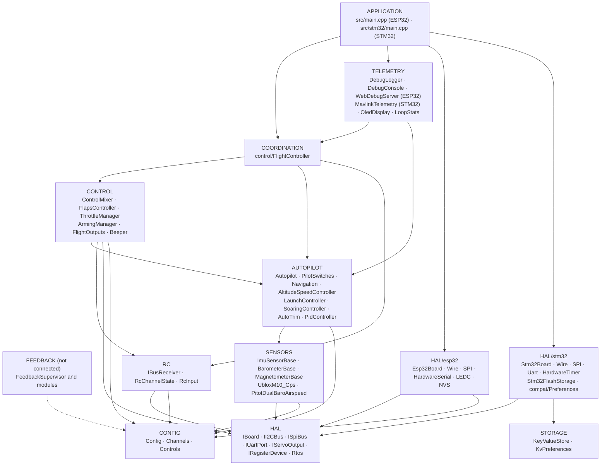
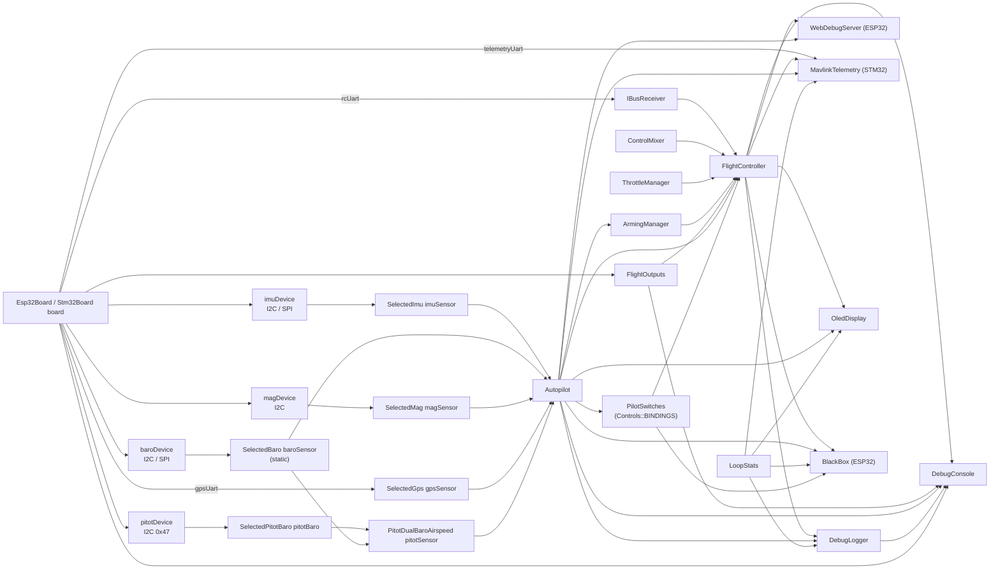
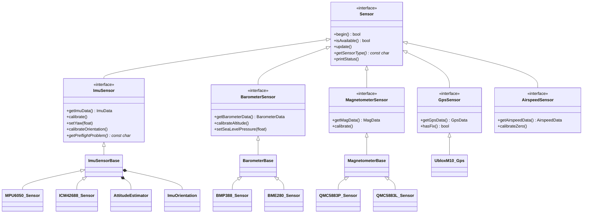
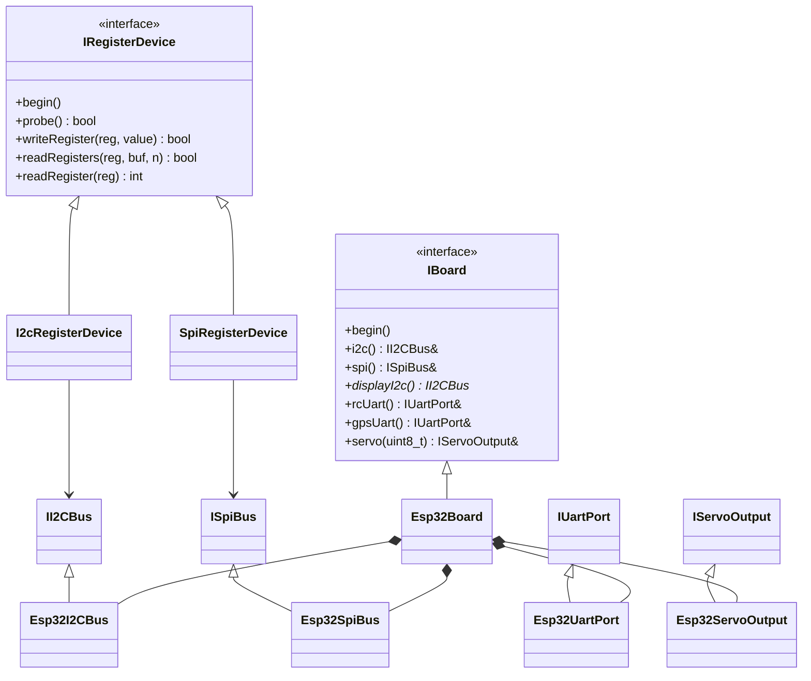
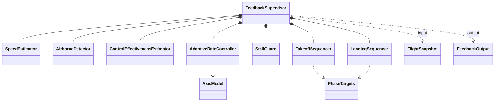
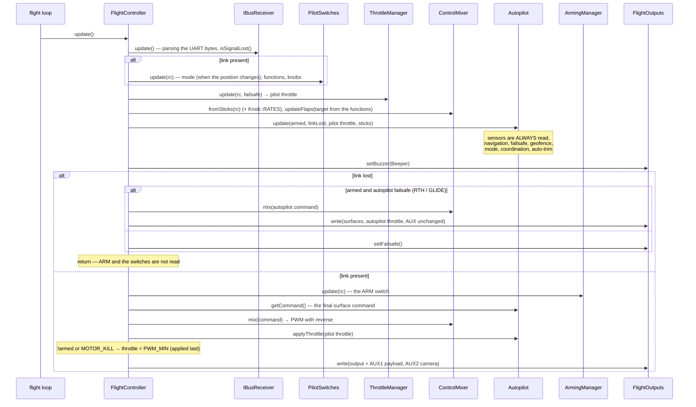
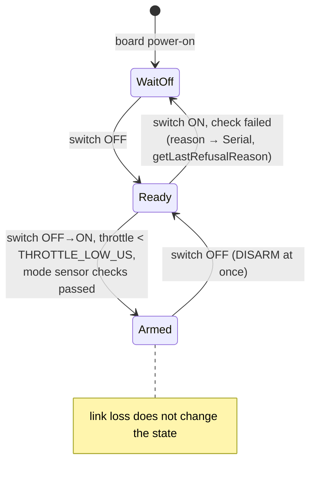
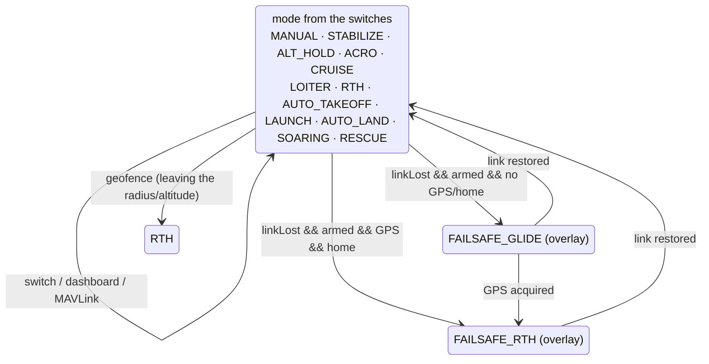
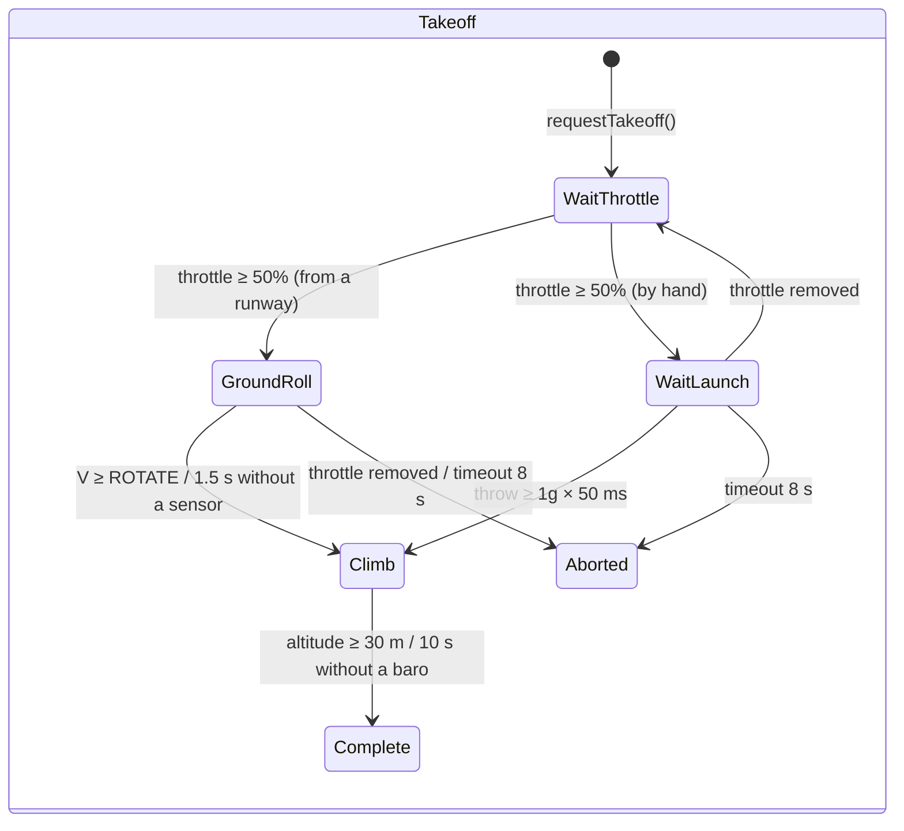
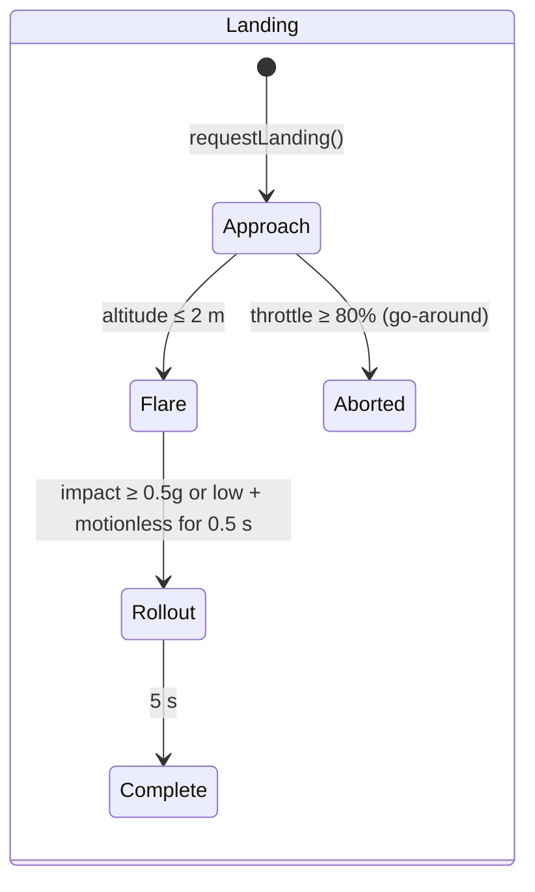

# ARCHITECTURE.md — the OpenPlaneProject firmware architecture

> 🌐 This page is a translation of the [Russian original](../../ARCHITECTURE.md). If the translation and the original differ, the original is authoritative. The firmware prints its console messages in Russian, so they are quoted as is.

This document describes **how the whole firmware is organized**: the layers and the
dependency rules between them, the object graph, the FreeRTOS threading model, the order of
operations per tick, the state machines, the sensor fault-tolerance strategy and the
extension points. A detailed reference for each class (public API,
fields, invariants) is in [`reference/`](reference/README.md).

Related documents:

| Document | What it is about |
|---|---|
| [`DEVELOPER_GUIDE.md`](DEVELOPER_GUIDE.md) | A practical guide: the sign convention, the HTTP API, the console, how to add a sensor/mode/board |
| [`reference/`](reference/README.md) | A reference for all classes, structures and namespaces |
| [`TESTING.md`](TESTING.md) | Tests: native (on a PC, with coverage) and on the board |
| [`PILOT_GUIDE.md`](PILOT_GUIDE.md) | Assembly, pinout, transmitter, first flight |
| [`ROADMAP.md`](ROADMAP.md) | Where the project is heading |

> Status: the ESP32-S3 bench has been verified with all sensors, **the autopilot has not been
> tested in flight**, and the feedback loop (`autopilot/feedback/`) is **not
> connected** to the firmware and is verified only by simulation.

---

## Contents

1. [Principles](#1-principles)
2. [Layers and dependency rules](#2-layers-and-dependency-rules)
3. [The object graph (composition root)](#3-the-object-graph-composition-root)
4. [Class hierarchies](#4-class-hierarchies)
5. [FreeRTOS tasks and data separation](#5-freertos-tasks-and-data-separation)
6. [The control tick: `FlightController::update()`](#6-the-control-tick-flightcontrollerupdate)
7. [State machines](#7-state-machines)
8. [Fault tolerance: sensors, link, outputs](#8-fault-tolerance-sensors-link-outputs)
9. [Configuration and build variants](#9-configuration-and-build-variants)
10. [The feedback loop (not connected)](#10-the-feedback-loop-not-connected)
11. [Extension points](#11-extension-points)
12. [Testability](#12-testability)

---

## 1. Principles

| Principle | How it is implemented |
|---|---|
| **Header-only C++** | All classes are defined in the headers under `include/<layer>/`. The only translation unit of the firmware is `src/main.cpp` (ESP32) or `src/stm32/main.cpp` (STM32). No dynamic memory in the flight loop (`String` strings only in the web server and the OLED). A variant split into `.h/.cpp` lives on a separate branch, `feature/split-headers`: it is generated by `tools/split_headers.py`, and the differences and firmware sizes are in its `docs/SPLIT_HEADERS.md`. |
| **Composition root** | `src/main.cpp` / `src/stm32/main.cpp` is the only place where objects are created and linked by references/pointers. There is no flight logic in it. |
| **One line — one switch** | What each transmitter channel does is defined by the `config/Controls.h` table (`Bind::modes/mode/feature/knob`), checked by `static_assert` at build time. |
| **Dependency inversion** | The upper layers depend on interfaces (`IBoard`, `IRegisterDevice`, `ImuSensor*`, …), not on specific chips and MCUs. |
| **Nullable dependencies** | The autopilot, the switches (`PilotSwitches`) and all sensors are passed as pointers and may be `nullptr`: without a sensor the mode behaves safely instead of crashing. |
| **Safety by priority** | The order of operations in the tick is the priority: link loss > ARM > sticks/autopilot > throttle. The ARM check on the throttle comes last. |
| **One sign convention** | From the IMU to the servo — aviation signs; the direction of each servo is set in exactly one place (`Config::*_REVERSED`). |
| **Time as a parameter** | Wherever possible (flaps, feedback modules) time is passed as an argument rather than read from `millis()` — this makes the classes deterministic and testable. |
| **Honest diagnostics** | Every sensor and output distinguishes “not in the build” (`attached`) from “present but not responding” (`available`); this is visible in the JSON, the log and on the OLED. |

---

## 2. Layers and dependency rules



The rules:

1. **The HAL is the only layer that knows the MCU.** Only `include/hal/esp32/`
   and `include/hal/stm32/` include `<Wire.h>`, `<SPI.h>`,
   `HardwareSerial`, and call `ledc*` / `HardwareTimer` / flash. FreeRTOS
   tasks are created through `hal/Rtos.h` (core 0 on the ESP32, a priority on the STM32).
   Settings storage: the code writes `<Preferences.h>` — on the ESP32 this is NVS, on the
   STM32 it is `hal/stm32/compat/Preferences.h` on top of `storage/KeyValueStore.h`.
   A deliberate exception: `SpiRegisterDevice` toggles CS with the standard
   Arduino `pinMode/digitalWrite` (identical on the ESP32 and the STM32).
2. **Sensor drivers do not know the bus.** They receive an `IRegisterDevice&`
   (an I2C address or an SPI CS) or an `IUartPort&`. The bus is selected in
   `sensors/SensorSelection.h`.
3. **RC and Outputs know nothing about the airplane**: iBUS bytes → channels; PWM values →
   outputs.
4. **Control and Autopilot** are pure logic over data: no UART, PWM or Wi-Fi.
5. **Coordination** (`FlightController`) is the only class that sees
   several lower layers at once and decides the order of operations.
6. **Telemetry** only reads the state through const getters; commands from
   the dashboard pass through a “mailbox” and are applied by the flight loop;
   MAVLink (`MavlinkTelemetry`) works directly inside the flight loop and applies
   commands itself.
7. **A lower layer never includes an upper one.** If a lower class needs an
   upper one, the logic is lifted into `FlightController`.

`ArmingManager` (CONTROL) reads the mode from `Autopilot` — this is the only
horizontal dependency CONTROL → AUTOPILOT: the ARM checks depend on which
sensors the selected mode needs.

---

## 3. The object graph (composition root)

All objects are globals with static storage duration, created in
`src/main.cpp`. The references and pointers between them are **non-owning**; the construction
order matches the declaration order (a single translation unit).



The initialization order in `setup()`:

```
Serial (ESP32: TX buffer 4 KB; STM32: SERIAL_TX_BUFFER_SIZE=1024), 115200 → banner
board.begin()               — I2C/SPI buses (the second I2C, if present)
flightOutputs.begin()       — PWM channels; setFailsafe() right away
[STM32] settings from flash — KeyValueStore::mount(), image CRC
setupSensors()              — begin() of each sensor; calibration of the ones that responded:
                              IMU (2 s motionless + pre-flight check),
                              baro (zero altitude), compass (initial heading → IMU yaw),
                              pitot tube (zero is collected during the first second of the loop)
autopilot.begin()           — trim from NVS/flash
flightController.begin()    — setFailsafe() + UART iBUS
oledDisplay.begin(...)      — its own task (hal/Rtos.h)
[ESP32] webDebugServer.begin() — access point + its own task on core 0
[ESP32] blackBox.begin()   — the blackbox partition, a queue in PSRAM, the bbox task on core 0
[STM32] mavlink.begin()     — UART4 of the radio modem
[STM32] setupBlackBox()    — SD card, the BLACKBOX.BIN file, blackBox.begin(), the bbox task
pilotSwitches.printBindings() — what is on which switch
debugLogger.begin()         — log settings
[STM32] flight / storage tasks → vTaskStartScheduler()
```

---

## 4. Class hierarchies

### Sensors



The base classes (`ImuSensorBase`, `BarometerBase`, `MagnetometerBase`) implement the **Template Method** pattern: the public `update()`/`calibrate()` are written once, and the chip driver implements only the protected “primitives” (`readSample()`, `isNewSampleReady()`, `readRaw()`, the scales).

### HAL



### The feedback loop



---

## 5. FreeRTOS tasks and data separation

**ESP32** (two cores, FreeRTOS is built into the Arduino core):

| Core | Task | What it does | Period |
|---|---|---|---|
| 1 | Arduino `loopTask` → `loop()` | `WebDebugServer::applyPendingCommands()` → `FlightController::update()` → `DebugLogger::update()` → `DebugConsole::update()` → `LoopStats::record()` → `BlackBox::update()` | `Config::LOOP_PERIOD_MS` = 2 ms (500 Hz), `vTaskDelayUntil` |
| 0 | `web` (8 KB of stack, priority 1) | `WebServer::handleClient()` | every 2 ms (`vTaskDelay`) |
| 0 | `oled` (4 KB of stack, priority 1) | `OledDisplay::draw()` over the second I2C bus | 200 ms (`vTaskDelayUntil`) |
| 0 | `bbox` (6 KB of stack, priority 2) | `BlackBox::writerStep()`: a page from the queue into flash; on the ground — erasing | notified from `loop()` after every tick (otherwise once every 20 ms) |
| 0 | the ESP-IDF Wi-Fi stack | the access point | — |

**STM32H743** (one core, STM32duino FreeRTOS, preemption by priority):

| Priority | Task | What it does | Period |
|---|---|---|---|
| 5 | `flight` (16 KB) | `FlightController::update()` → `MavlinkTelemetry::update()` → `DebugLogger::update()` → `DebugConsole::update()` → `LoopStats::record()` | 2 ms, `vTaskDelayUntil` |
| 1 | `oled` (4 KB) | `OledDisplay::draw()` over the second I2C bus | 200 ms |
| 1 | `storage` (2 KB) | `Stm32FlashStorage::service()` — erasing and writing the settings sector | 100 ms |
| 2 | `bbox` (8 KB) | `BlackBox::writerStep()`: a page from the queue to the SD card; on the ground — erasing. Preempted by the flight task | notified after every tick (otherwise once every 20 ms) |

**Data-separation rules:**

- The `web` and `oled` tasks **only read** the state (`FlightController`,
  `Autopilot`, `LoopStats`, the sensors) through const getters. The fields are
  individual 16/32-bit values, so there is no “torn” read; in the worst case the
  values of adjacent ticks are visible.
- **Commands** from the dashboard (`/api/setmode`, `/api/setpid`) are **not applied**
  directly from the `web` task: they are put into `PendingCommands` under a
  `portMUX` spinlock and picked up by the flight loop in
  `applyPendingCommands()` — a change to the autopilot always happens in the
  context of the task that owns it.
- `LoopStats::hz/avgUs/maxUs` are `volatile uint32_t`; `takePeakUs()` is called
  only from `loop()`.
- `OledDisplay` keeps a pointer to the bus in a static variable (the U8g2 C callback
  does not take a context); there is one display on board.

**Real time:**

- The period is held by `vTaskDelayUntil`, not by `delay()` after the work. After a
  long block (a calibration from the console, > 100 ms) the timing starts
  anew — the missed ticks are not caught up in a burst.
- The I2C transaction timeout is 5 ms (the stock `Wire` one is 50 ms).
- `Serial` with a 4 KB transmit buffer — a log line does not block the loop.
- Black box: the loop only puts a snapshot into the queue (a spinlock, microseconds);
  the page into flash (stopping both cores for ~0.6–0.9 ms) is written by the `bbox` task
  right after the tick — in the gap of the loop. Flash erasing happens only without ARM and
  without recording, never in the air.
- ESP32: a flash write (NVS, Wi-Fi settings) stops both cores for
  ~0.3–0.4 s, so: Wi-Fi is `persistent(false)`; log settings
  are saved only without ARM; calibrations only without ARM; the auto-trim —
  after DISARM and only when the airplane is standing still (`Autopilot::looksLanded()`).
- STM32: `Preferences::end()` merely copies the image (microseconds), while erasing
  the sector (seconds) goes on in the `storage` task. The settings sector is in bank 2 of the
  flash, the code in bank 1: the flight task preempts the write and keeps
  running.
- MAVLink does not block the loop: a frame is sent only if there is room in the UART buffer
  (`IUartPort::availableForWrite()`), otherwise it waits for the next tick.

---

## 6. The control tick: `FlightController::update()`



Key invariants of the tick:

- **Link loss** — the mode and the functions from the switches do not change; ARM is neither read nor reset; the motor runs only by the decision of the autopilot failsafe (RTH with the motor) or `FAILSAFE_THROTTLE`.
- **No mode can slip the throttle past ARM**: the forced `PWM_MIN` for `!armed` and `MOTOR_KILL` comes after `Autopilot::applyThrottle()`.
- **The autopilot issues the final command** (`getCommand()`); in the stabilization modes the sticks are the desired angles; corrections = command − sticks (for the log and the dashboard). Everything is in one sign convention (`ControlCommand`) up to the mixer.

---

## 7. State machines

### ARM (`ArmingManager`)



`WaitOff` = `armed == false && switchSeenOff == false`; `Ready` =
`armed == false && switchSeenOff == true`.

### Autopilot modes (`Autopilot` + `PilotSwitches`)

Twelve modes (`AutopilotTypes.h`); what each one does is in [AUTOPILOT_GUIDE.md](AUTOPILOT_GUIDE.md#modes). The mode is chosen by `PilotSwitches` from the `config/Controls.h` table: the mode switch (`Bind::modes`) and the “mode on top” switches (`Bind::mode`, the upper row takes precedence). `setMode()` is called only when the **result of the switches has changed** — so a mode chosen from the dashboard or the GCS holds until the pilot flips a switch.



Failsafe is not a separate `AutopilotMode` but a flag on top of the current mode; a return that has begun is not dropped into gliding by a short GPS loss; after the link is restored, the mode from the switches resumes (auto-takeoff and hand launch — only anew). The internal state machines: `LaunchController` (IDLE → READY → THROWN → CLIMB → DONE) and `SoaringController` (GLIDE → THERMAL → MOTOR_CLIMB → RETURN).

**AUTO_TAKEOFF** (by time from the start, when armed and the throttle ≥ 1500 µs):

| Time | Throttle (program) | Pitch |
|---|---|---|
| 0–1 s | smoothly 0 → 100 % | 0° |
| 1–3 s | 100 % | +15° |
| > 3 s | 100 % | +10° |

### Takeoff and landing (feedback loop, not connected)





---

## 8. Fault tolerance: sensors, link, outputs

### Sensors

| Sensor | `isAvailable()` becomes `false` | What happens on a read failure |
|---|---|---|
| IMU (`ImuSensorBase`) | `begin()` did not identify the chip, **or** 50 consecutive read errors (~0.1 s at 500 Hz) | the data are not overwritten, `errorCount++`; once it recovers it is available again |
| Barometer (`BarometerBase`) | 100 consecutive errors (~0.5 s when polled every 5 ms) | the same |
| Compass (`MagnetometerBase`) | 25 consecutive errors (~0.5 s at 50 Hz) | the same |
| GPS (`UbloxM10_Gps`) | not a single valid NAV-PVT **or** the latest one is older than `GPS_TIMEOUT_US` (2 s) | — |

In addition, the IMU has a **pre-flight check** (`getPreflightProblem()`):
motionlessness during gyroscope calibration, |a| ≈ 1g, the “up” direction matches the
saved mounting. If it fails — `Autopilot::imuReady() == false` (zero
corrections in all modes, including gliding), and `ArmingManager` does not arm the
modes with stabilization.

The consumers react identically: **no sensor (`nullptr`) or it is unavailable —
no effects**, and the airplane is controlled as in MANUAL.

### Link (`IBusReceiver::isSignalLost()`)

Two independent indicators:

1. no correct frames for longer than `RX_TIMEOUT_US` (500 ms) — or none at all
   since power-on;
2. the throttle in the frame is below `RX_FAILSAFE_THROTTLE_US` (950 µs) — the failsafe
   programmed in the transmitter (the FS-iA6B does not stop sending frames when the
   transmitter is lost).

Frames with a bad CRC are discarded and counted (`getBadFrameCount()`).

### Outputs

`FlightOutputs::begin()` is immediately followed by `setFailsafe()` — surfaces to neutral, the motor
off, even before the sensors are read. An output with pin `-1` (the rudder on the C3)
is simply not attached; `attached` in the JSON shows whether a LEDC channel has been allocated.
The real pulse on each pin is checked by `printPulseSelfTest()` (console `p`).

---

## 9. Configuration and build variants

| What | Where | How it is chosen |
|---|---|---|
| Board (pins) | `include/config/Config.h` | the macro `BOARD_ESP32_S3` / `BOARD_ESP32_C3` / `BOARD_ESP32_CLASSIC` / `BOARD_STM32H743` from `[env:*]` in `platformio.ini` |
| All settings (timeouts, surface travel, reverses, failsafe, Wi-Fi) | `Config.h`, namespace `Config` | `constexpr`, edit the file |
| RC channel assignment | `include/config/Channels.h` | edit the file |
| Sensors and buses | `include/sensors/SensorSelection.h` | `#define SENSOR_IMU/BARO/MAG/GPS`, can also be given with a `-D` flag |
| Feedback constants | `include/autopilot/feedback/FeedbackConfig.h` | will move to `Config.h` when connected |
| IMU mounting | NVS (`imu_mpu6050` / `imu_icm42688`) or `Config::IMU_ROTATION_CW_DEG` | console command `o` |
| Compass calibration | NVS (`qmc5883p` / `qmc5883l`) | console command `m` |
| Log settings | NVS (`debuglog`) | console menu `l` |
| Black box | `Config.h` (`BLACKBOX_*`), the `blackbox` partition in `partitions_blackbox.csv` | flights — `tools/blackbox.py`, console menu `k` |

PlatformIO environments:

| `env` | Purpose |
|---|---|
| `esp32-s3` (default) | The main flight controller |
| `esp32-c3` | The old prototype |
| `esp32-dev` | The classic ESP32, bench |
| `stm32h743` | STM32H743VIT6: the full firmware (`src/stm32/main.cpp`), settings in flash, MAVLink, the black box on SD, FreeRTOS; verified on a bare board — see [reference/hal.md](reference/hal.md#implementation-for-the-stm32h743) |
| `stm32h743-devebox` | DevEBox H743: the same, the console over USB CDC, flashing via DFU ([DEVELOPER_GUIDE](DEVELOPER_GUIDE.md#stm32h743)) |
| `native` | Build and tests on a PC with Arduino/ESP-IDF fakes and coverage — see [`TESTING.md`](TESTING.md) |

---

## 10. The feedback loop (not connected)

`include/autopilot/feedback/` is a future replacement for PID stabilization: the axis model
`ε = b·u + a·ω + c` is learned in flight by recursive least squares
(`ControlEffectivenessEstimator`), and the controller is a cascade angle → angular rate →
angular acceleration → surface through the learned model (`AdaptiveRateController`),
with stall protection (`StallGuard`) and the takeoff/landing phases on top.

The only input is `FlightSnapshot` (a snapshot per tick), the only output is
`FeedbackOutput`. The modules do not read the sensors or the RC directly, so they are
verified by a closed-loop simulation (`test/test_feedback`) both on a PC and on the board.

The order per tick in `FeedbackSupervisor::update()`:

1. speed and longitudinal acceleration (`SpeedEstimator`), whether airborne (`AirborneDetector`);
2. training the model for each axis (only in the air, with the IMU alive, flaps not moving, not in a stall);
3. stall protection (switched off near the ground when landing);
4. the targets of the takeoff/landing phase;
5. targets ← the constraints of the stall protection;
6. the axis controllers → surface deflections; throttle (only with a live link).

The connection plan is in [`DEVELOPER_GUIDE.md`](DEVELOPER_GUIDE.md#connection-plan).

---

## 11. Extension points

| Task | What to change | What not to change |
|---|---|---|
| A new chip of an existing category | a new `*_Sensor.h` from the base class + a branch in `SensorSelection.h` | `main.cpp`, `Autopilot` |
| A new sensor category | an interface in `SensorInterface.h`, a nullable pointer in `Autopilot`, the `attached/available` fields in the JSON | the rest of the code |
| A new autopilot mode | `AutopilotMode`, `handle*Mode()`, `applyThrottle()`, the selector/dashboard, `ArmingManager::checkFailureReason()` | `FlightController` |
| A new output (servo) | a row in `FlightOutputs::outputInfo()`, a field in `FlightOutputState`, an index in `ServoChannel`, a pin and a LEDC channel in `Esp32Board` | the write/status loop |
| A new ESP32 board | an `#elif` in `Config.h`, `[env:*]` in `platformio.ini` | all the rest of the code |
| Another MCU | `hal/<mcu>/<Mcu>Board.h` implementing `IBoard` (an example — `hal/stm32/`), a pin block in `Config.h`, `[env:*]` | the sensors, the flight logic |
| Another receiver protocol | replace `IBusReceiver` with one that has the same API (`getState()`, `isSignalLost()`) | `FlightController` |
| A new log channel | `LogChannel`, a row in `LogSettings::info()`, `DebugLogger::format*()`, `VERSION++` | — |

---

## 12. Testability

Thanks to the HAL interfaces and to passing time as a parameter, most of the logic
can be verified without hardware:

- **Native tests** (`pio test -e native`) build the firmware headers on a PC with
  fakes for Arduino, FreeRTOS, Wire/SPI/UART/LEDC, Preferences, WebServer/WiFi and
  U8g2 (`test/native/support/`). Coverage is computed by `gcovr`.
- **The whole firmware on a PC** — `src/main.cpp` on the S3 and 38-pin pinouts with
  each sensor kit (register-level chip emulators), and `src/stm32/main.cpp`
  (`pio test -e native-stm32`) on top of the STM32duino fake layer.
- **Closed-loop flight simulations** (`test/native/test_sim`): the whole firmware
  flies an airplane model — every autopilot mode actually flies, rather than just
  “producing numbers”.
- **The build matrix** (`tools/build_matrix.sh`): all boards × all sensors, with no
  warnings.
- **Tests on the board** (`pio test -e esp32-s3`): the same `test_feedback` and
  `test_imu_orientation` also run on a real ESP32-S3.

The details, the structure of the tests and the commands are in [`TESTING.md`](TESTING.md).
