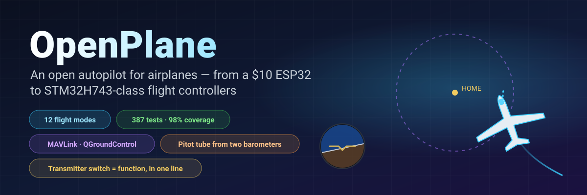
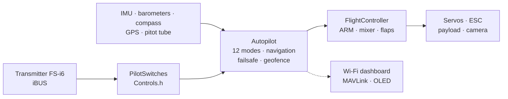

<!-- i18n-bar:start -->
  <p align="center">
    <a href="../../../README.md"> Читать на русском</a>
    &nbsp;·&nbsp;
     <b>Read this in English</b>
    &nbsp;·&nbsp;
    <a href="../zh-CN/README.md"> 阅读中文版</a>
    &nbsp;·&nbsp;
    <a href="../es/README.md"> Lee esto en español</a>
  </p>
  <p align="center">
    <a href="../hi/README.md"> हिन्दी में पढ़ें</a>
    &nbsp;·&nbsp;
    <a href="../ar/README.md"> اقرأ بالعربية</a>
    &nbsp;·&nbsp;
    <a href="../pt-BR/README.md"> Leia em português</a>
    &nbsp;·&nbsp;
    <a href="../fr/README.md"> Lire en français</a>
  </p>
  <p align="center">
    <a href="../de/README.md"> Auf Deutsch lesen</a>
    &nbsp;·&nbsp;
    <a href="../ja/README.md"> 日本語で読む</a>
    &nbsp;·&nbsp;
    <a href="../ko/README.md"> 한국어로 읽기</a>
  </p>
<!-- i18n-bar:end -->

<p align="center"><sub>🌐 Translation of the <a href="../../../README.md">Russian README</a>. The detailed documentation is translated too, and the links below lead to the translated pages. If the translation and the original differ, the original is authoritative. Console messages, screenshots and plots still use Russian labels. The translation was made by AI and has not been checked by native speakers. Please report mistakes to <a href="https://github.com/damir-lebedev">Damir Lebedev</a> or in the <a href="https://github.com/damir-lebedev/OpenPlaneProject/issues">issue tracker</a>.</sub></p>

<p align="center">
  
</p>

<p align="center">
  
  
  
  <br>
  
  
  
  <a href="../../../LICENSE"></a>
</p>

<h3 align="center">Switch off the transmitter — and the plane flies home on its own and circles above you.</h3>
<p align="center">This is no cartoon: <b>the entire firmware</b> flies an airplane model in a closed loop — the same iBUS bytes going in, the same PWM coming out.</p>

<p align="center">
  
</p>

---

## ⚡ In 30 seconds

| | |
|---|---|
| **What it is** | An open flight controller and autopilot for radio-controlled airplanes. Today it is an ESP32-S3 at ~$10; the next step is the STM32H743 (a Pixhawk-class board): the full firmware runs through the tests, and on a DevEBox board it is **already up and flown from the transmitter** — [there is a video](#-stm32h743-came-alive-on-the-board). |
| **What it can do** | 12 flight modes — from stabilization to return-home, GPS circles, hand launch, auto-landing and **thermal soaring**. A pitot tube made of two cheap barometers. MAVLink telemetry to QGroundControl and Mission Planner. |
| **The main trick** | Any switch or knob on the transmitter = any function. **One line** in `Controls.h` — and SwD is no longer RTH but a payload drop. |
| **Why you can trust it** | 387 automated tests (plus 9 on the board itself with a real SD card), 98% of the code under test, 24 "board × sensors" builds with not a single warning, closed-loop simulations of every mode. |
| **Honestly** | So far only manual mode has flown (the first prototype). The STM32H743 has so far been checked only on the bench, without sensors. The autopilot has been verified on the bench, by tests and by simulations, and is waiting for flight trials — [status below](#-honest-status). |

---

## 🎛️ A switch = a function. One line.

```cpp
// include/config/Controls.h
constexpr Binding BINDINGS[] = {
    Bind::modes  (Channels::SWC, MODE_MANUAL, MODE_STABILIZE, MODE_AUTO_TAKEOFF),
    Bind::feature(Channels::SWB, Feature::FLAPS),
    Bind::mode   (Channels::SWD, MODE_RTH),              // home, while switched on
    Bind::knob   (Channels::VRA, Knob::STAB_GAIN),       // "softer / stiffer" right in flight
    Bind::knob   (Channels::VRB, Knob::CRUISE_SPEED),
};
```

Want thermal soaring on SwD instead of RTH? `Bind::mode(Channels::SWD, MODE_SOARING)`. A payload drop on SwB? `Bind::feature(Channels::SWB, Feature::PAYLOAD_DROP)`. Made a mistake — say, put two modes on one switch or took over a stick — **the build will not pass**: the compiler checks the table (`static_assert`). At power-up the aircraft itself prints what is assigned to which switch.

**12 modes · 10 functions · 7 knobs** — all with examples in the [autopilot reference](AUTOPILOT_GUIDE.md).

---

## ✈️ What the autopilot can do

| | Mode | The idea |
|---|---|---|
| 🕹️ | **MANUAL** | control surfaces = sticks, just as without a flight controller |
| 🧭 | **STABILIZE** | the stick sets the angle; let go and the plane levels itself |
| 📏 | **ALT_HOLD** | + holds altitude using the barometer |
| 🌀 | **ACRO** | the stick sets the rotation rate — for aerobatics |
| 🛣️ | **CRUISE** | heading, altitude and speed hold themselves; the sticks only nudge |
| ⭕ | **LOITER** | circles above a GPS point (the radius is set with a knob) |
| 🏠 | **RTH** | home at 40 m and circles overhead; switches on by itself when the link is lost |
| 🛫 | **AUTO_TAKEOFF** | runway takeoff on the pilot's throttle |
| 🤾 | **LAUNCH** | hand launch: the motor starts after the throw, then a climb |
| 🛬 | **AUTO_LAND** | glide and flare near the ground |
| 🦅 | **SOARING** | motor off, finds thermals and circles in them |
| 🆘 | **RESCUE** | "help!": wings level, nose up — out of any spiral |

Plus: geofence, auto-trim for a "crooked" airplane, turn coordination, stall protection using the pitot tube, flaps and an air brake, payload drop, a stabilized camera, and a buzzer that says "find me in the grass".

---

## 📈 Every mode flies — in a closed loop

Not "a function returned a number", but a **flight**: transmitter → iBUS frame → firmware → PWM → control surface deflections → an airplane model with lift, stalls, wind and thermals → sensors → back to the firmware. 14 such flights are part of the ordinary tests (`pio test -e native`).

<p align="center"></p>

<table>
  <tr>
    <td width="50%"></td>
    <td width="50%"></td>
  </tr>
  <tr>
    <td>🦅 Found a thermal on its own and gained altitude <b>with the motor off</b> — the total-energy variometer does not mistake "stick back" for an updraft.</td>
    <td>🆘 A 60° bank — and a few seconds later, a level horizon. RESCUE pulls the plane out of a spiral with a 70° bank and a −40° nose.</td>
  </tr>
  <tr>
    <td></td>
    <td></td>
  </tr>
  <tr>
    <td>🤾 Hand throw → the motor starts only once the hand is clear of the propeller → climb. 🛬 Landing: glide and flare at 3 m.</td>
    <td>🌬️ Airspeed from a tube made of two <b>noisy</b> barometers with a 150 Pa offset between the chips — the error is below 0.5 m/s.</td>
  </tr>
</table>

---

## 🌬️ A pitot tube for pennies

A proper airspeed sensor costs about as much as half a flight controller. Here there are **two barometers**: a BMP581 in the tube (total pressure) and the main barometer in the fuselage (static pressure). The firmware zeroes the difference between the chips on the ground, filters, computes air density from altitude and temperature, and notices swapped hoses. What this gives: CRUISE holds **air**speed, not throttle; stall protection; an honest speed in telemetry. The build is described in the [reference](AUTOPILOT_GUIDE.md#a-diy-pitot-tube).

---

## 📡 Ground station: browser or QGroundControl

<table>
  <tr>
    <td width="46%"></td>
    <td>
      <b>ESP32 — a web dashboard right from the aircraft.</b> Access point <code>OpenPlane-Debug</code>, address <code>192.168.4.1</code>: transmitter channels, outputs, all sensors, mode, navigation, mode changes and PID tuning on the fly. No apps and no extra hardware.<br><br>
      <b>STM32H743 — MAVLink over a radio modem.</b> QGroundControl and Mission Planner see the aircraft as an ArduPilot airplane: horizon, a map with the home point, speed from the pitot tube, modes under their ArduPlane names, PID from the parameters window, mode changes with a button. ARM from the ground is not possible, only with a switch: it is safer that way.<br><br>
      MAVLink frames are checked byte for byte against the reference <code>pymavlink</code>.
    </td>
  </tr>
</table>

---

## 📼 Black box

The board records every flight: IMU at 500 Hz, angles and autopilot decisions, PID, all outputs, sticks, barometer, compass, GPS, battery and events — from ARM and throttle-up until landing, with 10 seconds before the start. **ESP32-S3** records to its built-in flash (13.9 MB, about 11 minutes), **STM32H743** to an SD card (64 MB — about an hour; the card remains an ordinary FAT32 card, and the firmware writes into a pre-created file `BLACKBOX.BIN`). Erasing happens only on the ground. After the flight, `python tools/blackbox.py download` downloads the flight over USB and splits it into CSV files; flights can also be decoded from the SD card without the board: `python tools/blackbox.py ring E:/BLACKBOX.BIN`. Details — [BLACKBOX.md](BLACKBOX.md).

---

## 🔩 Hardware: one firmware — four boards, twelve sensors

| Board | Status | What has been checked |
|---|---|---|
| **ESP32-S3 N16R8** | ✅ main board, on the bench | all sensors, servos, iBUS, OLED, dashboard live; the whole firmware in tests |
| **ESP32 38-pin** | 🧪 tests | the whole firmware in tests with the ICM-45686 kit |
| **ESP32-C3 SuperMini** | ✈️ has flown (manual) | the first prototype; builds of all kits |
| **STM32H743VIT6** | 🔧 DevEBox board without sensors + 🧪 tests | on the board: boot, console over USB, **SD card and black box** (on-board tests), **iBUS reception, ARM and control of the servos and motor from the transmitter** (the launch is on video); on the PC — the whole firmware: FreeRTOS tasks, flash, MAVLink, I2C and SPI. Sensors have not been connected to the board yet |

| Sensor | What it is | Buses |
|---|---|---|
| **LSM6DSV** + **QMC6309** | IMU + compass (module) | I2C / SPI |
| **ICM-45686** + **QMC6309** | IMU + compass (alternative) | I2C / SPI |
| **SPL06-001** | fuselage barometer | I2C / SPI |
| **BMP581** | barometer in the pitot tube (or the main one) | I2C / SPI |
| MPU6050/6500, ICM-42688, BMP388, BME280, QMC5883P/L | bench and legacy | I2C / SPI |
| **u-blox M10** | GPS, 10 Hz, UBX | UART |

A sensor is changed with one line (`SENSOR_KIT_LSM6DSV_PITOT`), a board with one build flag. All 4 boards × 6 sensor kits build without warnings: [`tools/build_matrix.sh`](../../../tools/build_matrix.sh).

<table>
  <tr>
    <td width="50%"></td>
    <td width="50%"></td>
  </tr>
  <tr>
    <td>The ESP32-S3 bench: IMU, barometer, compass, OLED, servos, receiver.</td>
    <td>Test of the motor-propeller group.</td>
  </tr>
</table>

### 🎥 STM32H743 came alive on the board

The firmware for the STM32H743 runs on a DevEBox board **without a single sensor** and is flown from an ordinary transmitter: the iBUS receiver, ARM, servos and motor respond to the sticks and switches in manual mode. The whole launch was recorded on video.

▶️ **[Watch the launch on video](https://t.me/lisnmylife/420)**

What this proves: the "transmitter → iBUS → firmware → PWM" chain works on real hardware, not only in tests. What is not yet proven: no sensors (IMU, barometer, GPS) have been connected to this board, so the autopilot modes have not yet been tried on it.

---

## 🧪 Quality you can verify

| | |
|---|---|
| **387 automated tests** | modules, chip drivers checked at the register level, closed-loop flights, the ESP32 and STM32 firmware **in full** on a PC; plus 9 tests on the STM32 board itself with a real SD card |
| **98.3% of lines, 87.7% of branches** | `gcovr` coverage, including the STM32 code |
| **24/24 builds** | 4 boards × 6 sensor kits, `-Wall -Wextra`, zero warnings |
| **0 findings** | cppcheck and clang-tidy over all the code |
| **References, not copies of code** | sensor formulas follow the datasheets (Bosch, ST, TDK, Goertek), MAVLink follows pymavlink |

```bash
pio test -e native -e native-stm32   # all tests, ~1.5 minutes, no hardware needed
```

Details — [TESTING.md](TESTING.md).

---

## 🧠 How it is built



- **Header-only C++**, a single translation unit, no dynamic memory in the flight loop. Prefer `.h/.cpp`? There is a parallel branch for you, [`feature/split-headers`](https://github.com/damir-lebedev/OpenPlaneProject/tree/feature/split-headers): a script generates it from this one, and the firmware with LTO comes out the same size.
- **HAL** — the only layer that knows the MCU: a new board is a new `Board`, not a rewritten autopilot.
- **A sensor driver does not know the bus**: one class works over both I2C and SPI.
- **Safety through order of operations**: link loss > ARM > mode > throttle; no mode can push throttle past ARM.

Details — [ARCHITECTURE.md](ARCHITECTURE.md).

---

## 🚀 Quick start

```bash
pip install platformio
git clone https://github.com/damir-lebedev/OpenPlaneProject && cd OpenPlaneProject
pio run -e esp32-s3 -t upload && pio device monitor     # ESP32-S3
pio run -e stm32h743 -t upload                            # STM32H743 (ST-Link)
pio run -e stm32h743-devebox -t upload                    # DevEBox H743: USB DFU, console over USB
```

DevEBox: the board has no BOOT0 button — before the first upload, connect pin BT0 to 3V3 and press RST; after that, the `D` key in the console reboots the board into the bootloader by itself ([details](DEVELOPER_GUIDE.md#stm32h743)).

In the serial monitor: `h` — menu, `b` — which chips are visible on the buses, `s` — sensors, `p` — output test (remove the propeller!). Then — the [pilot's guide](PILOT_GUIDE.md).

---

## 🟢 Honest status

| What | Where it was verified |
|---|---|
| Manual control, mixer | ✈️ in flight (first prototype, C3) |
| ARM, failsafe, flaps, servos, motor | 🔧 on the bench (S3) |
| STABILIZE | 🔧 on the bench: the control surfaces respond to tilts in the right direction |
| Bench sensors (MPU6500, BMP388, QMC5883P), OLED, dashboard | 🔧 on the bench |
| The other modes, navigation, pitot tube, MAVLink | 🧪 tests and closed-loop simulations |
| New sensors (LSM6DSV, ICM-45686, QMC6309, SPL06, BMP581) | 🧪 register emulators built from the datasheets |
| STM32H743: SD card, black box, console over USB | 🔧 on the DevEBox board (on-board tests) |
| STM32H743: iBUS, ARM, PWM to the servos and motor, manual control | 🔧 on the board without sensors, recorded on video |
| STM32H743: sensors (IMU, barometer, compass, GPS) and autopilot modes | 🧪 the whole firmware on a PC; no sensors connected to the board yet |

The airplane model in the simulations is simplified, and the coefficients are starting values. Every new mode is first tried at altitude, with a finger on the MANUAL switch.

---

## 🗺️ Roadmap

- [x] Manual control, ARM, failsafe, object-oriented firmware, web dashboard
- [x] ESP32-S3 bench with all sensors — live
- [x] 12 modes, GPS navigation, RTH on link loss, geofence
- [x] Switches and knobs in one line, payload drop, camera, auto-trim
- [x] Pitot tube from two barometers, stall protection
- [x] New sensors: LSM6DSV, ICM-45686, QMC6309, SPL06, BMP581
- [x] STM32H743: full firmware, MAVLink, settings in flash
- [x] Closed-loop simulations of all modes, the whole firmware in tests
- [x] Black box: flights to flash (ESP32-S3) and to an SD card (STM32H743), download and decoding to CSV
- [x] STM32H743 runs on the board: transmitter → iBUS → servos and motor (no sensors, on video)
- [ ] STM32H743: connect the sensors and go through the bench the same way as with the ESP32-S3
- [ ] Flight trials of the autopilot on the new airframe
- [ ] A custom flight controller board ([FC_BOARD.md](FC_BOARD.md)) on the STM32H743
- [ ] Waypoint flight, MAVLink missions
- [ ] Adaptive feedback (a draft is already verified in simulation)
- [ ] Current and battery sensor, telemetry to the transmitter (iBUS-SENS)
- [ ] Autonomous delivery: route → payload drop → home

Details — [ROADMAP.md](ROADMAP.md).

---

## 💼 For partners and investors

Small delivery airplanes and monitoring aircraft are either closed, expensive platforms or scattered hobby projects. OpenPlane aims at the middle: **an open, verifiable autopilot on mass-market hardware**, where every function is covered by tests and can be adapted to a task — delivering medicines to hard-to-reach places, monitoring fields and forests, search operations.

What has already been done with our own resources: an architecture that moves between boards without being rewritten; an autopilot with a full set of modes; test infrastructure on which new features appear quickly and do not break old ones. What additional resources would speed up: flight trials, a custom flight controller board on the STM32H743, waypoint flight and payload drop. Where and why — [ROADMAP.md](ROADMAP.md).

---

## 📚 Documentation

| Document | For whom |
|---|---|
| [AUTOPILOT_GUIDE.md](AUTOPILOT_GUIDE.md) | the pilot: every mode, function and knob, how to put them on a switch, the pitot tube, the ground station |
| [PILOT_GUIDE.md](PILOT_GUIDE.md) | assembly, pinout, transmitter, failsafe, first flight |
| [DEVELOPER_GUIDE.md](DEVELOPER_GUIDE.md) | the developer: files, sign conventions, API, how to add a sensor, a mode or a board |
| [ARCHITECTURE.md](ARCHITECTURE.md) | layers, tasks, the control tick, state machines |
| [TESTING.md](TESTING.md) | tests, simulations, coverage, analysis |
| [reference/](reference/README.md) | a reference for every class |
| [FC_BOARD.md](FC_BOARD.md) · [ROADMAP.md](ROADMAP.md) | the flight controller board · where the project is heading |
| [airframe/](airframe/README.md) | the Astro-Cargo airframe: Fusion 360 project and STL files for printing, known flaws of version v2 |

> **Related project:** [esp32-rc-joystick](https://github.com/damir-lebedev/esp32-rc-joystick) — the FS-i6 transmitter as a USB joystick for a simulator, on the same ESP32-S3: first log your hours in the simulator, then in the field.

---

## 🤝 Contributing

We need hands and heads: aerodynamics and aeromodelling, 3D printing and structural strength, embedded C++, sensors and autopilots, ground interfaces. Issues and pull requests go to the `main` branch; start with [DEVELOPER_GUIDE.md](DEVELOPER_GUIDE.md).

## 📜 License

The [OpenPlane License](../../../LICENSE) is a license based on MIT with additional conditions. The code, the documentation and the model files may be used, copied, modified and sold, including in commercial products. The conditions are:

1. **Credit the author — Damir Lebedev (Damn / Проклятый).** The name must appear where the users of your product will see it: in the documentation, the README or an "About" page. Keep the license text together with the code.
2. **Military use is prohibited.** The project must not be used by armies and paramilitary organizations, in war, or to create weapons, munitions, and delivery or targeting systems.
3. **Do not intentionally harm people or property without their prior written consent to that harm.** You may break your own equipment if it threatens no one: for example, shooting your own drone with an air pistol. Maiming and killing people is not allowed.
4. **Follow the safety rules and the law** when building, testing and flying.

If the conditions are violated, the permission to use the project ends. Because of the bans on certain kinds of use, this is not an "open" license in the OSI sense: the code is available to read, copy and modify, but formally the project is source-available, not open source.

Only the English text in the [LICENSE](../../../LICENSE) file has legal force: translations of the license into other languages are provided for convenience.

The firmware controls an aircraft and is not certified. Whatever you do with it is at your own risk; the author accepts no liability.

```text
OpenPlane © 2026 Damir Lebedev (Damn / Проклятый) — https://github.com/damir-lebedev/OpenPlaneProject
```

<p align="center"><i>The first prototype broke on its very first flight — which is why everything here is in the open: code, tests, problems. Build it, break it, fix it together with us.</i></p>
