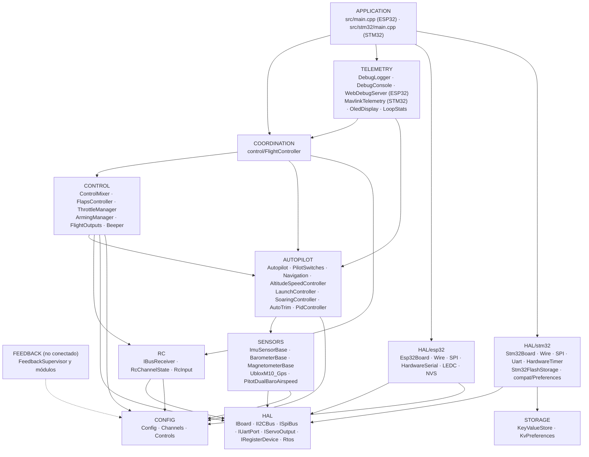
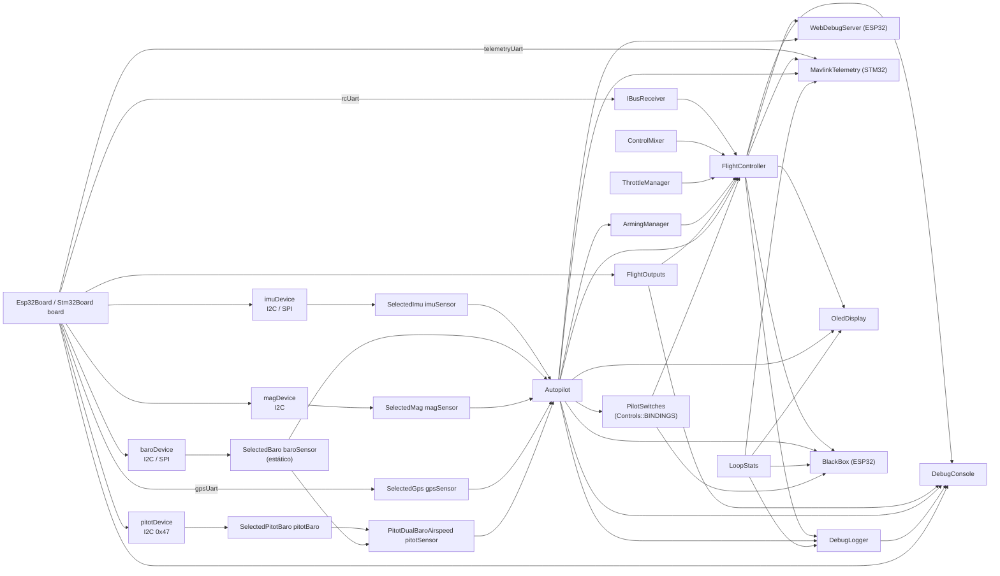
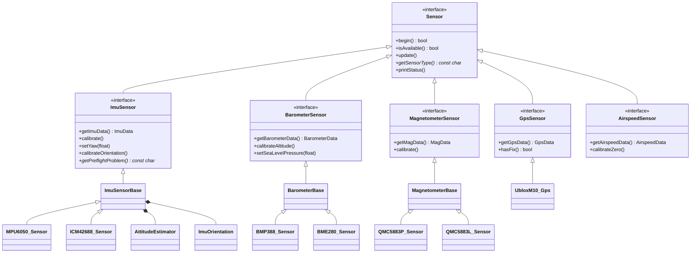
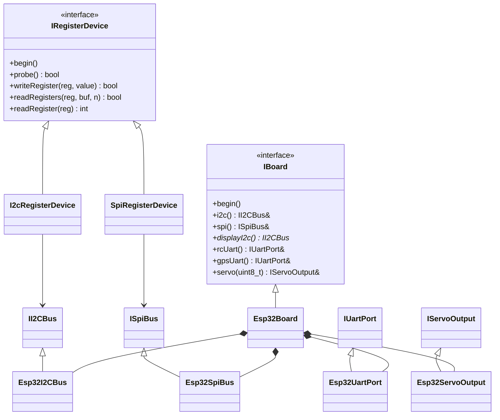
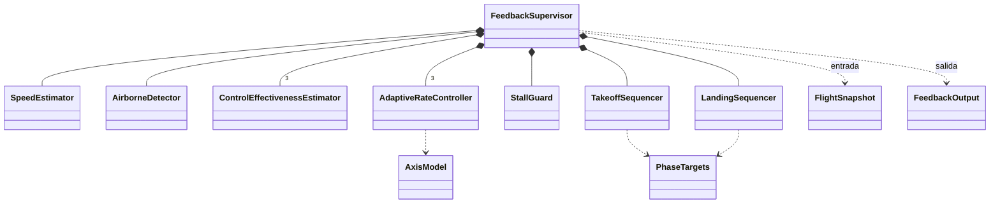
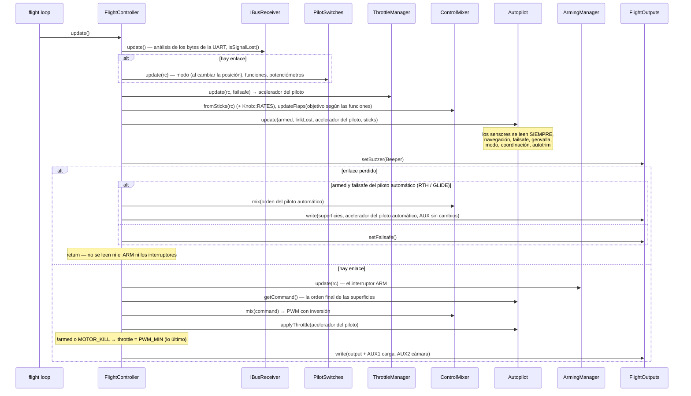
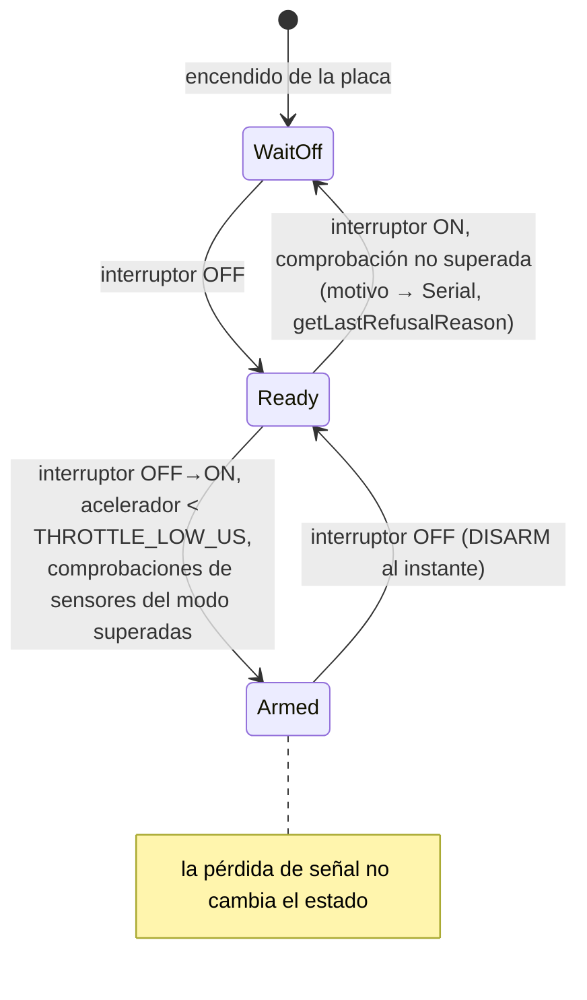
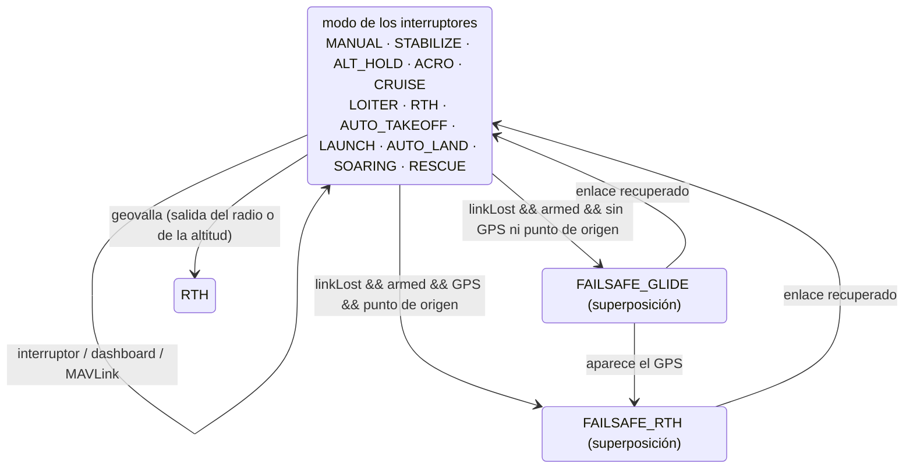
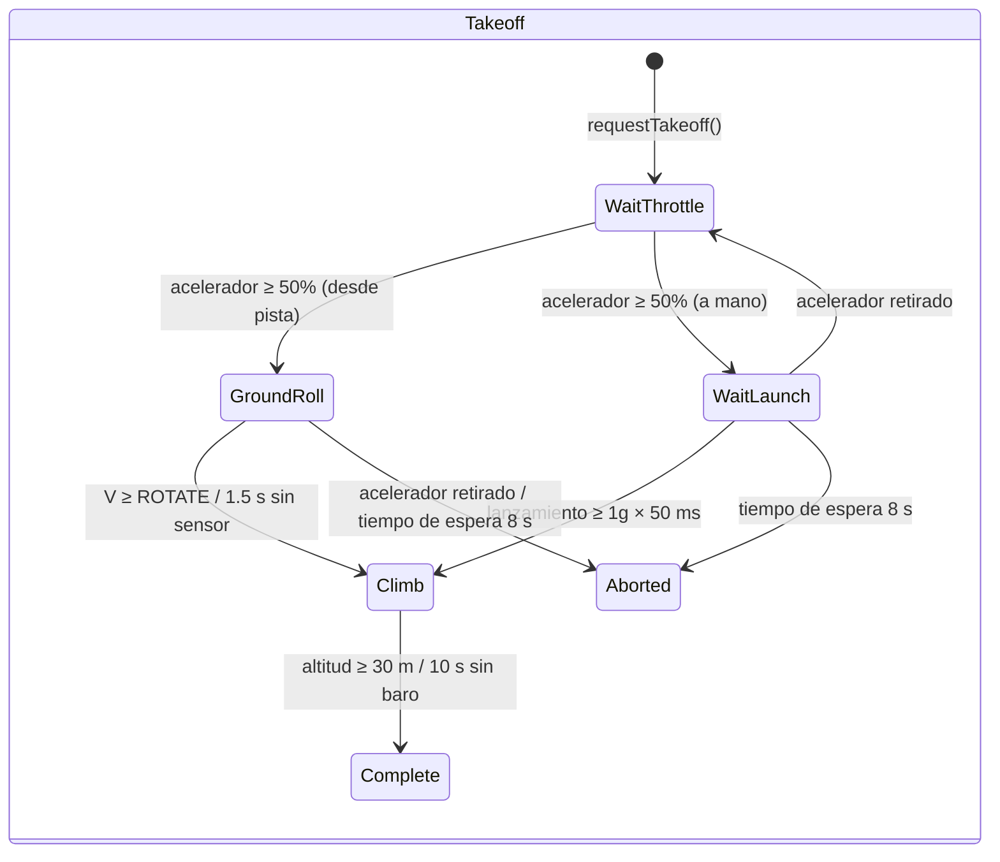
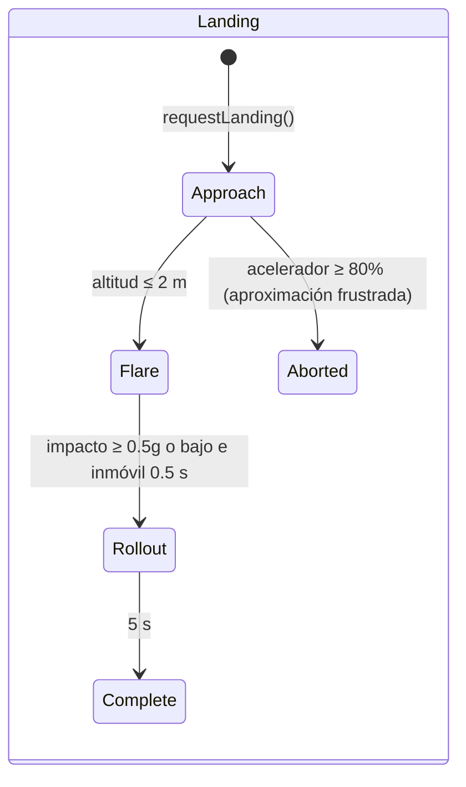

# ARCHITECTURE.md: la arquitectura del firmware de OpenPlaneProject

> 🌐 Esta página es una traducción del [original en ruso](../../ARCHITECTURE.md). Si la traducción y el original difieren, prevalece el original. El firmware muestra los mensajes de la consola en ruso, por lo que se citan tal cual. La traducción la ha hecho una IA y no la han revisado hablantes nativos. Si encuentras errores, escribe a [Damir Lebedev](https://github.com/damir-lebedev) o abre una [incidencia](https://github.com/damir-lebedev/OpenPlaneProject/issues).

Este documento describe **cómo está organizado el firmware completo**: las capas y las reglas de dependencia entre ellas, el grafo de objetos, el modelo de hilos de FreeRTOS, el orden de las operaciones en cada ciclo, las máquinas de estados, la estrategia de tolerancia a fallos de los sensores y los puntos de extensión. Una referencia detallada de cada clase (API pública, campos, invariantes) está en [`reference/`](reference/README.md).

Documentos relacionados:

| Documento | De qué trata |
|---|---|
| [`DEVELOPER_GUIDE.md`](DEVELOPER_GUIDE.md) | Guía práctica: el convenio de signos, la API HTTP, la consola, cómo añadir un sensor, un modo o una placa |
| [`reference/`](reference/README.md) | Referencia de todas las clases, estructuras y espacios de nombres |
| [`TESTING.md`](TESTING.md) | Pruebas: nativas (en el PC, con cobertura) y en la placa |
| [`PILOT_GUIDE.md`](PILOT_GUIDE.md) | Montaje, distribución de pines, emisora, primer vuelo |
| [`ROADMAP.md`](ROADMAP.md) | Hacia dónde va el proyecto |

> Estado: el banco con el ESP32-S3 está comprobado con todos los sensores, **el piloto automático no se ha probado en vuelo**, y el lazo de realimentación (`autopilot/feedback/`) **no está conectado** al firmware y solo se comprueba mediante simulación.

---

## Contenido

1. [Principios](#1-principios)
2. [Capas y reglas de dependencia](#2-capas-y-reglas-de-dependencia)
3. [El grafo de objetos (composition root)](#3-el-grafo-de-objetos-composition-root)
4. [Jerarquías de clases](#4-jerarquías-de-clases)
5. [Tareas de FreeRTOS y separación de datos](#5-tareas-de-freertos-y-separación-de-datos)
6. [El ciclo de control: `FlightController::update()`](#6-el-ciclo-de-control-flightcontrollerupdate)
7. [Máquinas de estados](#7-máquinas-de-estados)
8. [Tolerancia a fallos: sensores, enlace, salidas](#8-tolerancia-a-fallos-sensores-enlace-salidas)
9. [Configuración y variantes de compilación](#9-configuración-y-variantes-de-compilación)
10. [El lazo de realimentación (no conectado)](#10-el-lazo-de-realimentación-no-conectado)
11. [Puntos de extensión](#11-puntos-de-extensión)
12. [Facilidad de prueba](#12-facilidad-de-prueba)

---

## 1. Principios

| Principio | Cómo se implementa |
|---|---|
| **C++ solo con cabeceras** | Todas las clases se definen en las cabeceras de `include/<capa>/`. La única unidad de traducción del firmware es `src/main.cpp` (ESP32) o `src/stm32/main.cpp` (STM32). No hay memoria dinámica en el lazo de vuelo (las cadenas `String` solo se usan en el servidor web y en la OLED). Una variante dividida en `.h/.cpp` está en una rama aparte, `feature/split-headers`: la genera `tools/split_headers.py`, y las diferencias y los tamaños del firmware están en su `docs/SPLIT_HEADERS.md`. |
| **Composition root** | `src/main.cpp` / `src/stm32/main.cpp` es el único lugar donde se crean los objetos y se enlazan mediante referencias o punteros. No contiene lógica de vuelo. |
| **Una línea, un interruptor** | Lo que hace cada canal de la emisora lo define la tabla `config/Controls.h` (`Bind::modes/mode/feature/knob`), que se comprueba con `static_assert` al compilar. |
| **Inversión de dependencias** | Las capas superiores dependen de interfaces (`IBoard`, `IRegisterDevice`, `ImuSensor*`, …) y no de chips ni MCU concretos. |
| **Dependencias anulables** | El piloto automático, los interruptores (`PilotSwitches`) y todos los sensores se pasan como punteros y pueden ser `nullptr`: sin un sensor, el modo se comporta de forma segura en lugar de fallar. |
| **Seguridad por prioridad** | El orden de las operaciones en el ciclo es la prioridad: pérdida de señal > ARM > sticks/piloto automático > acelerador. La comprobación del ARM sobre el acelerador va al final. |
| **Un solo convenio de signos** | Desde la IMU hasta el servo, signos aeronáuticos; el sentido de cada servo se fija en un único lugar (`Config::*_REVERSED`). |
| **El tiempo como parámetro** | Siempre que es posible (flaps, módulos de realimentación), el tiempo se pasa como argumento y no se lee de `millis()`: así las clases son deterministas y fáciles de probar. |
| **Diagnóstico honesto** | Cada sensor y cada salida distinguen «no está en la compilación» (`attached`) de «está, pero no responde» (`available`); se ve en el JSON, en el registro y en la OLED. |

---

## 2. Capas y reglas de dependencia



Las reglas:

1. **La HAL es la única capa que conoce la MCU.** Solo `include/hal/esp32/` e `include/hal/stm32/` incluyen `<Wire.h>`, `<SPI.h>`, `HardwareSerial`, y llaman a `ledc*` / `HardwareTimer` / la flash. Las tareas de FreeRTOS se crean mediante `hal/Rtos.h` (el núcleo 0 en el ESP32, una prioridad en la STM32). Almacenamiento de ajustes: el código escribe `<Preferences.h>`; en el ESP32 eso es NVS y en la STM32 es `hal/stm32/compat/Preferences.h` sobre `storage/KeyValueStore.h`. Una excepción deliberada: `SpiRegisterDevice` conmuta el CS con los `pinMode/digitalWrite` estándar de Arduino (idénticos en el ESP32 y en la STM32).
2. **Los drivers de sensores no conocen el bus.** Reciben un `IRegisterDevice&` (una dirección I2C o un CS de SPI) o un `IUartPort&`. El bus se elige en `sensors/SensorSelection.h`.
3. **RC y Outputs no saben nada del avión**: bytes de iBUS → canales; valores de PWM → salidas.
4. **Control y Autopilot** son lógica pura sobre datos: sin UART, PWM ni Wi-Fi.
5. **Coordination** (`FlightController`) es la única clase que ve a la vez varias capas inferiores y decide el orden de las operaciones.
6. **Telemetry** solo lee el estado mediante getters constantes; las órdenes del dashboard pasan por un «buzón» y las aplica el lazo de vuelo; MAVLink (`MavlinkTelemetry`) trabaja directamente dentro del lazo de vuelo y aplica las órdenes por sí mismo.
7. **Una capa inferior nunca incluye una superior.** Si una clase inferior necesita una superior, la lógica se sube a `FlightController`.

`ArmingManager` (CONTROL) lee el modo de `Autopilot`: es la única dependencia horizontal CONTROL → AUTOPILOT; las comprobaciones del ARM dependen de qué sensores necesita el modo elegido.

---

## 3. El grafo de objetos (composition root)

Todos los objetos son globales con duración de almacenamiento estática, creados en `src/main.cpp`. Las referencias y los punteros entre ellos **no son propietarios**; el orden de construcción coincide con el orden de declaración (una única unidad de traducción).



El orden de inicialización en `setup()`:

```
Serial (ESP32: búfer TX de 4 KB; STM32: SERIAL_TX_BUFFER_SIZE=1024), 115200 → cartel de arranque
board.begin()               — buses I2C/SPI (la segunda I2C, si existe)
flightOutputs.begin()       — canales PWM; enseguida setFailsafe()
[STM32] ajustes desde la flash — KeyValueStore::mount(), CRC de la imagen
setupSensors()              — begin() de cada sensor; calibración de los que respondieron:
                              IMU (2 s inmóvil + comprobación previa al vuelo),
                              baro (altitud cero), brújula (rumbo inicial → yaw de la IMU),
                              tubo de Pitot (el cero se toma durante el primer segundo del ciclo)
autopilot.begin()           — trim desde NVS/flash
flightController.begin()    — setFailsafe() + UART iBUS
oledDisplay.begin(...)      — tarea propia (hal/Rtos.h)
[ESP32] webDebugServer.begin() — punto de acceso + tarea propia en el núcleo 0
[ESP32] blackBox.begin()   — la partición blackbox, una cola en PSRAM, la tarea bbox en el núcleo 0
[STM32] mavlink.begin()     — UART4 del radiomódem
[STM32] setupBlackBox()    — tarjeta SD, el archivo BLACKBOX.BIN, blackBox.begin(), la tarea bbox
pilotSwitches.printBindings() — qué hay en cada interruptor
debugLogger.begin()         — ajustes del registro
[STM32] tareas flight / storage → vTaskStartScheduler()
```

---

## 4. Jerarquías de clases

### Sensores



Las clases base (`ImuSensorBase`, `BarometerBase`, `MagnetometerBase`) implementan el patrón **Template Method**: los `update()`/`calibrate()` públicos se escriben una sola vez, y el driver del chip implementa solo las «primitivas» protegidas (`readSample()`, `isNewSampleReady()`, `readRaw()`, las escalas).

### HAL



### El lazo de realimentación



---

## 5. Tareas de FreeRTOS y separación de datos

**ESP32** (dos núcleos, FreeRTOS está integrado en el núcleo de Arduino):

| Núcleo | Tarea | Qué hace | Periodo |
|---|---|---|---|
| 1 | Arduino `loopTask` → `loop()` | `WebDebugServer::applyPendingCommands()` → `FlightController::update()` → `DebugLogger::update()` → `DebugConsole::update()` → `LoopStats::record()` → `BlackBox::update()` | `Config::LOOP_PERIOD_MS` = 2 ms (500 Hz), `vTaskDelayUntil` |
| 0 | `web` (8 KB de pila, prioridad 1) | `WebServer::handleClient()` | cada 2 ms (`vTaskDelay`) |
| 0 | `oled` (4 KB de pila, prioridad 1) | `OledDisplay::draw()` por el segundo bus I2C | 200 ms (`vTaskDelayUntil`) |
| 0 | `bbox` (6 KB de pila, prioridad 2) | `BlackBox::writerStep()`: una página de la cola a la flash; en tierra, borrado | notificación desde `loop()` tras cada ciclo (si no, una vez cada 20 ms) |
| 0 | la pila Wi-Fi de ESP-IDF | el punto de acceso | — |

**STM32H743** (un núcleo, FreeRTOS de STM32duino, desalojo por prioridad):

| Prioridad | Tarea | Qué hace | Periodo |
|---|---|---|---|
| 5 | `flight` (16 KB) | `FlightController::update()` → `MavlinkTelemetry::update()` → `DebugLogger::update()` → `DebugConsole::update()` → `LoopStats::record()` | 2 ms, `vTaskDelayUntil` |
| 1 | `oled` (4 KB) | `OledDisplay::draw()` por el segundo bus I2C | 200 ms |
| 1 | `storage` (2 KB) | `Stm32FlashStorage::service()`: borrado y escritura del sector de ajustes | 100 ms |
| 2 | `bbox` (8 KB) | `BlackBox::writerStep()`: una página de la cola a la tarjeta SD; en tierra, borrado. La desaloja la tarea de vuelo | notificación tras cada ciclo (si no, una vez cada 20 ms) |

**Reglas de separación de datos:**

- Las tareas `web` y `oled` **solo leen** el estado (`FlightController`, `Autopilot`, `LoopStats`, los sensores) mediante getters constantes. Los campos son valores individuales de 16/32 bits, así que no hay lecturas «rotas»; en el peor de los casos se ven los valores de ciclos contiguos.
- Las **órdenes** del dashboard (`/api/setmode`, `/api/setpid`) **no se aplican** directamente desde la tarea `web`: se colocan en `PendingCommands` bajo un spinlock `portMUX` y el lazo de vuelo las recoge en `applyPendingCommands()`; un cambio en el piloto automático siempre ocurre en el contexto de la tarea que lo posee.
- `LoopStats::hz/avgUs/maxUs` son `volatile uint32_t`; `takePeakUs()` se llama solo desde `loop()`.
- `OledDisplay` guarda un puntero al bus en una variable estática (el callback en C de U8g2 no admite contexto); a bordo hay una sola pantalla.

**Tiempo real:**

- El periodo lo mantiene `vTaskDelayUntil`, y no un `delay()` tras el trabajo. Tras un bloqueo largo (una calibración desde la consola, > 100 ms) la cuenta empieza de nuevo: los ciclos perdidos no se recuperan de golpe.
- El tiempo de espera de una transacción I2C es de 5 ms (el de `Wire` por defecto es de 50 ms).
- `Serial` con un búfer de transmisión de 4 KB: una línea de registro no bloquea el lazo.
- Caja negra: el lazo solo pone una instantánea en la cola (spinlock, microsegundos); la página a la flash (detiene ambos núcleos unos 0.6–0.9 ms) la escribe la tarea `bbox` justo después del ciclo, en el hueco del lazo. El borrado de la flash solo se hace sin ARM y sin grabación, nunca en el aire.
- ESP32: una escritura en la flash (NVS, ajustes de Wi-Fi) detiene ambos núcleos unos 0.3–0.4 s, por eso: el Wi-Fi usa `persistent(false)`; los ajustes del registro se guardan solo sin ARM; las calibraciones, solo sin ARM; el autotrim, tras el DISARM y solo cuando el avión está parado (`Autopilot::looksLanded()`).
- STM32: `Preferences::end()` solo copia la imagen (microsegundos), y el borrado del sector (segundos) se hace en la tarea `storage`. El sector de ajustes está en el banco 2 de la flash y el código en el banco 1: la tarea de vuelo desaloja la escritura y sigue funcionando.
- MAVLink no bloquea el lazo: una trama se envía solo si hay sitio en el búfer de la UART (`IUartPort::availableForWrite()`); si no, espera al siguiente ciclo.

---

## 6. El ciclo de control: `FlightController::update()`



Invariantes clave del ciclo:

- **Pérdida de señal**: el modo y las funciones de los interruptores no cambian; el ARM no se lee ni se restablece; el motor funciona solo por decisión del failsafe del piloto automático (RTH con motor) o por `FAILSAFE_THROTTLE`.
- **Ningún modo puede colar el acelerador por encima del ARM**: el `PWM_MIN` forzado con `!armed` y `MOTOR_KILL` se aplica después de `Autopilot::applyThrottle()`.
- **El piloto automático emite la orden final** (`getCommand()`); en los modos con estabilización los sticks son los ángulos deseados; correcciones = orden − sticks (para el registro y el dashboard). Todo con un único convenio de signos (`ControlCommand`) hasta el mezclador.

---

## 7. Máquinas de estados

### ARM (`ArmingManager`)



`WaitOff` = `armed == false && switchSeenOff == false`; `Ready` =
`armed == false && switchSeenOff == true`.

### Modos del piloto automático (`Autopilot` + `PilotSwitches`)

Doce modos (`AutopilotTypes.h`); lo que hace cada uno está en [AUTOPILOT_GUIDE.md](AUTOPILOT_GUIDE.md#modos). El modo lo elige `PilotSwitches` según la tabla `config/Controls.h`: el interruptor de modos (`Bind::modes`) y los interruptores de «modo superpuesto» (`Bind::mode`, la fila superior tiene prioridad). `setMode()` se llama solo cuando **ha cambiado el resultado** de los interruptores; por eso un modo elegido desde el dashboard o la GCS se mantiene hasta que el piloto mueve un interruptor.



El failsafe no es un `AutopilotMode` aparte, sino un indicador superpuesto al modo actual; un regreso ya iniciado no se abandona para planear por una breve pérdida del GPS; al recuperarse el enlace continúa el modo de los interruptores (el despegue automático y el lanzamiento a mano, solo de nuevo). Máquinas de estados internas: `LaunchController` (IDLE → READY → THROWN → CLIMB → DONE) y `SoaringController` (GLIDE → THERMAL → MOTOR_CLIMB → RETURN).

**AUTO_TAKEOFF** (por tiempo desde el inicio, cuando está armed y el acelerador ≥ 1500 µs):

| Tiempo | Acelerador (programa) | Cabeceo |
|---|---|---|
| 0–1 s | gradual de 0 → 100 % | 0° |
| 1–3 s | 100 % | +15° |
| > 3 s | 100 % | +10° |

### Despegue y aterrizaje (lazo de realimentación, no conectado)





---

## 8. Tolerancia a fallos: sensores, enlace, salidas

### Sensores

| Sensor | `isAvailable()` pasa a `false` | Qué ocurre ante un fallo de lectura |
|---|---|---|
| IMU (`ImuSensorBase`) | `begin()` no identificó el chip, **o** 50 errores de lectura seguidos (~0.1 s a 500 Hz) | los datos no se sobrescriben, `errorCount++`; si se recupera, vuelve a estar disponible |
| Barómetro (`BarometerBase`) | 100 errores seguidos (~0.5 s con sondeo cada 5 ms) | lo mismo |
| Brújula (`MagnetometerBase`) | 25 errores seguidos (~0.5 s a 50 Hz) | lo mismo |
| GPS (`UbloxM10_Gps`) | ningún NAV-PVT válido **o** el último es más antiguo que `GPS_TIMEOUT_US` (2 s) | — |

Además, la IMU tiene una **comprobación previa al vuelo** (`getPreflightProblem()`): inmovilidad durante la calibración del giroscopio, |a| ≈ 1g, la dirección «arriba» coincide con el montaje guardado. Si no la supera, `Autopilot::imuReady() == false` (correcciones nulas en todos los modos, incluido el planeo) y `ArmingManager` no hace ARM en los modos con estabilización.

Los consumidores reaccionan igual: **sin sensor (`nullptr`) o con el sensor no disponible, no hay ningún efecto**, y el avión se maneja como en MANUAL.

### Enlace (`IBusReceiver::isSignalLost()`)

Dos indicadores independientes:

1. no hay tramas correctas durante más de `RX_TIMEOUT_US` (500 ms), o no ha habido ninguna desde el encendido;
2. el acelerador de la trama es inferior a `RX_FAILSAFE_THROTTLE_US` (950 µs): el failsafe programado en la emisora (el FS-iA6B no deja de enviar tramas cuando se pierde la emisora).

Las tramas con un CRC erróneo se descartan y se cuentan (`getBadFrameCount()`).

### Salidas

Justo después de `FlightOutputs::begin()` se llama a `setFailsafe()`: superficies al neutro y motor apagado incluso antes de leer los sensores. Una salida con el pin `-1` (el timón de dirección en la C3) simplemente no se conecta; `attached` en el JSON indica si se ha asignado un canal LEDC. El pulso real en cada pin lo comprueba `printPulseSelfTest()` (comando de consola `p`).

---

## 9. Configuración y variantes de compilación

| Qué | Dónde | Cómo se elige |
|---|---|---|
| Placa (pines) | `include/config/Config.h` | la macro `BOARD_ESP32_S3` / `BOARD_ESP32_C3` / `BOARD_ESP32_CLASSIC` / `BOARD_STM32H743` desde `[env:*]` en `platformio.ini` |
| Todos los ajustes (tiempos de espera, recorridos de las superficies, inversiones, failsafe, Wi-Fi) | `Config.h`, espacio de nombres `Config` | `constexpr`, editando el archivo |
| Asignación de los canales RC | `include/config/Channels.h` | editando el archivo |
| Sensores y buses | `include/sensors/SensorSelection.h` | `#define SENSOR_IMU/BARO/MAG/GPS`, también se puede dar con un indicador `-D` |
| Constantes de la realimentación | `include/autopilot/feedback/FeedbackConfig.h` | al conectarlas pasarán a `Config.h` |
| Montaje de la IMU | NVS (`imu_mpu6050` / `imu_icm42688`) o `Config::IMU_ROTATION_CW_DEG` | comando de consola `o` |
| Calibración de la brújula | NVS (`qmc5883p` / `qmc5883l`) | comando de consola `m` |
| Ajustes del registro | NVS (`debuglog`) | menú de la consola `l` |
| Caja negra | `Config.h` (`BLACKBOX_*`), la partición `blackbox` en `partitions_blackbox.csv` | vuelos: `tools/blackbox.py`, menú de la consola `k` |

Entornos de PlatformIO:

| `env` | Finalidad |
|---|---|
| `esp32-s3` (por defecto) | El controlador de vuelo principal |
| `esp32-c3` | El prototipo antiguo |
| `esp32-dev` | La ESP32 clásica, banco |
| `stm32h743` | STM32H743VIT6: firmware completo (`src/stm32/main.cpp`), ajustes en la flash, MAVLink, caja negra en SD, FreeRTOS; comprobado en una placa desnuda; véase [reference/hal.md](reference/hal.md#implementación-para-el-stm32h743) |
| `stm32h743-devebox` | DevEBox H743: lo mismo, con la consola por USB CDC y la carga por DFU ([DEVELOPER_GUIDE](DEVELOPER_GUIDE.md#stm32h743)) |
| `native` | Compilación y pruebas en el PC con fakes de Arduino/ESP-IDF y cobertura; véase [`TESTING.md`](TESTING.md) |

---

## 10. El lazo de realimentación (no conectado)

`include/autopilot/feedback/` es la futura sustitución de la estabilización con PID: el modelo del eje `ε = b·u + a·ω + c` se aprende en vuelo mediante mínimos cuadrados recursivos (`ControlEffectivenessEstimator`), y el regulador es una cascada ángulo → velocidad angular → aceleración angular → superficie a través del modelo aprendido (`AdaptiveRateController`), con la protección contra la pérdida de sustentación (`StallGuard`) y las etapas de despegue y aterrizaje por encima.

La única entrada es `FlightSnapshot` (una instantánea por ciclo) y la única salida es `FeedbackOutput`. Los módulos no leen directamente los sensores ni el RC, por lo que se comprueban con una simulación en lazo cerrado (`test/test_feedback`), tanto en el PC como en la placa.

El orden por ciclo en `FeedbackSupervisor::update()`:

1. velocidad y aceleración longitudinal (`SpeedEstimator`), si está en el aire (`AirborneDetector`);
2. entrenamiento del modelo de cada eje (solo en el aire, con la IMU viva, los flaps sin moverse y sin pérdida de sustentación);
3. protección contra la pérdida de sustentación (desactivada cerca del suelo al aterrizar);
4. los objetivos de la etapa de despegue o aterrizaje;
5. objetivos ← las restricciones de la protección contra la pérdida de sustentación;
6. los reguladores de los ejes → deflexiones de las superficies; acelerador (solo con el enlace vivo).

El plan de conexión está en [`DEVELOPER_GUIDE.md`](DEVELOPER_GUIDE.md#plan-de-conexión).

---

## 11. Puntos de extensión

| Tarea | Qué cambiar | Qué no cambiar |
|---|---|---|
| Un chip nuevo de una categoría existente | un nuevo `*_Sensor.h` a partir de la clase base + una rama en `SensorSelection.h` | `main.cpp`, `Autopilot` |
| Una categoría nueva de sensores | una interfaz en `SensorInterface.h`, un puntero anulable en `Autopilot`, los campos `attached/available` en el JSON | el resto del código |
| Un modo nuevo del piloto automático | `AutopilotMode`, `handle*Mode()`, `applyThrottle()`, el selector y el dashboard, `ArmingManager::checkFailureReason()` | `FlightController` |
| Una salida nueva (servo) | una fila en `FlightOutputs::outputInfo()`, un campo en `FlightOutputState`, un índice en `ServoChannel`, un pin y un canal LEDC en `Esp32Board` | el lazo de escritura y de estado |
| Una placa ESP32 nueva | un `#elif` en `Config.h`, `[env:*]` en `platformio.ini` | todo el resto del código |
| Otra MCU | `hal/<mcu>/<Mcu>Board.h` que implemente `IBoard` (un ejemplo: `hal/stm32/`), un bloque de pines en `Config.h`, `[env:*]` | los sensores, la lógica de vuelo |
| Otro protocolo de receptor | sustituir `IBusReceiver` por uno con la misma API (`getState()`, `isSignalLost()`) | `FlightController` |
| Un canal nuevo del registro | `LogChannel`, una fila en `LogSettings::info()`, `DebugLogger::format*()`, `VERSION++` | — |

---

## 12. Facilidad de prueba

Gracias a las interfaces de la HAL y a que el tiempo se pasa como parámetro, la mayor parte de la lógica se puede comprobar sin hardware:

- Las **pruebas nativas** (`pio test -e native`) compilan las cabeceras del firmware en el PC con fakes de Arduino, FreeRTOS, Wire/SPI/UART/LEDC, Preferences, WebServer/WiFi y U8g2 (`test/native/support/`). La cobertura la calcula `gcovr`.
- **El firmware completo en el PC**: `src/main.cpp` con la distribución de pines de la S3 y de la de 38 pines y con cada kit de sensores (emuladores de chips a nivel de registros), y `src/stm32/main.cpp` (`pio test -e native-stm32`) sobre la capa de fakes de STM32duino.
- **Simulaciones de vuelo en lazo cerrado** (`test/native/test_sim`): todo el firmware pilota un modelo del avión; cada modo del piloto automático vuela de verdad, y no se limita a «producir números».
- **La matriz de compilaciones** (`tools/build_matrix.sh`): todas las placas × todos los sensores, sin advertencias.
- **Pruebas en la placa** (`pio test -e esp32-s3`): los mismos `test_feedback` y `test_imu_orientation` se ejecutan también en un ESP32-S3 real.

Los detalles, la estructura de las pruebas y los comandos están en [`TESTING.md`](TESTING.md).
