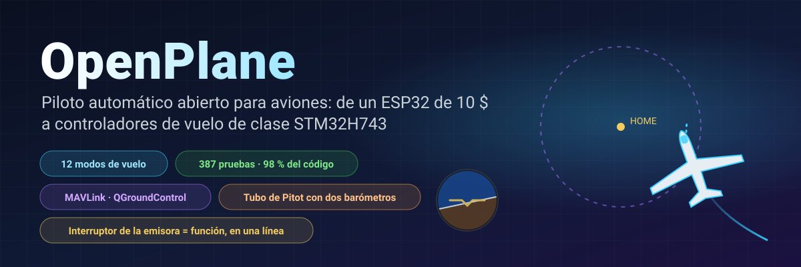
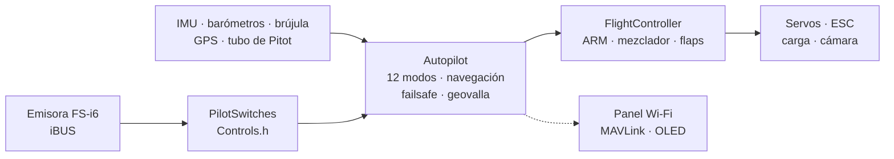

<!-- i18n-bar:start -->
  <p align="center">
    <a href="../../../README.md"> Читать на русском</a>
    &nbsp;·&nbsp;
    <a href="../en/README.md"> Read this in English</a>
    &nbsp;·&nbsp;
    <a href="../zh-CN/README.md"> 阅读中文版</a>
    &nbsp;·&nbsp;
     <b>Lee esto en español</b>
  </p>
  <p align="center">
    <a href="../hi/README.md"> हिन्दी में पढ़ें</a>
    &nbsp;·&nbsp;
    <a href="../ar/README.md"> اقرأ بالعربية</a>
    &nbsp;·&nbsp;
    <a href="../pt-BR/README.md"> Leia em português</a>
    &nbsp;·&nbsp;
    <a href="../fr/README.md"> Lire en français</a>
  </p>
  <p align="center">
    <a href="../de/README.md"> Auf Deutsch lesen</a>
    &nbsp;·&nbsp;
    <a href="../ja/README.md"> 日本語で読む</a>
    &nbsp;·&nbsp;
    <a href="../ko/README.md"> 한국어로 읽기</a>
  </p>
<!-- i18n-bar:end -->

<p align="center"><sub>🌐 Traducción del <a href="../../../README.md">README en ruso</a>. La documentación detallada también está traducida y los enlaces de abajo llevan a las páginas traducidas. Si la traducción y el original difieren, prevalece el original. Los mensajes de la consola, las capturas y los gráficos siguen mostrando textos en ruso. La traducción la ha hecho una IA y no la han revisado hablantes nativos. Si encuentras errores, escribe a <a href="https://github.com/damir-lebedev">Damir Lebedev</a> o abre una <a href="https://github.com/damir-lebedev/OpenPlaneProject/issues">incidencia</a>.</sub></p>

<p align="center">
  
</p>

<p align="center">
  
  
  
  <br>
  
  
  
  <a href="LICENSE.md"></a>
</p>

<h3 align="center">Apagas la emisora: el avión vuelve solo a casa y da vueltas sobre tu cabeza.</h3>
<p align="center">Esto no es un dibujo animado: <b>todo el firmware</b> pilota un modelo de avión en lazo cerrado, con los mismos bytes iBUS a la entrada y el mismo PWM a la salida.</p>

<p align="center">
  
</p>

---

## ⚡ En 30 segundos

| | |
|---|---|
| **Qué es** | Un controlador de vuelo y piloto automático abiertos para aviones de radiocontrol. La placa principal es la STM32H743 (una placa de la clase Pixhawk): en una placa DevEBox el firmware **ya está en marcha y se pilota con la emisora** ([hay vídeo](#-la-stm32h743-cobra-vida-en-la-placa)), y ahora se están conectando los sensores. La base anterior es un ESP32-S3 de unos 10 $, que pasó el banco con todos los sensores. |
| **Qué hace** | 12 modos de vuelo: desde la estabilización hasta el regreso a casa, círculos por GPS, lanzamiento a mano, aterrizaje automático y **vuelo a vela en térmicas**. Un tubo de Pitot hecho con dos barómetros baratos. Telemetría MAVLink para QGroundControl y Mission Planner. |
| **Lo principal** | Cualquier interruptor o potenciómetro de la emisora = cualquier función. **Una línea** en `Controls.h` y SwD deja de ser RTH para convertirse en lanzamiento de carga. |
| **Por qué fiarse** | 387 pruebas automáticas (y 9 más en la propia placa, con una tarjeta SD real), el 98 % del código cubierto por pruebas, 24 compilaciones «placa × sensores» sin un solo aviso y simulaciones en lazo cerrado de cada modo. |
| **Con honestidad** | De momento solo ha volado el modo manual (el primer prototipo). La STM32H743 solo se ha probado en el banco, sin sensores. El piloto automático se ha verificado en el banco, con pruebas y con simulaciones, y está a la espera de los ensayos en vuelo: [estado más abajo](#-estado-real). |

---

## 🎛️ Un interruptor = una función. Una línea.

```cpp
// include/config/Controls.h
constexpr Binding BINDINGS[] = {
    Bind::modes  (Channels::SWC, MODE_MANUAL, MODE_STABILIZE, MODE_AUTO_TAKEOFF),
    Bind::feature(Channels::SWB, Feature::FLAPS),
    Bind::mode   (Channels::SWD, MODE_RTH),              // a casa, mientras esté activado
    Bind::knob   (Channels::VRA, Knob::STAB_GAIN),       // «más suave / más duro» en pleno vuelo
    Bind::knob   (Channels::VRB, Knob::CRUISE_SPEED),
};
```

¿Quieres el vuelo a vela en térmicas en SwD en lugar de RTH? `Bind::mode(Channels::SWD, MODE_SOARING)`. ¿Lanzamiento de carga en SwB? `Bind::feature(Channels::SWB, Feature::PAYLOAD_DROP)`. Si te equivocas (por ejemplo, si asignas dos modos al mismo interruptor o te quedas con un stick), **la compilación no pasará**: la tabla la comprueba el compilador (`static_assert`). Al encenderse, el avión imprime por sí mismo qué hay en cada interruptor.

**12 modos · 10 funciones · 7 potenciómetros**, todo con ejemplos en la [referencia del piloto automático](AUTOPILOT_GUIDE.md).

---

## ✈️ Qué sabe hacer el piloto automático

| | Modo | En esencia |
|---|---|---|
| 🕹️ | **MANUAL** | superficies de control = sticks, como sin controlador de vuelo |
| 🧭 | **STABILIZE** | el stick fija el ángulo; lo sueltas y el avión se nivela solo |
| 📏 | **ALT_HOLD** | + mantiene la altitud con el barómetro |
| 🌀 | **ACRO** | el stick fija la velocidad de giro, para acrobacia |
| 🛣️ | **CRUISE** | rumbo, altitud y velocidad se mantienen solos; los sticks solo corrigen |
| ⭕ | **LOITER** | círculos sobre un punto GPS (el radio se ajusta con un potenciómetro) |
| 🏠 | **RTH** | a casa a 40 m y círculos sobre tu cabeza; se activa solo si se pierde la señal |
| 🛫 | **AUTO_TAKEOFF** | despegue desde la pista con el acelerador del piloto |
| 🤾 | **LAUNCH** | lanzamiento a mano: el motor arranca tras el lanzamiento y comienza el ascenso |
| 🛬 | **AUTO_LAND** | planeo y recogida cerca del suelo |
| 🦅 | **SOARING** | motor apagado; encuentra térmicas y da vueltas en ellas |
| 🆘 | **RESCUE** | «¡socorro!»: alas niveladas y morro arriba, desde cualquier espiral |

Además: geovalla, autotrim para un avión «torcido», coordinación de virajes, protección contra la pérdida de sustentación con el tubo de Pitot, flaps y aerofreno, lanzamiento de carga, cámara estabilizada y un zumbador de «búscame en la hierba».

---

## 📈 Cada modo vuela, en lazo cerrado

No es «una función devolvió un número», sino un **vuelo**: emisora → trama iBUS → firmware → PWM → deflexión de las superficies de control → modelo de avión con sustentación, pérdida, viento y térmicas → sensores → de nuevo el firmware. 14 vuelos así forman parte de las pruebas habituales (`pio test -e native`).

<p align="center"></p>

<table>
  <tr>
    <td width="50%"></td>
    <td width="50%"></td>
  </tr>
  <tr>
    <td>🦅 Encontró una térmica por sí solo y ganó altura <b>con el motor apagado</b>: el variómetro de energía total no confunde «stick atrás» con una corriente ascendente.</td>
    <td>🆘 Alabeo de 60° y, unos segundos después, horizonte nivelado. RESCUE saca al avión de una espiral con 70° de alabeo y −40° de morro.</td>
  </tr>
  <tr>
    <td></td>
    <td></td>
  </tr>
  <tr>
    <td>🤾 Lanzamiento a mano → el motor arranca solo cuando la mano se ha alejado de la hélice → ascenso. 🛬 Aterrizaje: planeo y recogida a 3 m.</td>
    <td>🌬️ Velocidad del aire con un tubo hecho de dos barómetros <b>ruidosos</b>, con un desfase de 150 Pa entre los chips: el error es inferior a 0.5 m/s.</td>
  </tr>
</table>

---

## 🌬️ Un tubo de Pitot por cuatro duros

Un buen sensor de velocidad del aire cuesta como la mitad de un controlador de vuelo. Aquí hay **dos barómetros**: un BMP581 en el tubo (presión total) y el barómetro principal en el fuselaje (presión estática). El firmware pone a cero en tierra la diferencia entre los chips, filtra, calcula la densidad del aire a partir de la altitud y la temperatura y detecta si las mangueras están intercambiadas. Qué se consigue: CRUISE mantiene la velocidad **del aire**, no el acelerador; protección contra la pérdida de sustentación; una velocidad fiable en la telemetría. El montaje se explica en la [referencia](AUTOPILOT_GUIDE.md#un-tubo-de-pitot-casero).

---

## 📡 Estación de tierra: navegador o QGroundControl

<table>
  <tr>
    <td width="46%"></td>
    <td>
      <b>ESP32: un panel web directamente desde el avión.</b> Punto de acceso <code>OpenPlane-Debug</code>, dirección <code>192.168.4.1</code>: canales de la emisora, salidas, todos los sensores, modo, navegación, cambio de modo y ajuste del PID sobre la marcha. Sin aplicaciones ni hardware adicional.<br><br>
      <b>STM32H743: MAVLink por radiomódem.</b> QGroundControl y Mission Planner ven el avión como un avión ArduPilot: horizonte, mapa con el punto de origen, velocidad según el tubo de Pitot, modos con los nombres de ArduPlane, PID desde la ventana de parámetros y cambio de modo con un botón. El ARM desde tierra no es posible, solo con un interruptor: es más seguro.<br><br>
      Las tramas MAVLink se han comparado byte a byte con la referencia <code>pymavlink</code>.
    </td>
  </tr>
</table>

---

## 📼 Caja negra

La placa graba cada vuelo: IMU a 500 Hz, ángulos y decisiones del piloto automático, PID, todas las salidas, sticks, barómetro, brújula, GPS, batería y eventos, desde el ARM y el acelerador hasta el aterrizaje, con 10 segundos antes del inicio. La **ESP32-S3** graba en su flash integrada (13.9 MB, unos 11 minutos); la **STM32H743**, en una tarjeta SD (64 MB, aproximadamente una hora; la tarjeta sigue siendo una FAT32 normal y el firmware escribe en un archivo creado de antemano, `BLACKBOX.BIN`). El borrado solo se hace en tierra. Después del vuelo, `python tools/blackbox.py download` descarga el vuelo por USB y lo desglosa en CSV; los vuelos de la tarjeta SD también se pueden descodificar sin la placa: `python tools/blackbox.py ring E:/BLACKBOX.BIN`. Más detalles: [BLACKBOX.md](BLACKBOX.md).

---

## 🔩 Hardware: un firmware, cuatro placas, doce sensores

| Placa | Estado | Qué se ha comprobado |
|---|---|---|
| **STM32H743VIT6** | ✅ principal · 🔧 DevEBox, conectando sensores + 🧪 pruebas | en la placa: arranque, consola por USB, **tarjeta SD y caja negra** (pruebas en la placa), **recepción iBUS, ARM y control de servos y motor desde la emisora** (el arranque está en vídeo); en el PC, todo el firmware: tareas FreeRTOS, flash, MAVLink, I2C y SPI. Aún no se han conectado sensores a la placa |
| **ESP32-S3 N16R8** | ✅ antigua principal, en el banco | todos los sensores, servos, iBUS, OLED y panel web en vivo; el firmware completo, en pruebas |
| **ESP32 38-pin** | 🧪 pruebas | el firmware completo en pruebas con el kit ICM-45686 |
| **ESP32-C3 SuperMini** | ✈️ ha volado (manual) | el primer prototipo; compilación de todos los kits |

| Sensor | Qué es | Buses |
|---|---|---|
| **LSM6DSV** + **QMC6309** | IMU + brújula (módulo) | I2C / SPI |
| **ICM-45686** + **QMC6309** | IMU + brújula (alternativa) | I2C / SPI |
| **SPL06-001** | barómetro del fuselaje | I2C / SPI |
| **BMP581** | barómetro principal y barómetro del tubo de Pitot | I2C / SPI |
| MPU6050/6500, ICM-42688, BMP388, BME280, QMC5883P/L | de banco y anteriores | I2C / SPI |
| **u-blox M10** | GPS, 10 Hz, UBX | UART |

El sensor se cambia con una sola línea (`SENSOR_KIT_LSM6DSV_PITOT`) y la placa, con una sola opción de compilación. Las 4 placas × 6 kits de sensores se compilan sin avisos: [`tools/build_matrix.sh`](../../../tools/build_matrix.sh).

<table>
  <tr>
    <td width="50%"></td>
    <td width="50%"></td>
  </tr>
  <tr>
    <td>Banco con la ESP32-S3: IMU, barómetro, brújula, OLED, servos, receptor.</td>
    <td>Prueba del grupo motor-hélice.</td>
  </tr>
</table>

### 🎥 La STM32H743 cobra vida en la placa

El firmware de la STM32H743 se ejecuta en una placa DevEBox **sin un solo sensor** y se pilota con una emisora normal: el receptor iBUS, el ARM, los servos y el motor responden a los sticks y a los interruptores en modo manual. Todo el arranque quedó grabado en vídeo.

▶️ **[Ver el arranque en vídeo](https://t.me/lisnmylife/420)**

Lo que esto demuestra: la cadena «emisora → iBUS → firmware → PWM» funciona en hardware real y no solo en las pruebas. Lo que aún no está demostrado: a esta placa no se le han conectado sensores (IMU, barómetro, GPS), así que los modos del piloto automático todavía no se han probado en ella.

---

## 🧪 Calidad que se puede comprobar

| | |
|---|---|
| **387 pruebas automáticas** | módulos, controladores comprobados a nivel de registros del chip, vuelos en lazo cerrado, el firmware de ESP32 y STM32 **completo** en el PC; además, 9 pruebas en la propia placa STM32 con una tarjeta SD real |
| **98.3 % de líneas, 87.7 % de ramas** | cobertura de `gcovr`, incluido el código de STM32 |
| **24/24 compilaciones** | 4 placas × 6 kits de sensores, `-Wall -Wextra`, cero avisos |
| **0 observaciones** | cppcheck y clang-tidy sobre todo el código |
| **Referencias, no copias de código** | las fórmulas de los sensores siguen las hojas de datos (Bosch, ST, TDK, Goertek) y MAVLink sigue pymavlink |

```bash
pio test -e native -e native-stm32   # todas las pruebas, ~1.5 minutos, sin hardware
```

Más detalles: [TESTING.md](TESTING.md).

---

## 🧠 Cómo está hecho



- **C++ solo con cabeceras (header-only)**, una única unidad de traducción, sin memoria dinámica en el lazo de vuelo. ¿Prefieres `.h/.cpp`? Para ti hay una rama paralela, [`feature/split-headers`](https://github.com/damir-lebedev/OpenPlaneProject/tree/feature/split-headers): se genera desde esta con un script, y el firmware con LTO ocupa lo mismo.
- **HAL**: la única capa que conoce el microcontrolador; una placa nueva es un `Board` nuevo, no un piloto automático reescrito.
- **El controlador de un sensor no conoce el bus**: una misma clase funciona tanto por I2C como por SPI.
- **La seguridad, por el orden de las operaciones**: pérdida de señal > ARM > modo > acelerador; ningún modo puede pasar el acelerador por encima del ARM.

Más detalles: [ARCHITECTURE.md](ARCHITECTURE.md).

---

## 🚀 Inicio rápido

```bash
pip install platformio
git clone https://github.com/damir-lebedev/OpenPlaneProject && cd OpenPlaneProject
pio run -e stm32h743-devebox -t upload                    # DevEBox H743: USB DFU, consola por USB
pio run -e esp32-s3 -t upload && pio device monitor     # ESP32-S3
pio run -e stm32h743 -t upload                            # STM32H743 (ST-Link)
```

DevEBox: la placa no tiene botón BOOT0; antes de la primera carga, une el pin BT0 con 3V3 y pulsa RST. Después, la tecla `D` de la consola reinicia la placa en el cargador de arranque por sí sola ([más detalles](DEVELOPER_GUIDE.md#stm32h743)).

En el monitor serie: `h`, menú; `b`, qué chips se ven en los buses; `s`, sensores; `p`, prueba de las salidas (¡quita la hélice!). Después, la [guía del piloto](PILOT_GUIDE.md).

---

## 🟢 Estado real

| Qué | Dónde se ha comprobado |
|---|---|
| Control manual, mezclador | ✈️ en vuelo (primer prototipo, C3) |
| ARM, failsafe, flaps, servos, motor | 🔧 en el banco (S3) |
| STABILIZE | 🔧 en el banco: las superficies de control responden a las inclinaciones en el sentido correcto |
| Sensores del banco (MPU6500, BMP388, QMC5883P), OLED, panel web | 🔧 en el banco |
| Resto de modos, navegación, tubo de Pitot, MAVLink | 🧪 pruebas y simulaciones en lazo cerrado |
| Sensores nuevos (LSM6DSV, ICM-45686, QMC6309, SPL06, BMP581) | 🧪 emuladores de registros según las hojas de datos |
| STM32H743: tarjeta SD, caja negra, consola por USB | 🔧 en la placa DevEBox (pruebas en la placa) |
| STM32H743: iBUS, ARM, PWM a servos y motor, control manual | 🔧 en la placa sin sensores, grabado en vídeo |
| STM32H743: sensores (IMU, barómetro, brújula, GPS) y modos del piloto automático | 🧪 todo el firmware en el PC; aún no hay sensores conectados a la placa |

El modelo de avión de las simulaciones está simplificado y los coeficientes son valores iniciales. Cada modo nuevo se prueba primero en altura, con el dedo sobre el interruptor MANUAL.

---

## 🗺️ Hoja de ruta

- [x] Control manual, ARM, failsafe, firmware orientado a objetos, panel web
- [x] Banco con la ESP32-S3 y todos los sensores, en vivo
- [x] 12 modos, navegación por GPS, RTH al perder la señal, geovalla
- [x] Interruptores y potenciómetros en una línea, lanzamiento de carga, cámara, autotrim
- [x] Tubo de Pitot con dos barómetros, protección contra la pérdida de sustentación
- [x] Sensores nuevos: LSM6DSV, ICM-45686, QMC6309, SPL06, BMP581
- [x] STM32H743: firmware completo, MAVLink, ajustes en la flash
- [x] Simulaciones en lazo cerrado de todos los modos, todo el firmware en las pruebas
- [x] Caja negra: vuelos en la flash (ESP32-S3) y en una tarjeta SD (STM32H743), descarga y descodificación a CSV
- [x] La STM32H743 funciona en la placa: emisora → iBUS → servos y motor (sin sensores, en vídeo)
- [ ] STM32H743: conectar los sensores y pasar el banco igual que con la ESP32-S3
- [ ] Ensayos en vuelo del piloto automático con el nuevo avión
- [ ] Una placa de controlador de vuelo propia ([FC_BOARD.md](FC_BOARD.md)) con la STM32H743
- [ ] Vuelo por puntos de ruta, misiones MAVLink
- [ ] Realimentación adaptativa (el prototipo ya está verificado en simulación)
- [ ] Sensor de corriente y de batería, telemetría a la emisora (iBUS-SENS)
- [ ] Reparto autónomo: ruta → lanzamiento de carga → casa

Más detalles: [ROADMAP.md](ROADMAP.md).

---

## 💼 Para socios e inversores

Los aviones pequeños de reparto y de vigilancia son plataformas cerradas y caras o proyectos de aficionados dispersos. OpenPlane apunta al punto intermedio: **un piloto automático abierto y verificable sobre hardware de gran consumo**, donde cada función está cubierta por pruebas y puede adaptarse a una tarea: reparto de medicamentos a lugares de difícil acceso, vigilancia de campos y bosques, operaciones de búsqueda.

Lo que ya se ha hecho con recursos propios: una arquitectura que se traslada de una placa a otra sin reescribirse; un piloto automático con un conjunto completo de modos; una infraestructura de pruebas en la que las funciones nuevas aparecen rápido y no rompen las antiguas. Lo que se aceleraría con más recursos: los ensayos en vuelo, una placa de controlador de vuelo propia con la STM32H743, el vuelo por puntos de ruta y el lanzamiento de carga. Adónde y para qué: [ROADMAP.md](ROADMAP.md).

---

## 📚 Documentación

| Documento | Para quién |
|---|---|
| [AUTOPILOT_GUIDE.md](AUTOPILOT_GUIDE.md) | el piloto: cada modo, función y potenciómetro, cómo asignarlos a un interruptor, el tubo de Pitot, la estación de tierra |
| [PILOT_GUIDE.md](PILOT_GUIDE.md) | montaje, asignación de pines, emisora, failsafe, primer vuelo |
| [DEVELOPER_GUIDE.md](DEVELOPER_GUIDE.md) | el desarrollador: archivos, convenio de signos, API, cómo añadir un sensor, un modo o una placa |
| [ARCHITECTURE.md](ARCHITECTURE.md) | capas, tareas, el ciclo de control, máquinas de estados |
| [TESTING.md](TESTING.md) | pruebas, simulaciones, cobertura, análisis |
| [reference/](reference/README.md) | referencia de cada clase |
| [FC_BOARD.md](FC_BOARD.md) · [ROADMAP.md](ROADMAP.md) | la placa del controlador de vuelo · hacia dónde va el proyecto |
| [airframe/](airframe/README.md) | la estructura del Astro-Cargo: proyecto de Fusion 360 y archivos STL para imprimir, fallos conocidos de la versión v2 |

> **Proyecto relacionado:** [esp32-rc-joystick](https://github.com/damir-lebedev/esp32-rc-joystick): la emisora FS-i6 como joystick USB para el simulador, en la misma ESP32-S3. Primero se acumulan horas en el simulador y después, en el campo.

---

## 🤝 Participación

Hacen falta manos y cabezas: aerodinámica y aeromodelismo, impresión 3D y resistencia de materiales, C++ embebido, sensores y pilotos automáticos, interfaces de tierra. Las issues y los pull requests van a la rama `main`; empieza por [DEVELOPER_GUIDE.md](DEVELOPER_GUIDE.md).

## 📜 Licencia

La [OpenPlane License](LICENSE.md) es una licencia basada en MIT con condiciones adicionales. El código, la documentación y los archivos del modelo se pueden usar, copiar, modificar y vender, también en productos comerciales. Las condiciones son estas:

1. **Menciona al autor: Damir Lebedev (Damn / Проклятый).** El nombre debe aparecer donde lo vean los usuarios de tu producto: en la documentación, en el README o en una página «Acerca de». Conserva el texto de la licencia junto con el código.
2. **Se prohíbe el uso militar.** No se puede usar el proyecto para ejércitos ni organizaciones paramilitares, ni en la guerra, ni para crear armas, municiones o sistemas de entrega y de designación de objetivos.
3. **No se puede dañar intencionadamente a personas ni bienes sin su consentimiento previo por escrito para ese daño.** Puedes romper tu propio equipo si no amenaza a nadie: por ejemplo, disparar con una pistola de aire comprimido a tu propio dron. Mutilar o matar a personas no está permitido.
4. **Respeta las normas de seguridad y la ley** al montar, probar y volar.

Si se incumplen las condiciones, el permiso de uso queda sin efecto. Por las prohibiciones de ciertos usos, esta no es una licencia «abierta» en el sentido de la OSI: el código se puede leer, copiar y modificar, pero formalmente el proyecto es de código disponible (source-available), no de código abierto (open source).

Solo tiene fuerza jurídica el texto en inglés del archivo [LICENSE](LICENSE.md): las traducciones de la licencia a otros idiomas se ofrecen para mayor comodidad.

El firmware controla una aeronave y no está certificado. Todo lo que hagas con él es bajo tu propia responsabilidad; el autor no asume ninguna.

```text
OpenPlane © 2026 Damir Lebedev (Damn / Проклятый) — https://github.com/damir-lebedev/OpenPlaneProject
```

<p align="center"><i>El primer prototipo se rompió en su primer vuelo; por eso aquí todo está a la vista: código, pruebas, problemas. Constrúyelo, rómpelo y arréglalo con nosotros.</i></p>
