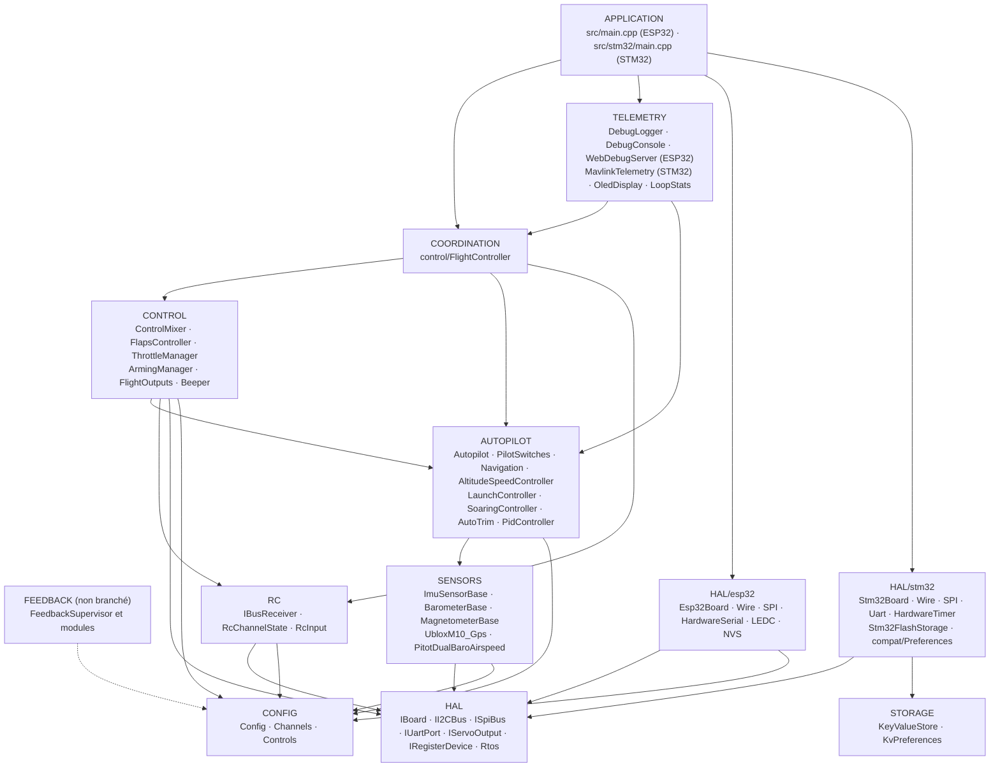
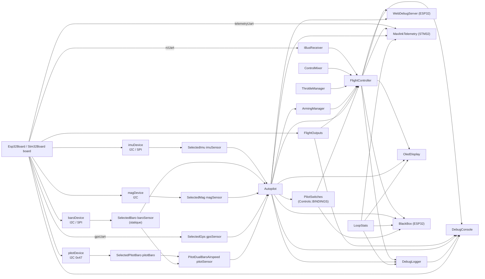
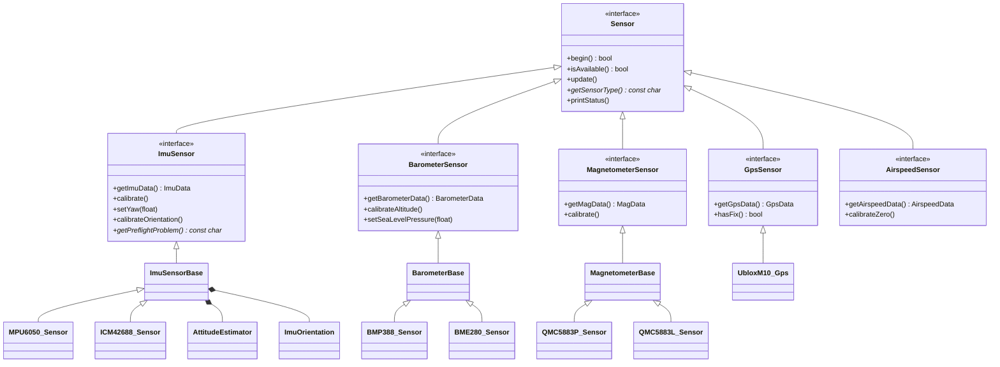
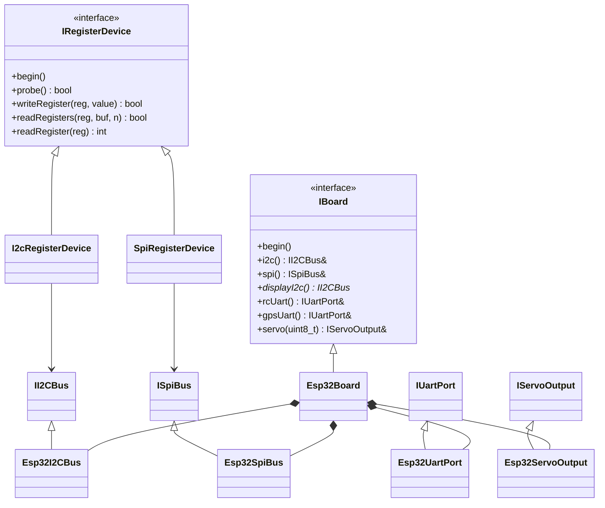
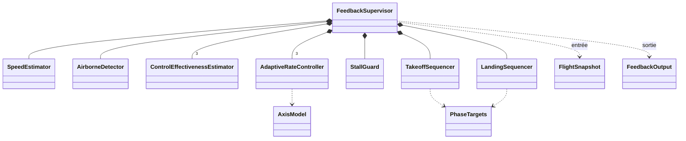
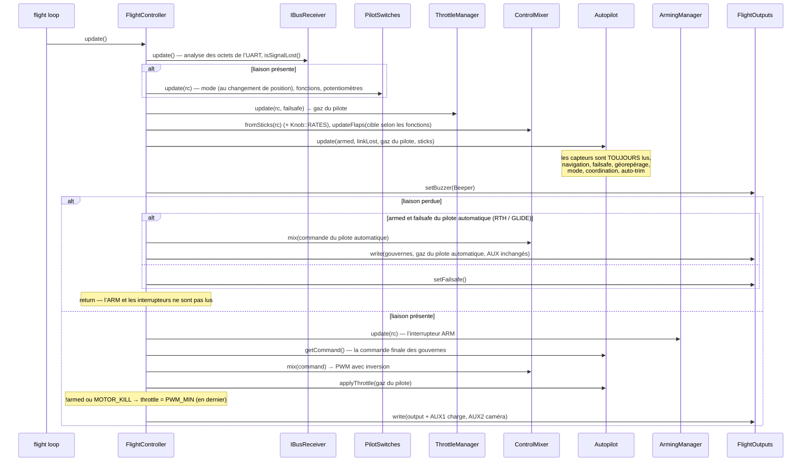
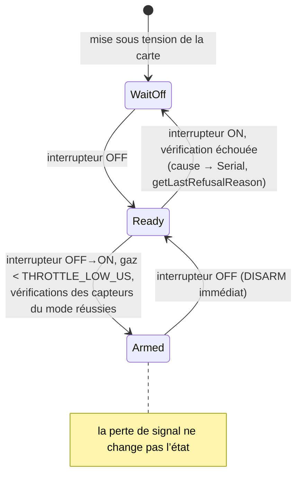
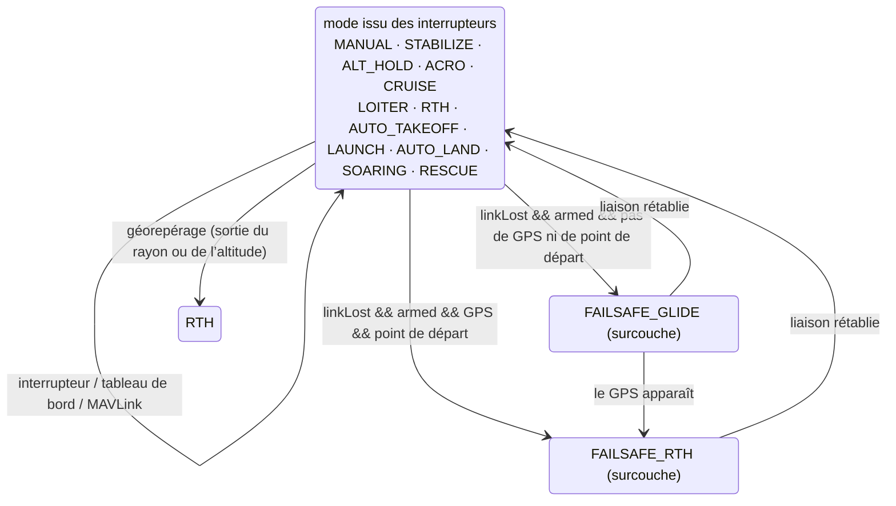
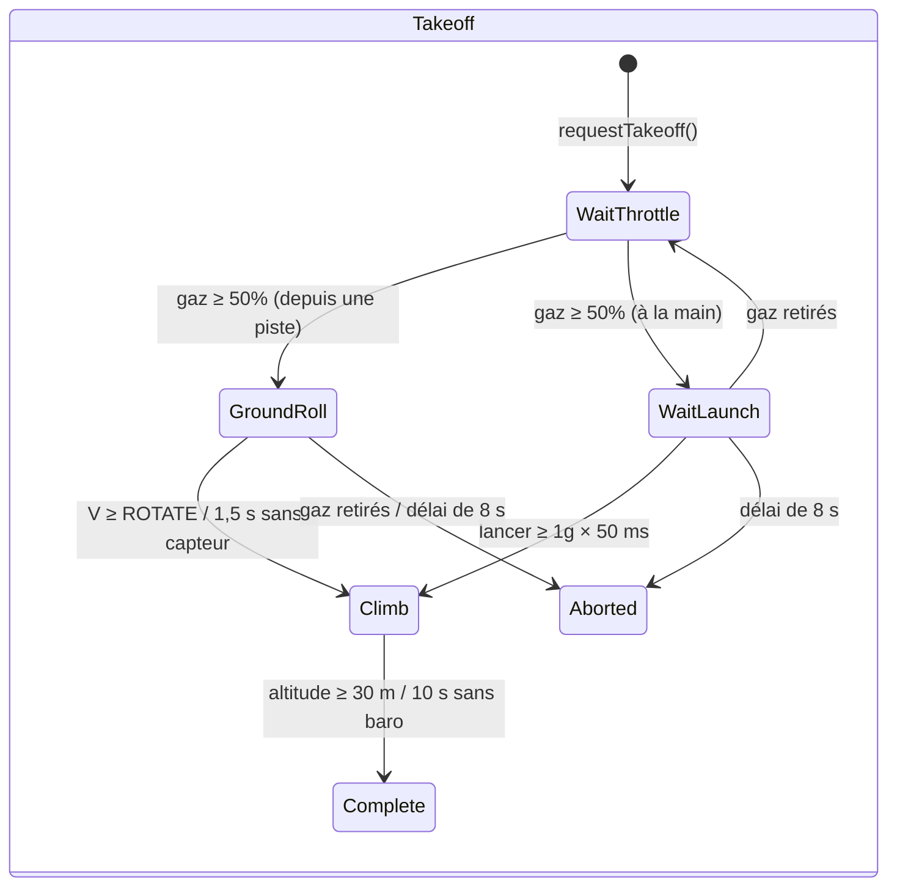
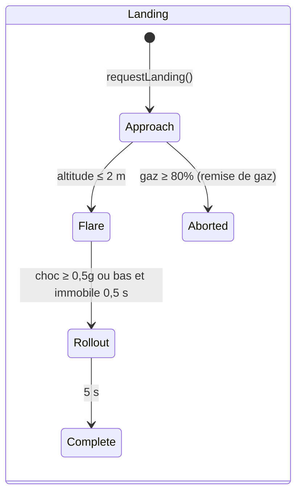

# ARCHITECTURE.md — l’architecture du firmware d’OpenPlaneProject

> 🌐 Cette page est la traduction de l’[original en russe](../../ARCHITECTURE.md). En cas de divergence entre la traduction et l’original, c’est l’original qui fait foi. Le firmware affiche les messages de la console en russe ; ils sont donc cités tels quels.

Ce document décrit **comment est organisé le firmware dans son ensemble** : les couches et les règles de dépendance entre elles, le graphe d’objets, le modèle de tâches FreeRTOS, l’ordre des opérations à chaque cycle, les machines à états, la stratégie de tolérance aux pannes des capteurs et les points d’extension. Une référence détaillée de chaque classe (API publique, champs, invariants) se trouve dans [`reference/`](reference/README.md).

Documents associés :

| Document | De quoi il traite |
|---|---|
| [`DEVELOPER_GUIDE.md`](DEVELOPER_GUIDE.md) | Guide pratique : la convention de signes, l’API HTTP, la console, comment ajouter un capteur, un mode ou une carte |
| [`reference/`](reference/README.md) | Référence de toutes les classes, structures et espaces de noms |
| [`TESTING.md`](TESTING.md) | Tests : natifs (sur PC, avec couverture) et sur la carte |
| [`PILOT_GUIDE.md`](PILOT_GUIDE.md) | Assemblage, brochage, radio, premier vol |
| [`ROADMAP.md`](ROADMAP.md) | Où va le projet |

> État : le banc avec l’ESP32-S3 est vérifié avec tous les capteurs, **le pilote automatique n’a pas été éprouvé en vol**, et la boucle de rétroaction (`autopilot/feedback/`) **n’est pas branchée** au firmware et n’est vérifiée que par simulation.

---

## Sommaire

1. [Principes](#1-principes)
2. [Couches et règles de dépendance](#2-couches-et-règles-de-dépendance)
3. [Le graphe d’objets (composition root)](#3-le-graphe-dobjets-composition-root)
4. [Hiérarchies de classes](#4-hiérarchies-de-classes)
5. [Tâches FreeRTOS et séparation des données](#5-tâches-freertos-et-séparation-des-données)
6. [Le cycle de contrôle : `FlightController::update()`](#6-le-cycle-de-contrôle-flightcontrollerupdate)
7. [Machines à états](#7-machines-à-états)
8. [Tolérance aux pannes : capteurs, liaison, sorties](#8-tolérance-aux-pannes-capteurs-liaison-sorties)
9. [Configuration et variantes de compilation](#9-configuration-et-variantes-de-compilation)
10. [La boucle de rétroaction (non branchée)](#10-la-boucle-de-rétroaction-non-branchée)
11. [Points d’extension](#11-points-dextension)
12. [Testabilité](#12-testabilité)

---

## 1. Principes

| Principe | Comment c’est réalisé |
|---|---|
| **C++ uniquement en en-têtes** | Toutes les classes sont définies dans les en-têtes de `include/<couche>/`. La seule unité de traduction du firmware est `src/main.cpp` (ESP32) ou `src/stm32/main.cpp` (STM32). Aucune mémoire dynamique dans la boucle de vol (les chaînes `String` ne servent que dans le serveur web et l’OLED). Une variante scindée en `.h/.cpp` se trouve dans une branche à part, `feature/split-headers` : elle est générée par `tools/split_headers.py`, et les différences et tailles du firmware figurent dans son `docs/SPLIT_HEADERS.md`. |
| **Composition root** | `src/main.cpp` / `src/stm32/main.cpp` est le seul endroit où les objets sont créés et reliés par des références/pointeurs. Il ne contient aucune logique de vol. |
| **Une ligne — un interrupteur** | Ce que fait chaque canal de la radio est défini par la table `config/Controls.h` (`Bind::modes/mode/feature/knob`), vérifiée par `static_assert` à la compilation. |
| **Inversion des dépendances** | Les couches supérieures dépendent d’interfaces (`IBoard`, `IRegisterDevice`, `ImuSensor*`, …), et non de puces et de MCU précis. |
| **Dépendances nullables** | Le pilote automatique, les interrupteurs (`PilotSwitches`) et tous les capteurs sont transmis par pointeurs et peuvent valoir `nullptr` : sans capteur, le mode se comporte de façon sûre au lieu de planter. |
| **Sécurité par priorité** | L’ordre des opérations dans le cycle est la priorité : perte de signal > ARM > sticks/pilote automatique > gaz. La vérification de l’ARM sur les gaz vient en dernier. |
| **Une seule convention de signes** | De l’IMU au servo, des signes aéronautiques ; le sens de chaque servo est défini à un seul endroit (`Config::*_REVERSED`). |
| **Le temps en paramètre** | Chaque fois que c’est possible (volets, modules de rétroaction), le temps est passé en argument au lieu d’être lu depuis `millis()` — ce qui rend les classes déterministes et testables. |
| **Diagnostic honnête** | Chaque capteur et chaque sortie distinguent « absent de la compilation » (`attached`) de « présent mais ne répond pas » (`available`) ; cela se voit dans le JSON, dans le journal et sur l’OLED. |

---

## 2. Couches et règles de dépendance



Les règles :

1. **La HAL est la seule couche qui connaisse le MCU.** Seuls `include/hal/esp32/` et `include/hal/stm32/` incluent `<Wire.h>`, `<SPI.h>`, `HardwareSerial`, et appellent `ledc*` / `HardwareTimer` / la flash. Les tâches FreeRTOS sont créées via `hal/Rtos.h` (le cœur 0 sur l’ESP32, une priorité sur la STM32). Stockage des réglages : le code écrit `<Preferences.h>` — sur l’ESP32, c’est la NVS ; sur la STM32, c’est `hal/stm32/compat/Preferences.h` au-dessus de `storage/KeyValueStore.h`. Une exception délibérée : `SpiRegisterDevice` commute le CS avec les `pinMode/digitalWrite` standard d’Arduino (identiques sur l’ESP32 et la STM32).
2. **Les pilotes de capteurs ne connaissent pas le bus.** Ils reçoivent un `IRegisterDevice&` (une adresse I2C ou un CS SPI) ou un `IUartPort&`. Le bus est choisi dans `sensors/SensorSelection.h`.
3. **RC et Outputs ne savent rien de l’avion** : octets iBUS → canaux ; valeurs PWM → sorties.
4. **Control et Autopilot** sont de la logique pure sur des données : ni UART, ni PWM, ni Wi-Fi.
5. **Coordination** (`FlightController`) est la seule classe qui voie plusieurs couches inférieures à la fois et décide de l’ordre des opérations.
6. **Telemetry** ne fait que lire l’état par des accesseurs constants ; les commandes du tableau de bord passent par une « boîte aux lettres » et sont appliquées par la boucle de vol ; MAVLink (`MavlinkTelemetry`) travaille directement dans la boucle de vol et applique lui-même les commandes.
7. **Une couche inférieure n’inclut jamais une couche supérieure.** Si une classe inférieure a besoin d’une classe supérieure, la logique est remontée dans `FlightController`.

`ArmingManager` (CONTROL) lit le mode depuis `Autopilot` — c’est la seule dépendance horizontale CONTROL → AUTOPILOT : les vérifications de l’ARM dépendent des capteurs dont le mode choisi a besoin.

---

## 3. Le graphe d’objets (composition root)

Tous les objets sont des globaux à durée de stockage statique, créés dans `src/main.cpp`. Les références et les pointeurs entre eux sont **non propriétaires** ; l’ordre de construction coïncide avec l’ordre de déclaration (une seule unité de traduction).



L’ordre d’initialisation dans `setup()` :

```
Serial (ESP32 : tampon TX de 4 Ko ; STM32 : SERIAL_TX_BUFFER_SIZE=1024), 115200 → bannière
board.begin()               — bus I2C/SPI (le second I2C, s’il existe)
flightOutputs.begin()       — canaux PWM ; aussitôt setFailsafe()
[STM32] réglages depuis la flash — KeyValueStore::mount(), CRC de l’image
setupSensors()              — begin() de chaque capteur ; étalonnage de ceux qui ont répondu :
                              IMU (2 s immobile + vérification avant vol),
                              baro (altitude zéro), boussole (cap initial → yaw de l’IMU),
                              tube de Pitot (le zéro est relevé pendant la première seconde du cycle)
autopilot.begin()           — trim depuis la NVS/la flash
flightController.begin()    — setFailsafe() + UART iBUS
oledDisplay.begin(...)      — sa propre tâche (hal/Rtos.h)
[ESP32] webDebugServer.begin() — point d’accès + sa propre tâche sur le cœur 0
[ESP32] blackBox.begin()   — la partition blackbox, une file en PSRAM, la tâche bbox sur le cœur 0
[STM32] mavlink.begin()     — UART4 du modem radio
[STM32] setupBlackBox()    — carte SD, le fichier BLACKBOX.BIN, blackBox.begin(), la tâche bbox
pilotSwitches.printBindings() — ce qu’il y a sur chaque interrupteur
debugLogger.begin()         — réglages du journal
[STM32] tâches flight / storage → vTaskStartScheduler()
```

---

## 4. Hiérarchies de classes

### Capteurs



Les classes de base (`ImuSensorBase`, `BarometerBase`, `MagnetometerBase`) implémentent le patron **Template Method** : les `update()`/`calibrate()` publics sont écrits une seule fois, et le pilote de la puce n’implémente que les « primitives » protégées (`readSample()`, `isNewSampleReady()`, `readRaw()`, les échelles).

### HAL



### La boucle de rétroaction



---

## 5. Tâches FreeRTOS et séparation des données

**ESP32** (deux cœurs, FreeRTOS est intégré au cœur Arduino) :

| Cœur | Tâche | Ce qu’elle fait | Période |
|---|---|---|---|
| 1 | Arduino `loopTask` → `loop()` | `WebDebugServer::applyPendingCommands()` → `FlightController::update()` → `DebugLogger::update()` → `DebugConsole::update()` → `LoopStats::record()` → `BlackBox::update()` | `Config::LOOP_PERIOD_MS` = 2 ms (500 Hz), `vTaskDelayUntil` |
| 0 | `web` (8 Ko de pile, priorité 1) | `WebServer::handleClient()` | toutes les 2 ms (`vTaskDelay`) |
| 0 | `oled` (4 Ko de pile, priorité 1) | `OledDisplay::draw()` via le second bus I2C | 200 ms (`vTaskDelayUntil`) |
| 0 | `bbox` (6 Ko de pile, priorité 2) | `BlackBox::writerStep()` : une page de la file vers la flash ; au sol — effacement | notification depuis `loop()` après chaque cycle (sinon une fois toutes les 20 ms) |
| 0 | la pile Wi-Fi d’ESP-IDF | le point d’accès | — |

**STM32H743** (un cœur, FreeRTOS de STM32duino, préemption par priorité) :

| Priorité | Tâche | Ce qu’elle fait | Période |
|---|---|---|---|
| 5 | `flight` (16 Ko) | `FlightController::update()` → `MavlinkTelemetry::update()` → `DebugLogger::update()` → `DebugConsole::update()` → `LoopStats::record()` | 2 ms, `vTaskDelayUntil` |
| 1 | `oled` (4 Ko) | `OledDisplay::draw()` via le second bus I2C | 200 ms |
| 1 | `storage` (2 Ko) | `Stm32FlashStorage::service()` — effacement et écriture du secteur des réglages | 100 ms |
| 2 | `bbox` (8 Ko) | `BlackBox::writerStep()` : une page de la file vers la carte SD ; au sol — effacement. Elle est préemptée par la tâche de vol | notification après chaque cycle (sinon une fois toutes les 20 ms) |

**Règles de séparation des données :**

- Les tâches `web` et `oled` **ne font que lire** l’état (`FlightController`, `Autopilot`, `LoopStats`, les capteurs) par des accesseurs constants. Les champs sont des valeurs isolées de 16/32 bits, il n’y a donc pas de lecture « déchirée » ; dans le pire des cas, on voit les valeurs de cycles voisins.
- Les **commandes** du tableau de bord (`/api/setmode`, `/api/setpid`) **ne sont pas appliquées** directement depuis la tâche `web` : elles sont placées dans `PendingCommands` sous un spinlock `portMUX` et reprises par la boucle de vol dans `applyPendingCommands()` — une modification du pilote automatique se fait toujours dans le contexte de la tâche qui en est propriétaire.
- `LoopStats::hz/avgUs/maxUs` sont des `volatile uint32_t` ; `takePeakUs()` n’est appelée que depuis `loop()`.
- `OledDisplay` conserve un pointeur vers le bus dans une variable statique (le callback C d’U8g2 n’accepte pas de contexte) ; il n’y a qu’un seul écran à bord.

**Temps réel :**

- La période est tenue par `vTaskDelayUntil`, et non par un `delay()` après le travail. Après un long blocage (un étalonnage lancé depuis la console, > 100 ms), le décompte repart de zéro — les cycles manqués ne sont pas rattrapés en rafale.
- Le délai d’attente d’une transaction I2C est de 5 ms (celui de `Wire` par défaut est de 50 ms).
- `Serial` avec un tampon d’émission de 4 Ko — une ligne de journal ne bloque pas la boucle.
- Boîte noire : la boucle ne fait que mettre un instantané dans la file (spinlock, microsecondes) ; la page vers la flash (qui arrête les deux cœurs pendant ~0,6–0,9 ms) est écrite par la tâche `bbox` juste après le cycle — dans l’intervalle de la boucle. L’effacement de la flash n’a lieu que sans ARM et sans enregistrement, jamais en vol.
- ESP32 : une écriture en flash (NVS, réglages Wi-Fi) arrête les deux cœurs pendant ~0,3–0,4 s, d’où : le Wi-Fi est en `persistent(false)` ; les réglages du journal ne sont enregistrés que sans ARM ; les étalonnages, uniquement sans ARM ; l’auto-trim, après le DISARM et seulement quand l’avion est à l’arrêt (`Autopilot::looksLanded()`).
- STM32 : `Preferences::end()` ne fait que copier l’image (microsecondes), tandis que l’effacement du secteur (secondes) se déroule dans la tâche `storage`. Le secteur des réglages est dans la banque 2 de la flash, le code dans la banque 1 : la tâche de vol préempte l’écriture et continue de tourner.
- MAVLink ne bloque pas la boucle : une trame n’est envoyée que s’il y a de la place dans le tampon de l’UART (`IUartPort::availableForWrite()`), sinon elle attend le cycle suivant.

---

## 6. Le cycle de contrôle : `FlightController::update()`



Invariants clés du cycle :

- **Perte de signal** — le mode et les fonctions issus des interrupteurs ne changent pas ; l’ARM n’est ni lu ni réinitialisé ; le moteur ne fonctionne que sur décision du failsafe du pilote automatique (RTH avec moteur) ou selon `FAILSAFE_THROTTLE`.
- **Aucun mode ne peut faire passer les gaz outre l’ARM** : le `PWM_MIN` forcé pour `!armed` et `MOTOR_KILL` vient après `Autopilot::applyThrottle()`.
- **Le pilote automatique émet la commande finale** (`getCommand()`) ; dans les modes à stabilisation, les sticks sont les angles souhaités ; corrections = commande − sticks (pour le journal et le tableau de bord). Tout est dans une seule convention de signes (`ControlCommand`) jusqu’au mixeur.

---

## 7. Machines à états

### ARM (`ArmingManager`)



`WaitOff` = `armed == false && switchSeenOff == false`; `Ready` =
`armed == false && switchSeenOff == true`.

### Modes du pilote automatique (`Autopilot` + `PilotSwitches`)

Douze modes (`AutopilotTypes.h`) ; ce que fait chacun est dans [AUTOPILOT_GUIDE.md](AUTOPILOT_GUIDE.md#modes). Le mode est choisi par `PilotSwitches` d’après la table `config/Controls.h` : l’interrupteur de modes (`Bind::modes`) et les interrupteurs de « mode par-dessus » (`Bind::mode`, la ligne du haut l’emporte). `setMode()` n’est appelé que lorsque **le résultat a changé** pour les interrupteurs — c’est pourquoi un mode choisi depuis le tableau de bord ou la GCS tient jusqu’à ce que le pilote actionne un interrupteur.



Le failsafe n’est pas un `AutopilotMode` distinct, mais un indicateur posé sur le mode courant ; un retour déjà entamé n’est pas abandonné pour un plané à cause d’une brève perte du GPS ; une fois la liaison rétablie, le mode issu des interrupteurs reprend (le décollage automatique et le lancement à la main — seulement à nouveau). Machines à états internes : `LaunchController` (IDLE → READY → THROWN → CLIMB → DONE) et `SoaringController` (GLIDE → THERMAL → MOTOR_CLIMB → RETURN).

**AUTO_TAKEOFF** (selon le temps écoulé depuis le début, quand armed et gaz ≥ 1500 µs) :

| Temps | Gaz (programme) | Tangage |
|---|---|---|
| 0–1 s | progressivement de 0 → 100 % | 0° |
| 1–3 s | 100 % | +15° |
| > 3 s | 100 % | +10° |

### Décollage et atterrissage (boucle de rétroaction, non branchée)





---

## 8. Tolérance aux pannes : capteurs, liaison, sorties

### Capteurs

| Capteur | `isAvailable()` devient `false` | Ce qui se passe en cas d’échec de lecture |
|---|---|---|
| IMU (`ImuSensorBase`) | `begin()` n’a pas identifié la puce, **ou** 50 erreurs de lecture d’affilée (~0,1 s à 500 Hz) | les données ne sont pas écrasées, `errorCount++` ; une fois rétabli, il redevient disponible |
| Baromètre (`BarometerBase`) | 100 erreurs d’affilée (~0,5 s avec une interrogation toutes les 5 ms) | idem |
| Boussole (`MagnetometerBase`) | 25 erreurs d’affilée (~0,5 s à 50 Hz) | idem |
| GPS (`UbloxM10_Gps`) | aucun NAV-PVT valide **ou** le dernier est plus vieux que `GPS_TIMEOUT_US` (2 s) | — |

De plus, l’IMU dispose d’une **vérification avant vol** (`getPreflightProblem()`) : immobilité pendant l’étalonnage du gyroscope, |a| ≈ 1g, la direction « haut » correspond au montage enregistré. En cas d’échec — `Autopilot::imuReady() == false` (corrections nulles dans tous les modes, y compris le plané), et `ArmingManager` n’arme pas les modes à stabilisation.

Les consommateurs réagissent tous de la même façon : **pas de capteur (`nullptr`) ou capteur indisponible — aucun effet**, et l’avion se pilote comme en MANUAL.

### Liaison (`IBusReceiver::isSignalLost()`)

Deux indicateurs indépendants :

1. aucune trame correcte depuis plus de `RX_TIMEOUT_US` (500 ms) — ou aucune depuis la mise sous tension ;
2. les gaz dans la trame sont inférieurs à `RX_FAILSAFE_THROTTLE_US` (950 µs) — le failsafe programmé dans la radio (le FS-iA6B ne cesse pas d’envoyer des trames quand la radio est perdue).

Les trames dont le CRC est faux sont rejetées et comptées (`getBadFrameCount()`).

### Sorties

`FlightOutputs::begin()` est immédiatement suivi de `setFailsafe()` — gouvernes au neutre, moteur coupé, avant même la lecture des capteurs. Une sortie dont la broche vaut `-1` (la gouverne de direction sur la C3) n’est simplement pas branchée ; `attached` dans le JSON indique si un canal LEDC a été alloué. L’impulsion réelle sur chaque broche est vérifiée par `printPulseSelfTest()` (commande de console `p`).

---

## 9. Configuration et variantes de compilation

| Quoi | Où | Comment c’est choisi |
|---|---|---|
| Carte (broches) | `include/config/Config.h` | la macro `BOARD_ESP32_S3` / `BOARD_ESP32_C3` / `BOARD_ESP32_CLASSIC` / `BOARD_STM32H743` issue de `[env:*]` dans `platformio.ini` |
| Tous les réglages (délais d’attente, courses des gouvernes, inversions, failsafe, Wi-Fi) | `Config.h`, espace de noms `Config` | `constexpr`, en modifiant le fichier |
| Affectation des canaux RC | `include/config/Channels.h` | en modifiant le fichier |
| Capteurs et bus | `include/sensors/SensorSelection.h` | `#define SENSOR_IMU/BARO/MAG/GPS`, peut aussi être donné par une option `-D` |
| Constantes de la rétroaction | `include/autopilot/feedback/FeedbackConfig.h` | passeront dans `Config.h` lors du branchement |
| Montage de l’IMU | NVS (`imu_mpu6050` / `imu_icm42688`) ou `Config::IMU_ROTATION_CW_DEG` | commande de console `o` |
| Étalonnage de la boussole | NVS (`qmc5883p` / `qmc5883l`) | commande de console `m` |
| Réglages du journal | NVS (`debuglog`) | menu de la console `l` |
| Boîte noire | `Config.h` (`BLACKBOX_*`), la partition `blackbox` dans `partitions_blackbox.csv` | vols — `tools/blackbox.py`, menu de la console `k` |

Environnements PlatformIO :

| `env` | Rôle |
|---|---|
| `esp32-s3` (par défaut) | Le contrôleur de vol principal |
| `esp32-c3` | L’ancien prototype |
| `esp32-dev` | L’ESP32 classique, banc |
| `stm32h743` | STM32H743VIT6 : firmware complet (`src/stm32/main.cpp`), réglages en flash, MAVLink, boîte noire sur SD, FreeRTOS ; vérifié sur une carte nue — voir [reference/hal.md](reference/hal.md#implémentation-pour-le-stm32h743) |
| `stm32h743-devebox` | DevEBox H743 : pareil, console par USB CDC, téléversement par DFU ([DEVELOPER_GUIDE](DEVELOPER_GUIDE.md#stm32h743)) |
| `native` | Compilation et tests sur PC avec les fakes d’Arduino/ESP-IDF et la couverture — voir [`TESTING.md`](TESTING.md) |

---

## 10. La boucle de rétroaction (non branchée)

`include/autopilot/feedback/` est le futur remplaçant de la stabilisation par PID : le modèle d’axe `ε = b·u + a·ω + c` est appris en vol par moindres carrés récursifs (`ControlEffectivenessEstimator`), et le régulateur est une cascade angle → vitesse angulaire → accélération angulaire → gouverne à travers le modèle appris (`AdaptiveRateController`), avec par-dessus la protection contre le décrochage (`StallGuard`) et les phases de décollage et d’atterrissage.

La seule entrée est `FlightSnapshot` (un instantané par cycle), la seule sortie est `FeedbackOutput`. Les modules ne lisent directement ni les capteurs ni la radio, ils sont donc vérifiés par une simulation en boucle fermée (`test/test_feedback`) aussi bien sur PC que sur la carte.

L’ordre par cycle dans `FeedbackSupervisor::update()` :

1. vitesse et accélération longitudinale (`SpeedEstimator`), en l’air ou non (`AirborneDetector`) ;
2. apprentissage du modèle de chaque axe (seulement en l’air, IMU en vie, volets immobiles, pas de décrochage) ;
3. protection contre le décrochage (désactivée près du sol à l’atterrissage) ;
4. les cibles de la phase de décollage ou d’atterrissage ;
5. cibles ← les contraintes de la protection contre le décrochage ;
6. les régulateurs d’axes → braquages des gouvernes ; gaz (seulement avec la liaison en vie).

Le plan de branchement se trouve dans [`DEVELOPER_GUIDE.md`](DEVELOPER_GUIDE.md#plan-de-branchement).

---

## 11. Points d’extension

| Tâche | Ce qu’il faut modifier | Ce qu’il ne faut pas modifier |
|---|---|---|
| Une nouvelle puce d’une catégorie existante | un nouveau `*_Sensor.h` dérivé de la classe de base + une branche dans `SensorSelection.h` | `main.cpp`, `Autopilot` |
| Une nouvelle catégorie de capteurs | une interface dans `SensorInterface.h`, un pointeur nullable dans `Autopilot`, les champs `attached/available` dans le JSON | le reste du code |
| Un nouveau mode du pilote automatique | `AutopilotMode`, `handle*Mode()`, `applyThrottle()`, le sélecteur et le tableau de bord, `ArmingManager::checkFailureReason()` | `FlightController` |
| Une nouvelle sortie (servo) | une ligne dans `FlightOutputs::outputInfo()`, un champ dans `FlightOutputState`, un indice dans `ServoChannel`, une broche et un canal LEDC dans `Esp32Board` | la boucle d’écriture et d’état |
| Une nouvelle carte ESP32 | un `#elif` dans `Config.h`, `[env:*]` dans `platformio.ini` | tout le reste du code |
| Un autre MCU | `hal/<mcu>/<Mcu>Board.h` qui implémente `IBoard` (un exemple : `hal/stm32/`), un bloc de broches dans `Config.h`, `[env:*]` | les capteurs, la logique de vol |
| Un autre protocole de récepteur | remplacer `IBusReceiver` par un autre qui a la même API (`getState()`, `isSignalLost()`) | `FlightController` |
| Un nouveau canal du journal | `LogChannel`, une ligne dans `LogSettings::info()`, `DebugLogger::format*()`, `VERSION++` | — |

---

## 12. Testabilité

Grâce aux interfaces de la HAL et au passage du temps en paramètre, l’essentiel de la logique se vérifie sans matériel :

- Les **tests natifs** (`pio test -e native`) compilent les en-têtes du firmware sur PC avec des fakes d’Arduino, de FreeRTOS, de Wire/SPI/UART/LEDC, de Preferences, de WebServer/WiFi et d’U8g2 (`test/native/support/`). La couverture est calculée par `gcovr`.
- **Le firmware entier sur PC** — `src/main.cpp` avec le brochage de la S3 et de la 38 broches et chaque kit de capteurs (émulateurs de puces au niveau des registres), et `src/stm32/main.cpp` (`pio test -e native-stm32`) au-dessus de la couche de fakes de STM32duino.
- **Simulations de vol en boucle fermée** (`test/native/test_sim`) : tout le firmware pilote un modèle d’avion — chaque mode du pilote automatique vole réellement, au lieu de simplement « produire des nombres ».
- **La matrice de compilations** (`tools/build_matrix.sh`) : toutes les cartes × tous les capteurs, sans avertissement.
- **Tests sur la carte** (`pio test -e esp32-s3`) : les mêmes `test_feedback` et `test_imu_orientation` s’exécutent aussi sur un vrai ESP32-S3.

Les détails, la structure des tests et les commandes se trouvent dans [`TESTING.md`](TESTING.md).
