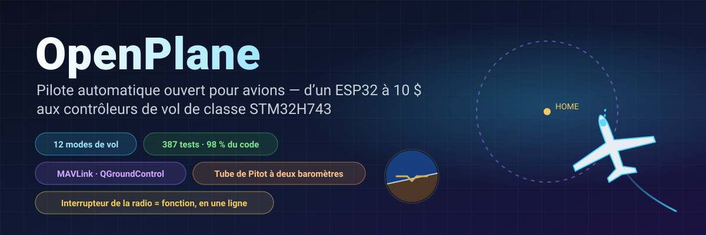
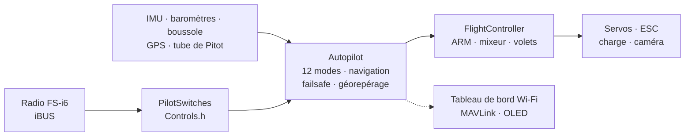

<!-- i18n-bar:start -->
  <p align="center">
    <a href="../../../README.md"> Читать на русском</a>
    &nbsp;·&nbsp;
    <a href="../en/README.md"> Read this in English</a>
    &nbsp;·&nbsp;
    <a href="../zh-CN/README.md"> 阅读中文版</a>
    &nbsp;·&nbsp;
    <a href="../es/README.md"> Lee esto en español</a>
  </p>
  <p align="center">
    <a href="../hi/README.md"> हिन्दी में पढ़ें</a>
    &nbsp;·&nbsp;
    <a href="../ar/README.md"> اقرأ بالعربية</a>
    &nbsp;·&nbsp;
    <a href="../pt-BR/README.md"> Leia em português</a>
    &nbsp;·&nbsp;
     <b>Lire en français</b>
  </p>
  <p align="center">
    <a href="../de/README.md"> Auf Deutsch lesen</a>
    &nbsp;·&nbsp;
    <a href="../ja/README.md"> 日本語で読む</a>
    &nbsp;·&nbsp;
    <a href="../ko/README.md"> 한국어로 읽기</a>
  </p>
<!-- i18n-bar:end -->

<p align="center"><sub>🌐 Traduction du <a href="../../../README.md">README en russe</a>. La documentation détaillée est elle aussi traduite, et les liens ci-dessous mènent aux pages traduites. En cas de divergence entre la traduction et l’original, c’est l’original qui fait foi. Les messages de la console, les captures d’écran et les graphiques portent encore des textes en russe. La traduction a été réalisée par une IA et n’a pas été relue par des locuteurs natifs. Pour signaler une erreur, écrivez à <a href="https://github.com/damir-lebedev">Damir Lebedev</a> ou ouvrez un <a href="https://github.com/damir-lebedev/OpenPlaneProject/issues">ticket</a>.</sub></p>

<p align="center">
  
</p>

<p align="center">
  
  
  
  <br>
  
  
  
  <a href="LICENSE.md"></a>
</p>

<h3 align="center">Éteignez la radio : l’avion rentre seul à la maison et tourne au-dessus de vous.</h3>
<p align="center">Ce n’est pas un dessin animé : <b>tout le firmware</b> pilote un modèle d’avion en boucle fermée — les mêmes octets iBUS en entrée, le même PWM en sortie.</p>

<p align="center">
  
</p>

---

## ⚡ En 30 secondes

| | |
|---|---|
| **Ce que c’est** | Un contrôleur de vol et pilote automatique ouverts pour avions radiocommandés. Aujourd’hui, c’est un ESP32-S3 à environ 10 $ ; la prochaine étape est le STM32H743 (une carte de la classe Pixhawk) : le firmware complet passe les tests et, sur une carte DevEBox, il **tourne déjà et se pilote avec la radio** — [il y a une vidéo](#-le-stm32h743sanime-sur-la-carte). |
| **Ce qu’il sait faire** | 12 modes de vol, de la stabilisation au retour à la maison, en passant par les cercles au GPS, le lancer à la main, l’atterrissage automatique et le **vol à voile en thermiques**. Un tube de Pitot fait de deux baromètres bon marché. Télémétrie MAVLink vers QGroundControl et Mission Planner. |
| **L’atout principal** | N’importe quel interrupteur ou potentiomètre de la radio = n’importe quelle fonction. **Une seule ligne** dans `Controls.h`, et SwD n’est plus un RTH mais un largage de charge. |
| **Pourquoi lui faire confiance** | 387 tests automatiques (plus 9 sur la carte elle-même, avec une vraie carte SD), 98 % du code couvert par les tests, 24 compilations « carte × capteurs » sans le moindre avertissement, des simulations en boucle fermée de chaque mode. |
| **En toute franchise** | Pour l’instant, seul le mode manuel a volé (le premier prototype). Le STM32H743 n’a été vérifié que sur le banc, sans capteurs. Le pilote automatique a été vérifié sur le banc, par des tests et des simulations, et attend les essais en vol — [état des lieux plus bas](#-état-réel). |

---

## 🎛️ Un interrupteur = une fonction. Une seule ligne.

```cpp
// include/config/Controls.h
constexpr Binding BINDINGS[] = {
    Bind::modes  (Channels::SWC, MODE_MANUAL, MODE_STABILIZE, MODE_AUTO_TAKEOFF),
    Bind::feature(Channels::SWB, Feature::FLAPS),
    Bind::mode   (Channels::SWD, MODE_RTH),              // retour à la maison, tant qu’il est activé
    Bind::knob   (Channels::VRA, Knob::STAB_GAIN),       // « plus doux / plus ferme » en plein vol
    Bind::knob   (Channels::VRB, Knob::CRUISE_SPEED),
};
```

Vous voulez le vol à voile en thermiques sur SwD au lieu du RTH ? `Bind::mode(Channels::SWD, MODE_SOARING)`. Un largage de charge sur SwB ? `Bind::feature(Channels::SWB, Feature::PAYLOAD_DROP)`. Si vous faites une erreur (par exemple deux modes sur le même interrupteur, ou un stick déjà pris), **la compilation échoue** : la table est vérifiée par le compilateur (`static_assert`). À la mise sous tension, l’appareil affiche lui-même ce qui est affecté à chaque interrupteur.

**12 modes · 10 fonctions · 7 potentiomètres** — le tout avec des exemples dans la [référence du pilote automatique](AUTOPILOT_GUIDE.md).

---

## ✈️ Ce que sait faire le pilote automatique

| | Mode | En bref |
|---|---|---|
| 🕹️ | **MANUAL** | gouvernes = sticks, comme sans contrôleur de vol |
| 🧭 | **STABILIZE** | le stick fixe l’angle ; relâché, l’avion se remet tout seul à l’horizontale |
| 📏 | **ALT_HOLD** | + maintient l’altitude grâce au baromètre |
| 🌀 | **ACRO** | le stick fixe la vitesse de rotation, pour la voltige |
| 🛣️ | **CRUISE** | cap, altitude et vitesse se maintiennent seuls ; les sticks ne font que corriger |
| ⭕ | **LOITER** | cercles autour d’un point GPS (le rayon se règle avec un potentiomètre) |
| 🏠 | **RTH** | retour à la maison à 40 m, puis cercles au-dessus de vous ; s’active seul en cas de perte de signal |
| 🛫 | **AUTO_TAKEOFF** | décollage depuis la piste aux gaz du pilote |
| 🤾 | **LAUNCH** | lancer à la main : le moteur démarre après le lancer, puis montée |
| 🛬 | **AUTO_LAND** | plané et arrondi près du sol |
| 🦅 | **SOARING** | moteur coupé, il trouve les thermiques et y tourne en cercle |
| 🆘 | **RESCUE** | « à l’aide » : ailes à plat, nez vers le haut — à partir de n’importe quelle spirale |

En plus : géorepérage, auto-trim pour un avion « de travers », coordination des virages, protection contre le décrochage grâce au tube de Pitot, volets et aérofrein, largage de charge, caméra stabilisée et un buzzer « retrouvez-moi dans l’herbe ».

---

## 📈 Chaque mode vole — en boucle fermée

Pas « une fonction a renvoyé un nombre », mais un **vol** : radio → trame iBUS → firmware → PWM → braquage des gouvernes → modèle d’avion avec portance, décrochage, vent et thermiques → capteurs → de nouveau le firmware. 14 vols de ce genre font partie des tests ordinaires (`pio test -e native`).

<p align="center"></p>

<table>
  <tr>
    <td width="50%"></td>
    <td width="50%"></td>
  </tr>
  <tr>
    <td>🦅 A trouvé un thermique tout seul et pris de l’altitude <b>moteur coupé</b> — le variomètre à énergie totale ne confond pas « stick tiré » avec une ascendance.</td>
    <td>🆘 Inclinaison de 60° — et quelques secondes plus tard, l’horizon est à plat. RESCUE sort l’avion d’une spirale à 70° d’inclinaison et −40° de nez.</td>
  </tr>
  <tr>
    <td></td>
    <td></td>
  </tr>
  <tr>
    <td>🤾 Lancer à la main → le moteur ne démarre qu’une fois la main éloignée de l’hélice → montée. 🛬 Atterrissage : plané et arrondi à 3 m.</td>
    <td>🌬️ Vitesse mesurée par un tube fait de deux baromètres <b>bruités</b>, avec un décalage de 150 Pa entre les puces — l’erreur reste inférieure à 0,5 m/s.</td>
  </tr>
</table>

---

## 🌬️ Un tube de Pitot pour trois fois rien

Un bon capteur de vitesse air coûte à peu près la moitié d’un contrôleur de vol. Ici, il y a **deux baromètres** : un BMP581 dans le tube (pression totale) et le baromètre principal dans le fuselage (pression statique). Le firmware remet à zéro, au sol, l’écart entre les puces, filtre, calcule la densité de l’air à partir de l’altitude et de la température, et repère les durites inversées. Ce que cela apporte : CRUISE maintient la vitesse **air** et non les gaz ; une protection contre le décrochage ; une vitesse fiable dans la télémétrie. Le montage est décrit dans la [référence](AUTOPILOT_GUIDE.md#un-tube-de-pitot-fait-maison).

---

## 📡 Station sol : navigateur ou QGroundControl

<table>
  <tr>
    <td width="46%"></td>
    <td>
      <b>ESP32 — un tableau de bord web directement depuis l’appareil.</b> Point d’accès <code>OpenPlane-Debug</code>, adresse <code>192.168.4.1</code> : canaux de la radio, sorties, tous les capteurs, mode, navigation, changement de mode et réglage des PID en vol. Sans application ni matériel supplémentaire.<br><br>
      <b>STM32H743 — MAVLink par radiomodem.</b> QGroundControl et Mission Planner voient l’appareil comme un avion ArduPilot : horizon, carte avec le point de départ, vitesse d’après le tube de Pitot, modes sous leurs noms ArduPlane, PID depuis la fenêtre des paramètres, changement de mode par un bouton. L’ARM depuis le sol est impossible, uniquement avec un interrupteur : c’est plus sûr.<br><br>
      Les trames MAVLink ont été comparées octet par octet à la référence <code>pymavlink</code>.
    </td>
  </tr>
</table>

---

## 📼 Boîte noire

La carte enregistre chaque vol : IMU à 500 Hz, angles et décisions du pilote automatique, PID, toutes les sorties, sticks, baromètre, boussole, GPS, batterie et événements — de l’ARM et des gaz jusqu’à l’atterrissage, avec 10 secondes avant le départ. L’**ESP32-S3** enregistre dans sa mémoire flash intégrée (13,9 Mo, environ 11 minutes), le **STM32H743** sur une carte SD (64 Mo, environ une heure ; la carte reste une carte FAT32 ordinaire, et le firmware écrit dans un fichier créé à l’avance, `BLACKBOX.BIN`). L’effacement n’a lieu qu’au sol. Après le vol, `python tools/blackbox.py download` télécharge le vol par USB et le découpe en CSV ; les vols de la carte SD se décodent aussi sans la carte électronique : `python tools/blackbox.py ring E:/BLACKBOX.BIN`. Détails : [BLACKBOX.md](BLACKBOX.md).

---

## 🔩 Matériel : un seul firmware, quatre cartes, douze capteurs

| Carte | État | Ce qui a été vérifié |
|---|---|---|
| **ESP32-S3 N16R8** | ✅ principale, sur le banc | tous les capteurs, servos, iBUS, OLED, tableau de bord en direct ; le firmware complet dans les tests |
| **ESP32 38-pin** | 🧪 tests | le firmware complet dans les tests avec le kit ICM-45686 |
| **ESP32-C3 SuperMini** | ✈️ a volé (manuel) | le premier prototype ; compilation de tous les kits |
| **STM32H743VIT6** | 🔧 carte DevEBox sans capteurs + 🧪 tests | sur la carte : démarrage, console par USB, **carte SD et boîte noire** (tests sur la carte), **réception iBUS, ARM et pilotage des servos et du moteur avec la radio** (le lancement est filmé) ; sur PC : le firmware entier — tâches FreeRTOS, flash, MAVLink, I2C et SPI. Aucun capteur n’a encore été branché sur la carte |

| Capteur | Ce que c’est | Bus |
|---|---|---|
| **LSM6DSV** + **QMC6309** | IMU + boussole (module) | I2C / SPI |
| **ICM-45686** + **QMC6309** | IMU + boussole (alternative) | I2C / SPI |
| **SPL06-001** | baromètre du fuselage | I2C / SPI |
| **BMP581** | baromètre principal et baromètre du tube de Pitot | I2C / SPI |
| MPU6050/6500, ICM-42688, BMP388, BME280, QMC5883P/L | de banc et anciens | I2C / SPI |
| **u-blox M10** | GPS, 10 Hz, UBX | UART |

Un capteur se change en une ligne (`SENSOR_KIT_LSM6DSV_PITOT`), une carte avec un seul indicateur de compilation. Les 4 cartes × 6 kits de capteurs se compilent sans avertissement : [`tools/build_matrix.sh`](../../../tools/build_matrix.sh).

<table>
  <tr>
    <td width="50%"></td>
    <td width="50%"></td>
  </tr>
  <tr>
    <td>Le banc avec l’ESP32-S3 : IMU, baromètre, boussole, OLED, servos, récepteur.</td>
    <td>Essai du groupe motopropulseur.</td>
  </tr>
</table>

### 🎥 Le STM32H743 s’anime sur la carte

Le firmware du STM32H743 tourne sur une carte DevEBox **sans le moindre capteur** et se pilote avec une radio ordinaire : le récepteur iBUS, l’ARM, les servos et le moteur répondent aux sticks et aux interrupteurs en mode manuel. Tout le lancement a été filmé.

▶️ **[Voir le lancement en vidéo](https://t.me/lisnmylife/420)**

Ce que cela prouve : la chaîne « radio → iBUS → firmware → PWM » fonctionne sur du vrai matériel, et pas seulement dans les tests. Ce qui n’est pas encore prouvé : aucun capteur (IMU, baromètre, GPS) n’a été branché sur cette carte, donc les modes du pilote automatique n’ont pas encore été essayés dessus.

---

## 🧪 Une qualité vérifiable

| | |
|---|---|
| **387 tests automatiques** | modules, pilotes vérifiés au niveau des registres des puces, vols en boucle fermée, firmware ESP32 et STM32 **complet** sur PC ; plus 9 tests sur la carte STM32 elle-même avec une vraie carte SD |
| **98,3 % des lignes, 87,7 % des branches** | couverture `gcovr`, code STM32 compris |
| **24/24 compilations** | 4 cartes × 6 kits de capteurs, `-Wall -Wextra`, zéro avertissement |
| **0 remarque** | cppcheck et clang-tidy sur tout le code |
| **Des références, pas des copies de code** | formules des capteurs d’après les fiches techniques (Bosch, ST, TDK, Goertek), MAVLink d’après pymavlink |

```bash
pio test -e native -e native-stm32   # tous les tests, ~1,5 minute, aucun matériel requis
```

Détails : [TESTING.md](TESTING.md).

---

## 🧠 Comment c’est construit



- **C++ en-têtes seuls (header-only)**, une seule unité de traduction, aucune mémoire dynamique dans la boucle de vol. Vous préférez `.h/.cpp` ? Pour vous, il existe une branche parallèle, [`feature/split-headers`](https://github.com/damir-lebedev/OpenPlaneProject/tree/feature/split-headers) : un script la génère à partir de celle-ci, et le firmware avec LTO a la même taille.
- **HAL** — la seule couche qui connaît le microcontrôleur : une nouvelle carte, c’est un nouveau `Board`, pas un pilote automatique réécrit.
- **Le pilote d’un capteur ne connaît pas le bus** : une même classe fonctionne en I2C comme en SPI.
- **La sécurité par l’ordre des opérations** : perte de signal > ARM > mode > gaz ; aucun mode ne peut faire passer les gaz outre l’ARM.

Détails : [ARCHITECTURE.md](ARCHITECTURE.md).

---

## 🚀 Démarrage rapide

```bash
pip install platformio
git clone https://github.com/damir-lebedev/OpenPlaneProject && cd OpenPlaneProject
pio run -e esp32-s3 -t upload && pio device monitor     # ESP32-S3
pio run -e stm32h743 -t upload                            # STM32H743 (ST-Link)
pio run -e stm32h743-devebox -t upload                    # DevEBox H743 : USB DFU, console par USB
```

DevEBox : la carte n’a pas de bouton BOOT0 — avant le premier téléversement, reliez la broche BT0 au 3V3 et appuyez sur RST ; ensuite, la touche `D` de la console redémarre la carte dans le chargeur d’amorçage toute seule ([détails](DEVELOPER_GUIDE.md#stm32h743)).

Dans le moniteur série : `h` — menu, `b` — quelles puces sont visibles sur les bus, `s` — capteurs, `p` — test des sorties (retirez l’hélice !). Ensuite — le [guide du pilote](PILOT_GUIDE.md).

---

## 🟢 État réel

| Quoi | Où cela a été vérifié |
|---|---|
| Pilotage manuel, mixeur | ✈️ en vol (premier prototype, C3) |
| ARM, failsafe, volets, servos, moteur | 🔧 sur le banc (S3) |
| STABILIZE | 🔧 sur le banc : les gouvernes réagissent aux inclinaisons dans le bon sens |
| Capteurs du banc (MPU6500, BMP388, QMC5883P), OLED, tableau de bord | 🔧 sur le banc |
| Autres modes, navigation, tube de Pitot, MAVLink | 🧪 tests et simulations en boucle fermée |
| Nouveaux capteurs (LSM6DSV, ICM-45686, QMC6309, SPL06, BMP581) | 🧪 émulateurs de registres d’après les fiches techniques |
| STM32H743 : carte SD, boîte noire, console par USB | 🔧 sur la carte DevEBox (tests sur la carte) |
| STM32H743 : iBUS, ARM, PWM des servos et du moteur, pilotage manuel | 🔧 sur la carte sans capteurs, filmé |
| STM32H743 : capteurs (IMU, baromètre, boussole, GPS) et modes du pilote automatique | 🧪 firmware entier sur PC ; aucun capteur n’est encore branché sur la carte |

Le modèle d’avion des simulations est simplifié, et les coefficients sont des valeurs de départ. Chaque nouveau mode est d’abord essayé en altitude, le doigt sur l’interrupteur MANUAL.

---

## 🗺️ Feuille de route

- [x] Pilotage manuel, ARM, failsafe, firmware orienté objet, tableau de bord web
- [x] Banc ESP32-S3 avec tous les capteurs — en direct
- [x] 12 modes, navigation GPS, RTH en cas de perte de signal, géorepérage
- [x] Interrupteurs et potentiomètres en une ligne, largage de charge, caméra, auto-trim
- [x] Tube de Pitot à deux baromètres, protection contre le décrochage
- [x] Nouveaux capteurs : LSM6DSV, ICM-45686, QMC6309, SPL06, BMP581
- [x] STM32H743 : firmware complet, MAVLink, réglages en flash
- [x] Simulations en boucle fermée de tous les modes, firmware entier dans les tests
- [x] Boîte noire : vol en flash (ESP32-S3) et sur carte SD (STM32H743), téléchargement et décodage en CSV
- [x] Le STM32H743 tourne sur la carte : radio → iBUS → servos et moteur (sans capteurs, en vidéo)
- [ ] STM32H743 : brancher les capteurs et passer le banc comme pour l’ESP32-S3
- [ ] Essais en vol du pilote automatique sur la nouvelle cellule
- [ ] Une carte de contrôleur de vol maison ([FC_BOARD.md](FC_BOARD.md)) sur STM32H743
- [ ] Vol par points de passage, missions MAVLink
- [ ] Rétroaction adaptative (l’ébauche est déjà vérifiée en simulation)
- [ ] Capteur de courant et de batterie, télémétrie vers la radio (iBUS-SENS)
- [ ] Livraison autonome : trajet → largage de charge → retour

Détails : [ROADMAP.md](ROADMAP.md).

---

## 💼 Pour les partenaires et les investisseurs

Les petits avions de livraison et de surveillance sont soit des plateformes fermées et coûteuses, soit des projets d’amateurs dispersés. OpenPlane vise le juste milieu : **un pilote automatique ouvert et vérifiable sur du matériel grand public**, où chaque fonction est couverte par des tests et peut être adaptée à une tâche — livraison de médicaments dans des endroits difficiles d’accès, surveillance des champs et des forêts, opérations de recherche.

Ce qui a déjà été fait avec nos propres moyens : une architecture qui se transporte d’une carte à l’autre sans être réécrite ; un pilote automatique doté d’un jeu complet de modes ; une infrastructure de tests sur laquelle les nouvelles fonctions arrivent vite sans casser les anciennes. Ce que des ressources accéléreraient : les essais en vol, une carte de contrôleur de vol maison sur STM32H743, le vol par points de passage et le largage de charge. Où et pourquoi — [ROADMAP.md](ROADMAP.md).

---

## 📚 Documentation

| Document | Pour qui |
|---|---|
| [AUTOPILOT_GUIDE.md](AUTOPILOT_GUIDE.md) | le pilote : chaque mode, fonction et potentiomètre, comment les affecter à un interrupteur, le tube de Pitot, la station sol |
| [PILOT_GUIDE.md](PILOT_GUIDE.md) | montage, brochage, radio, failsafe, premier vol |
| [DEVELOPER_GUIDE.md](DEVELOPER_GUIDE.md) | le développeur : fichiers, conventions de signes, API, comment ajouter un capteur, un mode ou une carte |
| [ARCHITECTURE.md](ARCHITECTURE.md) | couches, tâches, cycle de contrôle, machines à états |
| [TESTING.md](TESTING.md) | tests, simulations, couverture, analyse |
| [reference/](reference/README.md) | une référence pour chaque classe |
| [FC_BOARD.md](FC_BOARD.md) · [ROADMAP.md](ROADMAP.md) | la carte du contrôleur de vol · où va le projet |
| [airframe/](airframe/README.md) | la cellule Astro-Cargo : projet Fusion 360 et fichiers STL à imprimer, défauts connus de la version v2 |

> **Projet associé :** [esp32-rc-joystick](https://github.com/damir-lebedev/esp32-rc-joystick) — la radio FS-i6 en joystick USB pour simulateur, sur le même ESP32-S3 : d’abord accumuler des heures de vol en simulateur, ensuite sur le terrain.

---

## 🤝 Participation

Nous cherchons des bras et des têtes : aérodynamique et aéromodélisme, impression 3D et résistance des structures, C++ embarqué, capteurs et pilotes automatiques, interfaces au sol. Les issues et les pull requests vont vers la branche `main` ; commencez par [DEVELOPER_GUIDE.md](DEVELOPER_GUIDE.md).

## 📜 Licence

La [OpenPlane License](LICENSE.md) est une licence fondée sur la MIT, assortie de conditions supplémentaires. Le code, la documentation et les fichiers du modèle peuvent être utilisés, copiés, modifiés et vendus, y compris dans des produits commerciaux. Les conditions sont les suivantes :

1. **Mentionnez l’auteur — Damir Lebedev (Damn / Проклятый).** Son nom doit figurer à un endroit visible des utilisateurs de votre produit : dans la documentation, le README ou une page « À propos ». Conservez le texte de la licence avec le code.
2. **L’usage militaire est interdit.** Le projet ne doit pas être utilisé par des armées ou des organisations paramilitaires, à la guerre, ni pour créer des armes, des munitions, des systèmes de largage ou de ciblage.
3. **Ne nuisez pas intentionnellement aux personnes ou aux biens sans leur consentement écrit préalable à ce dommage.** Vous pouvez casser votre propre matériel s’il ne menace personne : par exemple, tirer sur votre propre drone avec un pistolet à air comprimé. Mutiler ou tuer des personnes est interdit.
4. **Respectez les consignes de sécurité et la loi** lors du montage, des essais et des vols.

Si les conditions ne sont pas respectées, l’autorisation d’utiliser le projet prend fin. En raison de l’interdiction de certains usages, il ne s’agit pas d’une licence « ouverte » au sens de l’OSI : le code peut être lu, copié et modifié, mais le projet relève formellement du code source disponible (source-available), et non de l’open source.

Seul le texte anglais du fichier [LICENSE](LICENSE.md) a force juridique : les traductions de la licence dans d’autres langues sont fournies à titre de commodité.

Le firmware pilote un aéronef et n’est pas certifié. Tout ce que vous faites avec est à vos propres risques ; l’auteur n’assume aucune responsabilité.

```text
OpenPlane © 2026 Damir Lebedev (Damn / Проклятый) — https://github.com/damir-lebedev/OpenPlaneProject
```

<p align="center"><i>Le premier prototype s’est cassé dès son premier vol — c’est pourquoi tout est ici au grand jour : le code, les tests, les problèmes. Construisez, cassez, réparez avec nous.</i></p>
