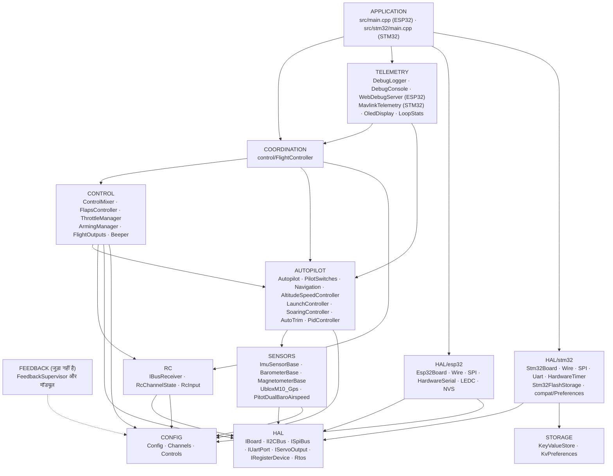
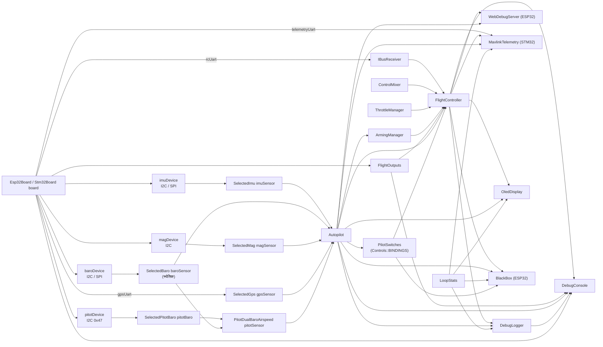
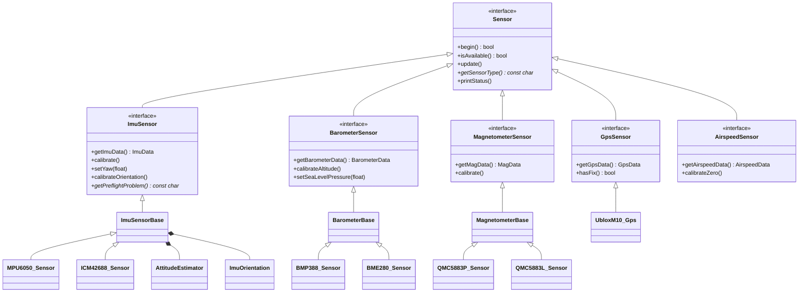
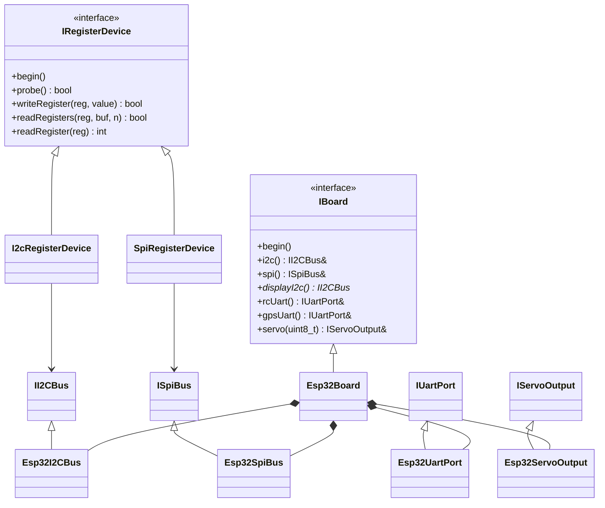
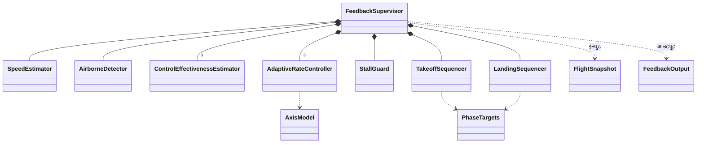
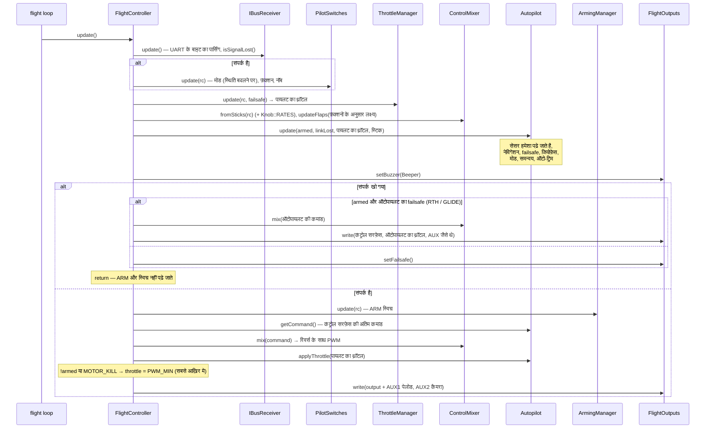
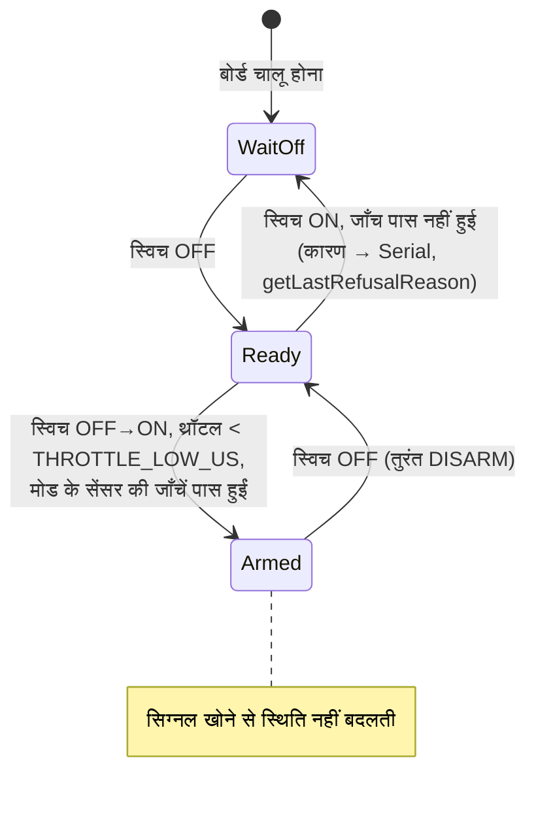
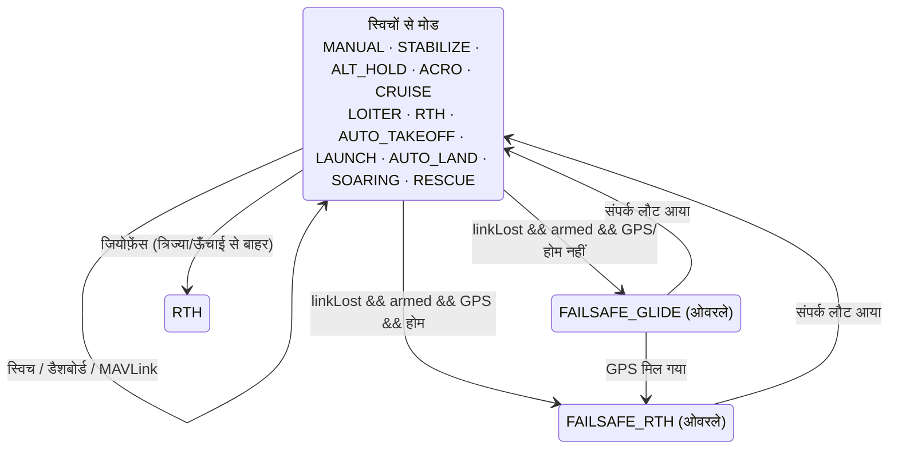
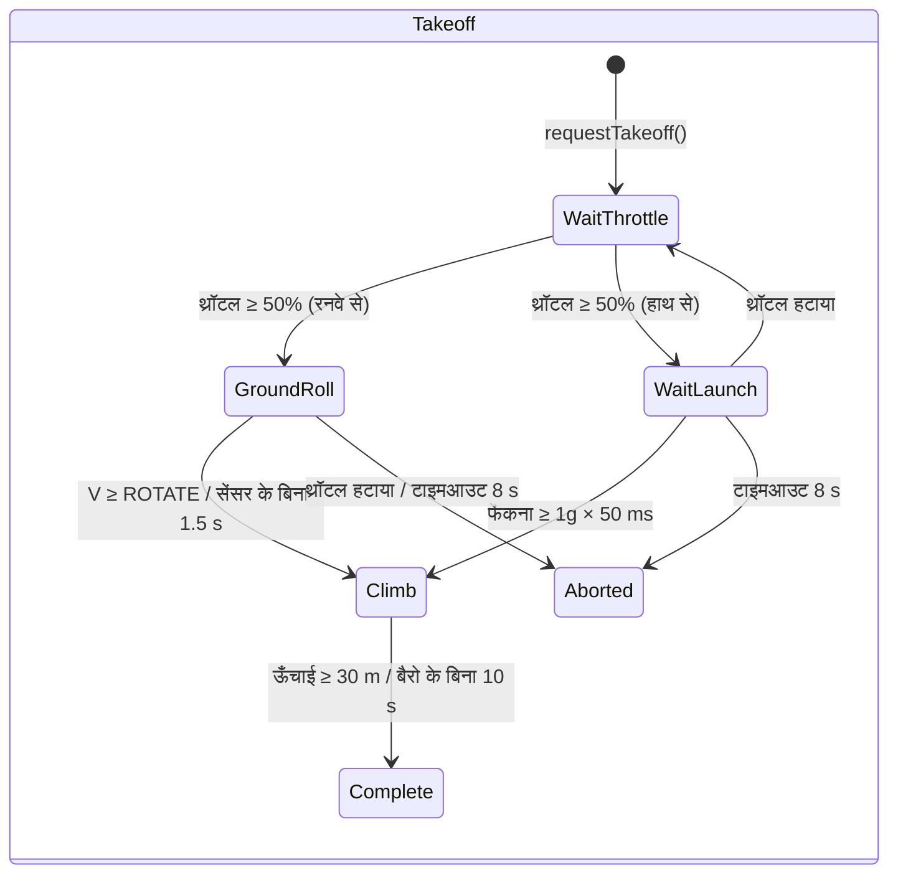
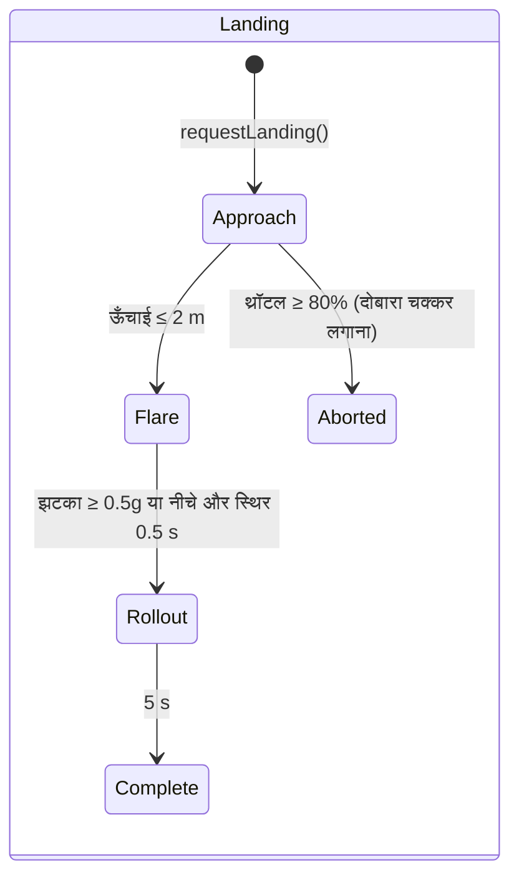

# ARCHITECTURE.md — OpenPlaneProject फ़र्मवेयर का आर्किटेक्चर

> 🌐 यह पृष्ठ [रूसी मूल पाठ](../../ARCHITECTURE.md) का अनुवाद है। अनुवाद और मूल पाठ में अंतर हो, तो मूल पाठ ही मान्य है। फ़र्मवेयर कंसोल संदेश रूसी में दिखाता है, इसलिए उन्हें जैसा है वैसा ही उद्धृत किया गया है।

यह दस्तावेज़ बताता है कि **पूरा फ़र्मवेयर कैसे बना है**: परतें और उनके बीच निर्भरता के नियम, ऑब्जेक्ट ग्राफ़, FreeRTOS का थ्रेड मॉडल, हर चक्र में संचालन का क्रम, स्टेट मशीनें, सेंसर की दोष-सहनशीलता की रणनीति और विस्तार के बिंदु। हर क्लास (सार्वजनिक API, फ़ील्ड, इनवेरिएंट) का विस्तृत संदर्भ [`reference/`](reference/README.md) में है।

संबंधित दस्तावेज़:

| दस्तावेज़ | किस बारे में है |
|---|---|
| [`DEVELOPER_GUIDE.md`](DEVELOPER_GUIDE.md) | व्यावहारिक मार्गदर्शिका: चिह्नों का नियम, HTTP API, कंसोल, सेंसर/मोड/बोर्ड कैसे जोड़ें |
| [`reference/`](reference/README.md) | सभी क्लासों, स्ट्रक्चरों और नेमस्पेस का संदर्भ |
| [`TESTING.md`](TESTING.md) | टेस्ट: नेटिव (PC पर, कवरेज के साथ) और बोर्ड पर |
| [`PILOT_GUIDE.md`](PILOT_GUIDE.md) | असेंबली, पिन-व्यवस्था, ट्रांसमीटर, पहली उड़ान |
| [`ROADMAP.md`](ROADMAP.md) | प्रोजेक्ट किधर बढ़ रहा है |

> स्थिति: ESP32-S3 वाला बेंच सभी सेंसरों के साथ जाँचा जा चुका है, **ऑटोपायलट उड़ान में परखा नहीं गया है**, और फ़ीडबैक लूप (`autopilot/feedback/`) फ़र्मवेयर से **जुड़ा नहीं है** और केवल सिमुलेशन से जाँचा जाता है।

---

## विषय-सूची

1. [सिद्धांत](#1-सिद्धांत)
2. [परतें और निर्भरता के नियम](#2-परतें-और-निर्भरता-के-नियम)
3. [ऑब्जेक्ट ग्राफ़ (composition root)](#3-ऑब्जेक्ट-ग्राफ़-composition-root)
4. [क्लासों के पदानुक्रम](#4-क्लासों-के-पदानुक्रम)
5. [FreeRTOS टास्क और डेटा का बँटवारा](#5-freertos-टास्क-और-डेटा-का-बँटवारा)
6. [नियंत्रण का चक्र: `FlightController::update()`](#6-नियंत्रण-का-चक्र-flightcontrollerupdate)
7. [स्टेट मशीनें](#7-स्टेट-मशीनें)
8. [दोष-सहनशीलता: सेंसर, संपर्क, आउटपुट](#8-दोष-सहनशीलता-सेंसर-संपर्क-आउटपुट)
9. [कॉन्फ़िगरेशन और बिल्ड के रूप](#9-कॉन्फ़िगरेशन-और-बिल्ड-के-रूप)
10. [फ़ीडबैक लूप (जुड़ा नहीं है)](#10-फ़ीडबैक-लूप-जुड़ा-नहीं-है)
11. [विस्तार के बिंदु](#11-विस्तार-के-बिंदु)
12. [परीक्षण-योग्यता](#12-परीक्षण-योग्यता)

---

## 1. सिद्धांत

| सिद्धांत | कैसे लागू है |
|---|---|
| **केवल हेडर वाला C++** | सभी क्लास `include/<परत>/` के हेडरों में परिभाषित हैं। फ़र्मवेयर की एकमात्र ट्रांसलेशन यूनिट `src/main.cpp` (ESP32) या `src/stm32/main.cpp` (STM32) है। उड़ान के लूप में डायनेमिक मेमोरी नहीं है (`String` स्ट्रिंग केवल वेब सर्वर और OLED में हैं)। `.h/.cpp` में बँटा रूप अलग ब्रांच `feature/split-headers` में है: उसे `tools/split_headers.py` बनाता है, अंतर और फ़र्मवेयर के आकार उसके `docs/SPLIT_HEADERS.md` में हैं। |
| **Composition root** | `src/main.cpp` / `src/stm32/main.cpp` ही वह अकेली जगह है जहाँ ऑब्जेक्ट बनते हैं और रेफ़रेंस/पॉइंटरों से जुड़ते हैं। इसमें उड़ान का लॉजिक नहीं है। |
| **एक पंक्ति — एक स्विच** | ट्रांसमीटर का हर चैनल क्या करता है, यह `config/Controls.h` की तालिका (`Bind::modes/mode/feature/knob`) तय करती है, जिसे बिल्ड के समय `static_assert` जाँचता है। |
| **निर्भरता का उलटाव** | ऊपरी परतें इंटरफ़ेस (`IBoard`, `IRegisterDevice`, `ImuSensor*`, …) पर निर्भर हैं, ख़ास चिप और MCU पर नहीं। |
| **Nullable निर्भरताएँ** | ऑटोपायलट, स्विच (`PilotSwitches`) और सभी सेंसर पॉइंटर के रूप में दिए जाते हैं और `nullptr` हो सकते हैं: सेंसर न हो तो मोड सुरक्षित ढंग से चलता है, गिरता नहीं। |
| **प्राथमिकता से सुरक्षा** | चक्र में संचालन का क्रम ही प्राथमिकता है: सिग्नल खोना > ARM > स्टिक/ऑटोपायलट > थ्रॉटल। थ्रॉटल पर ARM की जाँच सबसे आख़िर में आती है। |
| **चिह्नों की एक प्रणाली** | IMU से सर्वो तक — विमानन के चिह्न; हर सर्वो की दिशा ठीक एक जगह तय होती है (`Config::*_REVERSED`)। |
| **समय — पैरामीटर के रूप में** | जहाँ भी संभव है (फ़्लैप, फ़ीडबैक मॉड्यूल), समय आर्ग्युमेंट के रूप में दिया जाता है, `millis()` से पढ़ा नहीं जाता — इससे क्लास निर्धारित (deterministic) और परखने योग्य बनती हैं। |
| **ईमानदार निदान** | हर सेंसर और आउटपुट “बिल्ड में नहीं है” (`attached`) और “है, पर जवाब नहीं देता” (`available`) में फ़र्क़ करता है; यह JSON, लॉग और OLED पर दिखता है। |

---

## 2. परतें और निर्भरता के नियम



नियम:

1. **HAL ही अकेली परत है जो MCU को जानती है।** केवल `include/hal/esp32/` और `include/hal/stm32/` ही `<Wire.h>`, `<SPI.h>`, `HardwareSerial` शामिल करते हैं और `ledc*` / `HardwareTimer` / फ़्लैश को बुलाते हैं। FreeRTOS टास्क `hal/Rtos.h` से बनते हैं (ESP32 पर कोर 0, STM32 पर प्राथमिकता)। सेटिंग का भंडारण: कोड `<Preferences.h>` लिखता है — ESP32 पर यह NVS है, STM32 पर `storage/KeyValueStore.h` के ऊपर `hal/stm32/compat/Preferences.h`। सोचा-समझा अपवाद: `SpiRegisterDevice` CS को Arduino के मानक `pinMode/digitalWrite` से बदलता है (ESP32 और STM32 पर एक जैसे)।
2. **सेंसर के ड्राइवर बस को नहीं जानते।** उन्हें `IRegisterDevice&` (I2C पता या SPI का CS) या `IUartPort&` मिलता है। बस का चुनाव `sensors/SensorSelection.h` में होता है।
3. **RC और Outputs विमान के बारे में कुछ नहीं जानते**: iBUS के बाइट → चैनल; PWM के मान → आउटपुट।
4. **Control और Autopilot** डेटा पर शुद्ध लॉजिक हैं: न UART, न PWM, न Wi-Fi।
5. **Coordination** (`FlightController`) अकेली क्लास है जो एक साथ कई निचली परतें देखती है और संचालन का क्रम तय करती है।
6. **Telemetry** स्थिति को केवल const गेटर से पढ़ती है; डैशबोर्ड की कमांड “मेलबॉक्स” से गुज़रती हैं और उड़ान का लूप उन्हें लागू करता है; MAVLink (`MavlinkTelemetry`) सीधे उड़ान के लूप में चलता है और कमांड ख़ुद लागू करता है।
7. **निचली परत कभी ऊपरी परत को शामिल नहीं करती।** अगर किसी निचली क्लास को ऊपरी क्लास चाहिए, तो लॉजिक को `FlightController` में ऊपर उठा दिया जाता है।

`ArmingManager` (CONTROL) मोड `Autopilot` से पढ़ता है — यह CONTROL → AUTOPILOT की अकेली क्षैतिज निर्भरता है: ARM की जाँचें इस पर निर्भर करती हैं कि चुने गए मोड को किन सेंसरों की ज़रूरत है।

---

## 3. ऑब्जेक्ट ग्राफ़ (composition root)

सभी ऑब्जेक्ट स्थैतिक जीवनकाल वाले ग्लोबल हैं, जो `src/main.cpp` में बनते हैं। उनके बीच के रेफ़रेंस और पॉइंटर **स्वामित्व-रहित** हैं; निर्माण का क्रम घोषणा के क्रम जैसा ही है (एक ही ट्रांसलेशन यूनिट)।



`setup()` में आरंभ का क्रम:

```
Serial (ESP32: TX बफ़र 4 KB; STM32: SERIAL_TX_BUFFER_SIZE=1024), 115200 → बैनर
board.begin()               — I2C/SPI बसें (दूसरी I2C, अगर है)
flightOutputs.begin()       — PWM चैनल; तुरंत setFailsafe()
[STM32] फ़्लैश से सेटिंग    — KeyValueStore::mount(), इमेज का CRC
setupSensors()              — हर सेंसर का begin(); जवाब देने वालों का कैलिब्रेशन:
                              IMU (2 s स्थिर + उड़ान-पूर्व जाँच),
                              बैरो (शून्य ऊँचाई), कम्पास (शुरुआती हेडिंग → IMU yaw),
                              पिटो ट्यूब (ज़ीरो लूप के पहले सेकंड में लिया जाता है)
autopilot.begin()           — NVS/फ़्लैश से ट्रिम
flightController.begin()    — setFailsafe() + UART iBUS
oledDisplay.begin(...)      — अपना टास्क (hal/Rtos.h)
[ESP32] webDebugServer.begin() — एक्सेस पॉइंट + कोर 0 पर अपना टास्क
[ESP32] blackBox.begin()   — blackbox पार्टिशन, PSRAM में क्यू, कोर 0 पर bbox टास्क
[STM32] mavlink.begin()     — रेडियो मॉडेम का UART4
[STM32] setupBlackBox()    — SD कार्ड, BLACKBOX.BIN फ़ाइल, blackBox.begin(), bbox टास्क
pilotSwitches.printBindings() — किस स्विच पर क्या है
debugLogger.begin()         — लॉग की सेटिंग
[STM32] flight / storage टास्क → vTaskStartScheduler()
```

---

## 4. क्लासों के पदानुक्रम

### सेंसर



बेस क्लास (`ImuSensorBase`, `BarometerBase`, `MagnetometerBase`) **Template Method** पैटर्न लागू करती हैं: सार्वजनिक `update()`/`calibrate()` एक ही बार लिखे जाते हैं, और चिप का ड्राइवर केवल सुरक्षित (protected) “आदिम” फ़ंक्शन (`readSample()`, `isNewSampleReady()`, `readRaw()`, स्केल) लागू करता है।

### HAL



### फ़ीडबैक लूप



---

## 5. FreeRTOS टास्क और डेटा का बँटवारा

**ESP32** (दो कोर, FreeRTOS Arduino कोर में अंतर्निहित है):

| कोर | टास्क | क्या करता है | अवधि |
|---|---|---|---|
| 1 | Arduino `loopTask` → `loop()` | `WebDebugServer::applyPendingCommands()` → `FlightController::update()` → `DebugLogger::update()` → `DebugConsole::update()` → `LoopStats::record()` → `BlackBox::update()` | `Config::LOOP_PERIOD_MS` = 2 ms (500 Hz), `vTaskDelayUntil` |
| 0 | `web` (8 KB स्टैक, प्राथमिकता 1) | `WebServer::handleClient()` | हर 2 ms (`vTaskDelay`) |
| 0 | `oled` (4 KB स्टैक, प्राथमिकता 1) | दूसरी I2C बस पर `OledDisplay::draw()` | 200 ms (`vTaskDelayUntil`) |
| 0 | `bbox` (6 KB स्टैक, प्राथमिकता 2) | `BlackBox::writerStep()`: क्यू से एक पेज फ़्लैश में; ज़मीन पर — मिटाना | हर चक्र के बाद `loop()` से सूचना (वरना हर 20 ms पर एक बार) |
| 0 | ESP-IDF का Wi-Fi स्टैक | एक्सेस पॉइंट | — |

**STM32H743** (एक कोर, STM32duino FreeRTOS, प्राथमिकता के अनुसार प्रीएम्प्शन):

| प्राथमिकता | टास्क | क्या करता है | अवधि |
|---|---|---|---|
| 5 | `flight` (16 KB) | `FlightController::update()` → `MavlinkTelemetry::update()` → `DebugLogger::update()` → `DebugConsole::update()` → `LoopStats::record()` | 2 ms, `vTaskDelayUntil` |
| 1 | `oled` (4 KB) | दूसरी I2C बस पर `OledDisplay::draw()` | 200 ms |
| 1 | `storage` (2 KB) | `Stm32FlashStorage::service()` — सेटिंग वाले सेक्टर को मिटाना और लिखना | 100 ms |
| 2 | `bbox` (8 KB) | `BlackBox::writerStep()`: क्यू से एक पेज SD कार्ड पर; ज़मीन पर — मिटाना। उड़ान वाला टास्क इसे रोक (प्रीएम्प्ट कर) सकता है | हर चक्र के बाद सूचना (वरना हर 20 ms पर एक बार) |

**डेटा बँटवारे के नियम:**

- `web` और `oled` टास्क स्थिति (`FlightController`, `Autopilot`, `LoopStats`, सेंसर) को const गेटरों से **केवल पढ़ते** हैं। फ़ील्ड अलग-अलग 16/32-बिट मान हैं, इसलिए “फटी हुई” रीडिंग नहीं होती; सबसे बुरी हालत में पास के चक्रों के मान दिखते हैं।
- डैशबोर्ड की **कमांड** (`/api/setmode`, `/api/setpid`) `web` टास्क से सीधे **लागू नहीं** होतीं: वे `portMUX` स्पिनलॉक के तहत `PendingCommands` में रखी जाती हैं और उड़ान का लूप उन्हें `applyPendingCommands()` में उठाता है — ऑटोपायलट में बदलाव हमेशा उसी टास्क के संदर्भ में होता है जो उसका स्वामी है।
- `LoopStats::hz/avgUs/maxUs` `volatile uint32_t` हैं; `takePeakUs()` केवल `loop()` से बुलाया जाता है।
- `OledDisplay` बस का पॉइंटर स्थैतिक वेरिएबल में रखता है (U8g2 का C कॉलबैक संदर्भ नहीं लेता); बोर्ड पर स्क्रीन एक ही है।

**रियल टाइम:**

- अवधि `vTaskDelayUntil` से बनी रहती है, काम के बाद `delay()` से नहीं। लंबे अवरोध (कंसोल से कैलिब्रेशन, > 100 ms) के बाद गिनती नए सिरे से शुरू होती है — छूटे चक्र एक साथ नहीं पकड़े जाते।
- I2C लेन-देन का टाइमआउट 5 ms है (`Wire` का मानक 50 ms है)।
- 4 KB के ट्रांसमिट बफ़र वाला `Serial` — लॉग की एक पंक्ति लूप को नहीं रोकती।
- ब्लैक बॉक्स: लूप केवल स्नैपशॉट क्यू में रखता है (स्पिनलॉक, माइक्रोसेकंड); फ़्लैश में पेज (दोनों कोर लगभग 0.6–0.9 ms के लिए रुकते हैं) `bbox` टास्क चक्र के ठीक बाद लिखता है — लूप के ख़ाली अंतराल में। फ़्लैश मिटाना केवल ARM के बिना और रिकॉर्डिंग के बिना होता है, हवा में कभी नहीं।
- ESP32: फ़्लैश में लिखना (NVS, Wi-Fi की सेटिंग) दोनों कोर को लगभग 0.3–0.4 s रोक देता है, इसलिए: Wi-Fi `persistent(false)` है; लॉग की सेटिंग केवल ARM के बिना सहेजी जाती है; कैलिब्रेशन केवल ARM के बिना; ऑटो-ट्रिम — DISARM के बाद और केवल तब जब विमान खड़ा हो (`Autopilot::looksLanded()`)।
- STM32: `Preferences::end()` केवल इमेज की नक़ल करता है (माइक्रोसेकंड), जबकि सेक्टर मिटाना (सेकंड) `storage` टास्क में चलता है। सेटिंग का सेक्टर फ़्लैश के बैंक 2 में है, कोड बैंक 1 में: उड़ान वाला टास्क लिखाई को रोककर चलता रहता है।
- MAVLink लूप को नहीं रोकता: फ़्रेम तभी भेजा जाता है जब UART बफ़र में जगह हो (`IUartPort::availableForWrite()`), वरना वह अगले चक्र का इंतज़ार करता है।

---

## 6. नियंत्रण का चक्र: `FlightController::update()`



चक्र के मुख्य इनवेरिएंट:

- **सिग्नल खोना** — स्विचों से मोड और फ़ंक्शन नहीं बदलते; ARM न पढ़ा जाता है, न रीसेट होता है; मोटर केवल ऑटोपायलट के failsafe के फ़ैसले (मोटर के साथ RTH) या `FAILSAFE_THROTTLE` से चलती है।
- **कोई भी मोड थ्रॉटल को ARM से बचाकर नहीं निकाल सकता**: `!armed` और `MOTOR_KILL` पर ज़बरदस्ती `PWM_MIN` करना `Autopilot::applyThrottle()` के बाद आता है।
- **ऑटोपायलट अंतिम कमांड देता है** (`getCommand()`); स्टेबलाइज़ेशन वाले मोड में स्टिक वांछित कोण हैं; सुधार = कमांड − स्टिक (लॉग और डैशबोर्ड के लिए)। मिक्सर तक सब कुछ एक ही चिह्न-प्रणाली (`ControlCommand`) में रहता है।

---

## 7. स्टेट मशीनें

### ARM (`ArmingManager`)



`WaitOff` = `armed == false && switchSeenOff == false`; `Ready` =
`armed == false && switchSeenOff == true`.

### ऑटोपायलट के मोड (`Autopilot` + `PilotSwitches`)

बारह मोड (`AutopilotTypes.h`); हर एक क्या करता है, यह [AUTOPILOT_GUIDE.md](AUTOPILOT_GUIDE.md#मोड) में है। मोड को `PilotSwitches` तालिका `config/Controls.h` के अनुसार चुनता है: मोड का स्विच (`Bind::modes`) और “ऊपर से मोड” वाले स्विच (`Bind::mode`, ऊपर की पंक्ति ज़्यादा प्रबल है)। `setMode()` तभी बुलाया जाता है जब स्विचों का **नतीजा बदला** हो — इसलिए डैशबोर्ड या GCS से चुना मोड तब तक टिका रहता है जब तक पायलट कोई स्विच न पलटे।



failsafe कोई अलग `AutopilotMode` नहीं, बल्कि मौजूदा मोड के ऊपर लगा फ़्लैग है; शुरू हो चुकी वापसी GPS के थोड़ी देर खोने पर ग्लाइड में नहीं छोड़ी जाती; संपर्क लौटने पर स्विचों वाला मोड जारी रहता है (ऑटो-टेकऑफ़ और हाथ से लॉन्च — केवल नए सिरे से)। भीतरी स्टेट मशीनें: `LaunchController` (IDLE → READY → THROWN → CLIMB → DONE) और `SoaringController` (GLIDE → THERMAL → MOTOR_CLIMB → RETURN)।

**AUTO_TAKEOFF** (शुरू से समय के अनुसार, जब armed हो और थ्रॉटल ≥ 1500 µs):

| समय | थ्रॉटल (प्रोग्राम) | पिच |
|---|---|---|
| 0–1 s | धीरे-धीरे 0 → 100 % | 0° |
| 1–3 s | 100 % | +15° |
| > 3 s | 100 % | +10° |

### टेकऑफ़ और लैंडिंग (फ़ीडबैक लूप, जुड़ा नहीं है)





---

## 8. दोष-सहनशीलता: सेंसर, संपर्क, आउटपुट

### सेंसर

| सेंसर | `isAvailable()` कब `false` होता है | रीडिंग में गड़बड़ी होने पर क्या होता है |
|---|---|---|
| IMU (`ImuSensorBase`) | `begin()` ने चिप नहीं पहचानी, **या** लगातार 50 पठन-त्रुटियाँ (500 Hz पर ~0.1 s) | डेटा मिटाया नहीं जाता, `errorCount++`; ठीक होने पर फिर उपलब्ध हो जाता है |
| बैरोमीटर (`BarometerBase`) | लगातार 100 त्रुटियाँ (हर 5 ms पर पूछने पर ~0.5 s) | वही |
| कम्पास (`MagnetometerBase`) | लगातार 25 त्रुटियाँ (50 Hz पर ~0.5 s) | वही |
| GPS (`UbloxM10_Gps`) | एक भी वैध NAV-PVT नहीं, **या** आख़िरी वाला `GPS_TIMEOUT_US` (2 s) से पुराना है | — |

इसके अलावा IMU की एक **उड़ान-पूर्व जाँच** (`getPreflightProblem()`) है: जाइरोस्कोप के कैलिब्रेशन के समय स्थिरता, |a| ≈ 1g, “ऊपर” की दिशा सहेजी गई माउंटिंग से मेल खाती है। जाँच पास न हो तो — `Autopilot::imuReady() == false` (सभी मोड में, ग्लाइड समेत, सुधार शून्य), और `ArmingManager` स्टेबलाइज़ेशन वाले मोड को आर्म नहीं करता।

उपभोक्ता एक जैसी प्रतिक्रिया देते हैं: **सेंसर नहीं है (`nullptr`) या उपलब्ध नहीं है — तो कोई असर नहीं**, विमान MANUAL की तरह चलता है।

### संपर्क (`IBusReceiver::isSignalLost()`)

दो स्वतंत्र संकेत:

1. `RX_TIMEOUT_US` (500 ms) से ज़्यादा देर तक कोई सही फ़्रेम नहीं आया — या चालू होने के बाद एक भी नहीं आया;
2. फ़्रेम में थ्रॉटल `RX_FAILSAFE_THROTTLE_US` (950 µs) से नीचे है — ट्रांसमीटर में प्रोग्राम किया गया failsafe (ट्रांसमीटर के खो जाने पर FS-iA6B फ़्रेम भेजना बंद नहीं करता)।

ग़लत CRC वाले फ़्रेम फेंक दिए जाते हैं और गिने जाते हैं (`getBadFrameCount()`)।

### आउटपुट

`FlightOutputs::begin()` के तुरंत बाद `setFailsafe()` आता है — कंट्रोल सरफ़ेस न्यूट्रल पर, मोटर बंद, सेंसर पढ़े जाने से भी पहले। पिन `-1` वाला आउटपुट (C3 पर रडर) बस जुड़ता ही नहीं; JSON में `attached` बताता है कि LEDC का चैनल आवंटित हुआ या नहीं। हर पिन पर असली पल्स की जाँच `printPulseSelfTest()` करता है (कंसोल `p`)।

---

## 9. कॉन्फ़िगरेशन और बिल्ड के रूप

| क्या | कहाँ | कैसे चुना जाता है |
|---|---|---|
| बोर्ड (पिन) | `include/config/Config.h` | `platformio.ini` के `[env:*]` से मैक्रो `BOARD_ESP32_S3` / `BOARD_ESP32_C3` / `BOARD_ESP32_CLASSIC` / `BOARD_STM32H743` |
| सभी सेटिंग (टाइमआउट, कंट्रोल सरफ़ेस की यात्रा, रिवर्स, failsafe, Wi-Fi) | `Config.h`, नेमस्पेस `Config` | `constexpr`, फ़ाइल बदलकर |
| RC चैनलों का आवंटन | `include/config/Channels.h` | फ़ाइल बदलकर |
| सेंसर और बसें | `include/sensors/SensorSelection.h` | `#define SENSOR_IMU/BARO/MAG/GPS`, `-D` फ़्लैग से भी दिया जा सकता है |
| फ़ीडबैक के स्थिरांक | `include/autopilot/feedback/FeedbackConfig.h` | जुड़ने पर `Config.h` में चले जाएँगे |
| IMU की माउंटिंग | NVS (`imu_mpu6050` / `imu_icm42688`) या `Config::IMU_ROTATION_CW_DEG` | कंसोल कमांड `o` |
| कम्पास का कैलिब्रेशन | NVS (`qmc5883p` / `qmc5883l`) | कंसोल कमांड `m` |
| लॉग की सेटिंग | NVS (`debuglog`) | कंसोल मेनू `l` |
| ब्लैक बॉक्स | `Config.h` (`BLACKBOX_*`), `partitions_blackbox.csv` में पार्टिशन `blackbox` | उड़ानें — `tools/blackbox.py`, कंसोल मेनू `k` |

PlatformIO के परिवेश:

| `env` | उद्देश्य |
|---|---|
| `esp32-s3` (डिफ़ॉल्ट) | मुख्य फ़्लाइट कंट्रोलर |
| `esp32-c3` | पुराना प्रोटोटाइप |
| `esp32-dev` | क्लासिक ESP32, बेंच |
| `stm32h743` | STM32H743VIT6: पूरा फ़र्मवेयर (`src/stm32/main.cpp`), सेटिंग फ़्लैश में, MAVLink, SD पर ब्लैक बॉक्स, FreeRTOS; सादे बोर्ड पर जाँचा गया — देखें [reference/hal.md](reference/hal.md#stm32h743-के-लिए-क्रियान्वयन) |
| `stm32h743-devebox` | DevEBox H743: वही, कंसोल USB CDC पर, फ़र्मवेयर DFU से ([DEVELOPER_GUIDE](DEVELOPER_GUIDE.md#stm32h743)) |
| `native` | PC पर Arduino/ESP-IDF के फ़ेक और कवरेज के साथ बिल्ड और टेस्ट — देखें [`TESTING.md`](TESTING.md) |

---

## 10. फ़ीडबैक लूप (जुड़ा नहीं है)

`include/autopilot/feedback/` PID स्टेबलाइज़ेशन की भावी जगह लेने वाला हिस्सा है: अक्ष का मॉडल `ε = b·u + a·ω + c` उड़ान में रिकर्सिव लीस्ट स्क्वेयर्स से सीखा जाता है (`ControlEffectivenessEstimator`), और नियंत्रक सीखे हुए मॉडल के ज़रिए कोण → कोणीय गति → कोणीय त्वरण → कंट्रोल सरफ़ेस की कैस्केड है (`AdaptiveRateController`), जिसके ऊपर स्टॉल से सुरक्षा (`StallGuard`) और टेकऑफ़/लैंडिंग के चरण हैं।

एकमात्र इनपुट `FlightSnapshot` (हर चक्र का स्नैपशॉट) है, एकमात्र आउटपुट `FeedbackOutput`। मॉड्यूल सीधे सेंसर या RC नहीं पढ़ते, इसलिए उन्हें क्लोज़्ड-लूप सिमुलेशन (`test/test_feedback`) से PC पर भी और बोर्ड पर भी जाँचा जाता है।

`FeedbackSupervisor::update()` में हर चक्र का क्रम:

1. गति और अनुदैर्ध्य त्वरण (`SpeedEstimator`), हवा में है या नहीं (`AirborneDetector`);
2. हर अक्ष के लिए मॉडल का प्रशिक्षण (केवल हवा में, IMU चालू हो, फ़्लैप हिल न रहे हों, स्टॉल न हो);
3. स्टॉल से सुरक्षा (लैंडिंग में ज़मीन के पास बंद रहती है);
4. टेकऑफ़/लैंडिंग के चरण के लक्ष्य;
5. लक्ष्य ← स्टॉल सुरक्षा की सीमाएँ;
6. अक्षों के नियंत्रक → कंट्रोल सरफ़ेस के विचलन; थ्रॉटल (केवल संपर्क चालू होने पर)।

जोड़ने की योजना [`DEVELOPER_GUIDE.md`](DEVELOPER_GUIDE.md#जोड़ने-की-योजना) में है।

---

## 11. विस्तार के बिंदु

| काम | क्या बदलना है | क्या नहीं बदलना |
|---|---|---|
| मौजूदा श्रेणी की नई चिप | बेस क्लास से बना नया `*_Sensor.h` + `SensorSelection.h` में एक शाखा | `main.cpp`, `Autopilot` |
| सेंसर की नई श्रेणी | `SensorInterface.h` में इंटरफ़ेस, `Autopilot` में nullable पॉइंटर, JSON में `attached/available` फ़ील्ड | बाक़ी कोड |
| ऑटोपायलट का नया मोड | `AutopilotMode`, `handle*Mode()`, `applyThrottle()`, चयनकर्ता/डैशबोर्ड, `ArmingManager::checkFailureReason()` | `FlightController` |
| नया आउटपुट (सर्वो) | `FlightOutputs::outputInfo()` में एक पंक्ति, `FlightOutputState` में फ़ील्ड, `ServoChannel` में इंडेक्स, `Esp32Board` में पिन और LEDC चैनल | लिखने/स्थिति का लूप |
| नया ESP32 बोर्ड | `Config.h` में `#elif`, `platformio.ini` में `[env:*]` | बाक़ी सारा कोड |
| दूसरा MCU | `IBoard` को लागू करने वाला `hal/<mcu>/<Mcu>Board.h` (उदाहरण — `hal/stm32/`), `Config.h` में पिन का ब्लॉक, `[env:*]` | सेंसर, उड़ान का लॉजिक |
| रिसीवर का दूसरा प्रोटोकॉल | `IBusReceiver` को उसी API (`getState()`, `isSignalLost()`) वाले से बदलना | `FlightController` |
| लॉग का नया चैनल | `LogChannel`, `LogSettings::info()` में पंक्ति, `DebugLogger::format*()`, `VERSION++` | — |

---

## 12. परीक्षण-योग्यता

HAL के इंटरफ़ेस और समय को पैरामीटर के रूप में देने की बदौलत ज़्यादातर लॉजिक बिना हार्डवेयर के जाँचा जा सकता है:

- **नेटिव टेस्ट** (`pio test -e native`) फ़र्मवेयर के हेडर PC पर Arduino, FreeRTOS, Wire/SPI/UART/LEDC, Preferences, WebServer/WiFi और U8g2 के फ़ेक (`test/native/support/`) के साथ बनाते हैं। कवरेज `gcovr` गिनता है।
- **PC पर पूरा फ़र्मवेयर** — S3 और 38-pin की पिन-व्यवस्था पर हर सेंसर सेट (चिपों के रजिस्टर एमुलेटर) के साथ `src/main.cpp`, और STM32duino के फ़ेक की परत के ऊपर `src/stm32/main.cpp` (`pio test -e native-stm32`)।
- **क्लोज़्ड-लूप उड़ान सिमुलेशन** (`test/native/test_sim`): पूरा फ़र्मवेयर विमान के मॉडल को उड़ाता है — ऑटोपायलट का हर मोड सचमुच उड़ता है, सिर्फ़ “आँकड़े नहीं निकालता”।
- **बिल्ड मैट्रिक्स** (`tools/build_matrix.sh`): सभी बोर्ड × सभी सेंसर, बिना चेतावनी के।
- **बोर्ड पर टेस्ट** (`pio test -e esp32-s3`): वही `test_feedback` और `test_imu_orientation` असली ESP32-S3 पर भी चलते हैं।

विवरण, टेस्टों की बनावट और कमांड [`TESTING.md`](TESTING.md) में हैं।
