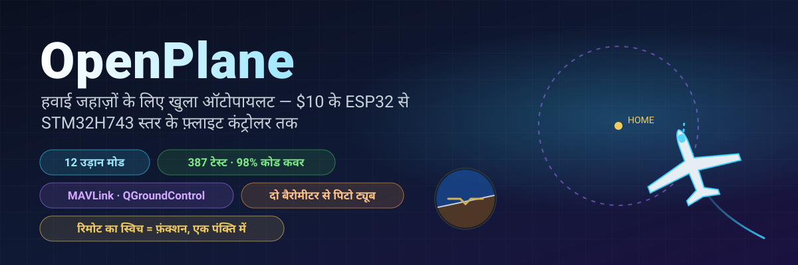
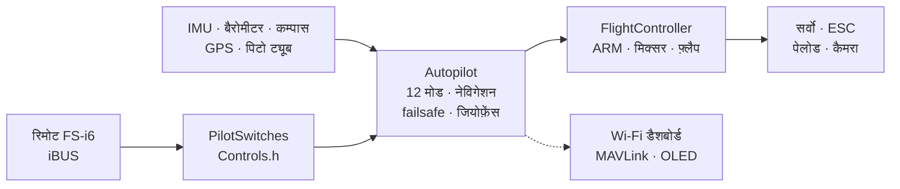

<!-- i18n-bar:start -->
  <p align="center">
    <a href="../../../README.md"> Читать на русском</a>
    &nbsp;·&nbsp;
    <a href="../en/README.md"> Read this in English</a>
    &nbsp;·&nbsp;
    <a href="../zh-CN/README.md"> 阅读中文版</a>
    &nbsp;·&nbsp;
    <a href="../es/README.md"> Lee esto en español</a>
  </p>
  <p align="center">
     <b>हिन्दी में पढ़ें</b>
    &nbsp;·&nbsp;
    <a href="../ar/README.md"> اقرأ بالعربية</a>
    &nbsp;·&nbsp;
    <a href="../pt-BR/README.md"> Leia em português</a>
    &nbsp;·&nbsp;
    <a href="../fr/README.md"> Lire en français</a>
  </p>
  <p align="center">
    <a href="../de/README.md"> Auf Deutsch lesen</a>
    &nbsp;·&nbsp;
    <a href="../ja/README.md"> 日本語で読む</a>
    &nbsp;·&nbsp;
    <a href="../ko/README.md"> 한국어로 읽기</a>
  </p>
<!-- i18n-bar:end -->

<p align="center"><sub>🌐 यह <a href="../../../README.md">रूसी README</a> का अनुवाद है। विस्तृत दस्तावेज़ भी अनुवादित हैं, और नीचे दिए गए लिंक अनूदित पृष्ठों पर ले जाते हैं। अनुवाद और मूल पाठ में अंतर हो, तो मूल पाठ ही मान्य है। कंसोल संदेश, स्क्रीनशॉट और ग्राफ़ में लेबल अभी रूसी में हैं। यह अनुवाद AI ने किया है और मूल भाषा के जानकारों ने इसकी जाँच नहीं की है। त्रुटियाँ मिलें तो <a href="https://github.com/damir-lebedev">Damir Lebedev</a> को लिखें या <a href="https://github.com/damir-lebedev/OpenPlaneProject/issues">इश्यू ट्रैकर</a> में बताएँ।</sub></p>

<p align="center">
  
</p>

<p align="center">
  
  
  
  <br>
  
  
  
  <a href="LICENSE.md"></a>
</p>

<h3 align="center">रिमोट बंद कर दीजिए — हवाई जहाज़ अपने-आप घर लौट आएगा और आपके ऊपर चक्कर लगाएगा।</h3>
<p align="center">यह कोई कार्टून नहीं है: <b>पूरा फ़र्मवेयर</b> हवाई जहाज़ के मॉडल को क्लोज़्ड-लूप में उड़ाता है — इनपुट पर वही iBUS बाइट, आउटपुट पर वही PWM।</p>

<p align="center">
  
</p>

---

## ⚡ 30 सेकंड में

| | |
|---|---|
| **यह क्या है** | रेडियो-नियंत्रित हवाई जहाज़ों के लिए एक खुला फ़्लाइट कंट्रोलर और ऑटोपायलट। आज यह लगभग $10 का ESP32-S3 है; अगला कदम STM32H743 (Pixhawk श्रेणी का बोर्ड) है: पूरा फ़र्मवेयर टेस्टों में चलता है, और DevEBox बोर्ड पर यह **पहले ही चालू है और रिमोट से नियंत्रित होता है** — [वीडियो उपलब्ध है](#-stm32h743-बोर्ड-पर-जाग-उठा)। |
| **यह क्या कर सकता है** | उड़ान के 12 मोड — स्टेबलाइज़ेशन से लेकर घर वापसी, GPS पर चक्कर, हाथ से लॉन्च, ऑटो-लैंडिंग और **थर्मल में सोअरिंग** तक। दो सस्ते बैरोमीटरों से बनी पिटो ट्यूब। QGroundControl और Mission Planner के लिए MAVLink टेलीमेट्री। |
| **मुख्य खूबी** | रिमोट का कोई भी स्विच या नॉब = कोई भी फ़ंक्शन। `Controls.h` में **एक पंक्ति** — और SwD अब RTH नहीं, बल्कि पेलोड ड्रॉप है। |
| **भरोसा क्यों करें** | 387 ऑटोमैटिक टेस्ट (साथ में असली SD कार्ड वाले बोर्ड पर 9 और), 98% कोड टेस्टों से ढका हुआ, "बोर्ड × सेंसर" के 24 बिल्ड बिना एक भी चेतावनी के, हर मोड का क्लोज़्ड-लूप सिमुलेशन। |
| **ईमानदारी से** | अभी तक हवा में केवल मैन्युअल मोड उड़ा है (पहला प्रोटोटाइप)। STM32H743 अभी केवल टेस्ट बेंच पर, बिना सेंसर के जाँची गई है। ऑटोपायलट को बेंच, टेस्टों और सिमुलेशनों में परखा गया है और वह उड़ान-परीक्षण की प्रतीक्षा में है — [नीचे स्थिति देखें](#-ईमानदार-स्थिति)। |

---

## 🎛️ स्विच = फ़ंक्शन। बस एक पंक्ति।

```cpp
// include/config/Controls.h
constexpr Binding BINDINGS[] = {
    Bind::modes  (Channels::SWC, MODE_MANUAL, MODE_STABILIZE, MODE_AUTO_TAKEOFF),
    Bind::feature(Channels::SWB, Feature::FLAPS),
    Bind::mode   (Channels::SWD, MODE_RTH),              // स्विच चालू रहने तक घर की ओर
    Bind::knob   (Channels::VRA, Knob::STAB_GAIN),       // "नरम / सख़्त", सीधे उड़ान के दौरान
    Bind::knob   (Channels::VRB, Knob::CRUISE_SPEED),
};
```

SwD पर RTH की जगह थर्मल में सोअरिंग चाहिए? `Bind::mode(Channels::SWD, MODE_SOARING)`। SwB पर पेलोड ड्रॉप? `Bind::feature(Channels::SWB, Feature::PAYLOAD_DROP)`। कोई गलती हो जाए — जैसे एक स्विच पर दो मोड रख दें या कोई स्टिक घेर लें — तो **बिल्ड पास नहीं होगा**: तालिका को कंपाइलर जाँचता है (`static_assert`)। चालू करते समय विमान खुद छापता है कि किस स्विच पर क्या है।

**12 मोड · 10 फ़ंक्शन · 7 नॉब** — सब उदाहरणों के साथ [ऑटोपायलट संदर्भ](AUTOPILOT_GUIDE.md) में।

---

## ✈️ ऑटोपायलट क्या कर सकता है

| | मोड | सार |
|---|---|---|
| 🕹️ | **MANUAL** | कंट्रोल सरफ़ेस = स्टिक, बिना फ़्लाइट कंट्रोलर के जैसा |
| 🧭 | **STABILIZE** | स्टिक कोण तय करती है; छोड़ दें तो हवाई जहाज़ खुद सीधा हो जाता है |
| 📏 | **ALT_HOLD** | + बैरोमीटर से ऊँचाई बनाए रखता है |
| 🌀 | **ACRO** | स्टिक घूमने की गति तय करती है — कलाबाज़ियों के लिए |
| 🛣️ | **CRUISE** | दिशा, ऊँचाई और गति खुद बनी रहती हैं; स्टिक केवल सुधार करती हैं |
| ⭕ | **LOITER** | GPS बिंदु के ऊपर चक्कर (त्रिज्या नॉब से तय होती है) |
| 🏠 | **RTH** | 40 m पर घर की ओर और सिर के ऊपर चक्कर; सिग्नल खोने पर अपने-आप चालू हो जाता है |
| 🛫 | **AUTO_TAKEOFF** | पायलट के थ्रॉटल पर रनवे से टेकऑफ़ |
| 🤾 | **LAUNCH** | हाथ से लॉन्च: फेंकने के बाद मोटर चालू होती है, फिर ऊँचाई पकड़ता है |
| 🛬 | **AUTO_LAND** | ग्लाइड और ज़मीन के पास फ़्लेयर |
| 🦅 | **SOARING** | मोटर बंद, थर्मल ढूँढता है और उनमें चक्कर लगाता है |
| 🆘 | **RESCUE** | "बचाओ": पंख सीधे, नाक ऊपर — किसी भी स्पाइरल से बाहर निकाल लाता है |

इसके अलावा: जियोफ़ेंस, "टेढ़े" हवाई जहाज़ के लिए ऑटो-ट्रिम, मोड़ का तालमेल, पिटो ट्यूब से स्टॉल सुरक्षा, फ़्लैप और एयर ब्रेक, पेलोड ड्रॉप, स्थिर रखा गया कैमरा, और "मुझे घास में ढूँढो" वाला बजर।

---

## 📈 हर मोड उड़ता है — क्लोज़्ड-लूप में

"किसी फ़ंक्शन ने एक संख्या लौटा दी" नहीं, बल्कि एक **उड़ान**: रिमोट → iBUS फ़्रेम → फ़र्मवेयर → PWM → कंट्रोल सरफ़ेस का झुकाव → उठान, स्टॉल, हवा और थर्मल वाला हवाई जहाज़ का मॉडल → सेंसर → फिर फ़र्मवेयर। ऐसी 14 उड़ानें सामान्य टेस्टों का हिस्सा हैं (`pio test -e native`)।

<p align="center"></p>

<table>
  <tr>
    <td width="50%"></td>
    <td width="50%"></td>
  </tr>
  <tr>
    <td>🦅 थर्मल खुद ढूँढा और <b>मोटर बंद रखकर</b> ऊँचाई पकड़ी — टोटल-एनर्जी वेरियोमीटर "स्टिक पीछे खींचने" को ऊपर उठती हवा नहीं समझता।</td>
    <td>🆘 60° का झुकाव — और कुछ ही सेकंड में क्षितिज बराबर। RESCUE हवाई जहाज़ को 70° झुकाव और −40° नाक वाले स्पाइरल से बाहर निकाल लाता है।</td>
  </tr>
  <tr>
    <td></td>
    <td></td>
  </tr>
  <tr>
    <td>🤾 हाथ से फेंकना → हाथ के प्रोपेलर से दूर होने के बाद ही मोटर चालू → ऊँचाई पकड़ना। 🛬 लैंडिंग: ग्लाइड और 3 m पर फ़्लेयर।</td>
    <td>🌬️ दो <b>शोर वाले</b> बैरोमीटरों से बनी ट्यूब से हवाई गति, जबकि दोनों चिप के बीच 150 Pa का अंतर है — त्रुटि 0.5 m/s से कम।</td>
  </tr>
</table>

---

## 🌬️ कौड़ियों में पिटो ट्यूब

एक ढंग का एयरस्पीड सेंसर आधे फ़्लाइट कंट्रोलर जितना महँगा पड़ता है। यहाँ **दो बैरोमीटर** हैं: ट्यूब में BMP581 (कुल दबाव) और फ़्यूज़लेज में मुख्य बैरोमीटर (स्थैतिक दबाव)। फ़र्मवेयर ज़मीन पर दोनों चिप का अंतर खुद शून्य करता है, फ़िल्टर करता है, ऊँचाई और तापमान से हवा का घनत्व निकालता है और उलझी हुई नलियों को पहचान लेता है। इससे क्या मिलता है: CRUISE थ्रॉटल की जगह **हवाई** गति बनाए रखता है; स्टॉल से सुरक्षा; टेलीमेट्री में सही गति। बनाने की विधि [संदर्भ](AUTOPILOT_GUIDE.md#खुद-बनाई-पिटो-ट्यूब) में है।

---

## 📡 ग्राउंड स्टेशन: ब्राउज़र या QGroundControl

<table>
  <tr>
    <td width="46%"></td>
    <td>
      <b>ESP32 — विमान से सीधे वेब डैशबोर्ड।</b> एक्सेस पॉइंट <code>OpenPlane-Debug</code>, पता <code>192.168.4.1</code>: रिमोट के चैनल, आउटपुट, सभी सेंसर, मोड, नेविगेशन, उड़ान के दौरान मोड बदलना और PID ट्यून करना। न कोई ऐप, न अतिरिक्त हार्डवेयर।<br><br>
      <b>STM32H743 — रेडियो मॉडेम पर MAVLink।</b> QGroundControl और Mission Planner इस विमान को ArduPilot वाला हवाई जहाज़ मानते हैं: क्षितिज, होम पॉइंट वाला नक्शा, पिटो ट्यूब से गति, ArduPlane के नामों वाले मोड, पैरामीटर विंडो से PID, बटन दबाकर मोड बदलना। ज़मीन से ARM नहीं किया जा सकता, केवल स्विच से: यह ज़्यादा सुरक्षित है।<br><br>
      MAVLink फ़्रेम संदर्भ <code>pymavlink</code> से बाइट-दर-बाइट मिलाए गए हैं।
    </td>
  </tr>
</table>

---

## 📼 ब्लैक बॉक्स

बोर्ड हर उड़ान रिकॉर्ड करता है: 500 Hz पर IMU, कोण और ऑटोपायलट के निर्णय, PID, सभी आउटपुट, स्टिक, बैरोमीटर, कम्पास, GPS, बैटरी और घटनाएँ — ARM और थ्रॉटल से लेकर लैंडिंग तक, शुरू होने से 10 सेकंड पहले से। **ESP32-S3** अपनी बिल्ट-इन फ़्लैश में लिखता है (13.9 MB, लगभग 11 मिनट), **STM32H743** SD कार्ड पर (64 MB, लगभग एक घंटा; कार्ड सामान्य FAT32 ही रहता है, और फ़र्मवेयर पहले से बनाई गई फ़ाइल `BLACKBOX.BIN` में लिखता है)। मिटाना केवल ज़मीन पर होता है। उड़ान के बाद `python tools/blackbox.py download` उड़ान को USB से उतारता है और CSV में बाँट देता है; SD कार्ड की उड़ानें बोर्ड के बिना भी पढ़ी जा सकती हैं: `python tools/blackbox.py ring E:/BLACKBOX.BIN`। विस्तार से — [BLACKBOX.md](BLACKBOX.md)।

---

## 🔩 हार्डवेयर: एक फ़र्मवेयर — चार बोर्ड, बारह सेंसर

| बोर्ड | स्थिति | क्या जाँचा गया है |
|---|---|---|
| **ESP32-S3 N16R8** | ✅ मुख्य, टेस्ट बेंच पर | सभी सेंसर, सर्वो, iBUS, OLED, डैशबोर्ड लाइव; पूरा फ़र्मवेयर टेस्टों में |
| **ESP32 38-pin** | 🧪 टेस्ट | ICM-45686 सेट के साथ पूरा फ़र्मवेयर टेस्टों में |
| **ESP32-C3 SuperMini** | ✈️ उड़ चुका है (मैन्युअल) | पहला प्रोटोटाइप; सभी सेटों की बिल्ड |
| **STM32H743VIT6** | 🔧 बिना सेंसर का DevEBox बोर्ड + 🧪 टेस्ट | बोर्ड पर: बूट, USB पर कंसोल, **SD कार्ड और ब्लैक बॉक्स** (बोर्ड पर टेस्ट), **iBUS रिसेप्शन, ARM और रिमोट से सर्वो व मोटर का नियंत्रण** (लॉन्च वीडियो में); PC पर — पूरा फ़र्मवेयर: FreeRTOS टास्क, फ़्लैश, MAVLink, I2C और SPI। बोर्ड से अभी सेंसर नहीं जोड़े गए हैं |

| सेंसर | यह क्या है | बस |
|---|---|---|
| **LSM6DSV** + **QMC6309** | IMU + कम्पास (मॉड्यूल) | I2C / SPI |
| **ICM-45686** + **QMC6309** | IMU + कम्पास (विकल्प) | I2C / SPI |
| **SPL06-001** | फ़्यूज़लेज का बैरोमीटर | I2C / SPI |
| **BMP581** | मुख्य बैरोमीटर और पिटो ट्यूब का बैरोमीटर | I2C / SPI |
| MPU6050/6500, ICM-42688, BMP388, BME280, QMC5883P/L | टेस्ट बेंच वाले और पुराने | I2C / SPI |
| **u-blox M10** | GPS, 10 Hz, UBX | UART |

सेंसर एक पंक्ति से बदलता है (`SENSOR_KIT_LSM6DSV_PITOT`), बोर्ड एक बिल्ड फ़्लैग से। सभी 4 बोर्ड × 6 सेंसर सेट बिना चेतावनी के बनते हैं: [`tools/build_matrix.sh`](../../../tools/build_matrix.sh)।

<table>
  <tr>
    <td width="50%"></td>
    <td width="50%"></td>
  </tr>
  <tr>
    <td>ESP32-S3 पर टेस्ट बेंच: IMU, बैरोमीटर, कम्पास, OLED, सर्वो, रिसीवर।</td>
    <td>मोटर-प्रोपेलर समूह का परीक्षण।</td>
  </tr>
</table>

### 🎥 STM32H743 बोर्ड पर जाग उठा

STM32H743 का फ़र्मवेयर **बिना एक भी सेंसर वाले** DevEBox बोर्ड पर चल रहा है और साधारण रिमोट से नियंत्रित होता है: iBUS रिसीवर, ARM, सर्वो और मोटर मैन्युअल मोड में स्टिक और स्विच पर प्रतिक्रिया देते हैं। पूरा लॉन्च वीडियो में रिकॉर्ड है।

▶️ **[लॉन्च का वीडियो देखें](https://t.me/lisnmylife/420)**

यह क्या साबित करता है: "रिमोट → iBUS → फ़र्मवेयर → PWM" वाली कड़ी असली हार्डवेयर पर काम करती है, केवल टेस्टों में नहीं। क्या अभी साबित नहीं हुआ: इस बोर्ड से कोई सेंसर (IMU, बैरोमीटर, GPS) नहीं जोड़ा गया है, इसलिए ऑटोपायलट के मोड इस पर अभी आज़माए नहीं गए हैं।

---

## 🧪 जाँच-योग्य गुणवत्ता

| | |
|---|---|
| **387 ऑटोमैटिक टेस्ट** | मॉड्यूल, चिप के रजिस्टर के स्तर पर जाँचे गए ड्राइवर, क्लोज़्ड-लूप उड़ानें, PC पर ESP32 और STM32 का **पूरा** फ़र्मवेयर; साथ ही असली SD कार्ड वाले STM32 बोर्ड पर 9 टेस्ट |
| **98.3% पंक्तियाँ, 87.7% शाखाएँ** | `gcovr` कवरेज, STM32 कोड समेत |
| **24/24 बिल्ड** | 4 बोर्ड × 6 सेंसर सेट, `-Wall -Wextra`, शून्य चेतावनियाँ |
| **0 आपत्तियाँ** | पूरे कोड पर cppcheck और clang-tidy |
| **कोड की नकल नहीं, संदर्भ** | सेंसर के सूत्र डेटाशीट (Bosch, ST, TDK, Goertek) के अनुसार, MAVLink pymavlink के अनुसार |

```bash
pio test -e native -e native-stm32   # सभी टेस्ट, ~1.5 मिनट, हार्डवेयर नहीं चाहिए
```

विस्तार से — [TESTING.md](TESTING.md)।

---

## 🧠 यह कैसे बना है



- **Header-only C++**, एक ही ट्रांसलेशन यूनिट, उड़ान के लूप में कोई डायनामिक मेमोरी नहीं। `.h/.cpp` पसंद हैं? आपके लिए एक समानांतर ब्रांच है, [`feature/split-headers`](https://github.com/damir-lebedev/OpenPlaneProject/tree/feature/split-headers): वह इसी से स्क्रिप्ट द्वारा बनाई जाती है, और LTO वाला फ़र्मवेयर उतने ही आकार का रहता है।
- **HAL** — एकमात्र परत जो MCU को जानती है: नया बोर्ड यानी नया `Board`, दोबारा लिखा हुआ ऑटोपायलट नहीं।
- **सेंसर ड्राइवर को बस का पता नहीं होता**: एक ही क्लास I2C और SPI दोनों पर चलती है।
- **सुरक्षा संचालनों के क्रम से**: सिग्नल खोना > ARM > मोड > थ्रॉटल; कोई भी मोड थ्रॉटल को ARM के बिना आगे नहीं बढ़ा सकता।

विस्तार से — [ARCHITECTURE.md](ARCHITECTURE.md)।

---

## 🚀 जल्दी शुरू करें

```bash
pip install platformio
git clone https://github.com/damir-lebedev/OpenPlaneProject && cd OpenPlaneProject
pio run -e esp32-s3 -t upload && pio device monitor     # ESP32-S3
pio run -e stm32h743 -t upload                            # STM32H743 (ST-Link)
pio run -e stm32h743-devebox -t upload                    # DevEBox H743: USB DFU, USB पर कंसोल
```

DevEBox: बोर्ड पर BOOT0 बटन नहीं है — पहली बार फ़्लैश करने से पहले BT0 पिन को 3V3 से जोड़ें और RST दबाएँ; उसके बाद कंसोल में `D` कुंजी बोर्ड को खुद बूटलोडर में रीबूट कर देती है ([विस्तार से](DEVELOPER_GUIDE.md#stm32h743))।

सीरियल मॉनिटर में: `h` — मेन्यू, `b` — बस पर कौन-सी चिप दिख रही हैं, `s` — सेंसर, `p` — आउटपुट की जाँच (प्रोपेलर हटा दें!)। आगे — [पायलट गाइड](PILOT_GUIDE.md)।

---

## 🟢 ईमानदार स्थिति

| क्या | कहाँ जाँचा गया |
|---|---|
| मैन्युअल नियंत्रण, मिक्सर | ✈️ उड़ान में (पहला प्रोटोटाइप, C3) |
| ARM, failsafe, फ़्लैप, सर्वो, मोटर | 🔧 टेस्ट बेंच पर (S3) |
| STABILIZE | 🔧 टेस्ट बेंच पर: झुकाने पर कंट्रोल सरफ़ेस सही दिशा में हिलते हैं |
| बेंच के सेंसर (MPU6500, BMP388, QMC5883P), OLED, डैशबोर्ड | 🔧 टेस्ट बेंच पर |
| बाकी मोड, नेविगेशन, पिटो ट्यूब, MAVLink | 🧪 टेस्ट और क्लोज़्ड-लूप सिमुलेशन |
| नए सेंसर (LSM6DSV, ICM-45686, QMC6309, SPL06, BMP581) | 🧪 डेटाशीट के अनुसार रजिस्टर इमुलेटर |
| STM32H743: SD कार्ड, ब्लैक बॉक्स, USB पर कंसोल | 🔧 DevEBox बोर्ड पर (बोर्ड पर टेस्ट) |
| STM32H743: iBUS, ARM, सर्वो और मोटर का PWM, मैन्युअल नियंत्रण | 🔧 बिना सेंसर के बोर्ड पर, वीडियो में रिकॉर्ड |
| STM32H743: सेंसर (IMU, बैरोमीटर, कम्पास, GPS) और ऑटोपायलट के मोड | 🧪 पूरा फ़र्मवेयर PC पर; बोर्ड से अभी सेंसर नहीं जोड़े गए |

सिमुलेशन में हवाई जहाज़ का मॉडल सरल है, और गुणांक शुरुआती मान हैं। हर नया मोड पहले ऊँचाई पर आज़माया जाता है, उँगली MANUAL स्विच पर रखकर।

---

## 🗺️ रोडमैप

- [x] मैन्युअल नियंत्रण, ARM, failsafe, ऑब्जेक्ट-ओरिएंटेड फ़र्मवेयर, वेब डैशबोर्ड
- [x] सभी सेंसरों के साथ ESP32-S3 टेस्ट बेंच — लाइव
- [x] 12 मोड, GPS नेविगेशन, सिग्नल खोने पर RTH, जियोफ़ेंस
- [x] स्विच और नॉब एक पंक्ति में, पेलोड ड्रॉप, कैमरा, ऑटो-ट्रिम
- [x] दो बैरोमीटरों से पिटो ट्यूब, स्टॉल से सुरक्षा
- [x] नए सेंसर: LSM6DSV, ICM-45686, QMC6309, SPL06, BMP581
- [x] STM32H743: पूरा फ़र्मवेयर, MAVLink, फ़्लैश में सेटिंग
- [x] सभी मोड के क्लोज़्ड-लूप सिमुलेशन, पूरा फ़र्मवेयर टेस्टों में
- [x] ब्लैक बॉक्स: फ़्लैश में (ESP32-S3) और SD कार्ड पर (STM32H743) उड़ान, उतारना और CSV में खोलना
- [x] STM32H743 बोर्ड पर चालू: रिमोट → iBUS → सर्वो और मोटर (बिना सेंसर के, वीडियो में)
- [ ] STM32H743: सेंसर जोड़ना और टेस्ट बेंच वैसे ही पार करना जैसे ESP32-S3 पर किया गया
- [ ] नए एयरफ़्रेम पर ऑटोपायलट के उड़ान-परीक्षण
- [ ] STM32H743 पर अपना फ़्लाइट कंट्रोलर बोर्ड ([FC_BOARD.md](FC_BOARD.md))
- [ ] वेपॉइंट पर उड़ान, MAVLink मिशन
- [ ] अनुकूली फ़ीडबैक (शुरुआती रूप सिमुलेशन में जाँचा जा चुका है)
- [ ] करंट और बैटरी सेंसर, रिमोट तक टेलीमेट्री (iBUS-SENS)
- [ ] स्वायत्त डिलीवरी: मार्ग → पेलोड ड्रॉप → घर

विस्तार से — [ROADMAP.md](ROADMAP.md)।

---

## 💼 साझेदारों और निवेशकों के लिए

छोटे डिलीवरी हवाई जहाज़ और निगरानी वाले विमान या तो बंद और महँगे प्लेटफ़ॉर्म हैं, या बिखरी हुई शौकिया परियोजनाएँ। OpenPlane बीच की जगह का निशाना साधता है: **आम हार्डवेयर पर खुला, जाँचा जा सकने वाला ऑटोपायलट**, जहाँ हर फ़ंक्शन टेस्टों से ढका है और किसी भी काम के अनुसार ढाला जा सकता है — दुर्गम जगहों तक दवाइयों की डिलीवरी, खेतों और जंगलों की निगरानी, खोज अभियान।

अपने संसाधनों से अब तक यह हो चुका है: ऐसी आर्किटेक्चर जो बिना दोबारा लिखे एक बोर्ड से दूसरे पर ले जाई जा सकती है; सभी मोड वाला ऑटोपायलट; टेस्टों का ऐसा ढाँचा जिस पर नए फ़ीचर जल्दी जुड़ते हैं और पुराने नहीं टूटते। संसाधन मिलने पर क्या तेज़ होगा: उड़ान-परीक्षण, STM32H743 पर अपना फ़्लाइट कंट्रोलर बोर्ड, वेपॉइंट पर उड़ान और पेलोड ड्रॉप। कहाँ और क्यों — [ROADMAP.md](ROADMAP.md)।

---

## 📚 दस्तावेज़

| दस्तावेज़ | किसके लिए |
|---|---|
| [AUTOPILOT_GUIDE.md](AUTOPILOT_GUIDE.md) | पायलट के लिए: हर मोड, फ़ंक्शन और नॉब, उन्हें स्विच पर कैसे लगाएँ, पिटो ट्यूब, ग्राउंड स्टेशन |
| [PILOT_GUIDE.md](PILOT_GUIDE.md) | असेंबली, पिन-आवंटन, रिमोट, failsafe, पहली उड़ान |
| [DEVELOPER_GUIDE.md](DEVELOPER_GUIDE.md) | डेवलपर के लिए: फ़ाइलें, चिह्न-परिपाटी, API, सेंसर, मोड या बोर्ड कैसे जोड़ें |
| [ARCHITECTURE.md](ARCHITECTURE.md) | परतें, टास्क, कंट्रोल साइकल, स्टेट मशीनें |
| [TESTING.md](TESTING.md) | टेस्ट, सिमुलेशन, कवरेज, विश्लेषण |
| [reference/](reference/README.md) | हर क्लास का संदर्भ |
| [FC_BOARD.md](FC_BOARD.md) · [ROADMAP.md](ROADMAP.md) | फ़्लाइट कंट्रोलर बोर्ड · परियोजना किस ओर बढ़ रही है |
| [airframe/](airframe/README.md) | Astro-Cargo एयरफ़्रेम: Fusion 360 प्रोजेक्ट और प्रिंट के लिए STL फ़ाइलें, संस्करण v2 की ज्ञात खामियाँ |

> **संबंधित परियोजना:** [esp32-rc-joystick](https://github.com/damir-lebedev/esp32-rc-joystick) — FS-i6 रिमोट को सिम्युलेटर के लिए USB जॉयस्टिक बनाना, उसी ESP32-S3 पर: पहले सिम्युलेटर में घंटों उड़ान का अभ्यास करें, फिर मैदान में।

---

## 🤝 योगदान

हमें हाथ और दिमाग दोनों चाहिए: वायुगतिकी और एयरो-मॉडलिंग, 3D प्रिंटिंग और मज़बूती, एम्बेडेड C++, सेंसर और ऑटोपायलट, ग्राउंड इंटरफ़ेस। Issues और pull request `main` ब्रांच में भेजें; शुरुआत [DEVELOPER_GUIDE.md](DEVELOPER_GUIDE.md) से करें।

## 📜 लाइसेंस

[OpenPlane License](LICENSE.md) MIT पर आधारित लाइसेंस है, जिसमें कुछ अतिरिक्त शर्तें जोड़ी गई हैं। कोड, दस्तावेज़ और मॉडल की फ़ाइलों का उपयोग, प्रतिलिपि, बदलाव और बिक्री की जा सकती है, व्यावसायिक उत्पादों में भी। शर्तें ये हैं:

1. **लेखक को श्रेय दें — Damir Lebedev (Damn / Проклятый)।** नाम ऐसी जगह होना चाहिए जहाँ आपके उत्पाद के उपयोगकर्ता उसे देखें: दस्तावेज़ में, README में या "परिचय" पृष्ठ पर। लाइसेंस का पाठ कोड के साथ ही रखें।
2. **सैन्य उपयोग निषिद्ध है।** इस परियोजना का उपयोग सेनाओं और अर्धसैनिक संगठनों के लिए, युद्ध में, या हथियार, गोला-बारूद, पहुँचाने और निशाना साधने वाली प्रणालियाँ बनाने के लिए नहीं किया जा सकता।
3. **लोगों या संपत्ति को उनकी पूर्व लिखित सहमति के बिना जानबूझकर नुकसान न पहुँचाएँ।** अपना खुद का उपकरण आप तोड़ सकते हैं, बशर्ते उससे किसी को खतरा न हो: उदाहरण के लिए, अपने ही ड्रोन पर एयर पिस्तौल से निशाना लगाना। लोगों को अपंग करना या मारना मना है।
4. **सुरक्षा नियमों और कानून का पालन करें**: जोड़ते, परखते और उड़ाते समय।

शर्तों का उल्लंघन होने पर परियोजना के उपयोग की अनुमति समाप्त हो जाती है। कुछ प्रकार के उपयोगों पर रोक के कारण यह OSI के अर्थ में "खुला" लाइसेंस नहीं है: कोड पढ़ने, प्रतिलिपि बनाने और बदलने के लिए उपलब्ध है, लेकिन औपचारिक रूप से परियोजना source-available है, open source नहीं।

कानूनी बल केवल [LICENSE](LICENSE.md) फ़ाइल के अंग्रेज़ी पाठ का है: लाइसेंस के अन्य भाषाओं में अनुवाद सुविधा के लिए दिए गए हैं।

फ़र्मवेयर विमान को नियंत्रित करता है और प्रमाणित नहीं है। इसके साथ आप जो भी करें, अपने जोखिम पर करें; लेखक कोई ज़िम्मेदारी नहीं लेता।

```text
OpenPlane © 2026 Damir Lebedev (Damn / Проклятый) — https://github.com/damir-lebedev/OpenPlaneProject
```

<p align="center"><i>पहला प्रोटोटाइप अपनी पहली ही उड़ान में टूट गया — इसीलिए यहाँ सब कुछ खुले में है: कोड, टेस्ट, समस्याएँ। बनाइए, तोड़िए, और हमारे साथ मिलकर ठीक कीजिए।</i></p>
