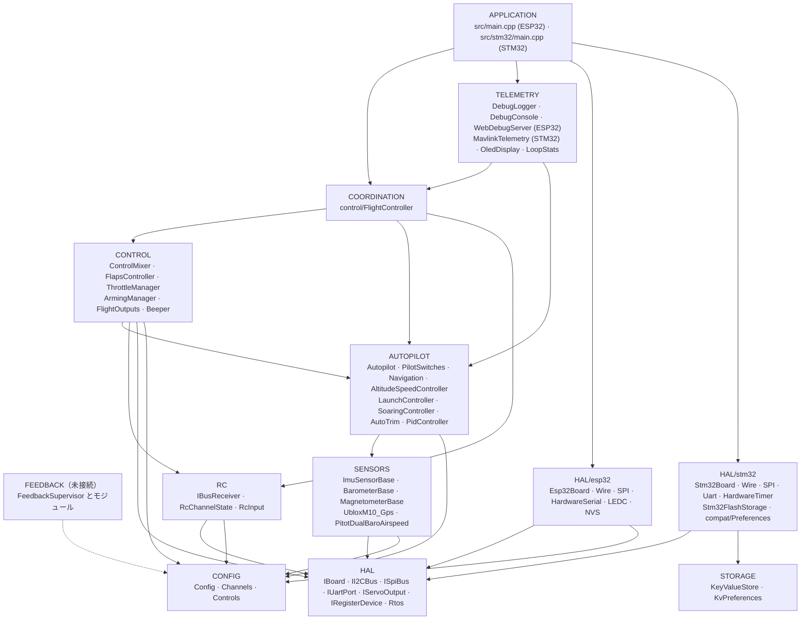
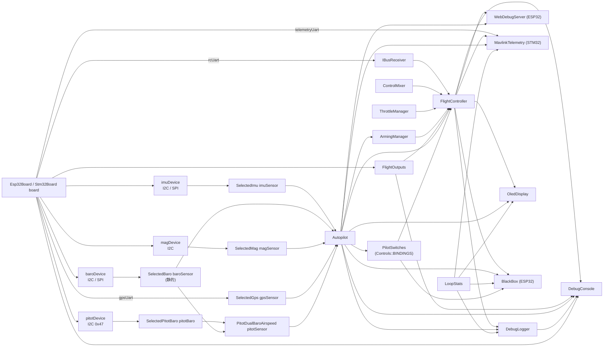
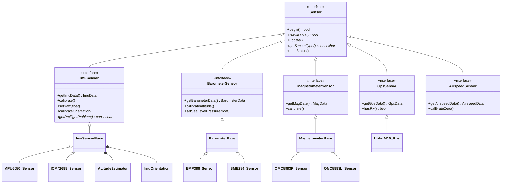
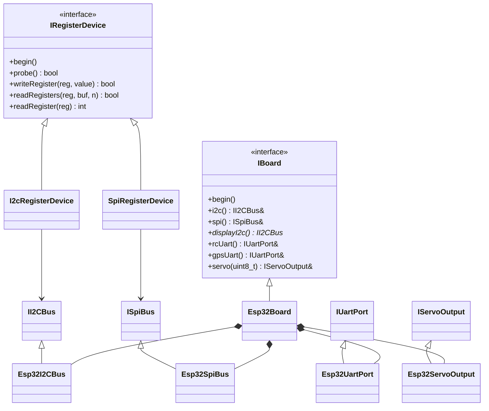
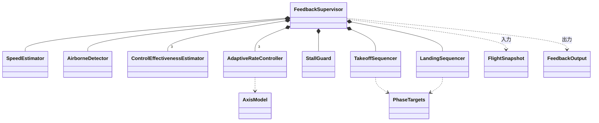
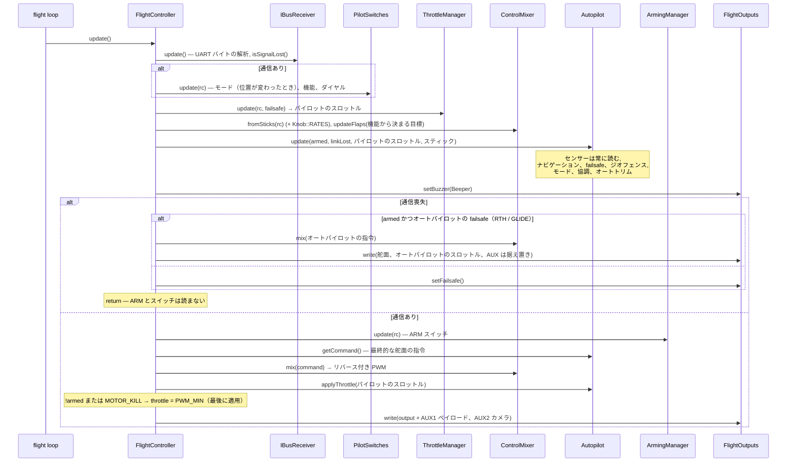
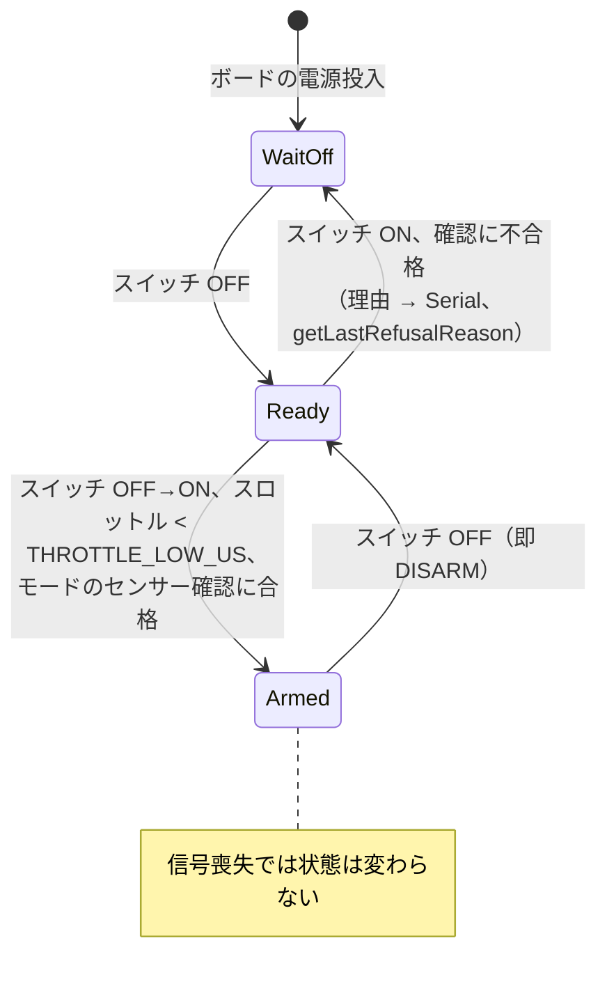
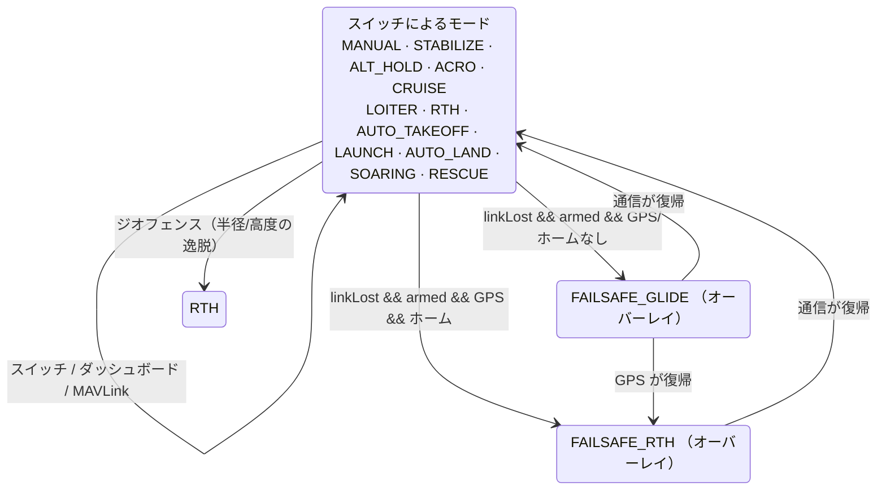
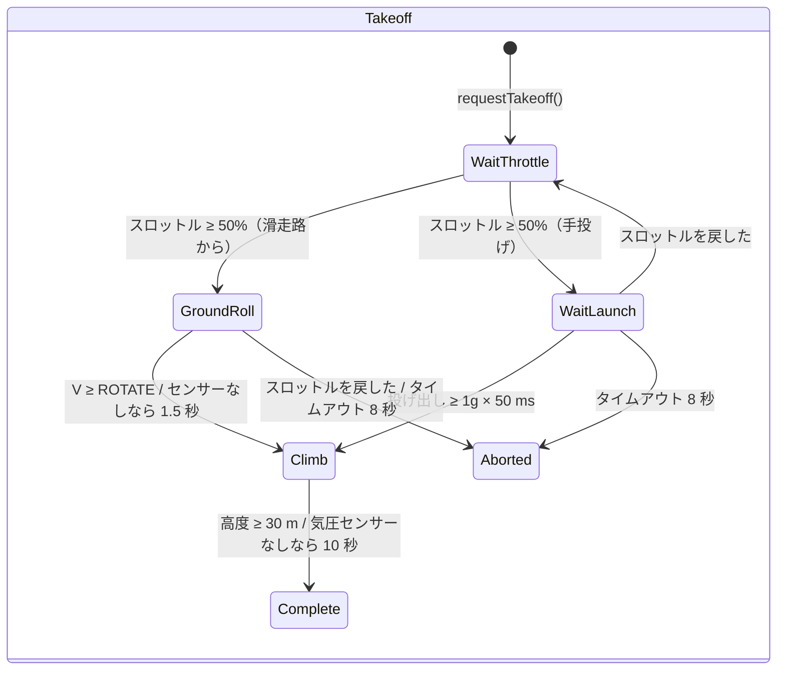
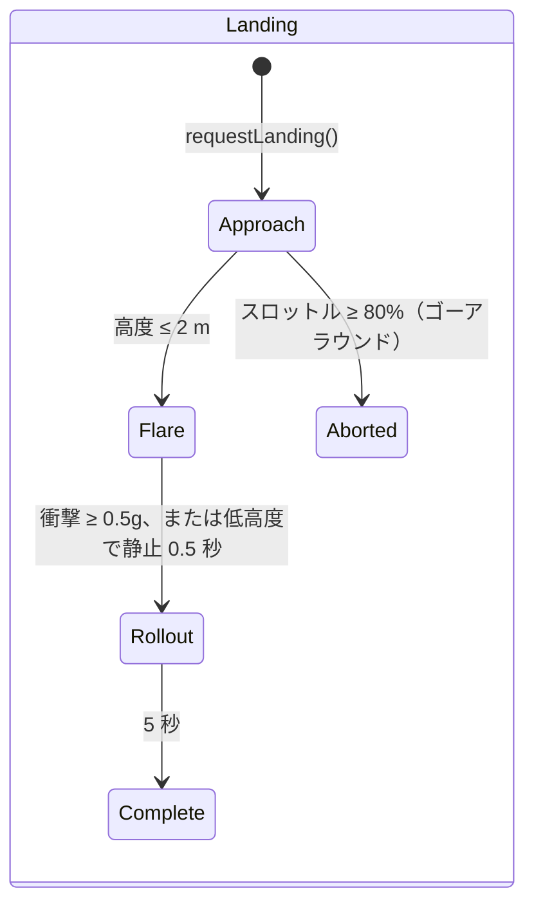

# ARCHITECTURE.md — OpenPlaneProject ファームウェアのアーキテクチャ

> 🌐 このページは[ロシア語の原文](../../ARCHITECTURE.md)の翻訳です。翻訳と原文に違いがある場合は、原文が優先されます。ファームウェアはコンソールメッセージをロシア語で出力するため、そのまま引用しています。

この文書は、**ファームウェア全体がどのように作られているか**を説明します。層と層の間の依存ルール、オブジェクトグラフ、FreeRTOS のスレッドモデル、1 周期あたりの処理の順序、ステートマシン、センサーの耐障害戦略、そして拡張ポイントです。各クラスの詳しいリファレンス（公開 API、フィールド、不変条件）は [`reference/`](reference/README.md) にあります。

関連文書：

| 文書 | 内容 |
|---|---|
| [`DEVELOPER_GUIDE.md`](DEVELOPER_GUIDE.md) | 実践ガイド：符号の規約、HTTP API、コンソール、センサー・モード・ボードの追加方法 |
| [`reference/`](reference/README.md) | すべてのクラス、構造体、名前空間のリファレンス |
| [`TESTING.md`](TESTING.md) | テスト：ネイティブ（PC 上、カバレッジ付き）とボード上 |
| [`PILOT_GUIDE.md`](PILOT_GUIDE.md) | 組み立て、ピン配置、送信機、初飛行 |
| [`ROADMAP.md`](ROADMAP.md) | プロジェクトの進む方向 |

> 状況：ESP32-S3 のベンチはすべてのセンサーで確認済みです。**オートパイロットは飛行では試験しておらず**、フィードバックループ（`autopilot/feedback/`）はファームウェアに**接続しておらず**、シミュレーションでのみ検証しています。

---

## 目次

1. [原則](#1-原則)
2. [層と依存ルール](#2-層と依存ルール)
3. [オブジェクトグラフ（composition root）](#3-オブジェクトグラフcomposition-root)
4. [クラスの階層](#4-クラスの階層)
5. [FreeRTOS のタスクとデータの分離](#5-freertos-のタスクとデータの分離)
6. [制御周期：`FlightController::update()`](#6-制御周期flightcontrollerupdate)
7. [ステートマシン](#7-ステートマシン)
8. [耐障害性：センサー、通信、出力](#8-耐障害性センサー通信出力)
9. [設定とビルドのバリエーション](#9-設定とビルドのバリエーション)
10. [フィードバックループ（未接続）](#10-フィードバックループ未接続)
11. [拡張ポイント](#11-拡張ポイント)
12. [テスト容易性](#12-テスト容易性)

---

## 1. 原則

| 原則 | 実現方法 |
|---|---|
| **ヘッダーのみの C++** | すべてのクラスは `include/<層>/` のヘッダーに定義されています。ファームウェアの翻訳単位は `src/main.cpp`（ESP32）または `src/stm32/main.cpp`（STM32）の 1 つだけです。飛行ループでは動的メモリを使いません（`String` は Web サーバーと OLED でのみ使用）。`.h/.cpp` に分割した版は別ブランチ `feature/split-headers` にあり、`tools/split_headers.py` が生成します。違いとファームウェアのサイズは、そのブランチの `docs/SPLIT_HEADERS.md` にあります。 |
| **Composition root** | `src/main.cpp` / `src/stm32/main.cpp` は、オブジェクトを生成して参照やポインターで結び付ける唯一の場所です。ここに飛行ロジックはありません。 |
| **1 行が 1 つのスイッチ** | 送信機の各チャンネルが何をするかは、表 `config/Controls.h`（`Bind::modes/mode/feature/knob`）で決まり、ビルド時に `static_assert` で検査されます。 |
| **依存性逆転** | 上位の層は、特定のチップや MCU ではなく、インターフェース（`IBoard`、`IRegisterDevice`、`ImuSensor*` など）に依存します。 |
| **null を許す依存** | オートパイロット、スイッチ（`PilotSwitches`）、すべてのセンサーはポインターで渡され、`nullptr` でも構いません。センサーがなくても、モードは落ちずに安全に振る舞います。 |
| **優先度による安全** | 周期内の処理の順序がそのまま優先度です：信号喪失 > ARM > スティック/オートパイロット > スロットル。スロットルに対する ARM の確認は最後に置かれます。 |
| **符号の体系は 1 つ** | IMU からサーボまで航空機の符号で統一し、各サーボの向きはちょうど 1 か所（`Config::*_REVERSED`）で決めます。 |
| **時間はパラメーターで** | 可能な場所（フラップ、フィードバックのモジュール）では、時間を `millis()` から読まず引数で渡します。これでクラスが決定的になり、テストしやすくなります。 |
| **正直な診断** | 各センサーと各出力は、「ビルドにない」（`attached`）と「あるが応答しない」（`available`）を区別します。これは JSON、ログ、OLED に表示されます。 |

---

## 2. 層と依存ルール



ルール：

1. **HAL は MCU を知っている唯一の層です。** `<Wire.h>`、`<SPI.h>`、`HardwareSerial` をインクルードし、`ledc*` / `HardwareTimer` / フラッシュを呼ぶのは `include/hal/esp32/` と `include/hal/stm32/` だけです。FreeRTOS のタスクは `hal/Rtos.h` を通して作ります（ESP32 ではコア 0、STM32 では優先度）。設定の保存：コードは `<Preferences.h>` を書き、ESP32 ではこれが NVS、STM32 では `storage/KeyValueStore.h` の上に作った `hal/stm32/compat/Preferences.h` になります。意図的な例外：`SpiRegisterDevice` は Arduino 標準の `pinMode/digitalWrite` で CS を切り替えます（ESP32 と STM32 で同じです）。
2. **センサードライバーはバスを知りません。** 受け取るのは `IRegisterDevice&`（I2C アドレスまたは SPI の CS）か `IUartPort&` です。バスは `sensors/SensorSelection.h` で選びます。
3. **RC と Outputs は飛行機のことを知りません**：iBUS のバイト → チャンネル、PWM の値 → 出力。
4. **Control と Autopilot** はデータに対する純粋なロジックです。UART も PWM も Wi-Fi もありません。
5. **Coordination**（`FlightController`）は、複数の下位層を同時に見て処理の順序を決める唯一のクラスです。
6. **Telemetry** は const のゲッター経由で状態を読むだけです。ダッシュボードからのコマンドは「メールボックス」を通り、飛行ループが適用します。MAVLink（`MavlinkTelemetry`）は飛行ループの中で直接動き、コマンドも自分で適用します。
7. **下位の層は上位の層を決してインクルードしません。** 下位のクラスが上位のクラスを必要とするなら、ロジックを `FlightController` に引き上げます。

`ArmingManager`（CONTROL）は `Autopilot` からモードを読みます。これが CONTROL → AUTOPILOT の唯一の水平方向の依存です。ARM の確認は、選ばれたモードがどのセンサーを必要とするかに依存するためです。

---

## 3. オブジェクトグラフ（composition root）

すべてのオブジェクトは静的記憶域期間のグローバルで、`src/main.cpp` で生成されます。それらの間の参照とポインターは**所有権を持ちません**。構築の順序は宣言の順序と一致します（翻訳単位は 1 つ）。



`setup()` での初期化の順序：

```
Serial (ESP32: 送信バッファ 4 KB; STM32: SERIAL_TX_BUFFER_SIZE=1024), 115200 → バナー
board.begin()               — I2C/SPI バス（2 本目の I2C があれば）
flightOutputs.begin()       — PWM チャンネル; すぐに setFailsafe()
[STM32] フラッシュから設定  — KeyValueStore::mount(), イメージの CRC
setupSensors()              — 各センサーの begin(); 応答したものの校正:
                              IMU (2 s 静止 + 飛行前チェック),
                              気圧センサー (高度ゼロ), コンパス (初期針路 → IMU の yaw),
                              ピトー管 (ゼロ点はループの最初の 1 秒で取得)
autopilot.begin()           — NVS/フラッシュからトリム
flightController.begin()    — setFailsafe() + UART iBUS
oledDisplay.begin(...)      — 専用タスク (hal/Rtos.h)
[ESP32] webDebugServer.begin() — アクセスポイント + コア 0 上の専用タスク
[ESP32] blackBox.begin()   — blackbox パーティション, PSRAM 上のキュー, コア 0 上の bbox タスク
[STM32] mavlink.begin()     — 無線モデムの UART4
[STM32] setupBlackBox()    — SD カード, BLACKBOX.BIN ファイル, blackBox.begin(), bbox タスク
pilotSwitches.printBindings() — どのスイッチに何があるか
debugLogger.begin()         — ログの設定
[STM32] flight / storage タスク → vTaskStartScheduler()
```

---

## 4. クラスの階層

### センサー



基底クラス（`ImuSensorBase`、`BarometerBase`、`MagnetometerBase`）は **Template Method** パターンを実装しています。公開の `update()`/`calibrate()` は 1 度だけ書かれ、チップのドライバーは保護された「プリミティブ」（`readSample()`、`isNewSampleReady()`、`readRaw()`、スケール）だけを実装します。

### HAL



### フィードバックループ



---

## 5. FreeRTOS のタスクとデータの分離

**ESP32**（2 コア、FreeRTOS は Arduino コアに組み込み）：

| コア | タスク | 内容 | 周期 |
|---|---|---|---|
| 1 | Arduino `loopTask` → `loop()` | `WebDebugServer::applyPendingCommands()` → `FlightController::update()` → `DebugLogger::update()` → `DebugConsole::update()` → `LoopStats::record()` → `BlackBox::update()` | `Config::LOOP_PERIOD_MS` = 2 ms（500 Hz）、`vTaskDelayUntil` |
| 0 | `web`（スタック 8 KB、優先度 1） | `WebServer::handleClient()` | 2 ms ごと（`vTaskDelay`） |
| 0 | `oled`（スタック 4 KB、優先度 1） | 2 本目の I2C バスでの `OledDisplay::draw()` | 200 ms（`vTaskDelayUntil`） |
| 0 | `bbox`（スタック 6 KB、優先度 2） | `BlackBox::writerStep()`：キューから 1 ページをフラッシュへ。地上では消去 | 各周期のあとに `loop()` から通知（なければ 20 ms に 1 回） |
| 0 | ESP-IDF の Wi-Fi スタック | アクセスポイント | — |

**STM32H743**（1 コア、STM32duino の FreeRTOS、優先度によるプリエンプション）：

| 優先度 | タスク | 内容 | 周期 |
|---|---|---|---|
| 5 | `flight`（16 KB） | `FlightController::update()` → `MavlinkTelemetry::update()` → `DebugLogger::update()` → `DebugConsole::update()` → `LoopStats::record()` | 2 ms、`vTaskDelayUntil` |
| 1 | `oled`（4 KB） | 2 本目の I2C バスでの `OledDisplay::draw()` | 200 ms |
| 1 | `storage`（2 KB） | `Stm32FlashStorage::service()`：設定セクターの消去と書き込み | 100 ms |
| 2 | `bbox`（8 KB） | `BlackBox::writerStep()`：キューから 1 ページを SD カードへ。地上では消去。飛行タスクにプリエンプトされる | 各周期のあとに通知（なければ 20 ms に 1 回） |

**データ分離のルール：**

- `web` と `oled` のタスクは、状態（`FlightController`、`Autopilot`、`LoopStats`、センサー）を const のゲッター経由で**読むだけ**です。フィールドは個別の 16/32 ビット値なので「引き裂かれた」読み出しは起こりません。最悪でも、隣り合う周期の値が見えるだけです。
- ダッシュボードの**コマンド**（`/api/setmode`、`/api/setpid`）は、`web` タスクから**直接は適用されません**。`portMUX` のスピンロックの下で `PendingCommands` に置かれ、飛行ループが `applyPendingCommands()` で取り出します。オートパイロットの変更は、常にそれを所有するタスクのコンテキストで行われます。
- `LoopStats::hz/avgUs/maxUs` は `volatile uint32_t` で、`takePeakUs()` は `loop()` からのみ呼ばれます。
- `OledDisplay` はバスへのポインターを静的変数に保持します（U8g2 の C コールバックはコンテキストを受け取らないため）。機体に載る画面は 1 つです。

**リアルタイム性：**

- 周期は、作業のあとの `delay()` ではなく `vTaskDelayUntil` で保ちます。長いブロック（コンソールからの校正など、100 ms 超）のあとは、カウントをやり直します。逃した周期をまとめて取り戻すことはしません。
- I2C トランザクションのタイムアウトは 5 ms です（`Wire` の標準は 50 ms）。
- 4 KB の送信バッファを持つ `Serial`：ログの 1 行でループが止まることはありません。
- ブラックボックス：ループはスナップショットをキューに置くだけです（スピンロック、マイクロ秒）。フラッシュへのページ書き込み（両コアが約 0.6〜0.9 ms 停止）は、`bbox` タスクが周期の直後、ループの空き時間に行います。フラッシュの消去は ARM なし・記録なしのときだけで、空中では決して行いません。
- ESP32：フラッシュへの書き込み（NVS、Wi-Fi の設定）は両コアを約 0.3〜0.4 s 止めます。そのため、Wi-Fi は `persistent(false)`、ログ設定の保存は ARM なしのときだけ、校正も ARM なしのときだけ、オートトリムは DISARM のあとで、しかも飛行機が止まっているときだけ行います（`Autopilot::looksLanded()`）。
- STM32：`Preferences::end()` はイメージをコピーするだけ（マイクロ秒）で、セクターの消去（秒単位）は `storage` タスクで行います。設定セクターはフラッシュのバンク 2、コードはバンク 1 にあるため、飛行タスクは書き込みをプリエンプトして動き続けられます。
- MAVLink はループを止めません。フレームは UART バッファに空きがあるときだけ送信し（`IUartPort::availableForWrite()`）、なければ次の周期まで待ちます。

---

## 6. 制御周期：`FlightController::update()`



周期の主な不変条件：

- **信号喪失**：スイッチによるモードと機能は変わりません。ARM は読まれず、リセットもされません。モーターはオートパイロットの failsafe の判断（モーター付きの RTH）または `FAILSAFE_THROTTLE` によってのみ動きます。
- **どのモードも ARM をすり抜けてスロットルを通すことはできません**：`!armed` と `MOTOR_KILL` のときの強制 `PWM_MIN` は、`Autopilot::applyThrottle()` のあとに置かれています。
- **オートパイロットが最終的な指令を出します**（`getCommand()`）。スタビライゼーションのモードでは、スティックは目標の角度です。補正 = 指令 − スティック（ログとダッシュボード用）。ミキサーまでは、すべてが 1 つの符号体系（`ControlCommand`）です。

---

## 7. ステートマシン

### ARM (`ArmingManager`)



`WaitOff` = `armed == false && switchSeenOff == false`; `Ready` =
`armed == false && switchSeenOff == true`.

### オートパイロットのモード（`Autopilot` + `PilotSwitches`）

12 のモード（`AutopilotTypes.h`）。それぞれの動作は [AUTOPILOT_GUIDE.md](AUTOPILOT_GUIDE.md#モード) にあります。モードは `PilotSwitches` が `config/Controls.h` の表に従って選びます。モード用スイッチ（`Bind::modes`）と、「上に重ねるモード」のスイッチ（`Bind::mode`、上の行が優先）です。`setMode()` が呼ばれるのは、スイッチの**結果が変わったとき**だけです。そのため、ダッシュボードや GCS で選んだモードは、パイロットがスイッチを操作するまで保たれます。



failsafe は独立した `AutopilotMode` ではなく、現在のモードに重なるフラグです。始まった帰還は、GPS の短い喪失で滑空に切り替わることはありません。通信が戻ると、スイッチによるモードが続きます（自動離陸と手投げ発進は、最初からやり直しのみ）。内部のステートマシンは、`LaunchController`（IDLE → READY → THROWN → CLIMB → DONE）と `SoaringController`（GLIDE → THERMAL → MOTOR_CLIMB → RETURN）です。

**AUTO_TAKEOFF**（開始からの時間に基づく。armed かつスロットル ≥ 1500 µs のとき）：

| 時間 | スロットル（プログラム） | ピッチ |
|---|---|---|
| 0–1 秒 | 0 → 100 % へなめらかに | 0° |
| 1–3 秒 | 100 % | +15° |
| > 3 秒 | 100 % | +10° |

### 離陸と着陸（フィードバックループ、未接続）





---

## 8. 耐障害性：センサー、通信、出力

### センサー

| センサー | `isAvailable()` が `false` になる条件 | 読み出しに失敗したときの動作 |
|---|---|---|
| IMU（`ImuSensorBase`） | `begin()` がチップを識別できなかった、**または**読み出しエラーが 50 回連続（500 Hz で約 0.1 秒） | データは上書きされず、`errorCount++`。回復すれば再び利用可能になる |
| 気圧センサー（`BarometerBase`） | 100 回連続のエラー（5 ms ごとの問い合わせで約 0.5 秒） | 同上 |
| コンパス（`MagnetometerBase`） | 25 回連続のエラー（50 Hz で約 0.5 秒） | 同上 |
| GPS（`UbloxM10_Gps`） | 有効な NAV-PVT が 1 つもない、**または**最後のものが `GPS_TIMEOUT_US`（2 秒）より古い | — |

加えて、IMU には**飛行前チェック**（`getPreflightProblem()`）があります。ジャイロ校正中の静止、|a| ≈ 1g、「上」の向きが保存済みの取り付けと一致していることです。通らなかった場合は `Autopilot::imuReady() == false` となり（滑空を含むすべてのモードで補正がゼロ）、`ArmingManager` はスタビライゼーションを使うモードの ARM を許可しません。

利用側の反応はどれも同じです。**センサーがない（`nullptr`）か、利用できない場合は何も起こらず**、飛行機は MANUAL のように操縦されます。

### 通信（`IBusReceiver::isSignalLost()`）

独立した 2 つの判定があります。

1. `RX_TIMEOUT_US`（500 ms）を超えて正しいフレームがない、または電源投入から 1 つも来ていない。
2. フレーム内のスロットルが `RX_FAILSAFE_THROTTLE_US`（950 µs）を下回る。送信機に設定されたフェイルセーフです（FS-iA6B は、送信機が失われてもフレームの送信をやめません）。

CRC の誤ったフレームは破棄され、数えられます（`getBadFrameCount()`）。

### 出力

`FlightOutputs::begin()` の直後に `setFailsafe()` が呼ばれ、センサーを読むより前に、舵面はニュートラル、モーターは停止になります。ピンが `-1` の出力（C3 の方向舵）は、単に接続されません。JSON の `attached` は、LEDC チャンネルが割り当てられたかどうかを示します。各ピンの実際のパルスは `printPulseSelfTest()`（コンソールの `p`）で確認します。

---

## 9. 設定とビルドのバリエーション

| 項目 | 場所 | 選び方 |
|---|---|---|
| ボード（ピン） | `include/config/Config.h` | `platformio.ini` の `[env:*]` から渡されるマクロ `BOARD_ESP32_S3` / `BOARD_ESP32_C3` / `BOARD_ESP32_CLASSIC` / `BOARD_STM32H743` |
| すべての設定（タイムアウト、舵面の可動量、リバース、failsafe、Wi-Fi） | `Config.h`、名前空間 `Config` | `constexpr`、ファイルを編集 |
| RC チャンネルの割り当て | `include/config/Channels.h` | ファイルを編集 |
| センサーとバス | `include/sensors/SensorSelection.h` | `#define SENSOR_IMU/BARO/MAG/GPS`。`-D` フラグでも指定可能 |
| フィードバックの定数 | `include/autopilot/feedback/FeedbackConfig.h` | 接続時に `Config.h` へ移る |
| IMU の取り付け | NVS（`imu_mpu6050` / `imu_icm42688`）または `Config::IMU_ROTATION_CW_DEG` | コンソールのコマンド `o` |
| コンパスの校正 | NVS（`qmc5883p` / `qmc5883l`） | コンソールのコマンド `m` |
| ログの設定 | NVS（`debuglog`） | コンソールのメニュー `l` |
| ブラックボックス | `Config.h`（`BLACKBOX_*`）、`partitions_blackbox.csv` の `blackbox` パーティション | フライト：`tools/blackbox.py`、コンソールのメニュー `k` |

PlatformIO の環境：

| `env` | 用途 |
|---|---|
| `esp32-s3`（既定） | 主力のフライトコントローラー |
| `esp32-c3` | 古い試作機 |
| `esp32-dev` | 標準の ESP32、ベンチ用 |
| `stm32h743` | STM32H743VIT6：完全なファームウェア（`src/stm32/main.cpp`）、設定はフラッシュ、MAVLink、SD 上のブラックボックス、FreeRTOS。素の基板で確認済み。[reference/hal.md](reference/hal.md#stm32h743-向けの実装) を参照 |
| `stm32h743-devebox` | DevEBox H743：同じ構成で、コンソールは USB CDC、書き込みは DFU（[DEVELOPER_GUIDE](DEVELOPER_GUIDE.md#stm32h743)） |
| `native` | Arduino/ESP-IDF のフェイクとカバレッジを使う、PC 上のビルドとテスト。[`TESTING.md`](TESTING.md) を参照 |

---

## 10. フィードバックループ（未接続）

`include/autopilot/feedback/` は、PID によるスタビライゼーションを将来置き換えるものです。軸のモデル `ε = b·u + a·ω + c` を、飛行中に再帰最小二乗法で学習し（`ControlEffectivenessEstimator`）、コントローラーは、学習したモデルを通した角度 → 角速度 → 角加速度 → 舵のカスケードです（`AdaptiveRateController`）。その上に失速防止（`StallGuard`）と、離陸・着陸の段階があります。

入力は `FlightSnapshot`（周期ごとのスナップショット）だけ、出力は `FeedbackOutput` だけです。モジュールはセンサーや RC を直接読まないため、閉ループシミュレーション（`test/test_feedback`）で、PC でもボード上でも検証できます。

`FeedbackSupervisor::update()` での 1 周期あたりの順序：

1. 速度と前後方向の加速度（`SpeedEstimator`）、空中にいるか（`AirborneDetector`）。
2. 軸ごとのモデルの学習（空中で、IMU が生きていて、フラップが動いておらず、失速していないときのみ）。
3. 失速防止（着陸時は地面近くで無効）。
4. 離陸・着陸の段階の目標。
5. 目標 ← 失速防止による制限。
6. 各軸のコントローラー → 舵面の振れ。スロットル（通信が生きているときのみ）。

接続の計画は [`DEVELOPER_GUIDE.md`](DEVELOPER_GUIDE.md#接続計画) にあります。

---

## 11. 拡張ポイント

| 作業 | 変更するもの | 変更しないもの |
|---|---|---|
| 既存カテゴリの新しいチップ | 基底クラスから作る新しい `*_Sensor.h` + `SensorSelection.h` の分岐 | `main.cpp`、`Autopilot` |
| 新しいセンサーのカテゴリ | `SensorInterface.h` のインターフェース、`Autopilot` の null 許容ポインター、JSON の `attached/available` フィールド | それ以外のコード |
| オートパイロットの新しいモード | `AutopilotMode`、`handle*Mode()`、`applyThrottle()`、セレクター/ダッシュボード、`ArmingManager::checkFailureReason()` | `FlightController` |
| 新しい出力（サーボ） | `FlightOutputs::outputInfo()` の 1 行、`FlightOutputState` のフィールド、`ServoChannel` のインデックス、`Esp32Board` のピンと LEDC チャンネル | 書き込み/状態のループ |
| 新しい ESP32 ボード | `Config.h` の `#elif`、`platformio.ini` の `[env:*]` | それ以外のコードすべて |
| 別の MCU | `IBoard` を実装する `hal/<mcu>/<Mcu>Board.h`（例：`hal/stm32/`）、`Config.h` のピンのブロック、`[env:*]` | センサー、飛行ロジック |
| 別の受信機プロトコル | 同じ API（`getState()`、`isSignalLost()`）を持つものへ `IBusReceiver` を置き換え | `FlightController` |
| 新しいログチャンネル | `LogChannel`、`LogSettings::info()` の 1 行、`DebugLogger::format*()`、`VERSION++` | — |

---

## 12. テスト容易性

HAL のインターフェースと、時間をパラメーターで渡す設計のおかげで、ロジックの大部分はハードウェアなしで検証できます。

- **ネイティブテスト**（`pio test -e native`）は、Arduino、FreeRTOS、Wire/SPI/UART/LEDC、Preferences、WebServer/WiFi、U8g2 のフェイク（`test/native/support/`）を使って、ファームウェアのヘッダーを PC でビルドします。カバレッジは `gcovr` が集計します。
- **ファームウェア全体を PC で** — S3 と 38 ピンのピン配置で各センサーセット（チップのレジスタレベルのエミュレーター）を使う `src/main.cpp` と、STM32duino のフェイク層の上で動く `src/stm32/main.cpp`（`pio test -e native-stm32`）。
- **閉ループのフライトシミュレーション**（`test/native/test_sim`）：ファームウェア全体が機体モデルを操縦します。オートパイロットのどのモードも、「数値を出す」だけでなく実際に飛びます。
- **ビルドマトリクス**（`tools/build_matrix.sh`）：すべてのボード × すべてのセンサー、警告なし。
- **ボード上のテスト**（`pio test -e esp32-s3`）：同じ `test_feedback` と `test_imu_orientation` が、実機の ESP32-S3 でも動きます。

詳細、テストの構成、コマンドは [`TESTING.md`](TESTING.md) にあります。
