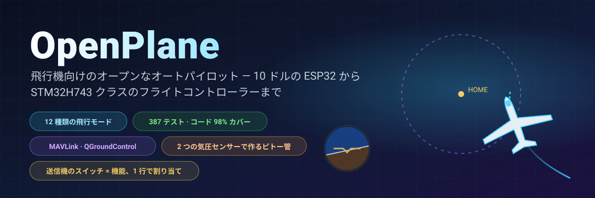
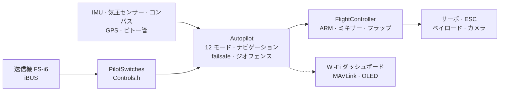

<!-- i18n-bar:start -->
  <p align="center">
    <a href="../../../README.md"> Читать на русском</a>
    &nbsp;·&nbsp;
    <a href="../en/README.md"> Read this in English</a>
    &nbsp;·&nbsp;
    <a href="../zh-CN/README.md"> 阅读中文版</a>
    &nbsp;·&nbsp;
    <a href="../es/README.md"> Lee esto en español</a>
  </p>
  <p align="center">
    <a href="../hi/README.md"> हिन्दी में पढ़ें</a>
    &nbsp;·&nbsp;
    <a href="../ar/README.md"> اقرأ بالعربية</a>
    &nbsp;·&nbsp;
    <a href="../pt-BR/README.md"> Leia em português</a>
    &nbsp;·&nbsp;
    <a href="../fr/README.md"> Lire en français</a>
  </p>
  <p align="center">
    <a href="../de/README.md"> Auf Deutsch lesen</a>
    &nbsp;·&nbsp;
     <b>日本語で読む</b>
    &nbsp;·&nbsp;
    <a href="../ko/README.md"> 한국어로 읽기</a>
  </p>
<!-- i18n-bar:end -->

<p align="center"><sub>🌐 <a href="../../../README.md">ロシア語版 README</a> の翻訳です。詳細なドキュメントも翻訳されており、以下のリンクは翻訳済みのページに移動します。翻訳と原文に違いがある場合は、原文が優先されます。コンソールメッセージ、スクリーンショット、グラフの文字はまだロシア語です。 この翻訳は AI によるもので、ネイティブスピーカーによる確認は行っていません。誤りを見つけたら、<a href="https://github.com/damir-lebedev">Damir Lebedev</a> までご連絡いただくか、<a href="https://github.com/damir-lebedev/OpenPlaneProject/issues">Issue</a> でお知らせください。</sub></p>

<p align="center">
  
</p>

<p align="center">
  
  
  
  <br>
  
  
  
  <a href="LICENSE.md"></a>
</p>

<h3 align="center">送信機を切ると、飛行機は自分で帰還して頭上を旋回します。</h3>
<p align="center">これはアニメーションではありません。<b>ファームウェア全体</b>が、飛行機モデルをクローズドループで飛ばしています。入力には同じ iBUS のバイト列、出力には同じ PWM です。</p>

<p align="center">
  
</p>

---

## ⚡ 30 秒でわかる

| | |
|---|---|
| **これは何か** | ラジコン飛行機向けのオープンなフライトコントローラー兼オートパイロットです。現在は約 10 ドルの ESP32-S3 で、次のステップは STM32H743（Pixhawk クラスのボード）です。完全なファームウェアはテストを通過しており、DevEBox ボード上では**すでに動作して送信機で操縦できます**（[動画あり](#-stm32h743-がボード上で動き出した)）。 |
| **できること** | 12 種類の飛行モード。スタビライズから帰還、GPS による旋回、手投げ発進、自動着陸、そして**サーマル・ソアリング**まで。安価な気圧センサー 2 個で作るピトー管。QGroundControl と Mission Planner 向けの MAVLink テレメトリー。 |
| **最大の特徴** | 送信機のどのスイッチやダイヤルにも、どんな機能でも割り当てられます。`Controls.h` に**1 行**書くだけで、SwD は RTH ではなくペイロード投下になります。 |
| **信頼できる理由** | 自動テストは 387 件（これとは別に、実物の SD カードを使うボード上のテストが 9 件）、コードの 98% をテストでカバー、「ボード × センサー」24 通りのビルドは警告ゼロ、全モードのクローズドループ・シミュレーション。 |
| **正直なところ** | これまでに実際に飛んだのは手動モードだけです（最初の試作機）。STM32H743 は今のところ、センサーなしでテストベンチ上でしか確認していません。オートパイロットはテストベンチ、テスト、シミュレーションで検証済みで、飛行試験を待っている段階です（[現状は下記](#-正直な現状)）。 |

---

## 🎛️ スイッチ＝機能、1 行で

```cpp
// include/config/Controls.h
constexpr Binding BINDINGS[] = {
    Bind::modes  (Channels::SWC, MODE_MANUAL, MODE_STABILIZE, MODE_AUTO_TAKEOFF),
    Bind::feature(Channels::SWB, Feature::FLAPS),
    Bind::mode   (Channels::SWD, MODE_RTH),              // スイッチが入っている間は帰還
    Bind::knob   (Channels::VRA, Knob::STAB_GAIN),       // 「ソフト / ハード」を飛行中にそのまま調整
    Bind::knob   (Channels::VRB, Knob::CRUISE_SPEED),
};
```

SwD を RTH ではなくサーマル・ソアリングにしたいですか？ `Bind::mode(Channels::SWD, MODE_SOARING)` と書きます。SwB でペイロード投下なら `Bind::feature(Channels::SWB, Feature::PAYLOAD_DROP)` です。間違えた場合（たとえば 1 つのスイッチに 2 つのモードを割り当てたり、スティックを使ってしまったり）は、**ビルドが通りません**。表はコンパイラが検査します（`static_assert`）。電源を入れると、機体自身がどのスイッチに何が割り当てられているかを表示します。

**12 モード · 10 機能 · 7 つのダイヤル**。すべて[オートパイロット・リファレンス](AUTOPILOT_GUIDE.md)に例付きで載っています。

---

## ✈️ オートパイロットにできること

| | モード | 概要 |
|---|---|---|
| 🕹️ | **MANUAL** | 舵面＝スティック。フライトコントローラーがないときと同じ |
| 🧭 | **STABILIZE** | スティックで角度を指定。離すと機体が自分で水平に戻る |
| 📏 | **ALT_HOLD** | ＋気圧センサーで高度を保つ |
| 🌀 | **ACRO** | スティックで回転速度を指定。曲技飛行向け |
| 🛣️ | **CRUISE** | 針路・高度・速度を自動で保つ。スティックは微調整だけ |
| ⭕ | **LOITER** | GPS の地点の上を旋回（半径はダイヤルで調整） |
| 🏠 | **RTH** | 高度 40 m で帰還し、頭上を旋回。通信が切れると自動で作動 |
| 🛫 | **AUTO_TAKEOFF** | パイロットのスロットル操作で滑走路から離陸 |
| 🤾 | **LAUNCH** | 手投げ発進：投げた後にモーターが回り、上昇する |
| 🛬 | **AUTO_LAND** | 滑空して、地面近くでフレア |
| 🦅 | **SOARING** | モーター停止。サーマルを見つけて、その中で旋回する |
| 🆘 | **RESCUE** | 「助けて」：翼を水平に、機首を上げる。どんなスパイラルからでも回復 |

ほかにも、ジオフェンス、「曲がった」機体のためのオートトリム、旋回の協調、ピトー管による失速防止、フラップとエアブレーキ、ペイロード投下、安定化されたカメラ、「草むらで私を探して」ブザーがあります。

---

## 📈 すべてのモードが飛ぶ——クローズドループで

「関数が数値を返した」ではなく、**飛行**そのものです。送信機 → iBUS フレーム → ファームウェア → PWM → 舵面の動き → 揚力・失速・風・サーマルを備えた飛行機モデル → センサー → 再びファームウェア。こうした飛行 14 本が、通常のテスト（`pio test -e native`）に含まれています。

<p align="center"></p>

<table>
  <tr>
    <td width="50%"></td>
    <td width="50%"></td>
  </tr>
  <tr>
    <td>🦅 サーマルを自分で見つけ、<b>モーターを止めたまま</b>高度を稼ぎました。全エネルギー型バリオメーターは、「スティックを引いた」ことを上昇気流と取り違えません。</td>
    <td>🆘 バンク 60° でも、数秒で水平に戻ります。RESCUE は、バンク 70°・機首 −40° のスパイラルからも機体を引き上げます。</td>
  </tr>
  <tr>
    <td></td>
    <td></td>
  </tr>
  <tr>
    <td>🤾 手で投げる → 手がプロペラから離れてからモーターが回る → 上昇。🛬 着陸：滑空して、高度 3 m でフレア。</td>
    <td>🌬️ <b>ノイズの多い</b>気圧センサー 2 個で作った管による対気速度。チップ間に 150 Pa のずれがあっても、誤差は 0.5 m/s 未満です。</td>
  </tr>
</table>

---

## 🌬️ 小銭で作るピトー管

まともな対気速度センサーは、フライトコントローラーの半分ほどの値段がします。ここでは**気圧センサーを 2 個**使います。管の中の BMP581（全圧）と、胴体内のメイン気圧センサー（静圧）です。ファームウェアは地上で 2 つのチップの差を自分でゼロ合わせし、フィルタをかけ、高度と気温から空気密度を計算し、チューブの接続の取り違えにも気づきます。その結果、CRUISE はスロットルではなく**対気**速度を保ちます。失速防止も働き、テレメトリーの速度も信頼できます。作り方は[リファレンス](AUTOPILOT_GUIDE.md#自作ピトー管)にあります。

---

## 📡 地上局：ブラウザーまたは QGroundControl

<table>
  <tr>
    <td width="46%"></td>
    <td>
      <b>ESP32：機体から直接開く Web ダッシュボード。</b>アクセスポイント <code>OpenPlane-Debug</code>、アドレス <code>192.168.4.1</code> で、送信機のチャンネル、出力、全センサー、モード、ナビゲーションを確認でき、モード切替や PID の調整も飛行中にできます。アプリも追加のハードウェアも不要です。<br><br>
      <b>STM32H743：無線モデム経由の MAVLink。</b>QGroundControl と Mission Planner は、この機体を ArduPilot の飛行機として扱います。水平線、ホーム地点付きの地図、ピトー管による速度、ArduPlane の名前のモード、パラメーター画面の PID、ボタンでのモード切替が使えます。地上からの ARM はできず、スイッチでのみ行えます。その方が安全だからです。<br><br>
      MAVLink のフレームは、リファレンス実装の <code>pymavlink</code> とバイト単位で照合してあります。
    </td>
  </tr>
</table>

---

## 📼 ブラックボックス

ボードはすべてのフライトを記録します。500 Hz の IMU、姿勢角とオートパイロットの判断、PID、すべての出力、スティック、気圧センサー、コンパス、GPS、バッテリー、イベントを、ARM とスロットルから着陸まで、開始の 10 秒前から残します。**ESP32-S3** は内蔵フラッシュ（13.9 MB、約 11 分）に、**STM32H743** は SD カード（64 MB、約 1 時間）に書き込みます。SD カードは普通の FAT32 のままで、ファームウェアは事前に作っておいたファイル `BLACKBOX.BIN` に書き込みます。消去は地上でのみ行われます。飛行後は `python tools/blackbox.py download` で USB 経由でフライトをダウンロードして CSV に展開できます。SD カードのフライトは、ボードなしでも解析できます：`python tools/blackbox.py ring E:/BLACKBOX.BIN`。詳しくは [BLACKBOX.md](BLACKBOX.md) をご覧ください。

---

## 🔩 ハードウェア：1 つのファームウェア、4 種類のボード、12 種類のセンサー

| ボード | 状態 | 確認できたこと |
|---|---|---|
| **ESP32-S3 N16R8** | ✅ メイン、テストベンチ | 全センサー、サーボ、iBUS、OLED、ダッシュボードを実機で確認。ファームウェア全体はテストで確認 |
| **ESP32 38-pin** | 🧪 テスト | ICM-45686 セットでファームウェア全体をテストで確認 |
| **ESP32-C3 SuperMini** | ✈️ 飛行実績あり（手動） | 最初の試作機。全セットのビルド |
| **STM32H743VIT6** | 🔧 センサーなしの DevEBox ボード＋🧪 テスト | ボード上：起動、USB コンソール、**SD カードとブラックボックス**（ボード上のテスト）、**iBUS 受信、ARM、送信機によるサーボとモーターの制御**（起動の様子は動画あり）。PC 上：ファームウェア全体（FreeRTOS タスク、フラッシュ、MAVLink、I2C、SPI）。ボードにはまだセンサーを接続していません |

| センサー | 内容 | バス |
|---|---|---|
| **LSM6DSV** + **QMC6309** | IMU＋コンパス（モジュール） | I2C / SPI |
| **ICM-45686** + **QMC6309** | IMU＋コンパス（代替） | I2C / SPI |
| **SPL06-001** | 胴体の気圧センサー | I2C / SPI |
| **BMP581** | ピトー管の気圧センサー（またはメイン） | I2C / SPI |
| MPU6050/6500, ICM-42688, BMP388, BME280, QMC5883P/L | テストベンチ用と旧型 | I2C / SPI |
| **u-blox M10** | GPS、10 Hz、UBX | UART |

センサーは 1 行（`SENSOR_KIT_LSM6DSV_PITOT`）で、ボードはビルドフラグ 1 つで切り替えられます。4 種類のボード × 6 種類のセンサーセットが、すべて警告なしでビルドできます：[`tools/build_matrix.sh`](../../../tools/build_matrix.sh)。

<table>
  <tr>
    <td width="50%"></td>
    <td width="50%"></td>
  </tr>
  <tr>
    <td>ESP32-S3 のテストベンチ：IMU、気圧センサー、コンパス、OLED、サーボ、受信機。</td>
    <td>モーターとプロペラの組み合わせのテスト。</td>
  </tr>
</table>

### 🎥 STM32H743 がボード上で動き出した

STM32H743 のファームウェアは、**センサーを 1 つも付けていない** DevEBox ボード上で動作し、普通の送信機で操縦できます。iBUS 受信機、ARM、サーボ、モーターが、手動モードでスティックとスイッチに反応します。起動の一部始終を動画に撮ってあります。

▶️ **[起動の動画を見る](https://t.me/lisnmylife/420)**

これで証明できたのは、「送信機 → iBUS → ファームウェア → PWM」という経路が、テストの中だけでなく実機でも動くことです。まだ証明できていないのは、このボードにセンサー（IMU、気圧センサー、GPS）を接続していないため、オートパイロットのモードをまだ試していないことです。

---

## 🧪 検証できる品質

| | |
|---|---|
| **自動テスト 387 件** | モジュール、チップのレジスタ単位で検証したドライバー、クローズドループの飛行、PC 上で ESP32 と STM32 の**ファームウェア全体**。さらに、実物の SD カードを使う STM32 ボード上のテスト 9 件 |
| **行カバレッジ 98.3%、分岐カバレッジ 87.7%** | `gcovr` によるカバレッジ（STM32 のコードを含む） |
| **24/24 ビルド** | 4 種類のボード × 6 種類のセンサーセット、`-Wall -Wextra`、警告ゼロ |
| **指摘 0 件** | 全コードに対する cppcheck と clang-tidy |
| **コードの複製ではなく、リファレンス** | センサーの式はデータシート（Bosch、ST、TDK、Goertek）に、MAVLink は pymavlink に準拠 |

```bash
pio test -e native -e native-stm32   # すべてのテスト、約 1.5 分、ハードウェア不要
```

詳しくは [TESTING.md](TESTING.md) をご覧ください。

---

## 🧠 しくみ



- **Header-only C++**、翻訳単位は 1 つ、飛行ループでは動的メモリを使いません。`.h/.cpp` の方がお好みですか？ そんな方のために、並行ブランチ [`feature/split-headers`](https://github.com/damir-lebedev/OpenPlaneProject/tree/feature/split-headers) があります。このブランチからスクリプトで生成していて、LTO 付きのファームウェアのサイズは同じです。
- **HAL**：マイコンのことを知っている唯一の層です。新しいボードに必要なのは新しい `Board` であり、オートパイロットの書き直しではありません。
- **センサードライバーはバスを知りません**。1 つのクラスが I2C でも SPI でも動きます。
- **安全は処理の順序で守ります**：通信途絶 > ARM > モード > スロットル。どのモードも、ARM を飛び越してスロットルを出すことはできません。

詳しくは [ARCHITECTURE.md](ARCHITECTURE.md) をご覧ください。

---

## 🚀 クイックスタート

```bash
pip install platformio
git clone https://github.com/damir-lebedev/OpenPlaneProject && cd OpenPlaneProject
pio run -e esp32-s3 -t upload && pio device monitor     # ESP32-S3
pio run -e stm32h743 -t upload                            # STM32H743 (ST-Link)
pio run -e stm32h743-devebox -t upload                    # DevEBox H743：USB DFU、USB 経由のコンソール
```

DevEBox：このボードには BOOT0 ボタンがありません。初回の書き込みの前に、BT0 ピンを 3V3 につないで RST を押してください。それ以降は、コンソールで `D` キーを押すと、ボードが自分でブートローダーに再起動します（[詳細](DEVELOPER_GUIDE.md#stm32h743)）。

シリアルモニターでは、`h` がメニュー、`b` がバス上で見えているチップ、`s` がセンサー、`p` が出力のチェックです（プロペラは外してください！）。そのあとは[パイロットガイド](PILOT_GUIDE.md)へ。

---

## 🟢 正直な現状

| 項目 | 確認した場所 |
|---|---|
| 手動操縦、ミキサー | ✈️ 実際の飛行（最初の試作機、C3） |
| ARM、failsafe、フラップ、サーボ、モーター | 🔧 テストベンチ（S3） |
| STABILIZE | 🔧 テストベンチ：機体を傾けると舵面が正しい向きに動く |
| ベンチ用センサー（MPU6500、BMP388、QMC5883P）、OLED、ダッシュボード | 🔧 テストベンチ |
| その他のモード、ナビゲーション、ピトー管、MAVLink | 🧪 テストとクローズドループ・シミュレーション |
| 新しいセンサー（LSM6DSV、ICM-45686、QMC6309、SPL06、BMP581） | 🧪 データシートに基づくレジスタ・エミュレーター |
| STM32H743：SD カード、ブラックボックス、USB コンソール | 🔧 DevEBox ボード（ボード上のテスト） |
| STM32H743：iBUS、ARM、サーボとモーターの PWM、手動操縦 | 🔧 センサーなしのボード、動画で記録 |
| STM32H743：センサー（IMU、気圧センサー、コンパス、GPS）とオートパイロットのモード | 🧪 ファームウェア全体を PC 上で確認。ボードにはまだセンサーを接続していない |

シミュレーションの飛行機モデルは単純化したもので、係数は初期値です。新しいモードは、必ず高度を取って、指を MANUAL スイッチにかけたまま試します。

---

## 🗺️ ロードマップ

- [x] 手動操縦、ARM、failsafe、オブジェクト指向のファームウェア、Web ダッシュボード
- [x] 全センサーを載せた ESP32-S3 テストベンチ（実機）
- [x] 12 モード、GPS ナビゲーション、通信途絶時の RTH、ジオフェンス
- [x] スイッチとダイヤルを 1 行で割り当て、ペイロード投下、カメラ、オートトリム
- [x] 気圧センサー 2 個によるピトー管、失速防止
- [x] 新しいセンサー：LSM6DSV、ICM-45686、QMC6309、SPL06、BMP581
- [x] STM32H743：完全なファームウェア、MAVLink、フラッシュへの設定保存
- [x] 全モードのクローズドループ・シミュレーション、ファームウェア全体をテストで検証
- [x] ブラックボックス：フラッシュ（ESP32-S3）と SD カード（STM32H743）へのフライト記録、ダウンロードと CSV への展開
- [x] STM32H743 がボード上で動作：送信機 → iBUS → サーボとモーター（センサーなし、動画あり）
- [ ] STM32H743：センサーを接続し、ESP32-S3 と同じようにテストベンチを通す
- [ ] 新しい機体でのオートパイロットの飛行試験
- [ ] STM32H743 を使った自作フライトコントローラー基板（[FC_BOARD.md](FC_BOARD.md)）
- [ ] ウェイポイント飛行、MAVLink ミッション
- [ ] 適応型フィードバック（試作版はシミュレーションで確認済み）
- [ ] 電流・バッテリーセンサー、送信機へのテレメトリー（iBUS-SENS）
- [ ] 自律配送：ルート → ペイロード投下 → 帰還

詳しくは [ROADMAP.md](ROADMAP.md) をご覧ください。

---

## 💼 パートナー・投資家の皆さまへ

小型の配送機や監視機は、閉じた高価なプラットフォームか、ばらばらの趣味のプロジェクトのどちらかです。OpenPlane が狙うのはその中間です。**ありふれたハードウェアで動く、オープンで検証可能なオートパイロット**で、すべての機能がテストでカバーされ、用途に合わせて調整できます。たとえば、行きにくい場所への医薬品の配送、農地や森林の監視、捜索活動です。

これまでに自力でできたこと：書き直さずにボード間で移せるアーキテクチャ、全モードをそろえたオートパイロット、新機能をすばやく追加でき、既存の機能を壊さないテスト基盤。リソースがあれば加速できること：飛行試験、STM32H743 の自作フライトコントローラー基板、ウェイポイント飛行、ペイロード投下。どこへ向かい、なぜ向かうのかは [ROADMAP.md](ROADMAP.md) をご覧ください。

---

## 📚 ドキュメント

| ドキュメント | 対象 |
|---|---|
| [AUTOPILOT_GUIDE.md](AUTOPILOT_GUIDE.md) | パイロット向け：各モード、機能、ダイヤル、スイッチへの割り当て方、ピトー管、地上局 |
| [PILOT_GUIDE.md](PILOT_GUIDE.md) | 組み立て、ピン配置、送信機、failsafe、初飛行 |
| [DEVELOPER_GUIDE.md](DEVELOPER_GUIDE.md) | 開発者向け：ファイル、符号の規約、API、センサー・モード・ボードの追加方法 |
| [ARCHITECTURE.md](ARCHITECTURE.md) | 層、タスク、制御周期、ステートマシン |
| [TESTING.md](TESTING.md) | テスト、シミュレーション、カバレッジ、解析 |
| [reference/](reference/README.md) | 各クラスのリファレンス |
| [FC_BOARD.md](FC_BOARD.md) · [ROADMAP.md](ROADMAP.md) | フライトコントローラー基板 · プロジェクトの進む先 |
| [airframe/](airframe/README.md) | Astro-Cargo の機体：Fusion 360 プロジェクトと印刷用 STL ファイル、バージョン v2 の既知の欠陥 |

> **関連プロジェクト：** [esp32-rc-joystick](https://github.com/damir-lebedev/esp32-rc-joystick)：FS-i6 送信機を、シミュレーター用の USB ジョイスティックにします。同じ ESP32-S3 で動き、まずシミュレーターで飛行時間を稼いでから、実際のフィールドに出られます。

---

## 🤝 参加するには

手と頭が必要です。空力と航空模型、3D プリントと強度、組み込み C++、センサーとオートパイロット、地上側のインターフェース。Issue と pull request は `main` ブランチへお願いします。まずは [DEVELOPER_GUIDE.md](DEVELOPER_GUIDE.md) から始めてください。

## 📜 ライセンス

[OpenPlane License](LICENSE.md) は、MIT をもとに条件を追加したライセンスです。コード、ドキュメント、モデルのファイルは、商用製品を含め、使用、複製、改変、販売ができます。条件は次のとおりです。

1. **著作者として Damir Lebedev (Damn / Проклятый) を明記してください。** 名前は、あなたの製品の利用者の目に触れる場所（ドキュメント、README、「このプロジェクトについて」のページ）に載せてください。ライセンス文はコードと一緒に残してください。
2. **軍事利用は禁止です。** 軍隊や準軍事組織のため、戦争で、あるいは兵器・弾薬・運搬システム・照準システムの開発のために、このプロジェクトを使うことはできません。
3. **危害を受ける人や財産の所有者が事前に書面で同意していない限り、人や財産に故意に危害を加えないでください。** 他の誰も危険にさらさないのであれば、自分の機材を壊すのは構いません。たとえば、自分のドローンをエアピストルで撃つ場合です。人を傷つけたり殺したりすることは認められません。
4. **安全規則と法令を守ってください。** 組み立て、試験、飛行のときも同様です。

条件に違反した場合、このプロジェクトを使用する許可は終了します。特定の用途を禁止しているため、これは OSI の意味での「オープン」なライセンスではありません。コードは読む、複製する、改変することができますが、形式上、このプロジェクトは open source ではなく source-available です。

法的効力を持つのは、[LICENSE](LICENSE.md) ファイルの英語の本文だけです。他の言語のライセンスの翻訳は、便宜のために提供しています。

ファームウェアは航空機を制御するもので、認証を受けていません。これを使って何をするかはすべて自己責任であり、著作者は一切責任を負いません。

```text
OpenPlane © 2026 Damir Lebedev (Damn / Проклятый) — https://github.com/damir-lebedev/OpenPlaneProject
```

<p align="center"><i>最初の試作機は、最初の飛行でいきなり壊れました。だからここでは、コードもテストも問題点もすべて公開しています。一緒に作って、壊して、直しましょう。</i></p>
