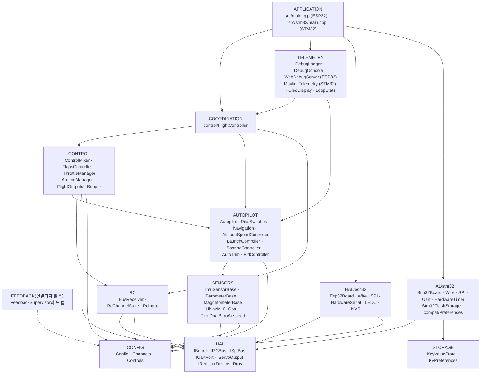
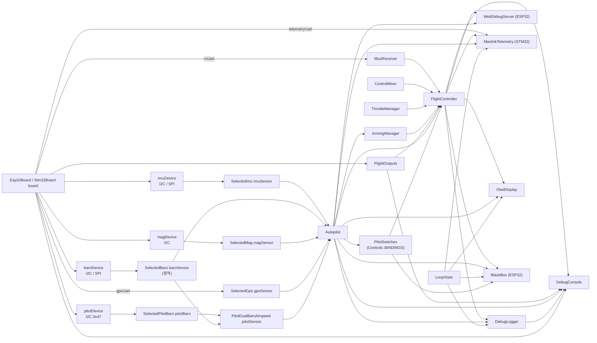
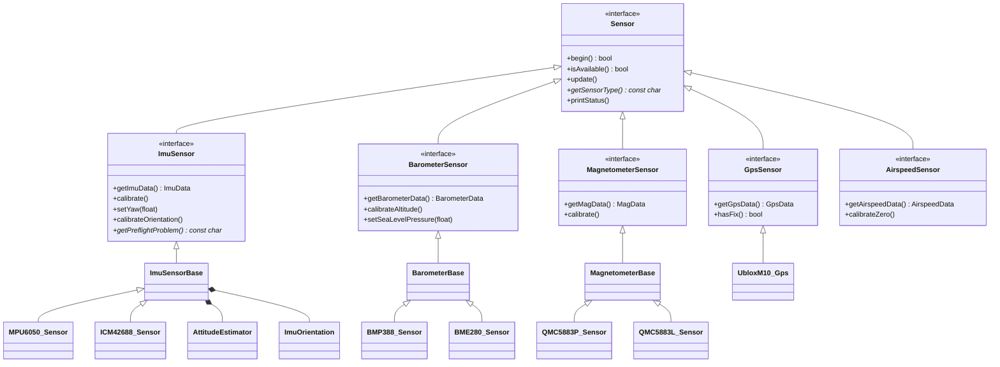
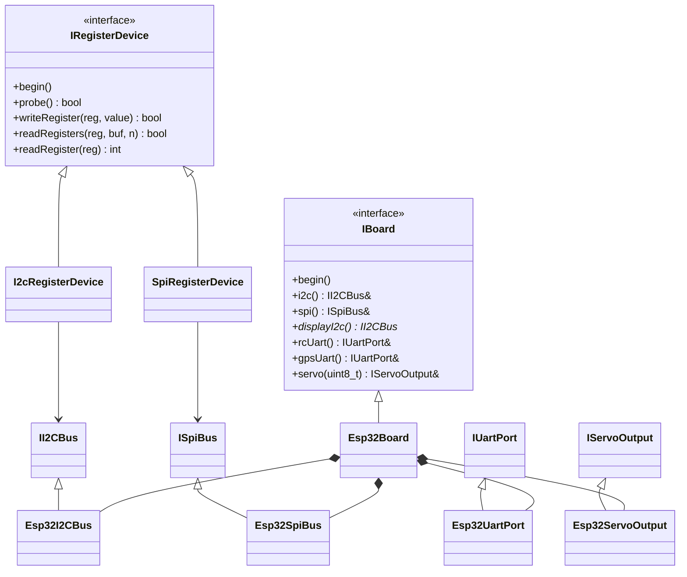
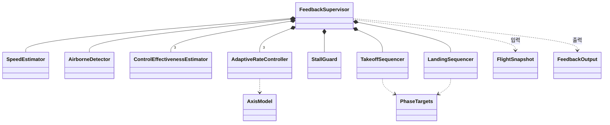
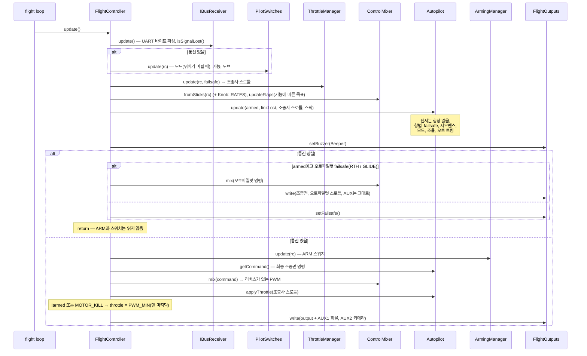
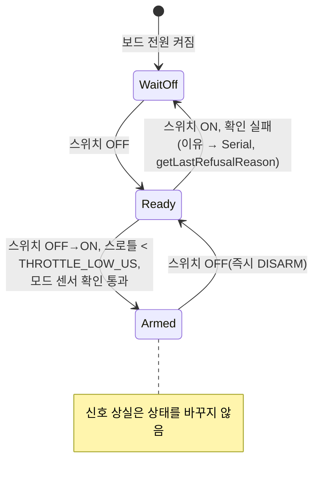
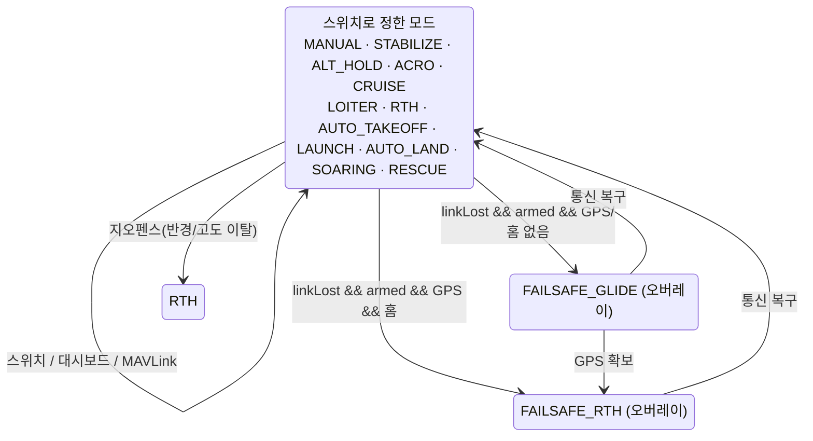
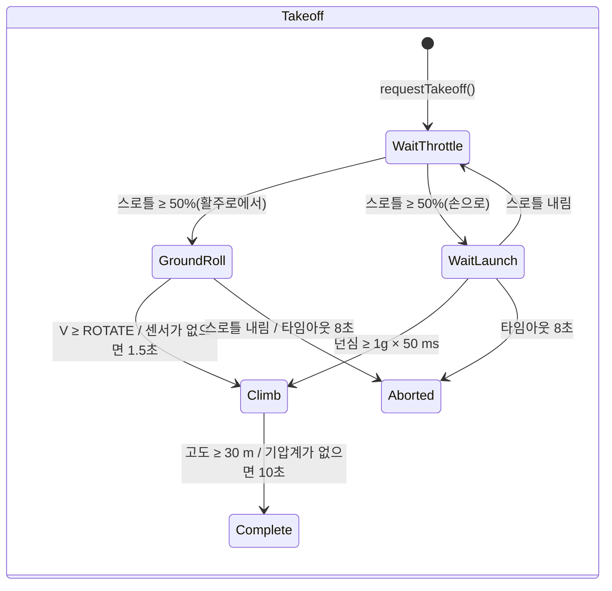
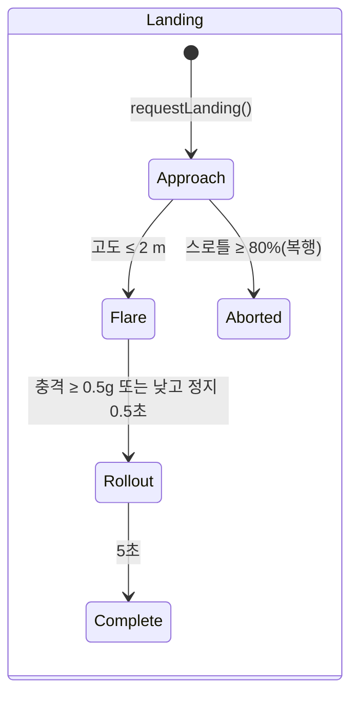

# ARCHITECTURE.md — OpenPlaneProject 펌웨어의 아키텍처

> 🌐 이 문서는 [러시아어 원문](../../ARCHITECTURE.md)을 번역한 것입니다. 번역과 원문이 다를 경우 원문이 우선합니다. 펌웨어는 콘솔 메시지를 러시아어로 출력하므로 그대로 인용했습니다. 이 번역은 AI가 작성했으며 원어민의 검수를 거치지 않았습니다. 오류를 발견하면 [Damir Lebedev](https://github.com/damir-lebedev)에게 알려 주시거나 [이슈](https://github.com/damir-lebedev/OpenPlaneProject/issues)로 남겨 주세요.

이 문서는 **펌웨어 전체가 어떻게 구성되어 있는지** 설명합니다. 계층과 계층 사이의 의존 규칙, 객체 그래프, FreeRTOS 스레드 모델, 한 주기 동안의 연산 순서, 상태 머신, 센서 내결함성 전략, 그리고 확장 지점입니다. 각 클래스의 상세한 참조(공개 API, 필드, 불변 조건)는 [`reference/`](reference/README.md)에 있습니다.

관련 문서:

| 문서 | 내용 |
|---|---|
| [`DEVELOPER_GUIDE.md`](DEVELOPER_GUIDE.md) | 실무 가이드: 부호 규약, HTTP API, 콘솔, 센서·모드·보드를 추가하는 방법 |
| [`reference/`](reference/README.md) | 모든 클래스, 구조체, 네임스페이스의 참조 |
| [`TESTING.md`](TESTING.md) | 테스트: 네이티브(PC에서, 커버리지 포함)와 보드에서 |
| [`PILOT_GUIDE.md`](PILOT_GUIDE.md) | 조립, 핀 배치, 조종기, 첫 비행 |
| [`ROADMAP.md`](ROADMAP.md) | 프로젝트가 나아가는 방향 |

> 상태: ESP32-S3 벤치는 모든 센서로 확인했습니다. **오토파일럿은 비행에서 시험하지 않았고**, 피드백 루프(`autopilot/feedback/`)는 펌웨어에 **연결하지 않았으며** 시뮬레이션으로만 검증합니다.

---

## 목차

1. [원칙](#1-원칙)
2. [계층과 의존 규칙](#2-계층과-의존-규칙)
3. [객체 그래프(composition root)](#3-객체-그래프composition-root)
4. [클래스 계층](#4-클래스-계층)
5. [FreeRTOS 태스크와 데이터 분리](#5-freertos-태스크와-데이터-분리)
6. [제어 주기: `FlightController::update()`](#6-제어-주기-flightcontrollerupdate)
7. [상태 머신](#7-상태-머신)
8. [내결함성: 센서, 통신, 출력](#8-내결함성-센서-통신-출력)
9. [설정과 빌드 변형](#9-설정과-빌드-변형)
10. [피드백 루프(연결되지 않음)](#10-피드백-루프연결되지-않음)
11. [확장 지점](#11-확장-지점)
12. [테스트 용이성](#12-테스트-용이성)

---

## 1. 원칙

| 원칙 | 구현 방식 |
|---|---|
| **헤더 전용 C++** | 모든 클래스는 `include/<계층>/`의 헤더에 정의되어 있습니다. 펌웨어의 번역 단위는 `src/main.cpp`(ESP32) 또는 `src/stm32/main.cpp`(STM32) 하나뿐입니다. 비행 루프에는 동적 메모리를 쓰지 않습니다(`String` 문자열은 웹 서버와 OLED에서만 사용). `.h/.cpp`로 나눈 버전은 별도 브랜치 `feature/split-headers`에 있으며 `tools/split_headers.py`가 생성합니다. 차이점과 펌웨어 크기는 그 브랜치의 `docs/SPLIT_HEADERS.md`에 있습니다. |
| **Composition root** | `src/main.cpp` / `src/stm32/main.cpp`는 객체를 만들고 참조나 포인터로 연결하는 유일한 곳입니다. 여기에는 비행 로직이 없습니다. |
| **한 줄에 스위치 하나** | 조종기의 각 채널이 하는 일은 `config/Controls.h` 표(`Bind::modes/mode/feature/knob`)가 정하며, 빌드할 때 `static_assert`로 검사합니다. |
| **의존성 역전** | 상위 계층은 특정 칩이나 MCU가 아니라 인터페이스(`IBoard`, `IRegisterDevice`, `ImuSensor*` 등)에 의존합니다. |
| **널 가능한 의존성** | 오토파일럿, 스위치(`PilotSwitches`), 모든 센서는 포인터로 전달되며 `nullptr`일 수 있습니다. 센서가 없어도 모드는 죽지 않고 안전하게 동작합니다. |
| **우선순위에 의한 안전** | 주기 안의 연산 순서가 곧 우선순위입니다: 신호 상실 > ARM > 스틱/오토파일럿 > 스로틀. 스로틀에 대한 ARM 확인은 맨 마지막에 둡니다. |
| **부호 체계는 하나** | IMU부터 서보까지 항공 부호로 통일하며, 각 서보의 방향은 정확히 한 곳(`Config::*_REVERSED`)에서 정합니다. |
| **시간은 매개변수로** | 가능한 곳(플랩, 피드백 모듈)에서는 시간을 `millis()`로 읽지 않고 인자로 넘깁니다. 이렇게 하면 클래스가 결정적이 되고 테스트하기 쉬워집니다. |
| **정직한 진단** | 각 센서와 출력은 “빌드에 없음”(`attached`)과 “있지만 응답하지 않음”(`available`)을 구분합니다. 이는 JSON, 로그, OLED에 표시됩니다. |

---

## 2. 계층과 의존 규칙



규칙:

1. **HAL은 MCU를 아는 유일한 계층입니다.** `<Wire.h>`, `<SPI.h>`, `HardwareSerial`을 포함하고 `ledc*` / `HardwareTimer` / 플래시를 호출하는 것은 `include/hal/esp32/`와 `include/hal/stm32/`뿐입니다. FreeRTOS 태스크는 `hal/Rtos.h`를 통해 만듭니다(ESP32에서는 코어 0, STM32에서는 우선순위). 설정 저장: 코드는 `<Preferences.h>`를 쓰며, ESP32에서는 이것이 NVS이고 STM32에서는 `storage/KeyValueStore.h` 위에 만든 `hal/stm32/compat/Preferences.h`입니다. 의도된 예외: `SpiRegisterDevice`는 Arduino 표준 `pinMode/digitalWrite`로 CS를 전환합니다(ESP32와 STM32에서 동일).
2. **센서 드라이버는 버스를 모릅니다.** 이들은 `IRegisterDevice&`(I2C 주소 또는 SPI CS)나 `IUartPort&`를 받습니다. 버스는 `sensors/SensorSelection.h`에서 고릅니다.
3. **RC와 Outputs는 비행기에 대해 아무것도 모릅니다**: iBUS 바이트 → 채널, PWM 값 → 출력.
4. **Control과 Autopilot**은 데이터에 대한 순수한 로직입니다. UART도 PWM도 Wi-Fi도 없습니다.
5. **Coordination**(`FlightController`)은 여러 하위 계층을 한꺼번에 보고 연산 순서를 정하는 유일한 클래스입니다.
6. **Telemetry**는 const 게터로 상태를 읽기만 합니다. 대시보드의 명령은 “우편함”을 거쳐 비행 루프가 적용하며, MAVLink(`MavlinkTelemetry`)는 비행 루프 안에서 직접 동작하고 명령도 스스로 적용합니다.
7. **하위 계층은 상위 계층을 절대 포함하지 않습니다.** 하위 클래스가 상위 클래스를 필요로 하면 로직을 `FlightController`로 끌어올립니다.

`ArmingManager`(CONTROL)는 `Autopilot`에서 모드를 읽습니다. 이것이 CONTROL → AUTOPILOT의 유일한 수평 의존입니다. ARM 확인이 선택된 모드에 필요한 센서에 따라 달라지기 때문입니다.

---

## 3. 객체 그래프(composition root)

모든 객체는 정적 저장 기간의 전역 객체이며 `src/main.cpp`에서 생성됩니다. 객체 사이의 참조와 포인터는 **소유권이 없고**, 생성 순서는 선언 순서와 같습니다(번역 단위는 하나).



`setup()`의 초기화 순서:

```
Serial (ESP32: 송신 버퍼 4 KB; STM32: SERIAL_TX_BUFFER_SIZE=1024), 115200 → 배너
board.begin()               — I2C/SPI 버스(두 번째 I2C가 있으면)
flightOutputs.begin()       — PWM 채널; 곧바로 setFailsafe()
[STM32] 플래시에서 설정     — KeyValueStore::mount(), 이미지 CRC
setupSensors()              — 각 센서의 begin(); 응답한 센서의 보정:
                              IMU (2 s 정지 + 비행 전 점검),
                              기압계 (고도 0), 나침반 (초기 침로 → IMU yaw),
                              피토관 (영점은 루프의 첫 1초 동안 수집)
autopilot.begin()           — NVS/플래시에서 트림
flightController.begin()    — setFailsafe() + UART iBUS
oledDisplay.begin(...)      — 전용 태스크 (hal/Rtos.h)
[ESP32] webDebugServer.begin() — 액세스 포인트 + 코어 0의 전용 태스크
[ESP32] blackBox.begin()   — blackbox 파티션, PSRAM의 큐, 코어 0의 bbox 태스크
[STM32] mavlink.begin()     — 무선 모뎀의 UART4
[STM32] setupBlackBox()    — SD 카드, BLACKBOX.BIN 파일, blackBox.begin(), bbox 태스크
pilotSwitches.printBindings() — 어느 스위치에 무엇이 있는지
debugLogger.begin()         — 로그 설정
[STM32] flight / storage 태스크 → vTaskStartScheduler()
```

---

## 4. 클래스 계층

### 센서



기반 클래스(`ImuSensorBase`, `BarometerBase`, `MagnetometerBase`)는 **Template Method** 패턴을 구현합니다. 공개 `update()`/`calibrate()`는 한 번만 작성하고, 칩 드라이버는 보호된 “프리미티브”(`readSample()`, `isNewSampleReady()`, `readRaw()`, 스케일)만 구현합니다.

### HAL



### 피드백 루프



---

## 5. FreeRTOS 태스크와 데이터 분리

**ESP32**(코어 2개, FreeRTOS는 Arduino 코어에 내장):

| 코어 | 태스크 | 하는 일 | 주기 |
|---|---|---|---|
| 1 | Arduino `loopTask` → `loop()` | `WebDebugServer::applyPendingCommands()` → `FlightController::update()` → `DebugLogger::update()` → `DebugConsole::update()` → `LoopStats::record()` → `BlackBox::update()` | `Config::LOOP_PERIOD_MS` = 2 ms(500 Hz), `vTaskDelayUntil` |
| 0 | `web`(스택 8 KB, 우선순위 1) | `WebServer::handleClient()` | 2 ms마다(`vTaskDelay`) |
| 0 | `oled`(스택 4 KB, 우선순위 1) | 두 번째 I2C 버스로 `OledDisplay::draw()` | 200 ms(`vTaskDelayUntil`) |
| 0 | `bbox`(스택 6 KB, 우선순위 2) | `BlackBox::writerStep()`: 큐의 한 페이지를 플래시로. 지상에서는 삭제 | 매 주기 뒤에 `loop()`가 알림(아니면 20 ms에 한 번) |
| 0 | ESP-IDF의 Wi-Fi 스택 | 액세스 포인트 | — |

**STM32H743**(코어 1개, STM32duino FreeRTOS, 우선순위에 따른 선점):

| 우선순위 | 태스크 | 하는 일 | 주기 |
|---|---|---|---|
| 5 | `flight`(16 KB) | `FlightController::update()` → `MavlinkTelemetry::update()` → `DebugLogger::update()` → `DebugConsole::update()` → `LoopStats::record()` | 2 ms, `vTaskDelayUntil` |
| 1 | `oled`(4 KB) | 두 번째 I2C 버스로 `OledDisplay::draw()` | 200 ms |
| 1 | `storage`(2 KB) | `Stm32FlashStorage::service()` — 설정 섹터의 삭제와 쓰기 | 100 ms |
| 2 | `bbox`(8 KB) | `BlackBox::writerStep()`: 큐의 한 페이지를 SD 카드로. 지상에서는 삭제. 비행 태스크에 선점됨 | 매 주기 뒤 알림(아니면 20 ms에 한 번) |

**데이터 분리 규칙:**

- `web`과 `oled` 태스크는 상태(`FlightController`, `Autopilot`, `LoopStats`, 센서)를 const 게터로 **읽기만** 합니다. 필드는 개별 16/32비트 값이라 “찢어진” 읽기는 없으며, 최악의 경우에도 이웃한 주기의 값이 보일 뿐입니다.
- 대시보드의 **명령**(`/api/setmode`, `/api/setpid`)은 `web` 태스크에서 **직접 적용하지 않습니다**. `portMUX` 스핀락 아래에서 `PendingCommands`에 넣고, 비행 루프가 `applyPendingCommands()`에서 가져갑니다. 오토파일럿의 변경은 언제나 그것을 소유한 태스크의 컨텍스트에서 일어납니다.
- `LoopStats::hz/avgUs/maxUs`는 `volatile uint32_t`이며, `takePeakUs()`는 `loop()`에서만 호출합니다.
- `OledDisplay`는 버스 포인터를 정적 변수에 보관합니다(U8g2의 C 콜백은 컨텍스트를 받지 않기 때문). 기체에 실리는 화면은 하나입니다.

**실시간성:**

- 주기는 작업 뒤의 `delay()`가 아니라 `vTaskDelayUntil`로 유지합니다. 긴 블로킹(콘솔에서 하는 보정 등, 100 ms 초과) 뒤에는 계산을 처음부터 다시 시작하며, 놓친 주기를 한꺼번에 따라잡지 않습니다.
- I2C 트랜잭션 타임아웃은 5 ms입니다(`Wire`의 기본값은 50 ms).
- 4 KB 송신 버퍼를 가진 `Serial`: 로그 한 줄이 루프를 막지 않습니다.
- 블랙박스: 루프는 스냅숏을 큐에 넣기만 합니다(스핀락, 마이크로초). 플래시로 가는 페이지 쓰기(두 코어가 약 0.6–0.9 ms 멈춤)는 `bbox` 태스크가 주기 직후, 루프의 빈틈에 합니다. 플래시 삭제는 ARM이 없고 기록도 하지 않을 때만 하며, 공중에서는 절대 하지 않습니다.
- ESP32: 플래시 쓰기(NVS, Wi-Fi 설정)는 두 코어를 약 0.3–0.4 s 멈추므로, Wi-Fi는 `persistent(false)`로 두고, 로그 설정은 ARM이 없을 때만 저장하고, 보정도 ARM이 없을 때만 하며, 오토 트림은 DISARM 뒤에 비행기가 멈춰 있을 때만 저장합니다(`Autopilot::looksLanded()`).
- STM32: `Preferences::end()`는 이미지를 복사할 뿐이고(마이크로초), 섹터 삭제(초 단위)는 `storage` 태스크에서 합니다. 설정 섹터는 플래시의 뱅크 2에, 코드는 뱅크 1에 있어서 비행 태스크가 쓰기를 선점하고 계속 동작할 수 있습니다.
- MAVLink는 루프를 막지 않습니다. 프레임은 UART 버퍼에 여유가 있을 때만(`IUartPort::availableForWrite()`) 보내고, 없으면 다음 주기까지 기다립니다.

---

## 6. 제어 주기: `FlightController::update()`



주기의 핵심 불변 조건:

- **신호 상실** — 스위치에 따른 모드와 기능은 바뀌지 않습니다. ARM은 읽지도 초기화하지도 않습니다. 모터는 오토파일럿 failsafe의 판단(모터를 쓰는 RTH)이나 `FAILSAFE_THROTTLE`로만 동작합니다.
- **어떤 모드도 스로틀을 ARM 너머로 통과시킬 수 없습니다**: `!armed`와 `MOTOR_KILL` 때의 강제 `PWM_MIN`은 `Autopilot::applyThrottle()` 뒤에 놓입니다.
- **오토파일럿이 최종 명령을 냅니다**(`getCommand()`). 안정화 모드에서 스틱은 원하는 각도입니다. 보정 = 명령 − 스틱(로그와 대시보드용). 믹서까지는 모든 것이 하나의 부호 체계(`ControlCommand`)입니다.

---

## 7. 상태 머신

### ARM (`ArmingManager`)



`WaitOff` = `armed == false && switchSeenOff == false`; `Ready` =
`armed == false && switchSeenOff == true`.

### 오토파일럿 모드(`Autopilot` + `PilotSwitches`)

12가지 모드(`AutopilotTypes.h`)이며, 각 모드가 하는 일은 [AUTOPILOT_GUIDE.md](AUTOPILOT_GUIDE.md#모드)에 있습니다. 모드는 `PilotSwitches`가 `config/Controls.h` 표에 따라 고릅니다. 모드 스위치(`Bind::modes`)와 “위에 덮어쓰는 모드” 스위치(`Bind::mode`, 위쪽 줄이 우선)입니다. `setMode()`는 스위치의 **결과가 바뀌었을 때만** 호출됩니다. 그래서 대시보드나 GCS에서 고른 모드는 조종사가 스위치를 건드릴 때까지 유지됩니다.



failsafe는 별개의 `AutopilotMode`가 아니라 현재 모드 위에 얹는 플래그입니다. 이미 시작된 귀환은 GPS를 잠깐 잃었다고 활공으로 바뀌지 않습니다. 통신이 복구되면 스위치로 정한 모드가 이어집니다(자동 이륙과 손으로 던져 이륙은 처음부터 다시). 내부 상태 머신은 `LaunchController`(IDLE → READY → THROWN → CLIMB → DONE)와 `SoaringController`(GLIDE → THERMAL → MOTOR_CLIMB → RETURN)입니다.

**AUTO_TAKEOFF**(시작으로부터의 시간에 따라, armed이고 스로틀 ≥ 1500 µs일 때):

| 시간 | 스로틀(프로그램) | 피치 |
|---|---|---|
| 0–1초 | 0 → 100 %까지 부드럽게 | 0° |
| 1–3초 | 100 % | +15° |
| > 3초 | 100 % | +10° |

### 이륙과 착륙(피드백 루프, 연결되지 않음)





---

## 8. 내결함성: 센서, 통신, 출력

### 센서

| 센서 | `isAvailable()`이 `false`가 되는 조건 | 읽기 실패 시 동작 |
|---|---|---|
| IMU(`ImuSensorBase`) | `begin()`이 칩을 식별하지 못함, **또는** 읽기 오류가 50번 연속(500 Hz에서 약 0.1초) | 데이터를 덮어쓰지 않고 `errorCount++`. 복구되면 다시 사용 가능해짐 |
| 기압계(`BarometerBase`) | 오류 100번 연속(5 ms마다 조회할 때 약 0.5초) | 동일 |
| 나침반(`MagnetometerBase`) | 오류 25번 연속(50 Hz에서 약 0.5초) | 동일 |
| GPS(`UbloxM10_Gps`) | 유효한 NAV-PVT가 하나도 없음, **또는** 마지막 것이 `GPS_TIMEOUT_US`(2초)보다 오래됨 | — |

이에 더해 IMU에는 **비행 전 점검**(`getPreflightProblem()`)이 있습니다. 자이로 보정 중의 정지, |a| ≈ 1g, “위쪽” 방향이 저장된 장착과 일치하는지입니다. 통과하지 못하면 `Autopilot::imuReady() == false`가 되어(활공을 포함한 모든 모드에서 보정이 0) `ArmingManager`가 안정화를 쓰는 모드를 ARM하지 않습니다.

사용하는 쪽의 반응은 모두 같습니다. **센서가 없거나(`nullptr`) 사용할 수 없으면 아무 영향도 없고**, 비행기는 MANUAL처럼 조종됩니다.

### 통신(`IBusReceiver::isSignalLost()`)

서로 독립된 두 가지 판정이 있습니다.

1. `RX_TIMEOUT_US`(500 ms)보다 오래 올바른 프레임이 없음, 또는 전원을 켠 뒤 하나도 없었음.
2. 프레임의 스로틀이 `RX_FAILSAFE_THROTTLE_US`(950 µs)보다 낮음. 조종기에 설정한 페일세이프입니다(FS-iA6B는 조종기가 사라져도 프레임 송신을 멈추지 않습니다).

CRC가 잘못된 프레임은 버려지고 집계됩니다(`getBadFrameCount()`).

### 출력

`FlightOutputs::begin()` 바로 뒤에 `setFailsafe()`가 호출되어, 센서를 읽기도 전에 조종면은 중립, 모터는 꺼집니다. 핀이 `-1`인 출력(C3의 방향타)은 그냥 연결되지 않습니다. JSON의 `attached`는 LEDC 채널이 할당되었는지를 보여 줍니다. 각 핀의 실제 펄스는 `printPulseSelfTest()`(콘솔의 `p`)가 확인합니다.

---

## 9. 설정과 빌드 변형

| 대상 | 위치 | 선택 방법 |
|---|---|---|
| 보드(핀) | `include/config/Config.h` | `platformio.ini`의 `[env:*]`에서 넘겨 주는 매크로 `BOARD_ESP32_S3` / `BOARD_ESP32_C3` / `BOARD_ESP32_CLASSIC` / `BOARD_STM32H743` |
| 모든 설정(타임아웃, 조종면 이동량, 리버스, failsafe, Wi-Fi) | `Config.h`, 네임스페이스 `Config` | `constexpr`, 파일 수정 |
| RC 채널 할당 | `include/config/Channels.h` | 파일 수정 |
| 센서와 버스 | `include/sensors/SensorSelection.h` | `#define SENSOR_IMU/BARO/MAG/GPS`, `-D` 플래그로도 지정 가능 |
| 피드백 상수 | `include/autopilot/feedback/FeedbackConfig.h` | 연결하면 `Config.h`로 옮겨 감 |
| IMU 장착 | NVS(`imu_mpu6050` / `imu_icm42688`) 또는 `Config::IMU_ROTATION_CW_DEG` | 콘솔 명령 `o` |
| 나침반 보정 | NVS(`qmc5883p` / `qmc5883l`) | 콘솔 명령 `m` |
| 로그 설정 | NVS(`debuglog`) | 콘솔 메뉴 `l` |
| 블랙박스 | `Config.h`(`BLACKBOX_*`), `partitions_blackbox.csv`의 `blackbox` 파티션 | 비행 기록: `tools/blackbox.py`, 콘솔 메뉴 `k` |

PlatformIO 환경:

| `env` | 용도 |
|---|---|
| `esp32-s3`(기본) | 주력 비행 컨트롤러 |
| `esp32-c3` | 예전 시제품 |
| `esp32-dev` | 일반 ESP32, 벤치용 |
| `stm32h743` | STM32H743VIT6: 전체 펌웨어(`src/stm32/main.cpp`), 설정은 플래시에, MAVLink, SD의 블랙박스, FreeRTOS. 맨 보드에서 확인함. [reference/hal.md](reference/hal.md#stm32h743용-구현) 참고 |
| `stm32h743-devebox` | DevEBox H743: 같은 구성이며 콘솔은 USB CDC, 펌웨어는 DFU로 올림([DEVELOPER_GUIDE](DEVELOPER_GUIDE.md#stm32h743)) |
| `native` | Arduino/ESP-IDF 페이크와 커버리지를 쓰는 PC에서의 빌드와 테스트. [`TESTING.md`](TESTING.md) 참고 |

---

## 10. 피드백 루프(연결되지 않음)

`include/autopilot/feedback/`는 PID 안정화를 앞으로 대체할 부분입니다. 축 모델 `ε = b·u + a·ω + c`를 비행 중에 재귀 최소제곱법으로 학습하고(`ControlEffectivenessEstimator`), 제어기는 학습한 모델을 거치는 각도 → 각속도 → 각가속도 → 조종면의 캐스케이드이며(`AdaptiveRateController`), 그 위에 실속 방지(`StallGuard`)와 이륙·착륙 단계가 있습니다.

입력은 `FlightSnapshot`(주기마다의 스냅숏) 하나뿐이고 출력은 `FeedbackOutput` 하나뿐입니다. 모듈이 센서나 RC를 직접 읽지 않으므로, 폐루프 시뮬레이션(`test/test_feedback`)으로 PC에서도 보드에서도 검증할 수 있습니다.

`FeedbackSupervisor::update()`의 한 주기당 순서:

1. 속도와 종방향 가속도(`SpeedEstimator`), 공중에 있는지(`AirborneDetector`).
2. 축별 모델 학습(공중에서, IMU가 살아 있고, 플랩이 움직이지 않고, 실속이 아닐 때만).
3. 실속 방지(착륙 시 지면 근처에서는 꺼짐).
4. 이륙·착륙 단계의 목표.
5. 목표 ← 실속 방지의 제한.
6. 축 제어기 → 조종면 꺾임. 스로틀(통신이 살아 있을 때만).

연결 계획은 [`DEVELOPER_GUIDE.md`](DEVELOPER_GUIDE.md#연결-계획)에 있습니다.

---

## 11. 확장 지점

| 작업 | 바꿀 것 | 바꾸지 않을 것 |
|---|---|---|
| 기존 범주의 새 칩 | 기반 클래스에서 만든 새 `*_Sensor.h` + `SensorSelection.h`의 분기 | `main.cpp`, `Autopilot` |
| 새 센서 범주 | `SensorInterface.h`의 인터페이스, `Autopilot`의 널 가능 포인터, JSON의 `attached/available` 필드 | 나머지 코드 |
| 새 오토파일럿 모드 | `AutopilotMode`, `handle*Mode()`, `applyThrottle()`, 선택기/대시보드, `ArmingManager::checkFailureReason()` | `FlightController` |
| 새 출력(서보) | `FlightOutputs::outputInfo()`의 한 줄, `FlightOutputState`의 필드, `ServoChannel`의 인덱스, `Esp32Board`의 핀과 LEDC 채널 | 쓰기/상태 루프 |
| 새 ESP32 보드 | `Config.h`의 `#elif`, `platformio.ini`의 `[env:*]` | 나머지 모든 코드 |
| 다른 MCU | `IBoard`를 구현하는 `hal/<mcu>/<Mcu>Board.h`(예: `hal/stm32/`), `Config.h`의 핀 블록, `[env:*]` | 센서, 비행 로직 |
| 다른 수신기 프로토콜 | 같은 API(`getState()`, `isSignalLost()`)를 가진 것으로 `IBusReceiver` 교체 | `FlightController` |
| 새 로그 채널 | `LogChannel`, `LogSettings::info()`의 한 줄, `DebugLogger::format*()`, `VERSION++` | — |

---

## 12. 테스트 용이성

HAL 인터페이스와 시간을 매개변수로 넘기는 설계 덕분에 로직의 대부분을 하드웨어 없이 검증할 수 있습니다.

- **네이티브 테스트**(`pio test -e native`)는 Arduino, FreeRTOS, Wire/SPI/UART/LEDC, Preferences, WebServer/WiFi, U8g2의 페이크(`test/native/support/`)를 써서 펌웨어 헤더를 PC에서 빌드합니다. 커버리지는 `gcovr`가 계산합니다.
- **펌웨어 전체를 PC에서** — S3와 38핀 핀 배치에서 각 센서 구성(칩의 레지스터 수준 에뮬레이터)과 함께 도는 `src/main.cpp`, 그리고 STM32duino 페이크 계층 위에서 도는 `src/stm32/main.cpp`(`pio test -e native-stm32`).
- **폐루프 비행 시뮬레이션**(`test/native/test_sim`): 펌웨어 전체가 비행기 모델을 조종합니다. 오토파일럿의 모든 모드가 “숫자만 내놓는” 것이 아니라 실제로 비행합니다.
- **빌드 매트릭스**(`tools/build_matrix.sh`): 모든 보드 × 모든 센서, 경고 없음.
- **보드에서의 테스트**(`pio test -e esp32-s3`): 같은 `test_feedback`과 `test_imu_orientation`이 실제 ESP32-S3에서도 돕니다.

자세한 내용, 테스트의 구조, 명령은 [`TESTING.md`](TESTING.md)에 있습니다.
