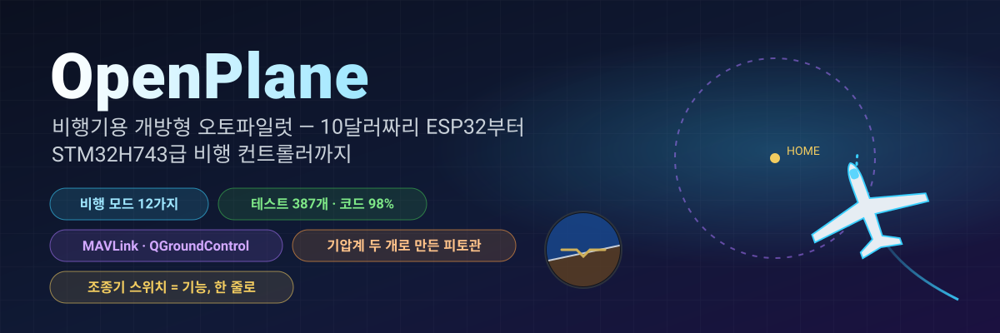
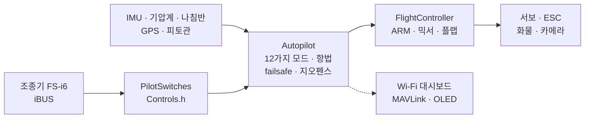

<!-- i18n-bar:start -->
  <p align="center">
    <a href="../../../README.md"> Читать на русском</a>
    &nbsp;·&nbsp;
    <a href="../en/README.md"> Read this in English</a>
    &nbsp;·&nbsp;
    <a href="../zh-CN/README.md"> 阅读中文版</a>
    &nbsp;·&nbsp;
    <a href="../es/README.md"> Lee esto en español</a>
  </p>
  <p align="center">
    <a href="../hi/README.md"> हिन्दी में पढ़ें</a>
    &nbsp;·&nbsp;
    <a href="../ar/README.md"> اقرأ بالعربية</a>
    &nbsp;·&nbsp;
    <a href="../pt-BR/README.md"> Leia em português</a>
    &nbsp;·&nbsp;
    <a href="../fr/README.md"> Lire en français</a>
  </p>
  <p align="center">
    <a href="../de/README.md"> Auf Deutsch lesen</a>
    &nbsp;·&nbsp;
    <a href="../ja/README.md"> 日本語で読む</a>
    &nbsp;·&nbsp;
     <b>한국어로 읽기</b>
  </p>
<!-- i18n-bar:end -->

<p align="center"><sub>🌐 <a href="../../../README.md">러시아어 README</a>를 번역한 것입니다. 상세 문서도 번역되어 있으며, 아래 링크는 번역된 페이지로 연결됩니다. 번역과 원문이 다를 경우 원문이 우선합니다. 콘솔 메시지, 스크린샷, 그래프의 글자는 아직 러시아어입니다. 이 번역은 AI가 작성했으며 원어민의 검수를 거치지 않았습니다. 오류를 발견하면 <a href="https://github.com/damir-lebedev">Damir Lebedev</a>에게 알려 주시거나 <a href="https://github.com/damir-lebedev/OpenPlaneProject/issues">이슈</a>로 남겨 주세요.</sub></p>

<p align="center">
  
</p>

<p align="center">
  
  
  
  <br>
  
  
  
  <a href="LICENSE.md"></a>
</p>

<h3 align="center">조종기를 끄면 비행기가 스스로 집으로 돌아와 머리 위를 선회합니다.</h3>
<p align="center">이것은 애니메이션이 아닙니다. <b>펌웨어 전체</b>가 비행기 모델을 폐루프로 비행시킵니다. 입력에는 똑같은 iBUS 바이트가, 출력에는 똑같은 PWM이 쓰입니다.</p>

<p align="center">
  
</p>

---

## ⚡ 30초 요약

| | |
|---|---|
| **무엇인가** | 무선 조종 비행기를 위한 개방형 비행 컨트롤러이자 오토파일럿입니다. 주력 보드는 STM32H743(Pixhawk급 보드)이며, DevEBox 보드에서는 **이미 작동하며 조종기로 조종됩니다**([영상 있음](#-stm32h743이-보드-위에서-깨어났습니다)). 지금은 센서를 연결하는 중입니다. 이전 기반은 약 10달러짜리 ESP32-S3이며, 모든 센서를 단 테스트 벤치를 통과했습니다. |
| **무엇을 할 수 있나** | 12가지 비행 모드: 자세 안정화부터 귀환, GPS 선회, 손으로 던져 발진, 자동 착륙, **서멀 소어링**까지. 저렴한 기압계 두 개로 만든 피토관. QGroundControl과 Mission Planner용 MAVLink 텔레메트리. |
| **핵심 기능** | 조종기의 어떤 스위치나 노브든 원하는 기능으로 바꿀 수 있습니다. `Controls.h`에서 **한 줄**만 고치면 SwD는 더 이상 RTH가 아니라 화물 투하가 됩니다. |
| **믿을 수 있는 이유** | 자동 테스트 387개(실제 SD 카드를 꽂은 보드에서 도는 테스트 9개는 별도), 코드의 98%가 테스트로 검증됨, "보드 × 센서" 빌드 24개가 경고 없이 통과, 모든 모드의 폐루프 시뮬레이션. |
| **솔직히 말씀드리면** | 지금까지 실제로 날아 본 것은 수동 모드뿐입니다(첫 번째 시제기). STM32H743은 아직 센서 없이 테스트 벤치에서만 확인했습니다. 오토파일럿은 테스트 벤치, 테스트, 시뮬레이션으로 검증했고 비행 시험을 기다리고 있습니다. [아래 현황](#-솔직한-현황)을 확인하세요. |

---

## 🎛️ 스위치 = 기능, 한 줄이면 됩니다

```cpp
// include/config/Controls.h
constexpr Binding BINDINGS[] = {
    Bind::modes  (Channels::SWC, MODE_MANUAL, MODE_STABILIZE, MODE_AUTO_TAKEOFF),
    Bind::feature(Channels::SWB, Feature::FLAPS),
    Bind::mode   (Channels::SWD, MODE_RTH),              // 스위치가 켜져 있는 동안 귀환
    Bind::knob   (Channels::VRA, Knob::STAB_GAIN),       // "부드럽게 / 단단하게"를 비행 중에 바로 조절
    Bind::knob   (Channels::VRB, Knob::CRUISE_SPEED),
};
```

SwD를 RTH 대신 서멀 소어링으로 쓰고 싶으신가요? `Bind::mode(Channels::SWD, MODE_SOARING)`이라고 쓰면 됩니다. SwB에 화물 투하를 지정하려면 `Bind::feature(Channels::SWB, Feature::PAYLOAD_DROP)`입니다. 실수하면(예를 들어 스위치 하나에 모드 두 개를 지정하거나 스틱을 점유하면) **빌드가 통과하지 않습니다**. 표는 컴파일러가 검사합니다(`static_assert`). 전원을 켜면 기체가 스스로 어느 스위치에 무엇이 지정되어 있는지 출력합니다.

**12가지 모드 · 10가지 기능 · 7개의 노브**. 모두 [오토파일럿 레퍼런스](AUTOPILOT_GUIDE.md)에 예시와 함께 정리되어 있습니다.

---

## ✈️ 오토파일럿이 할 수 있는 일

| | 모드 | 핵심 |
|---|---|---|
| 🕹️ | **MANUAL** | 조종면 = 스틱, 비행 컨트롤러가 없을 때와 같음 |
| 🧭 | **STABILIZE** | 스틱이 각도를 정하고, 놓으면 비행기가 스스로 수평을 잡음 |
| 📏 | **ALT_HOLD** | + 기압계로 고도 유지 |
| 🌀 | **ACRO** | 스틱이 회전 속도를 정함 — 곡예비행용 |
| 🛣️ | **CRUISE** | 방향, 고도, 속도를 스스로 유지하며 스틱은 보정만 함 |
| ⭕ | **LOITER** | GPS 지점 위를 선회(반경은 노브로 조절) |
| 🏠 | **RTH** | 고도 40 m로 귀환해 머리 위를 선회하며, 신호가 끊기면 저절로 켜짐 |
| 🛫 | **AUTO_TAKEOFF** | 조종사의 스로틀로 활주로에서 이륙 |
| 🤾 | **LAUNCH** | 손으로 던져 발진: 던진 뒤에 모터가 돌고 상승 |
| 🛬 | **AUTO_LAND** | 활공 후 지면 근처에서 플레어 |
| 🦅 | **SOARING** | 모터를 끈 채 서멀을 찾아 그 안에서 선회 |
| 🆘 | **RESCUE** | "살려 줘": 날개 수평, 기수 위로 — 어떤 나선 강하에서든 회복 |

그 밖에 지오펜스, "삐딱한" 비행기를 위한 오토 트림, 선회 협조, 피토관을 이용한 실속 방지, 플랩과 에어브레이크, 화물 투하, 안정화된 카메라, "풀숲에서 나를 찾아 줘" 부저가 있습니다.

---

## 📈 모든 모드가 비행합니다 — 폐루프로

"함수가 숫자를 돌려주었다"가 아니라 **비행**입니다. 조종기 → iBUS 프레임 → 펌웨어 → PWM → 조종면 움직임 → 양력, 실속, 바람, 서멀을 갖춘 비행기 모델 → 센서 → 다시 펌웨어. 이런 비행 14건이 일반 테스트(`pio test -e native`)에 포함되어 있습니다.

<p align="center"></p>

<table>
  <tr>
    <td width="50%"></td>
    <td width="50%"></td>
  </tr>
  <tr>
    <td>🦅 서멀을 스스로 찾아 <b>모터를 끈 채로</b> 고도를 얻었습니다. 총에너지 승강계는 "스틱을 당긴 것"을 상승기류로 착각하지 않습니다.</td>
    <td>🆘 경사 60°에서도 몇 초 만에 수평으로 돌아옵니다. RESCUE는 경사 70°, 기수 −40°의 나선 강하에서도 비행기를 끌어올립니다.</td>
  </tr>
  <tr>
    <td></td>
    <td></td>
  </tr>
  <tr>
    <td>🤾 손으로 던짐 → 손이 프로펠러에서 떨어진 뒤에야 모터가 돎 → 상승. 🛬 착륙: 활공 후 3 m에서 플레어.</td>
    <td>🌬️ <b>잡음이 많은</b> 기압계 두 개로 만든 관으로 측정한 대기속도입니다. 칩 사이에 150 Pa의 편차가 있어도 오차는 0.5 m/s 미만입니다.</td>
  </tr>
</table>

---

## 🌬️ 푼돈으로 만드는 피토관

제대로 된 대기속도 센서는 비행 컨트롤러 절반 값이 듭니다. 여기서는 **기압계 두 개**를 씁니다. 관 안의 BMP581(전압)과 기체 안의 주 기압계(정압)입니다. 펌웨어는 지상에서 두 칩의 차이를 스스로 0으로 맞추고, 필터링하고, 고도와 온도로 공기 밀도를 계산하며, 호스가 바뀌어 연결된 것도 알아챕니다. 그 결과 CRUISE는 스로틀이 아니라 **대기**속도를 유지하고, 실속 방지가 동작하며, 텔레메트리의 속도도 믿을 수 있습니다. 만드는 방법은 [레퍼런스](AUTOPILOT_GUIDE.md#직접-만드는-피토관)에 있습니다.

---

## 📡 지상국: 브라우저 또는 QGroundControl

<table>
  <tr>
    <td width="46%"></td>
    <td>
      <b>ESP32 — 기체에서 바로 여는 웹 대시보드.</b> 액세스 포인트 <code>OpenPlane-Debug</code>, 주소 <code>192.168.4.1</code>에서 조종기 채널, 출력, 모든 센서, 모드, 항법을 볼 수 있고, 비행 중에 모드를 바꾸거나 PID를 조정할 수 있습니다. 앱도 추가 하드웨어도 필요 없습니다.<br><br>
      <b>STM32H743 — 무선 모뎀을 통한 MAVLink.</b> QGroundControl과 Mission Planner는 이 기체를 ArduPilot 비행기로 인식합니다. 수평선, 홈 지점이 표시된 지도, 피토관 속도, ArduPlane 이름의 모드, 매개변수 창의 PID, 버튼으로 모드 전환이 가능합니다. 지상에서는 ARM할 수 없고 스위치로만 할 수 있습니다. 그편이 더 안전하기 때문입니다.<br><br>
      MAVLink 프레임은 기준 구현인 <code>pymavlink</code>와 바이트 단위로 대조했습니다.
    </td>
  </tr>
</table>

---

## 📼 블랙박스

보드는 모든 비행을 기록합니다. 500 Hz IMU, 자세각과 오토파일럿의 판단, PID, 모든 출력, 스틱, 기압계, 나침반, GPS, 배터리, 이벤트를 ARM과 스로틀 시점부터 착륙까지, 시작 10초 전부터 남깁니다. **ESP32-S3**는 내장 플래시(13.9 MB, 약 11분)에, **STM32H743**은 SD 카드(64 MB, 약 1시간)에 기록합니다. SD 카드는 평범한 FAT32 그대로이며, 펌웨어는 미리 만들어 둔 파일 `BLACKBOX.BIN`에 씁니다. 삭제는 지상에서만 이루어집니다. 비행이 끝나면 `python tools/blackbox.py download`로 USB를 통해 비행 기록을 내려받아 CSV로 나눕니다. SD 카드의 비행 기록은 보드 없이도 분석할 수 있습니다: `python tools/blackbox.py ring E:/BLACKBOX.BIN`. 자세한 내용은 [BLACKBOX.md](BLACKBOX.md)를 보세요.

---

## 🔩 하드웨어: 펌웨어 하나, 보드 네 종류, 센서 열두 종류

| 보드 | 상태 | 확인된 내용 |
|---|---|---|
| **STM32H743VIT6** | ✅ 주력 · 🔧 DevEBox, 센서 연결 중 + 🧪 테스트 | 보드에서: 부팅, USB 콘솔, **SD 카드와 블랙박스**(보드 위 테스트), **iBUS 수신, ARM, 조종기로 서보와 모터 제어**(발진 장면은 영상으로 남김). PC에서: 펌웨어 전체(FreeRTOS 태스크, 플래시, MAVLink, I2C, SPI). 센서는 아직 보드에 연결하지 않았음 |
| **ESP32-S3 N16R8** | ✅ 이전 주력, 테스트 벤치 | 모든 센서, 서보, iBUS, OLED, 대시보드를 실기로 확인. 펌웨어 전체는 테스트로 확인 |
| **ESP32 38-pin** | 🧪 테스트 | ICM-45686 세트로 펌웨어 전체를 테스트에서 확인 |
| **ESP32-C3 SuperMini** | ✈️ 비행 실적 있음(수동) | 첫 번째 시제기, 모든 세트의 빌드 |

| 센서 | 설명 | 버스 |
|---|---|---|
| **LSM6DSV** + **QMC6309** | IMU + 나침반(모듈) | I2C / SPI |
| **ICM-45686** + **QMC6309** | IMU + 나침반(대체품) | I2C / SPI |
| **SPL06-001** | 기체의 기압계 | I2C / SPI |
| **BMP581** | 주 기압계 및 피토관의 기압계 | I2C / SPI |
| MPU6050/6500, ICM-42688, BMP388, BME280, QMC5883P/L | 테스트 벤치용 및 이전 센서 | I2C / SPI |
| **u-blox M10** | GPS, 10 Hz, UBX | UART |

센서는 한 줄(`SENSOR_KIT_LSM6DSV_PITOT`)로, 보드는 빌드 플래그 하나로 바꿉니다. 보드 4종 × 센서 세트 6종이 모두 경고 없이 빌드됩니다: [`tools/build_matrix.sh`](../../../tools/build_matrix.sh).

<table>
  <tr>
    <td width="50%"></td>
    <td width="50%"></td>
  </tr>
  <tr>
    <td>ESP32-S3 테스트 벤치: IMU, 기압계, 나침반, OLED, 서보, 수신기.</td>
    <td>모터와 프로펠러 조합 시험.</td>
  </tr>
</table>

### 🎥 STM32H743이 보드 위에서 깨어났습니다

STM32H743 펌웨어는 **센서를 하나도 달지 않은** DevEBox 보드에서 작동하며, 일반 조종기로 조종됩니다. iBUS 수신기, ARM, 서보, 모터가 수동 모드에서 스틱과 스위치에 반응합니다. 발진 과정 전체를 영상으로 촬영했습니다.

▶️ **[발진 영상 보기](https://t.me/lisnmylife/420)**

이것이 증명하는 것: "조종기 → iBUS → 펌웨어 → PWM" 경로가 테스트 안에서만이 아니라 실제 하드웨어에서도 작동한다는 점입니다. 아직 증명하지 못한 것: 이 보드에는 센서(IMU, 기압계, GPS)를 연결하지 않았기 때문에 오토파일럿 모드는 아직 시험해 보지 못했습니다.

---

## 🧪 검증할 수 있는 품질

| | |
|---|---|
| **자동 테스트 387개** | 모듈, 칩 레지스터 수준에서 검증한 드라이버, 폐루프 비행, PC에서 ESP32와 STM32의 **펌웨어 전체**. 여기에 실제 SD 카드를 쓰는 STM32 보드 위의 테스트 9개 |
| **줄 커버리지 98.3%, 분기 커버리지 87.7%** | `gcovr` 커버리지(STM32 코드 포함) |
| **빌드 24/24** | 보드 4종 × 센서 세트 6종, `-Wall -Wextra`, 경고 0개 |
| **지적 사항 0건** | 전체 코드에 대한 cppcheck와 clang-tidy |
| **코드 복사가 아니라 기준 자료** | 센서 수식은 데이터시트(Bosch, ST, TDK, Goertek)를, MAVLink는 pymavlink를 따름 |

```bash
pio test -e native -e native-stm32   # 모든 테스트, 약 1.5분, 하드웨어 불필요
```

자세한 내용은 [TESTING.md](TESTING.md)를 보세요.

---

## 🧠 구조



- **Header-only C++**, 번역 단위는 하나뿐이고, 비행 루프에서는 동적 메모리를 쓰지 않습니다. `.h/.cpp`를 선호하시나요? 그런 분을 위해 병렬 브랜치 [`feature/split-headers`](https://github.com/damir-lebedev/OpenPlaneProject/tree/feature/split-headers)가 있습니다. 이 브랜치에서 스크립트로 생성하며, LTO를 적용한 펌웨어 크기는 같습니다.
- **HAL** — 마이크로컨트롤러를 아는 유일한 계층입니다. 새 보드는 새 `Board`를 만드는 일이지, 오토파일럿을 다시 쓰는 일이 아닙니다.
- **센서 드라이버는 버스를 모릅니다.** 같은 클래스가 I2C에서도 SPI에서도 동작합니다.
- **안전은 연산 순서로 지킵니다**: 신호 상실 > ARM > 모드 > 스로틀. 어떤 모드도 ARM을 건너뛰고 스로틀을 올릴 수 없습니다.

자세한 내용은 [ARCHITECTURE.md](ARCHITECTURE.md)를 보세요.

---

## 🚀 빠른 시작

```bash
pip install platformio
git clone https://github.com/damir-lebedev/OpenPlaneProject && cd OpenPlaneProject
pio run -e stm32h743-devebox -t upload                    # DevEBox H743: USB DFU, USB 콘솔
pio run -e esp32-s3 -t upload && pio device monitor     # ESP32-S3
pio run -e stm32h743 -t upload                            # STM32H743 (ST-Link)
```

DevEBox: 이 보드에는 BOOT0 버튼이 없습니다. 처음 업로드하기 전에 BT0 핀을 3V3에 연결하고 RST를 누르세요. 그 뒤에는 콘솔에서 `D` 키를 누르면 보드가 스스로 부트로더로 재부팅합니다([자세히](DEVELOPER_GUIDE.md#stm32h743)).

시리얼 모니터에서 `h`는 메뉴, `b`는 버스에서 보이는 칩, `s`는 센서, `p`는 출력 점검입니다(프로펠러를 빼 두세요!). 그다음은 [파일럿 가이드](PILOT_GUIDE.md)를 보세요.

---

## 🟢 솔직한 현황

| 항목 | 확인한 곳 |
|---|---|
| 수동 조종, 믹서 | ✈️ 실제 비행(첫 번째 시제기, C3) |
| ARM, failsafe, 플랩, 서보, 모터 | 🔧 테스트 벤치(S3) |
| STABILIZE | 🔧 테스트 벤치: 기체를 기울이면 조종면이 올바른 방향으로 움직임 |
| 벤치용 센서(MPU6500, BMP388, QMC5883P), OLED, 대시보드 | 🔧 테스트 벤치 |
| 나머지 모드, 항법, 피토관, MAVLink | 🧪 테스트와 폐루프 시뮬레이션 |
| 새 센서(LSM6DSV, ICM-45686, QMC6309, SPL06, BMP581) | 🧪 데이터시트를 바탕으로 만든 레지스터 에뮬레이터 |
| STM32H743: SD 카드, 블랙박스, USB 콘솔 | 🔧 DevEBox 보드(보드 위 테스트) |
| STM32H743: iBUS, ARM, 서보와 모터 PWM, 수동 조종 | 🔧 센서 없는 보드, 영상으로 기록 |
| STM32H743: 센서(IMU, 기압계, 나침반, GPS)와 오토파일럿 모드 | 🧪 펌웨어 전체를 PC에서 확인, 보드에는 아직 센서를 연결하지 않음 |

시뮬레이션의 비행기 모델은 단순화한 것이고 계수는 초깃값입니다. 새 모드는 항상 먼저 높은 고도에서 MANUAL 스위치에 손가락을 올려 둔 채 시험합니다.

---

## 🗺️ 로드맵

- [x] 수동 조종, ARM, failsafe, 객체 지향 펌웨어, 웹 대시보드
- [x] 모든 센서를 갖춘 ESP32-S3 테스트 벤치 — 실기 동작
- [x] 12가지 모드, GPS 항법, 신호 상실 시 RTH, 지오펜스
- [x] 스위치와 노브를 한 줄로 지정, 화물 투하, 카메라, 오토 트림
- [x] 기압계 두 개로 만든 피토관, 실속 방지
- [x] 새 센서: LSM6DSV, ICM-45686, QMC6309, SPL06, BMP581
- [x] STM32H743: 완전한 펌웨어, MAVLink, 플래시에 설정 저장
- [x] 모든 모드의 폐루프 시뮬레이션, 펌웨어 전체를 테스트로 검증
- [x] 블랙박스: 플래시(ESP32-S3)와 SD 카드(STM32H743)에 비행 기록, 내려받기와 CSV로 풀기
- [x] STM32H743이 보드에서 작동: 조종기 → iBUS → 서보와 모터(센서 없이, 영상 있음)
- [ ] STM32H743: 센서를 연결하고 ESP32-S3처럼 테스트 벤치 통과하기
- [ ] 새 기체에서 오토파일럿 비행 시험
- [ ] STM32H743 기반의 자체 비행 컨트롤러 보드([FC_BOARD.md](FC_BOARD.md))
- [ ] 웨이포인트 비행, MAVLink 미션
- [ ] 적응형 피드백(초안은 이미 시뮬레이션에서 검증됨)
- [ ] 전류·배터리 센서, 조종기로의 텔레메트리(iBUS-SENS)
- [ ] 자율 배송: 경로 → 화물 투하 → 귀환

자세한 내용은 [ROADMAP.md](ROADMAP.md)를 보세요.

---

## 💼 파트너와 투자자 여러분께

소형 배송기와 감시용 기체는 폐쇄적이고 비싼 플랫폼이거나 흩어져 있는 취미 프로젝트입니다. OpenPlane이 겨냥하는 곳은 그 중간입니다. **보급형 하드웨어에서 돌아가는 개방적이고 검증 가능한 오토파일럿**으로, 모든 기능이 테스트로 검증되며 용도에 맞게 조정할 수 있습니다. 예를 들어 접근이 어려운 곳으로의 의약품 배송, 농지와 숲 감시, 수색 활동입니다.

지금까지 자력으로 해낸 것: 다시 쓰지 않고도 보드 사이에 옮길 수 있는 아키텍처, 모든 모드를 갖춘 오토파일럿, 새 기능이 빠르게 추가되면서도 기존 기능을 깨뜨리지 않는 테스트 기반. 자원이 생기면 빨라질 것: 비행 시험, STM32H743 기반의 자체 비행 컨트롤러 보드, 웨이포인트 비행, 화물 투하. 어디로 가는지, 왜 가는지는 [ROADMAP.md](ROADMAP.md)에 있습니다.

---

## 📚 문서

| 문서 | 대상 |
|---|---|
| [AUTOPILOT_GUIDE.md](AUTOPILOT_GUIDE.md) | 파일럿용: 각 모드, 기능, 노브, 스위치에 지정하는 방법, 피토관, 지상국 |
| [PILOT_GUIDE.md](PILOT_GUIDE.md) | 조립, 핀 배치, 조종기, failsafe, 첫 비행 |
| [DEVELOPER_GUIDE.md](DEVELOPER_GUIDE.md) | 개발자용: 파일, 부호 규약, API, 센서·모드·보드 추가 방법 |
| [ARCHITECTURE.md](ARCHITECTURE.md) | 계층, 태스크, 제어 주기, 상태 머신 |
| [TESTING.md](TESTING.md) | 테스트, 시뮬레이션, 커버리지, 분석 |
| [reference/](reference/README.md) | 클래스별 레퍼런스 |
| [FC_BOARD.md](FC_BOARD.md) · [ROADMAP.md](ROADMAP.md) | 비행 컨트롤러 보드 · 프로젝트가 나아가는 방향 |
| [airframe/](airframe/README.md) | Astro-Cargo 기체: Fusion 360 프로젝트와 출력용 STL 파일, v2 버전의 알려진 결함 |

> **관련 프로젝트:** [esp32-rc-joystick](https://github.com/damir-lebedev/esp32-rc-joystick) — FS-i6 조종기를 시뮬레이터용 USB 조이스틱으로 바꿉니다. 같은 ESP32-S3에서 동작하며, 먼저 시뮬레이터에서 비행 시간을 쌓은 다음 실제 필드로 나가 보세요.

---

## 🤝 참여하기

손과 머리가 필요합니다. 공기역학과 항공 모형, 3D 프린팅과 강도, 임베디드 C++, 센서와 오토파일럿, 지상 인터페이스. 이슈와 pull request는 `main` 브랜치로 보내 주세요. [DEVELOPER_GUIDE.md](DEVELOPER_GUIDE.md)부터 시작하시면 됩니다.

## 📜 라이선스

[OpenPlane License](LICENSE.md)는 MIT를 바탕으로 조건을 추가한 라이선스입니다. 코드, 문서, 모델 파일은 상업용 제품을 포함해 사용, 복사, 수정, 판매할 수 있습니다. 조건은 다음과 같습니다.

1. **저작자 Damir Lebedev (Damn / Проклятый)를 밝히세요.** 이름은 제품 사용자가 볼 수 있는 곳(문서, README, "소개" 페이지)에 있어야 합니다. 라이선스 전문은 코드와 함께 두세요.
2. **군사적 사용은 금지됩니다.** 군대와 준군사 조직을 위해서, 전쟁에서, 또는 무기·탄약·운반 체계·조준 체계를 만드는 데 이 프로젝트를 쓸 수 없습니다.
3. **피해를 입는 사람과 재산 소유자가 그 피해에 대해 사전에 서면으로 동의하지 않았다면, 사람이나 재산에 고의로 해를 끼치지 마세요.** 다른 누구도 위험하게 하지 않는다면 본인의 장비를 부수는 것은 괜찮습니다. 예를 들어 자기 드론을 공기권총으로 쏘는 경우입니다. 사람을 다치게 하거나 죽이는 것은 허용되지 않습니다.
4. **안전 수칙과 법률을 지키세요.** 조립, 시험, 비행할 때 모두 마찬가지입니다.

조건을 어기면 이 프로젝트를 사용할 수 있는 허가가 끝납니다. 특정한 사용을 금지하기 때문에, 이것은 OSI 기준의 "개방형" 라이선스가 아닙니다. 코드는 읽고, 복사하고, 수정할 수 있지만 형식상 이 프로젝트는 오픈 소스가 아니라 source-available입니다.

법적 효력이 있는 것은 [LICENSE](LICENSE.md) 파일의 영어 원문뿐입니다. 다른 언어로 된 라이선스 번역본은 편의를 위해 제공합니다.

펌웨어는 항공기를 제어하며 인증을 받지 않았습니다. 이것으로 하는 모든 일은 본인의 책임이며, 저작자는 어떠한 책임도 지지 않습니다.

```text
OpenPlane © 2026 Damir Lebedev (Damn / Проклятый) — https://github.com/damir-lebedev/OpenPlaneProject
```

<p align="center"><i>첫 번째 시제기는 첫 비행에서 곧바로 부서졌습니다. 그래서 여기서는 코드도, 테스트도, 문제점도 모두 공개합니다. 함께 만들고, 부수고, 고쳐 봅시다.</i></p>
