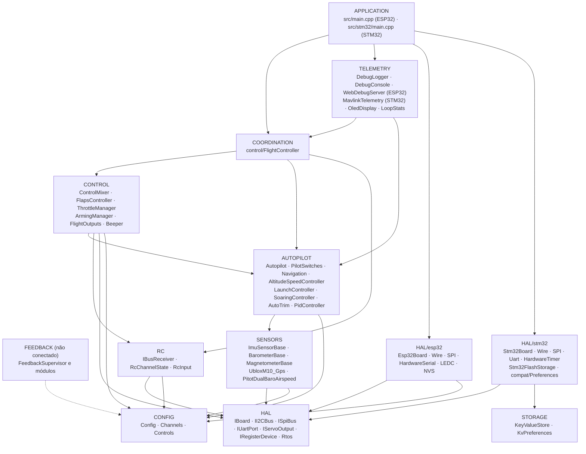
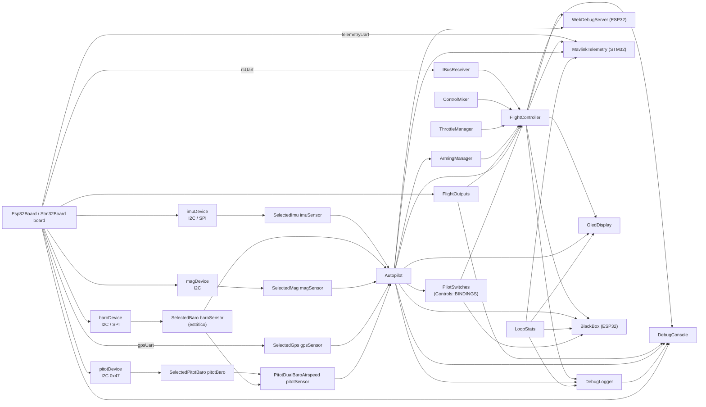
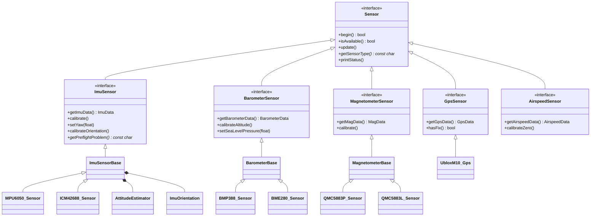
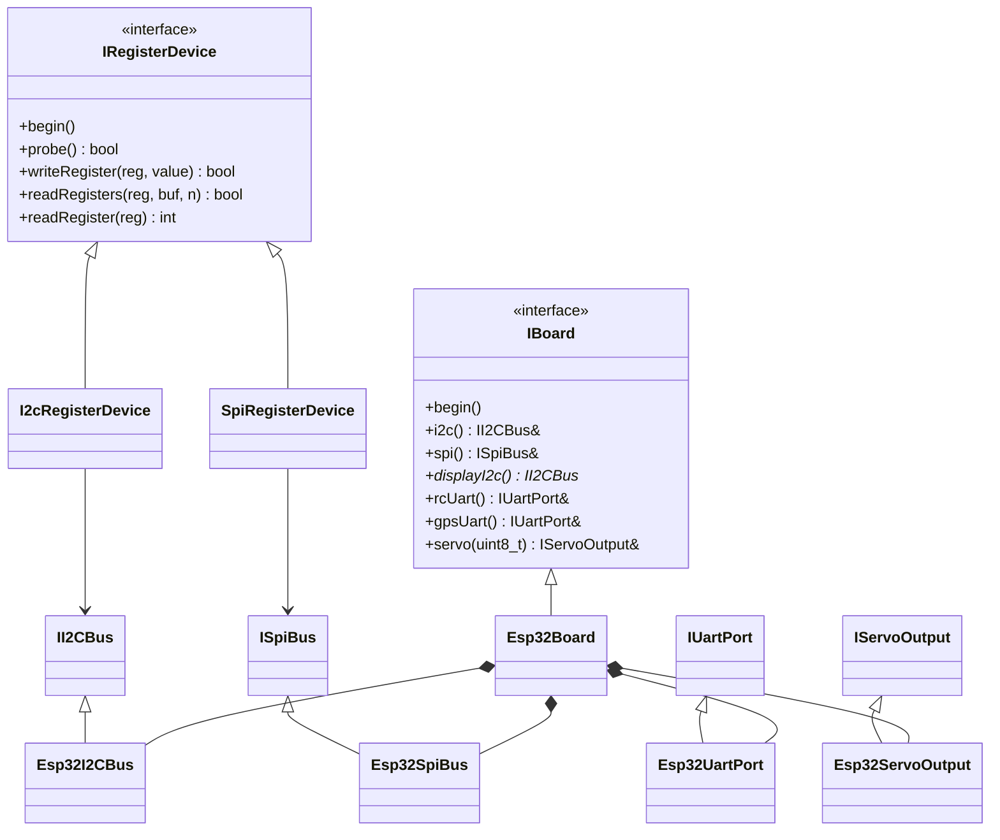
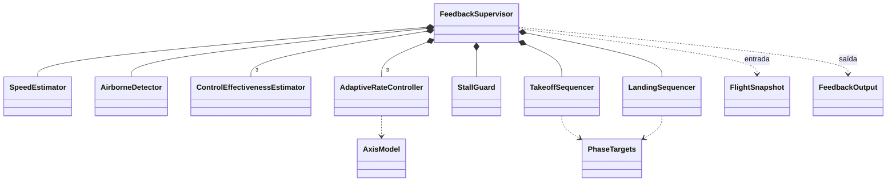
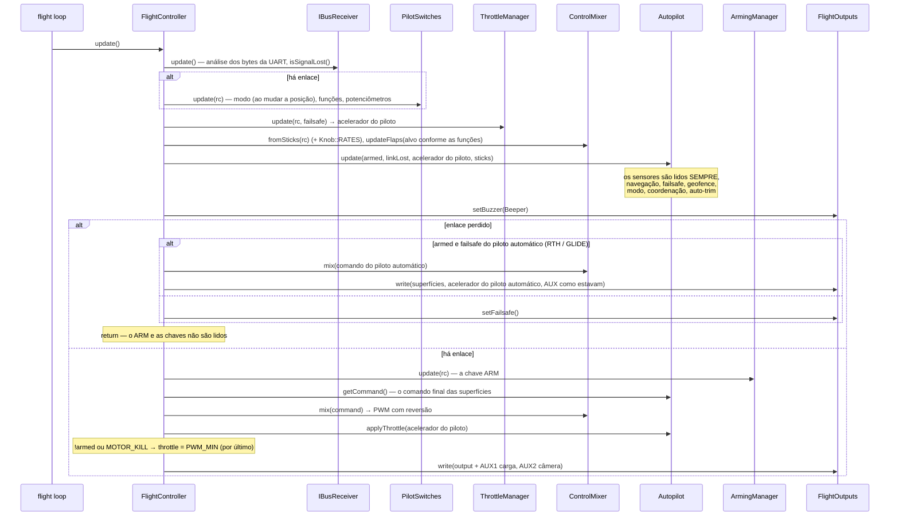
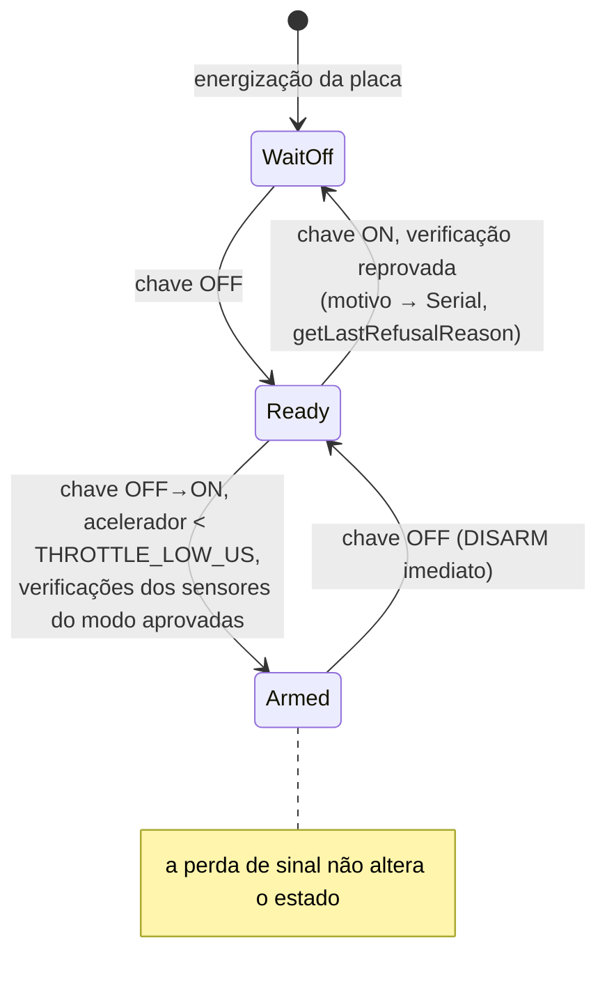
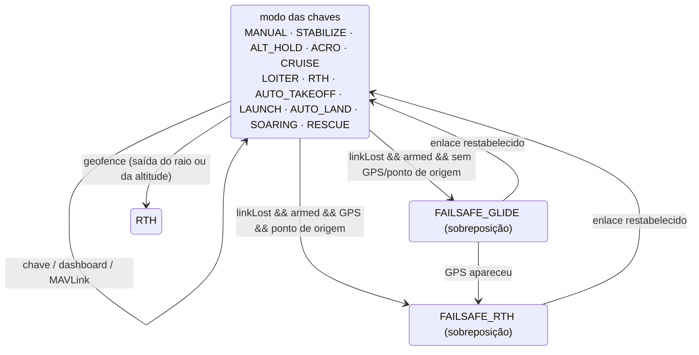
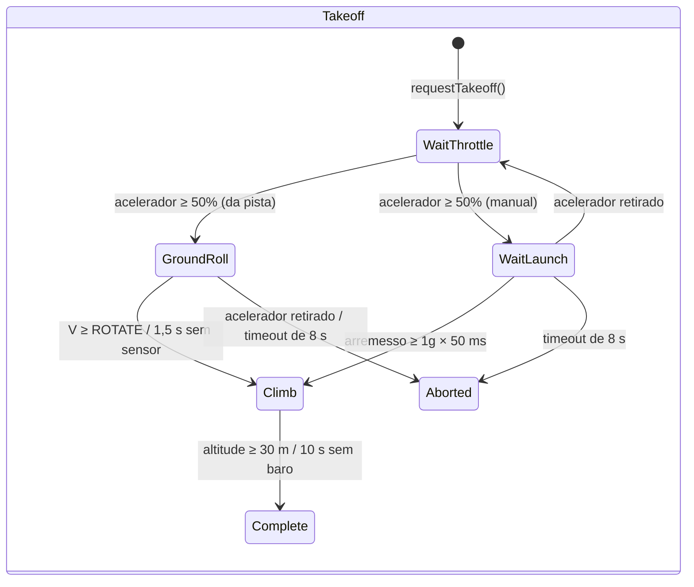
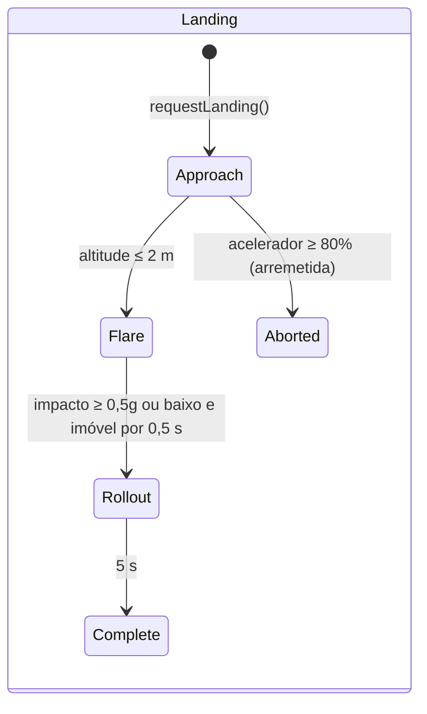

# ARCHITECTURE.md — a arquitetura do firmware do OpenPlaneProject

> 🌐 Esta página é uma tradução do [original em russo](../../ARCHITECTURE.md). Se a tradução e o original divergirem, vale o original. O firmware exibe as mensagens do console em russo, por isso elas são citadas como estão. A tradução foi feita por uma IA e não foi revisada por falantes nativos. Se encontrar erros, escreva para [Damir Lebedev](https://github.com/damir-lebedev) ou abra uma [issue](https://github.com/damir-lebedev/OpenPlaneProject/issues).

Este documento descreve **como o firmware inteiro é organizado**: as camadas e as regras de dependência entre elas, o grafo de objetos, o modelo de threads do FreeRTOS, a ordem das operações em cada ciclo, as máquinas de estados, a estratégia de tolerância a falhas dos sensores e os pontos de extensão. Uma referência detalhada de cada classe (API pública, campos, invariantes) está em [`reference/`](reference/README.md).

Documentos relacionados:

| Documento | Do que trata |
|---|---|
| [`DEVELOPER_GUIDE.md`](DEVELOPER_GUIDE.md) | Guia prático: a convenção de sinais, a API HTTP, o console, como adicionar um sensor, um modo ou uma placa |
| [`reference/`](reference/README.md) | Referência de todas as classes, estruturas e namespaces |
| [`TESTING.md`](TESTING.md) | Testes: nativos (no PC, com cobertura) e na placa |
| [`PILOT_GUIDE.md`](PILOT_GUIDE.md) | Montagem, pinagem, rádio, primeiro voo |
| [`ROADMAP.md`](ROADMAP.md) | Para onde o projeto caminha |

> Status: a bancada com o ESP32-S3 foi verificada com todos os sensores, **o piloto automático não foi testado em voo**, e a malha de realimentação (`autopilot/feedback/`) **não está conectada** ao firmware e é verificada somente por simulação.

---

## Conteúdo

1. [Princípios](#1-princípios)
2. [Camadas e regras de dependência](#2-camadas-e-regras-de-dependência)
3. [O grafo de objetos (composition root)](#3-o-grafo-de-objetos-composition-root)
4. [Hierarquias de classes](#4-hierarquias-de-classes)
5. [Tarefas do FreeRTOS e separação de dados](#5-tarefas-do-freertos-e-separação-de-dados)
6. [O ciclo de controle: `FlightController::update()`](#6-o-ciclo-de-controle-flightcontrollerupdate)
7. [Máquinas de estados](#7-máquinas-de-estados)
8. [Tolerância a falhas: sensores, enlace, saídas](#8-tolerância-a-falhas-sensores-enlace-saídas)
9. [Configuração e variantes de build](#9-configuração-e-variantes-de-build)
10. [A malha de realimentação (não conectada)](#10-a-malha-de-realimentação-não-conectada)
11. [Pontos de extensão](#11-pontos-de-extensão)
12. [Testabilidade](#12-testabilidade)

---

## 1. Princípios

| Princípio | Como é implementado |
|---|---|
| **C++ somente com cabeçalhos** | Todas as classes são definidas nos cabeçalhos de `include/<camada>/`. A única unidade de tradução do firmware é `src/main.cpp` (ESP32) ou `src/stm32/main.cpp` (STM32). Não há memória dinâmica no laço de voo (strings `String` só no servidor web e no OLED). Uma variante dividida em `.h/.cpp` fica em um ramo separado, `feature/split-headers`: ela é gerada por `tools/split_headers.py`, e as diferenças e os tamanhos do firmware estão no `docs/SPLIT_HEADERS.md` dela. |
| **Composition root** | `src/main.cpp` / `src/stm32/main.cpp` é o único lugar onde os objetos são criados e ligados por referências ou ponteiros. Não há lógica de voo nele. |
| **Uma linha — uma chave** | O que cada canal do rádio faz é definido pela tabela `config/Controls.h` (`Bind::modes/mode/feature/knob`), verificada por `static_assert` na compilação. |
| **Inversão de dependência** | As camadas superiores dependem de interfaces (`IBoard`, `IRegisterDevice`, `ImuSensor*`, …) e não de chips e MCUs específicos. |
| **Dependências anuláveis** | O piloto automático, as chaves (`PilotSwitches`) e todos os sensores são passados como ponteiros e podem ser `nullptr`: sem um sensor, o modo se comporta com segurança em vez de falhar. |
| **Segurança por prioridade** | A ordem das operações no ciclo é a prioridade: perda de sinal > ARM > sticks/piloto automático > acelerador. A verificação do ARM sobre o acelerador vem por último. |
| **Uma só convenção de sinais** | Da IMU ao servo, sinais aeronáuticos; o sentido de cada servo é definido em exatamente um lugar (`Config::*_REVERSED`). |
| **O tempo como parâmetro** | Sempre que possível (flaps, módulos de realimentação), o tempo é passado como argumento, e não lido de `millis()` — isso torna as classes determinísticas e testáveis. |
| **Diagnóstico honesto** | Cada sensor e cada saída distinguem “não está no build” (`attached`) de “está, mas não responde” (`available`); isso aparece no JSON, no log e no OLED. |

---

## 2. Camadas e regras de dependência



As regras:

1. **A HAL é a única camada que conhece a MCU.** Somente `include/hal/esp32/` e `include/hal/stm32/` incluem `<Wire.h>`, `<SPI.h>`, `HardwareSerial` e chamam `ledc*` / `HardwareTimer` / a flash. As tarefas do FreeRTOS são criadas por `hal/Rtos.h` (o núcleo 0 no ESP32, uma prioridade na STM32). Armazenamento de configurações: o código escreve `<Preferences.h>` — no ESP32 isso é o NVS, na STM32 é `hal/stm32/compat/Preferences.h` sobre `storage/KeyValueStore.h`. Uma exceção deliberada: `SpiRegisterDevice` alterna o CS com os `pinMode/digitalWrite` padrão do Arduino (iguais no ESP32 e na STM32).
2. **Os drivers de sensores não conhecem o barramento.** Eles recebem um `IRegisterDevice&` (um endereço I2C ou um CS de SPI) ou um `IUartPort&`. O barramento é escolhido em `sensors/SensorSelection.h`.
3. **RC e Outputs não sabem nada sobre o avião**: bytes do iBUS → canais; valores de PWM → saídas.
4. **Control e Autopilot** são lógica pura sobre dados: sem UART, PWM ou Wi-Fi.
5. **Coordination** (`FlightController`) é a única classe que enxerga várias camadas inferiores ao mesmo tempo e decide a ordem das operações.
6. **Telemetry** só lê o estado por getters constantes; os comandos do dashboard passam por uma “caixa de correio” e são aplicados pelo laço de voo; o MAVLink (`MavlinkTelemetry`) trabalha diretamente dentro do laço de voo e aplica os comandos por conta própria.
7. **Uma camada inferior nunca inclui uma superior.** Se uma classe inferior precisa de uma superior, a lógica é elevada para o `FlightController`.

O `ArmingManager` (CONTROL) lê o modo do `Autopilot` — essa é a única dependência horizontal CONTROL → AUTOPILOT: as verificações do ARM dependem de quais sensores o modo escolhido exige.

---

## 3. O grafo de objetos (composition root)

Todos os objetos são globais com duração de armazenamento estática, criados em `src/main.cpp`. As referências e os ponteiros entre eles **não são proprietários**; a ordem de construção coincide com a ordem de declaração (uma única unidade de tradução).



A ordem de inicialização em `setup()`:

```
Serial (ESP32: buffer TX de 4 KB; STM32: SERIAL_TX_BUFFER_SIZE=1024), 115200 → banner
board.begin()               — barramentos I2C/SPI (a segunda I2C, se houver)
flightOutputs.begin()       — canais PWM; logo em seguida setFailsafe()
[STM32] configurações da flash — KeyValueStore::mount(), CRC da imagem
setupSensors()              — begin() de cada sensor; calibração dos que responderam:
                              IMU (2 s parada + verificação pré-voo),
                              baro (altitude zero), bússola (rumo inicial → yaw da IMU),
                              tubo de Pitot (o zero é coletado no primeiro segundo do ciclo)
autopilot.begin()           — trim do NVS/flash
flightController.begin()    — setFailsafe() + UART iBUS
oledDisplay.begin(...)      — tarefa própria (hal/Rtos.h)
[ESP32] webDebugServer.begin() — ponto de acesso + tarefa própria no núcleo 0
[ESP32] blackBox.begin()   — a partição blackbox, uma fila na PSRAM, a tarefa bbox no núcleo 0
[STM32] mavlink.begin()     — UART4 do rádio modem
[STM32] setupBlackBox()    — cartão SD, o arquivo BLACKBOX.BIN, blackBox.begin(), a tarefa bbox
pilotSwitches.printBindings() — o que há em cada chave
debugLogger.begin()         — configurações do log
[STM32] tarefas flight / storage → vTaskStartScheduler()
```

---

## 4. Hierarquias de classes

### Sensores



As classes base (`ImuSensorBase`, `BarometerBase`, `MagnetometerBase`) implementam o padrão **Template Method**: os `update()`/`calibrate()` públicos são escritos uma só vez, e o driver do chip implementa apenas as “primitivas” protegidas (`readSample()`, `isNewSampleReady()`, `readRaw()`, as escalas).

### HAL



### A malha de realimentação



---

## 5. Tarefas do FreeRTOS e separação de dados

**ESP32** (dois núcleos, o FreeRTOS é embutido no núcleo do Arduino):

| Núcleo | Tarefa | O que faz | Período |
|---|---|---|---|
| 1 | Arduino `loopTask` → `loop()` | `WebDebugServer::applyPendingCommands()` → `FlightController::update()` → `DebugLogger::update()` → `DebugConsole::update()` → `LoopStats::record()` → `BlackBox::update()` | `Config::LOOP_PERIOD_MS` = 2 ms (500 Hz), `vTaskDelayUntil` |
| 0 | `web` (8 KB de pilha, prioridade 1) | `WebServer::handleClient()` | a cada 2 ms (`vTaskDelay`) |
| 0 | `oled` (4 KB de pilha, prioridade 1) | `OledDisplay::draw()` pelo segundo barramento I2C | 200 ms (`vTaskDelayUntil`) |
| 0 | `bbox` (6 KB de pilha, prioridade 2) | `BlackBox::writerStep()`: uma página da fila para a flash; no solo, apagamento | notificação do `loop()` após cada ciclo (senão, uma vez a cada 20 ms) |
| 0 | a pilha Wi-Fi do ESP-IDF | o ponto de acesso | — |

**STM32H743** (um núcleo, FreeRTOS do STM32duino, preempção por prioridade):

| Prioridade | Tarefa | O que faz | Período |
|---|---|---|---|
| 5 | `flight` (16 KB) | `FlightController::update()` → `MavlinkTelemetry::update()` → `DebugLogger::update()` → `DebugConsole::update()` → `LoopStats::record()` | 2 ms, `vTaskDelayUntil` |
| 1 | `oled` (4 KB) | `OledDisplay::draw()` pelo segundo barramento I2C | 200 ms |
| 1 | `storage` (2 KB) | `Stm32FlashStorage::service()` — apagamento e gravação do setor de configurações | 100 ms |
| 2 | `bbox` (8 KB) | `BlackBox::writerStep()`: uma página da fila para o cartão SD; no solo, apagamento. É preemptada pela tarefa de voo | notificação após cada ciclo (senão, uma vez a cada 20 ms) |

**Regras de separação de dados:**

- As tarefas `web` e `oled` **apenas leem** o estado (`FlightController`, `Autopilot`, `LoopStats`, os sensores) por getters constantes. Os campos são valores individuais de 16/32 bits, então não há leitura “rasgada”; no pior caso, aparecem os valores de ciclos vizinhos.
- Os **comandos** do dashboard (`/api/setmode`, `/api/setpid`) **não são aplicados** diretamente pela tarefa `web`: eles são colocados em `PendingCommands` sob um spinlock `portMUX` e recolhidos pelo laço de voo em `applyPendingCommands()` — uma mudança no piloto automático sempre acontece no contexto da tarefa que o possui.
- `LoopStats::hz/avgUs/maxUs` são `volatile uint32_t`; `takePeakUs()` é chamada apenas pelo `loop()`.
- O `OledDisplay` guarda um ponteiro para o barramento em uma variável estática (o callback em C do U8g2 não aceita contexto); há uma única tela a bordo.

**Tempo real:**

- O período é mantido por `vTaskDelayUntil`, e não por um `delay()` após o trabalho. Depois de um bloqueio longo (uma calibração pelo console, > 100 ms), a contagem recomeça — os ciclos perdidos não são recuperados em rajada.
- O timeout de uma transação I2C é de 5 ms (o padrão do `Wire` é de 50 ms).
- `Serial` com buffer de transmissão de 4 KB — uma linha de log não trava o laço.
- Caixa-preta: o laço apenas coloca um instantâneo na fila (spinlock, microssegundos); a página para a flash (que para os dois núcleos por ~0,6–0,9 ms) é gravada pela tarefa `bbox` logo após o ciclo, na folga do laço. O apagamento da flash só ocorre sem ARM e sem gravação, nunca no ar.
- ESP32: uma gravação na flash (NVS, configurações do Wi-Fi) para os dois núcleos por ~0,3–0,4 s, por isso: o Wi-Fi usa `persistent(false)`; as configurações do log são salvas só sem ARM; as calibrações, só sem ARM; o auto-trim, depois do DISARM e só quando o avião está parado (`Autopilot::looksLanded()`).
- STM32: `Preferences::end()` apenas copia a imagem (microssegundos), e o apagamento do setor (segundos) ocorre na tarefa `storage`. O setor de configurações fica no banco 2 da flash e o código no banco 1: a tarefa de voo preempta a gravação e continua funcionando.
- O MAVLink não trava o laço: um quadro só é enviado se houver espaço no buffer da UART (`IUartPort::availableForWrite()`); caso contrário, espera o próximo ciclo.

---

## 6. O ciclo de controle: `FlightController::update()`



Invariantes principais do ciclo:

- **Perda de sinal** — o modo e as funções das chaves não mudam; o ARM não é lido nem reiniciado; o motor funciona apenas por decisão do failsafe do piloto automático (RTH com motor) ou por `FAILSAFE_THROTTLE`.
- **Nenhum modo consegue passar o acelerador por cima do ARM**: o `PWM_MIN` forçado com `!armed` e `MOTOR_KILL` vem depois de `Autopilot::applyThrottle()`.
- **O piloto automático emite o comando final** (`getCommand()`); nos modos com estabilização, os sticks são os ângulos desejados; correções = comando − sticks (para o log e o dashboard). Tudo em uma única convenção de sinais (`ControlCommand`) até o mixer.

---

## 7. Máquinas de estados

### ARM (`ArmingManager`)



`WaitOff` = `armed == false && switchSeenOff == false`; `Ready` =
`armed == false && switchSeenOff == true`.

### Modos do piloto automático (`Autopilot` + `PilotSwitches`)

Doze modos (`AutopilotTypes.h`); o que cada um faz está em [AUTOPILOT_GUIDE.md](AUTOPILOT_GUIDE.md#modos). O modo é escolhido pelo `PilotSwitches` conforme a tabela `config/Controls.h`: a chave de modos (`Bind::modes`) e as chaves de “modo por cima” (`Bind::mode`, a linha de cima tem precedência). O `setMode()` só é chamado quando **mudou o resultado** das chaves — por isso um modo escolhido pelo dashboard ou pela GCS se mantém até o piloto acionar uma chave.



O failsafe não é um `AutopilotMode` separado, mas um sinalizador por cima do modo atual; um retorno já iniciado não é abandonado em favor do planeio por uma breve perda do GPS; depois que o enlace volta, continua o modo das chaves (a decolagem automática e o lançamento manual — só de novo). Máquinas de estados internas: `LaunchController` (IDLE → READY → THROWN → CLIMB → DONE) e `SoaringController` (GLIDE → THERMAL → MOTOR_CLIMB → RETURN).

**AUTO_TAKEOFF** (por tempo desde o início, quando armed e o acelerador ≥ 1500 µs):

| Tempo | Acelerador (programa) | Arfagem |
|---|---|---|
| 0–1 s | gradual de 0 → 100% | 0° |
| 1–3 s | 100 % | +15° |
| > 3 s | 100 % | +10° |

### Decolagem e pouso (malha de realimentação, não conectada)





---

## 8. Tolerância a falhas: sensores, enlace, saídas

### Sensores

| Sensor | `isAvailable()` passa a `false` | O que acontece numa falha de leitura |
|---|---|---|
| IMU (`ImuSensorBase`) | `begin()` não identificou o chip, **ou** 50 erros de leitura seguidos (~0,1 s a 500 Hz) | os dados não são sobrescritos, `errorCount++`; se se recuperar, volta a ficar disponível |
| Barômetro (`BarometerBase`) | 100 erros seguidos (~0,5 s com leitura a cada 5 ms) | o mesmo |
| Bússola (`MagnetometerBase`) | 25 erros seguidos (~0,5 s a 50 Hz) | o mesmo |
| GPS (`UbloxM10_Gps`) | nenhum NAV-PVT válido **ou** o último é mais antigo que `GPS_TIMEOUT_US` (2 s) | — |

Além disso, a IMU tem uma **verificação pré-voo** (`getPreflightProblem()`): imobilidade durante a calibração do giroscópio, |a| ≈ 1g, a direção “para cima” coincide com a instalação salva. Se não passar — `Autopilot::imuReady() == false` (correções nulas em todos os modos, inclusive no planeio), e o `ArmingManager` não arma os modos com estabilização.

Os consumidores reagem do mesmo jeito: **sem sensor (`nullptr`) ou com o sensor indisponível, nenhum efeito**, e o avião é pilotado como em MANUAL.

### Enlace (`IBusReceiver::isSignalLost()`)

Dois indicadores independentes:

1. nenhum quadro correto por mais de `RX_TIMEOUT_US` (500 ms) — ou nenhum desde que foi ligado;
2. o acelerador no quadro está abaixo de `RX_FAILSAFE_THROTTLE_US` (950 µs) — o failsafe programado no rádio (o FS-iA6B não para de enviar quadros quando o rádio é perdido).

Os quadros com CRC incorreto são descartados e contados (`getBadFrameCount()`).

### Saídas

Logo após `FlightOutputs::begin()` vem `setFailsafe()`: superfícies no neutro e motor desligado antes mesmo de os sensores serem lidos. Uma saída com o pino `-1` (o leme na C3) simplesmente não é conectada; `attached` no JSON mostra se um canal LEDC foi alocado. O pulso real em cada pino é verificado por `printPulseSelfTest()` (comando do console `p`).

---

## 9. Configuração e variantes de build

| O quê | Onde | Como é escolhido |
|---|---|---|
| Placa (pinos) | `include/config/Config.h` | a macro `BOARD_ESP32_S3` / `BOARD_ESP32_C3` / `BOARD_ESP32_CLASSIC` / `BOARD_STM32H743` vinda de `[env:*]` no `platformio.ini` |
| Todas as configurações (timeouts, cursos das superfícies, reversões, failsafe, Wi-Fi) | `Config.h`, namespace `Config` | `constexpr`, editando o arquivo |
| Atribuição dos canais do rádio | `include/config/Channels.h` | editando o arquivo |
| Sensores e barramentos | `include/sensors/SensorSelection.h` | `#define SENSOR_IMU/BARO/MAG/GPS`, também pode ser dado por uma flag `-D` |
| Constantes da realimentação | `include/autopilot/feedback/FeedbackConfig.h` | passarão para o `Config.h` quando forem conectadas |
| Instalação da IMU | NVS (`imu_mpu6050` / `imu_icm42688`) ou `Config::IMU_ROTATION_CW_DEG` | comando do console `o` |
| Calibração da bússola | NVS (`qmc5883p` / `qmc5883l`) | comando do console `m` |
| Configurações do log | NVS (`debuglog`) | menu do console `l` |
| Caixa-preta | `Config.h` (`BLACKBOX_*`), a partição `blackbox` em `partitions_blackbox.csv` | voos — `tools/blackbox.py`, menu do console `k` |

Ambientes do PlatformIO:

| `env` | Finalidade |
|---|---|
| `esp32-s3` (padrão) | O controlador de voo principal |
| `esp32-c3` | O protótipo antigo |
| `esp32-dev` | A ESP32 clássica, bancada |
| `stm32h743` | STM32H743VIT6: firmware completo (`src/stm32/main.cpp`), configurações na flash, MAVLink, caixa-preta no SD, FreeRTOS; verificado em uma placa nua — veja [reference/hal.md](reference/hal.md#implementação-para-o-stm32h743) |
| `stm32h743-devebox` | DevEBox H743: o mesmo, com o console por USB CDC e gravação por DFU ([DEVELOPER_GUIDE](DEVELOPER_GUIDE.md#stm32h743)) |
| `native` | Build e testes no PC com fakes do Arduino/ESP-IDF e cobertura — veja [`TESTING.md`](TESTING.md) |

---

## 10. A malha de realimentação (não conectada)

`include/autopilot/feedback/` é a futura substituta da estabilização por PID: o modelo do eixo `ε = b·u + a·ω + c` é aprendido em voo por mínimos quadrados recursivos (`ControlEffectivenessEstimator`), e o controlador é uma cascata ângulo → velocidade angular → aceleração angular → superfície, passando pelo modelo aprendido (`AdaptiveRateController`), com a proteção contra estol (`StallGuard`) e as etapas de decolagem e pouso por cima.

A única entrada é o `FlightSnapshot` (um instantâneo por ciclo) e a única saída é o `FeedbackOutput`. Os módulos não leem os sensores nem o rádio diretamente, por isso são verificados por uma simulação em malha fechada (`test/test_feedback`), tanto no PC quanto na placa.

A ordem por ciclo em `FeedbackSupervisor::update()`:

1. velocidade e aceleração longitudinal (`SpeedEstimator`), se está no ar (`AirborneDetector`);
2. treinamento do modelo de cada eixo (só no ar, com a IMU viva, os flaps sem se mover e sem estol);
3. proteção contra estol (desligada perto do solo no pouso);
4. os alvos da etapa de decolagem ou pouso;
5. alvos ← as restrições da proteção contra estol;
6. os controladores dos eixos → deflexões das superfícies; acelerador (só com o enlace vivo).

O plano de conexão está em [`DEVELOPER_GUIDE.md`](DEVELOPER_GUIDE.md#plano-de-conexão).

---

## 11. Pontos de extensão

| Tarefa | O que mudar | O que não mudar |
|---|---|---|
| Um chip novo de uma categoria existente | um novo `*_Sensor.h` a partir da classe base + um ramo em `SensorSelection.h` | `main.cpp`, `Autopilot` |
| Uma nova categoria de sensores | uma interface em `SensorInterface.h`, um ponteiro anulável em `Autopilot`, os campos `attached/available` no JSON | o resto do código |
| Um novo modo do piloto automático | `AutopilotMode`, `handle*Mode()`, `applyThrottle()`, o seletor e o dashboard, `ArmingManager::checkFailureReason()` | `FlightController` |
| Uma nova saída (servo) | uma linha em `FlightOutputs::outputInfo()`, um campo em `FlightOutputState`, um índice em `ServoChannel`, um pino e um canal LEDC em `Esp32Board` | o laço de escrita e de status |
| Uma nova placa ESP32 | um `#elif` em `Config.h`, `[env:*]` em `platformio.ini` | todo o resto do código |
| Outra MCU | `hal/<mcu>/<Mcu>Board.h` implementando `IBoard` (um exemplo: `hal/stm32/`), um bloco de pinos em `Config.h`, `[env:*]` | os sensores, a lógica de voo |
| Outro protocolo de receptor | substituir o `IBusReceiver` por um com a mesma API (`getState()`, `isSignalLost()`) | `FlightController` |
| Um novo canal do log | `LogChannel`, uma linha em `LogSettings::info()`, `DebugLogger::format*()`, `VERSION++` | — |

---

## 12. Testabilidade

Graças às interfaces da HAL e ao fato de o tempo ser passado como parâmetro, a maior parte da lógica pode ser verificada sem hardware:

- Os **testes nativos** (`pio test -e native`) compilam os cabeçalhos do firmware no PC com fakes de Arduino, FreeRTOS, Wire/SPI/UART/LEDC, Preferences, WebServer/WiFi e U8g2 (`test/native/support/`). A cobertura é calculada pelo `gcovr`.
- **O firmware inteiro no PC**: o `src/main.cpp` com a pinagem da S3 e da de 38 pinos e com cada kit de sensores (emuladores de chips no nível dos registradores), e o `src/stm32/main.cpp` (`pio test -e native-stm32`) sobre a camada de fakes do STM32duino.
- **Simulações de voo em malha fechada** (`test/native/test_sim`): todo o firmware pilota um modelo de avião; cada modo do piloto automático voa de verdade, e não apenas “produz números”.
- **A matriz de builds** (`tools/build_matrix.sh`): todas as placas × todos os sensores, sem avisos.
- **Testes na placa** (`pio test -e esp32-s3`): os mesmos `test_feedback` e `test_imu_orientation` rodam também em um ESP32-S3 real.

Os detalhes, a estrutura dos testes e os comandos estão em [`TESTING.md`](TESTING.md).
