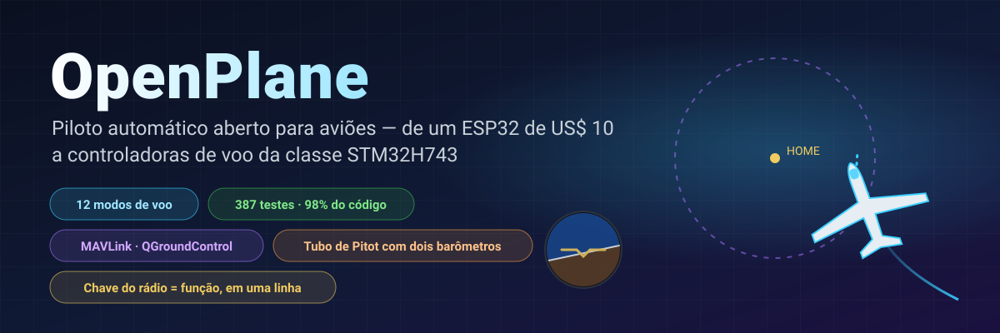
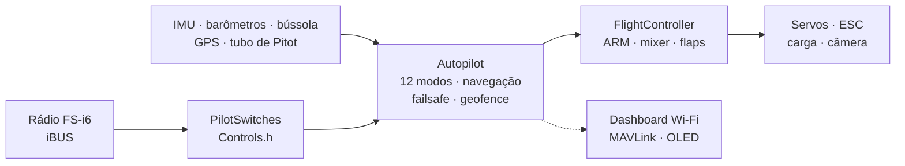

<!-- i18n-bar:start -->
  <p align="center">
    <a href="../../../README.md"> Читать на русском</a>
    &nbsp;·&nbsp;
    <a href="../en/README.md"> Read this in English</a>
    &nbsp;·&nbsp;
    <a href="../zh-CN/README.md"> 阅读中文版</a>
    &nbsp;·&nbsp;
    <a href="../es/README.md"> Lee esto en español</a>
  </p>
  <p align="center">
    <a href="../hi/README.md"> हिन्दी में पढ़ें</a>
    &nbsp;·&nbsp;
    <a href="../ar/README.md"> اقرأ بالعربية</a>
    &nbsp;·&nbsp;
     <b>Leia em português</b>
    &nbsp;·&nbsp;
    <a href="../fr/README.md"> Lire en français</a>
  </p>
  <p align="center">
    <a href="../de/README.md"> Auf Deutsch lesen</a>
    &nbsp;·&nbsp;
    <a href="../ja/README.md"> 日本語で読む</a>
    &nbsp;·&nbsp;
    <a href="../ko/README.md"> 한국어로 읽기</a>
  </p>
<!-- i18n-bar:end -->

<p align="center"><sub>🌐 Tradução do <a href="../../../README.md">README em russo</a>. A documentação detalhada também foi traduzida, e os links abaixo levam às páginas traduzidas. Se a tradução e o original divergirem, vale o original. As mensagens do console, as capturas de tela e os gráficos ainda têm textos em russo. A tradução foi feita por uma IA e não foi revisada por falantes nativos. Se encontrar erros, escreva para <a href="https://github.com/damir-lebedev">Damir Lebedev</a> ou abra uma <a href="https://github.com/damir-lebedev/OpenPlaneProject/issues">issue</a>.</sub></p>

<p align="center">
  
</p>

<p align="center">
  
  
  
  <br>
  
  
  
  <a href="LICENSE.md"></a>
</p>

<h3 align="center">Desligue o rádio — o avião volta sozinho para casa e fica circulando sobre você.</h3>
<p align="center">Isto não é desenho animado: <b>todo o firmware</b> pilota um modelo de avião em malha fechada — os mesmos bytes iBUS na entrada, o mesmo PWM na saída.</p>

<p align="center">
  
</p>

---

## ⚡ Em 30 segundos

| | |
|---|---|
| **O que é** | Um controlador de voo e piloto automático abertos para aviões radiocontrolados. A placa principal é a STM32H743 (placa da classe Pixhawk): em uma placa DevEBox o firmware **já está rodando e é pilotado pelo rádio** — [há vídeo](#-a-stm32h743-ganhou-vida-na-placa), e os sensores estão sendo ligados agora. A base anterior é um ESP32-S3 de uns US$ 10, que passou pela bancada com todos os sensores. |
| **O que faz** | 12 modos de voo — da estabilização ao retorno para casa, círculos por GPS, lançamento manual, pouso automático e **voo planado em térmicas**. Tubo de Pitot feito com dois barômetros baratos. Telemetria MAVLink para o QGroundControl e o Mission Planner. |
| **O grande trunfo** | Qualquer chave ou potenciômetro do rádio = qualquer função. **Uma linha** no `Controls.h` — e a SwD deixa de ser RTH e vira lançamento de carga. |
| **Por que confiar** | 387 testes automatizados (mais 9 na própria placa, com um cartão SD de verdade), 98% do código coberto por testes, 24 builds "placa × sensores" sem um único aviso, simulações em malha fechada de cada modo. |
| **Com honestidade** | Até agora só o modo manual voou (o primeiro protótipo). A STM32H743 foi testada apenas na bancada, sem sensores. O piloto automático foi verificado na bancada, em testes e em simulações, e aguarda os testes de voo — [status abaixo](#-situação-real). |

---

## 🎛️ Chave = função. Uma linha.

```cpp
// include/config/Controls.h
constexpr Binding BINDINGS[] = {
    Bind::modes  (Channels::SWC, MODE_MANUAL, MODE_STABILIZE, MODE_AUTO_TAKEOFF),
    Bind::feature(Channels::SWB, Feature::FLAPS),
    Bind::mode   (Channels::SWD, MODE_RTH),              // para casa, enquanto estiver ligada
    Bind::knob   (Channels::VRA, Knob::STAB_GAIN),       // "mais macio / mais duro" em pleno voo
    Bind::knob   (Channels::VRB, Knob::CRUISE_SPEED),
};
```

Quer o voo planado em térmicas na SwD em vez de RTH? `Bind::mode(Channels::SWD, MODE_SOARING)`. Lançamento de carga na SwB? `Bind::feature(Channels::SWB, Feature::PAYLOAD_DROP)`. Errou — por exemplo, pôs dois modos na mesma chave ou ocupou um stick — **o build não passa**: a tabela é verificada pelo compilador (`static_assert`). Ao ligar, a própria aeronave imprime o que está em cada chave.

**12 modos · 10 funções · 7 potenciômetros** — tudo com exemplos na [referência do piloto automático](AUTOPILOT_GUIDE.md).

---

## ✈️ O que o piloto automático sabe fazer

| | Modo | Em essência |
|---|---|---|
| 🕹️ | **MANUAL** | superfícies de comando = sticks, como sem controladora de voo |
| 🧭 | **STABILIZE** | o stick define o ângulo; solto, o avião se nivela sozinho |
| 📏 | **ALT_HOLD** | + mantém a altitude pelo barômetro |
| 🌀 | **ACRO** | o stick define a taxa de rotação — para acrobacias |
| 🛣️ | **CRUISE** | rumo, altitude e velocidade se mantêm sozinhos; os sticks só corrigem |
| ⭕ | **LOITER** | círculos sobre um ponto de GPS (o raio é ajustado com um potenciômetro) |
| 🏠 | **RTH** | para casa a 40 m e círculos sobre a sua cabeça; liga sozinho quando o sinal se perde |
| 🛫 | **AUTO_TAKEOFF** | decolagem da pista com o acelerador do piloto |
| 🤾 | **LAUNCH** | lançamento manual: o motor liga depois do arremesso e começa a subida |
| 🛬 | **AUTO_LAND** | planeio e arredondamento perto do chão |
| 🦅 | **SOARING** | motor desligado, encontra térmicas e circula nelas |
| 🆘 | **RESCUE** | "socorro": asas niveladas e nariz para cima — a partir de qualquer espiral |

Além disso: geofence, auto-trim para um avião "torto", coordenação de curva, proteção contra estol pelo tubo de Pitot, flaps e freio aerodinâmico, lançamento de carga, câmera estabilizada e um buzzer "me procure na grama".

---

## 📈 Cada modo voa — em malha fechada

Não é "a função devolveu um número", e sim um **voo**: rádio → quadro iBUS → firmware → PWM → deflexão das superfícies de comando → modelo de avião com sustentação, estol, vento e térmicas → sensores → de novo o firmware. 14 voos assim fazem parte dos testes comuns (`pio test -e native`).

<p align="center"></p>

<table>
  <tr>
    <td width="50%"></td>
    <td width="50%"></td>
  </tr>
  <tr>
    <td>🦅 Encontrou uma térmica sozinho e ganhou altitude <b>com o motor desligado</b> — o variômetro de energia total não confunde "stick para trás" com uma corrente ascendente.</td>
    <td>🆘 Inclinação de 60° — e, em poucos segundos, o horizonte nivelado. O RESCUE tira o avião de uma espiral com 70° de inclinação e nariz a −40°.</td>
  </tr>
  <tr>
    <td></td>
    <td></td>
  </tr>
  <tr>
    <td>🤾 Arremesso manual → o motor só liga depois que a mão se afasta da hélice → subida. 🛬 Pouso: planeio e arredondamento a 3 m.</td>
    <td>🌬️ Velocidade por um tubo feito de dois barômetros <b>ruidosos</b>, com 150 Pa de diferença entre os chips — o erro é menor que 0,5 m/s.</td>
  </tr>
</table>

---

## 🌬️ Tubo de Pitot por uns trocados

Um sensor de velocidade do ar decente custa quase metade de uma controladora de voo. Aqui são **dois barômetros**: um BMP581 no tubo (pressão total) e o barômetro principal na fuselagem (pressão estática). O firmware zera a diferença entre os chips no solo, filtra, calcula a densidade do ar pela altitude e pela temperatura e percebe quando as mangueiras estão trocadas. O que isso entrega: o CRUISE mantém a velocidade **do ar**, e não o acelerador; proteção contra estol; uma velocidade honesta na telemetria. A montagem está na [referência](AUTOPILOT_GUIDE.md#tubo-de-pitot-caseiro).

---

## 📡 Estação de solo: navegador ou QGroundControl

<table>
  <tr>
    <td width="46%"></td>
    <td>
      <b>ESP32 — dashboard web direto da aeronave.</b> Ponto de acesso <code>OpenPlane-Debug</code>, endereço <code>192.168.4.1</code>: canais do rádio, saídas, todos os sensores, modo, navegação, troca de modo e ajuste do PID em pleno voo. Sem aplicativos e sem hardware extra.<br><br>
      <b>STM32H743 — MAVLink por rádio-modem.</b> O QGroundControl e o Mission Planner enxergam a aeronave como um avião ArduPilot: horizonte, mapa com o ponto de origem, velocidade pelo tubo de Pitot, modos com os nomes do ArduPlane, PID pela janela de parâmetros, troca de modo por botão. O ARM pelo solo não é possível, apenas por uma chave: é mais seguro.<br><br>
      Os quadros MAVLink foram conferidos byte a byte com a referência <code>pymavlink</code>.
    </td>
  </tr>
</table>

---

## 📼 Caixa-preta

A placa grava cada voo: IMU a 500 Hz, ângulos e decisões do piloto automático, PID, todas as saídas, sticks, barômetro, bússola, GPS, bateria e eventos — do ARM e do acelerador até o pouso, com 10 segundos antes do início. A **ESP32-S3** grava na flash integrada (13,9 MB, cerca de 11 minutos); a **STM32H743**, em um cartão SD (64 MB — cerca de uma hora; o cartão continua sendo um FAT32 comum, e o firmware escreve em um arquivo criado de antemão, `BLACKBOX.BIN`). O apagamento só acontece no solo. Depois do voo, `python tools/blackbox.py download` baixa o voo por USB e o separa em CSV; os voos do cartão SD também podem ser decodificados sem a placa: `python tools/blackbox.py ring E:/BLACKBOX.BIN`. Detalhes em [BLACKBOX.md](BLACKBOX.md).

---

## 🔩 Hardware: um firmware — quatro placas, doze sensores

| Placa | Status | O que foi verificado |
|---|---|---|
| **STM32H743VIT6** | ✅ principal · 🔧 DevEBox, sensores sendo ligados + 🧪 testes | na placa: boot, console por USB, **cartão SD e caixa-preta** (testes na placa), **recepção iBUS, ARM e controle de servos e motor pelo rádio** (o lançamento está em vídeo); no PC — o firmware inteiro: tarefas FreeRTOS, flash, MAVLink, I2C e SPI. Ainda não foram ligados sensores à placa |
| **ESP32-S3 N16R8** | ✅ antiga principal, na bancada | todos os sensores, servos, iBUS, OLED e dashboard ao vivo; o firmware completo nos testes |
| **ESP32 38-pin** | 🧪 testes | o firmware completo nos testes com o kit ICM-45686 |
| **ESP32-C3 SuperMini** | ✈️ já voou (manual) | o primeiro protótipo; build de todos os kits |

| Sensor | O que é | Barramentos |
|---|---|---|
| **LSM6DSV** + **QMC6309** | IMU + bússola (módulo) | I2C / SPI |
| **ICM-45686** + **QMC6309** | IMU + bússola (alternativa) | I2C / SPI |
| **SPL06-001** | barômetro da fuselagem | I2C / SPI |
| **BMP581** | barômetro principal e barômetro no tubo de Pitot | I2C / SPI |
| MPU6050/6500, ICM-42688, BMP388, BME280, QMC5883P/L | de bancada e anteriores | I2C / SPI |
| **u-blox M10** | GPS, 10 Hz, UBX | UART |

O sensor muda com uma linha (`SENSOR_KIT_LSM6DSV_PITOT`), e a placa, com uma flag de build. Todas as 4 placas × 6 kits de sensores compilam sem avisos: [`tools/build_matrix.sh`](../../../tools/build_matrix.sh).

<table>
  <tr>
    <td width="50%"></td>
    <td width="50%"></td>
  </tr>
  <tr>
    <td>Bancada com a ESP32-S3: IMU, barômetro, bússola, OLED, servos, receptor.</td>
    <td>Teste do conjunto motor-hélice.</td>
  </tr>
</table>

### 🎥 A STM32H743 ganhou vida na placa

O firmware da STM32H743 roda em uma placa DevEBox **sem um único sensor** e é pilotado por um rádio comum: o receptor iBUS, o ARM, os servos e o motor respondem aos sticks e às chaves no modo manual. Toda a partida foi gravada em vídeo.

▶️ **[Assista à partida em vídeo](https://t.me/lisnmylife/420)**

O que isso prova: a cadeia "rádio → iBUS → firmware → PWM" funciona em hardware real, e não só nos testes. O que ainda não está provado: nenhum sensor (IMU, barômetro, GPS) foi ligado a essa placa, então os modos do piloto automático ainda não foram testados nela.

---

## 🧪 Qualidade que dá para verificar

| | |
|---|---|
| **387 testes automatizados** | módulos, drivers verificados no nível dos registradores do chip, voos em malha fechada, o firmware de ESP32 e STM32 **inteiro** no PC; além de 9 testes na própria placa STM32 com um cartão SD de verdade |
| **98,3% das linhas, 87,7% dos ramos** | cobertura do `gcovr`, inclusive do código da STM32 |
| **24/24 builds** | 4 placas × 6 kits de sensores, `-Wall -Wextra`, zero avisos |
| **0 apontamentos** | cppcheck e clang-tidy em todo o código |
| **Referências, e não cópias de código** | as fórmulas dos sensores seguem os datasheets (Bosch, ST, TDK, Goertek), e o MAVLink segue o pymavlink |

```bash
pio test -e native -e native-stm32   # todos os testes, ~1,5 minuto, sem precisar de hardware
```

Detalhes em [TESTING.md](TESTING.md).

---

## 🧠 Como é feito



- **C++ só com cabeçalhos (header-only)**, uma única unidade de tradução, sem memória dinâmica no laço de voo. Prefere `.h/.cpp`? Para você há uma branch paralela, [`feature/split-headers`](https://github.com/damir-lebedev/OpenPlaneProject/tree/feature/split-headers): ela é gerada a partir desta por um script, e o firmware com LTO fica do mesmo tamanho.
- **HAL** — a única camada que conhece o microcontrolador: uma placa nova é um `Board` novo, e não um piloto automático reescrito.
- **O driver de um sensor não conhece o barramento**: uma mesma classe funciona por I2C e por SPI.
- **Segurança pela ordem das operações**: perda de sinal > ARM > modo > acelerador; nenhum modo consegue passar o acelerador por cima do ARM.

Detalhes em [ARCHITECTURE.md](ARCHITECTURE.md).

---

## 🚀 Início rápido

```bash
pip install platformio
git clone https://github.com/damir-lebedev/OpenPlaneProject && cd OpenPlaneProject
pio run -e stm32h743-devebox -t upload                    # DevEBox H743: USB DFU, console por USB
pio run -e esp32-s3 -t upload && pio device monitor     # ESP32-S3
pio run -e stm32h743 -t upload                            # STM32H743 (ST-Link)
```

DevEBox: a placa não tem botão BOOT0 — antes da primeira gravação, ligue o pino BT0 ao 3V3 e pressione RST; depois disso, a tecla `D` no console reinicia a placa no bootloader sozinha ([detalhes](DEVELOPER_GUIDE.md#stm32h743)).

No monitor serial: `h` — menu, `b` — quais chips aparecem nos barramentos, `s` — sensores, `p` — teste das saídas (tire a hélice!). Depois — o [guia do piloto](PILOT_GUIDE.md).

---

## 🟢 Situação real

| O quê | Onde foi verificado |
|---|---|
| Controle manual, mixer | ✈️ em voo (primeiro protótipo, C3) |
| ARM, failsafe, flaps, servos, motor | 🔧 na bancada (S3) |
| STABILIZE | 🔧 na bancada: as superfícies de comando respondem às inclinações no sentido certo |
| Sensores da bancada (MPU6500, BMP388, QMC5883P), OLED, dashboard | 🔧 na bancada |
| Demais modos, navegação, tubo de Pitot, MAVLink | 🧪 testes e simulações em malha fechada |
| Sensores novos (LSM6DSV, ICM-45686, QMC6309, SPL06, BMP581) | 🧪 emuladores de registradores feitos a partir dos datasheets |
| STM32H743: cartão SD, caixa-preta, console por USB | 🔧 na placa DevEBox (testes na placa) |
| STM32H743: iBUS, ARM, PWM dos servos e do motor, controle manual | 🔧 na placa sem sensores, gravado em vídeo |
| STM32H743: sensores (IMU, barômetro, bússola, GPS) e modos do piloto automático | 🧪 firmware inteiro no PC; ainda não há sensores ligados à placa |

O modelo de avião nas simulações é simplificado, e os coeficientes são valores iniciais. Todo modo novo é testado primeiro em altitude, com o dedo na chave MANUAL.

---

## 🗺️ Roteiro

- [x] Controle manual, ARM, failsafe, firmware orientado a objetos, dashboard web
- [x] Bancada com a ESP32-S3 e todos os sensores — ao vivo
- [x] 12 modos, navegação por GPS, RTH na perda de sinal, geofence
- [x] Chaves e potenciômetros em uma linha, lançamento de carga, câmera, auto-trim
- [x] Tubo de Pitot com dois barômetros, proteção contra estol
- [x] Sensores novos: LSM6DSV, ICM-45686, QMC6309, SPL06, BMP581
- [x] STM32H743: firmware completo, MAVLink, configurações na flash
- [x] Simulações em malha fechada de todos os modos, o firmware inteiro nos testes
- [x] Caixa-preta: voo na flash (ESP32-S3) e em cartão SD (STM32H743), download e decodificação para CSV
- [x] A STM32H743 roda na placa: rádio → iBUS → servos e motor (sem sensores, em vídeo)
- [ ] STM32H743: ligar os sensores e passar pela bancada como foi feito com a ESP32-S3
- [ ] Testes de voo do piloto automático no novo avião
- [ ] Uma controladora de voo própria ([FC_BOARD.md](FC_BOARD.md)) com a STM32H743
- [ ] Voo por pontos de rota, missões MAVLink
- [ ] Realimentação adaptativa (o esboço já foi verificado em simulação)
- [ ] Sensor de corrente e de bateria, telemetria para o rádio (iBUS-SENS)
- [ ] Entrega autônoma: rota → lançamento de carga → casa

Detalhes em [ROADMAP.md](ROADMAP.md).

---

## 💼 Para parceiros e investidores

Aviões pequenos de entrega e de monitoramento são plataformas fechadas e caras ou projetos de hobby dispersos. A OpenPlane mira o meio-termo: **um piloto automático aberto e verificável em hardware popular**, em que cada função é coberta por testes e pode ser adaptada a uma tarefa — entrega de medicamentos a locais de difícil acesso, monitoramento de lavouras e florestas, operações de busca.

O que já foi feito com recursos próprios: uma arquitetura que se leva de uma placa para outra sem reescrever; um piloto automático com o conjunto completo de modos; uma infraestrutura de testes em que novas funções surgem rápido e não quebram as antigas. O que mais recursos acelerariam: os testes de voo, uma controladora de voo própria na STM32H743, o voo por pontos de rota e o lançamento de carga. Para onde e por quê — [ROADMAP.md](ROADMAP.md).

---

## 📚 Documentação

| Documento | Para quem |
|---|---|
| [AUTOPILOT_GUIDE.md](AUTOPILOT_GUIDE.md) | o piloto: cada modo, função e potenciômetro, como colocá-los em uma chave, o tubo de Pitot, a estação de solo |
| [PILOT_GUIDE.md](PILOT_GUIDE.md) | montagem, pinagem, rádio, failsafe, primeiro voo |
| [DEVELOPER_GUIDE.md](DEVELOPER_GUIDE.md) | o desenvolvedor: arquivos, convenção de sinais, API, como adicionar um sensor, um modo ou uma placa |
| [ARCHITECTURE.md](ARCHITECTURE.md) | camadas, tarefas, o ciclo de controle, máquinas de estados |
| [TESTING.md](TESTING.md) | testes, simulações, cobertura, análise |
| [reference/](reference/README.md) | referência de cada classe |
| [FC_BOARD.md](FC_BOARD.md) · [ROADMAP.md](ROADMAP.md) | a placa da controladora de voo · para onde o projeto caminha |
| [airframe/](airframe/README.md) | o aeromodelo Astro-Cargo: projeto do Fusion 360 e arquivos STL para impressão, falhas conhecidas da versão v2 |

> **Projeto relacionado:** [esp32-rc-joystick](https://github.com/damir-lebedev/esp32-rc-joystick) — o rádio FS-i6 como joystick USB para o simulador, na mesma ESP32-S3: primeiro acumule horas no simulador, depois no campo.

---

## 🤝 Participação

Precisamos de mãos e cabeças: aerodinâmica e aeromodelismo, impressão 3D e resistência estrutural, C++ embarcado, sensores e pilotos automáticos, interfaces de solo. Issues e pull requests vão para a branch `main`; comece pelo [DEVELOPER_GUIDE.md](DEVELOPER_GUIDE.md).

## 📜 Licença

A [OpenPlane License](LICENSE.md) é uma licença baseada na MIT com condições adicionais. O código, a documentação e os arquivos do modelo podem ser usados, copiados, modificados e vendidos, inclusive em produtos comerciais. As condições são estas:

1. **Credite o autor — Damir Lebedev (Damn / Проклятый).** O nome deve aparecer onde os usuários do seu produto possam vê-lo: na documentação, no README ou em uma página "Sobre". Mantenha o texto da licença junto com o código.
2. **O uso militar é proibido.** O projeto não pode ser usado por exércitos e organizações paramilitares, na guerra, nem para criar armas, munições e sistemas de lançamento ou de mira.
3. **Não cause dano intencional a pessoas ou bens sem que eles tenham consentido previamente, por escrito, com esse dano.** Você pode quebrar o seu próprio equipamento se isso não ameaçar ninguém: por exemplo, atirar com uma pistola de pressão no seu próprio drone. Mutilar e matar pessoas não é permitido.
4. **Respeite as normas de segurança e a lei** ao montar, testar e voar.

Se as condições forem descumpridas, a permissão de uso do projeto deixa de valer. Por causa das proibições a certos tipos de uso, esta não é uma licença "aberta" no sentido da OSI: o código está disponível para leitura, cópia e modificação, mas formalmente o projeto é source-available, e não open source.

Somente o texto em inglês do arquivo [LICENSE](LICENSE.md) tem validade jurídica: as traduções da licença para outros idiomas são oferecidas para sua conveniência.

O firmware controla uma aeronave e não é certificado. Tudo o que você fizer com ele é por sua conta e risco; o autor não assume responsabilidade alguma.

```text
OpenPlane © 2026 Damir Lebedev (Damn / Проклятый) — https://github.com/damir-lebedev/OpenPlaneProject
```

<p align="center"><i>O primeiro protótipo quebrou já no primeiro voo — por isso aqui está tudo à mostra: código, testes, problemas. Monte, quebre e conserte junto com a gente.</i></p>
