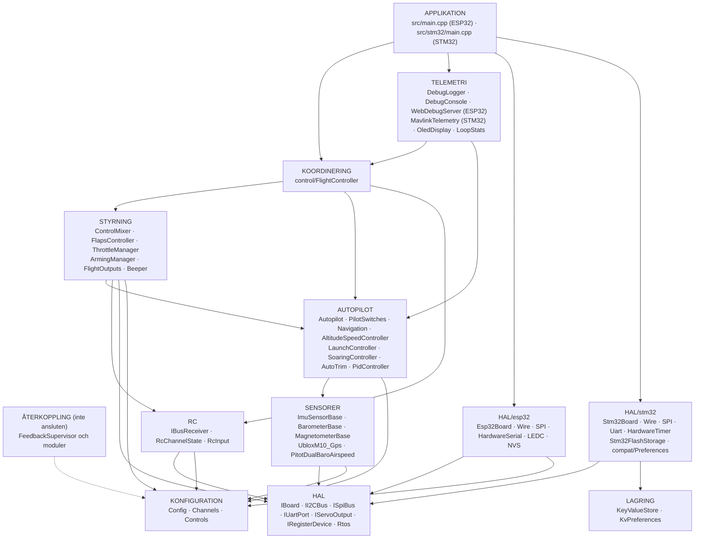
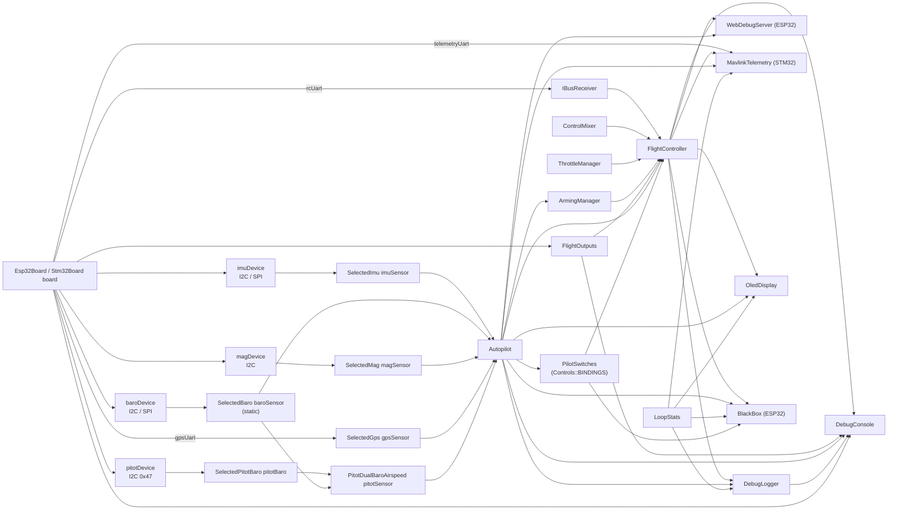
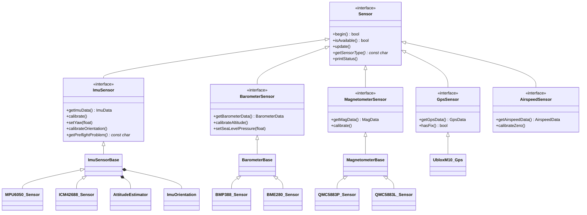
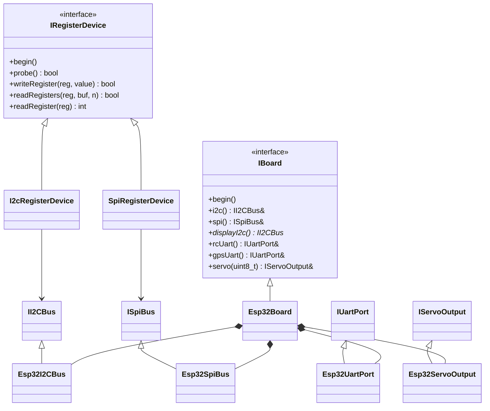
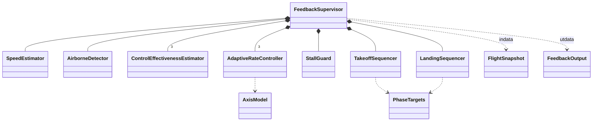
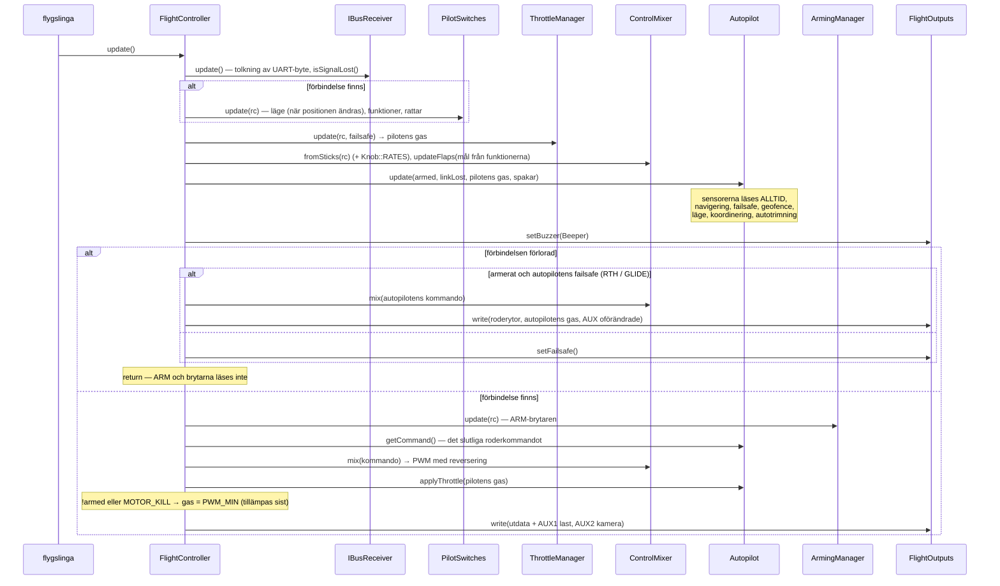
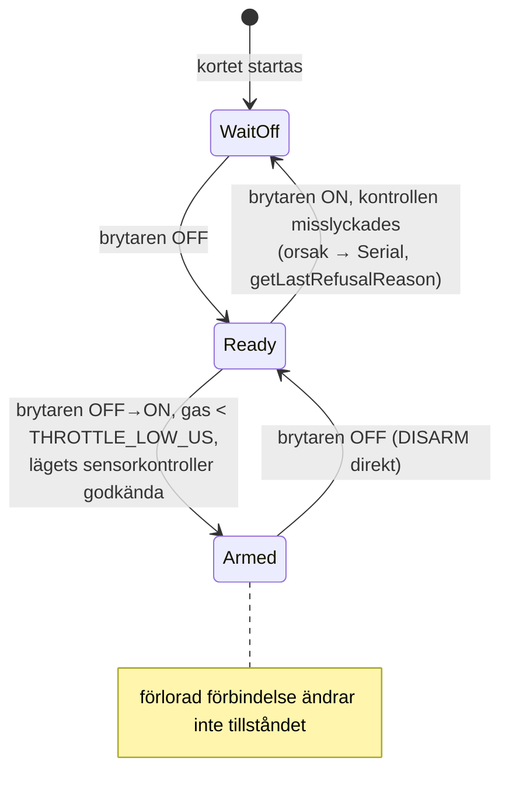
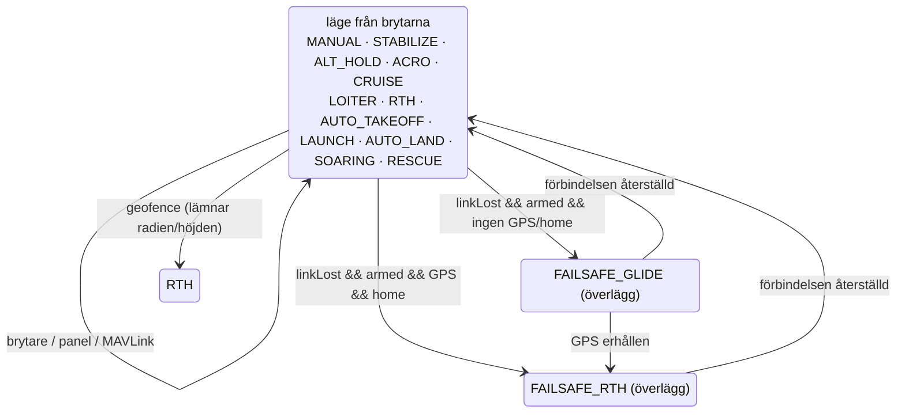
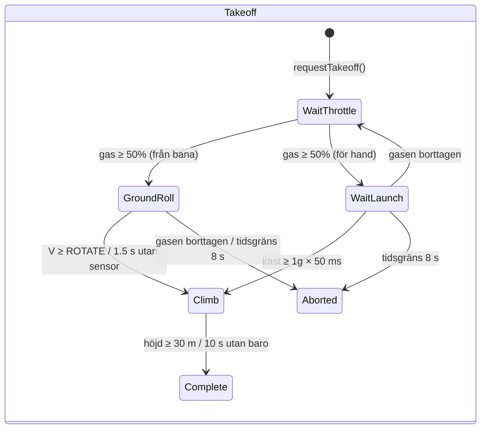
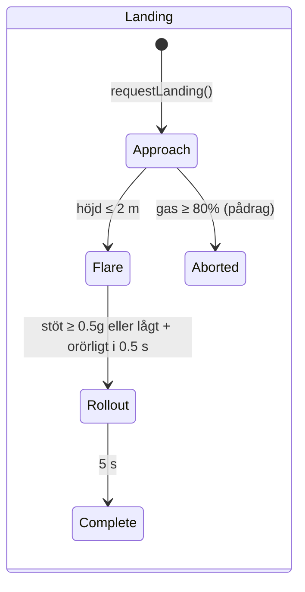

# ARCHITECTURE.md – arkitekturen i OpenPlaneProjects firmware

> 🌐 Den här sidan är en översättning av [det ryska originalet](../../ARCHITECTURE.md). Om översättningen och originalet skiljer sig åt gäller originalet. Firmwaren skriver ut sina konsolmeddelanden på ryska, så de citeras oförändrade. Översättningen är gjord av AI och har inte granskats av personer med svenska som modersmål. Rapportera fel till [Damir Lebedev](https://github.com/damir-lebedev) eller i [ärendehanteraren](https://github.com/damir-lebedev/OpenPlaneProject/issues).

Det här dokumentet beskriver **hur hela firmwaren är organiserad**: lagren och
beroendereglerna mellan dem, objektgrafen, FreeRTOS-trådmodellen, ordningen för
operationer per cykel, tillståndsmaskinerna, strategin för feltolerans hos sensorer och
utbyggnadspunkterna. En detaljerad referens för varje klass (publikt API,
fält, invarianter) finns i [`reference/`](reference/README.md).

Närliggande dokument:

| Dokument | Vad det handlar om |
|---|---|
| [`DEVELOPER_GUIDE.md`](DEVELOPER_GUIDE.md) | En praktisk handbok: teckenkonventionen, HTTP-API:t, konsolen, hur man lägger till en sensor/ett läge/ett kort |
| [`reference/`](reference/README.md) | En referens för alla klasser, strukturer och namnrymder |
| [`TESTING.md`](TESTING.md) | Tester: native (på en dator, med täckning) och på kortet |
| [`PILOT_GUIDE.md`](PILOT_GUIDE.md) | Montering, stiftbeläggning, sändare, första flygningen |
| [`ROADMAP.md`](ROADMAP.md) | Vart projektet är på väg |

> Status: ESP32-S3-bänken har verifierats med alla sensorer, **autopiloten har inte
> provats under flygning**, och återkopplingsslingan (`autopilot/feedback/`) är **inte
> ansluten** till firmwaren och verifieras bara genom simulering.

---

## Innehåll

1. [Principer](#1-principer)
2. [Lager och beroenderegler](#2-lager-och-beroenderegler)
3. [Objektgrafen (composition root)](#3-objektgrafen-composition-root)
4. [Klasshierarkier](#4-klasshierarkier)
5. [FreeRTOS-uppgifter och dataseparation](#5-freertos-uppgifter-och-dataseparation)
6. [Styrcykeln: `FlightController::update()`](#6-styrcykeln-flightcontrollerupdate)
7. [Tillståndsmaskiner](#7-tillståndsmaskiner)
8. [Feltolerans: sensorer, förbindelse, utgångar](#8-feltolerans-sensorer-förbindelse-utgångar)
9. [Konfiguration och byggvarianter](#9-konfiguration-och-byggvarianter)
10. [Återkopplingsslingan (inte ansluten)](#10-återkopplingsslingan-inte-ansluten)
11. [Utbyggnadspunkter](#11-utbyggnadspunkter)
12. [Testbarhet](#12-testbarhet)

---

## 1. Principer

| Princip | Hur den är genomförd |
|---|---|
| **Header-only C++** | Alla klasser definieras i headerfilerna under `include/<lager>/`. Firmwarens enda översättningsenhet är `src/main.cpp` (ESP32) eller `src/stm32/main.cpp` (STM32). Inget dynamiskt minne i flygslingan (`String`-strängar bara i webbservern och OLED). En variant uppdelad i `.h/.cpp` finns på en separat gren, `feature/split-headers`: den genereras av `tools/split_headers.py`, och skillnaderna och firmwarestorlekarna finns i dess `docs/SPLIT_HEADERS.md`. |
| **Composition root** | `src/main.cpp` / `src/stm32/main.cpp` är det enda stället där objekt skapas och länkas med referenser/pekare. Där finns ingen flyglogik. |
| **En rad – en brytare** | Vad varje sändarkanal gör definieras av tabellen i `config/Controls.h` (`Bind::modes/mode/feature/knob`), som kontrolleras med `static_assert` vid bygget. |
| **Beroendeinvertering** | De övre lagren beror på gränssnitt (`IBoard`, `IRegisterDevice`, `ImuSensor*`, …), inte på specifika kretsar och mikrokontroller. |
| **Nullbara beroenden** | Autopiloten, brytarna (`PilotSwitches`) och alla sensorer skickas som pekare och får vara `nullptr`: utan en sensor beter sig läget säkert i stället för att krascha. |
| **Säkerhet genom prioritet** | Operationsordningen i cykeln är prioriteten: förlorad förbindelse > ARM > spakar/autopilot > gas. ARM-kontrollen av gasen kommer sist. |
| **En teckenkonvention** | Från IMU:n till servot – flygtekniska tecken; riktningen för varje servo anges på exakt ett ställe (`Config::*_REVERSED`). |
| **Tid som parameter** | Där det är möjligt (klaffar, återkopplingsmoduler) skickas tiden som argument i stället för att läsas från `millis()` – det gör klasserna deterministiska och testbara. |
| **Ärlig diagnostik** | Varje sensor och utgång skiljer på ”inte med i bygget” (`attached`) och ”finns men svarar inte” (`available`); det syns i JSON, i loggen och på OLED-skärmen. |

---

## 2. Lager och beroenderegler



Reglerna:

1. **HAL är det enda lagret som känner till mikrokontrollern.** Bara `include/hal/esp32/`
   och `include/hal/stm32/` inkluderar `<Wire.h>`, `<SPI.h>`,
   `HardwareSerial` och anropar `ledc*` / `HardwareTimer` / flash. FreeRTOS-uppgifter
   skapas via `hal/Rtos.h` (kärna 0 på ESP32, en prioritet på STM32).
   Lagring av inställningar: koden skriver `<Preferences.h>` – på ESP32 är det NVS, på
   STM32 är det `hal/stm32/compat/Preferences.h` ovanpå `storage/KeyValueStore.h`.
   Ett avsiktligt undantag: `SpiRegisterDevice` växlar CS med Arduinos standardfunktioner
   `pinMode/digitalWrite` (identiska på ESP32 och STM32).
2. **Sensordrivrutiner känner inte till bussen.** De får en `IRegisterDevice&`
   (en I2C-adress eller en SPI CS) eller en `IUartPort&`. Bussen väljs i
   `sensors/SensorSelection.h`.
3. **RC och utgångar vet ingenting om flygplanet**: iBUS-byte → kanaler; PWM-värden →
   utgångar.
4. **Styrning och Autopilot** är ren logik över data: ingen UART, PWM eller Wi-Fi.
5. **Koordinering** (`FlightController`) är den enda klassen som ser
   flera lägre lager samtidigt och bestämmer operationsordningen.
6. **Telemetri** läser bara tillståndet via const-getters; kommandon från
   panelen passerar genom en ”brevlåda” och tillämpas av flygslingan;
   MAVLink (`MavlinkTelemetry`) arbetar direkt i flygslingan och tillämpar
   kommandon själv.
7. **Ett lägre lager inkluderar aldrig ett övre.** Om en lägre klass behöver en
   övre lyfts logiken upp i `FlightController`.

`ArmingManager` (STYRNING) läser läget från `Autopilot` – det är det enda
horisontella beroendet STYRNING → AUTOPILOT: ARM-kontrollerna beror på vilka
sensorer det valda läget behöver.

---

## 3. Objektgrafen (composition root)

Alla objekt är globala med statisk lagringstid, skapade i
`src/main.cpp`. Referenserna och pekarna mellan dem är **icke-ägande**; konstruktionsordningen
följer deklarationsordningen (en enda översättningsenhet).



Initieringsordningen i `setup()`:

```
Serial (ESP32: TX-buffert 4 KB; STM32: SERIAL_TX_BUFFER_SIZE=1024), 115200 → banner
board.begin()               — I2C/SPI-bussar (den andra I2C, om den finns)
flightOutputs.begin()       — PWM-kanaler; setFailsafe() direkt
[STM32] inställningar från flash — KeyValueStore::mount(), avbildens CRC
setupSensors()              — begin() för varje sensor; kalibrering av dem som svarade:
                              IMU (2 s orörligt + kontroll före flygning),
                              baro (nollhöjd), kompass (startkurs → IMU-gir),
                              pitotrör (nollpunkten samlas in under slingans första sekund)
autopilot.begin()           — trim från NVS/flash
flightController.begin()    — setFailsafe() + UART iBUS
oledDisplay.begin(...)      — en egen uppgift (hal/Rtos.h)
[ESP32] webDebugServer.begin() — åtkomstpunkt + en egen uppgift på kärna 0
[ESP32] blackBox.begin()   — blackbox-partitionen, en kö i PSRAM, uppgiften bbox på kärna 0
[STM32] mavlink.begin()     — UART4 för radiomodemet
[STM32] setupBlackBox()    — SD-kort, filen BLACKBOX.BIN, blackBox.begin(), uppgiften bbox
pilotSwitches.printBindings() — vad som ligger på vilken brytare
debugLogger.begin()         — logginställningar
[STM32] uppgifterna flight / storage → vTaskStartScheduler()
```

---

## 4. Klasshierarkier

### Sensorer



Basklasserna (`ImuSensorBase`, `BarometerBase`, `MagnetometerBase`) implementerar mönstret **Template Method**: de publika `update()`/`calibrate()` skrivs en gång, och kretsdrivrutinen implementerar bara de skyddade ”primitiverna” (`readSample()`, `isNewSampleReady()`, `readRaw()`, skalorna).

### HAL



### Återkopplingsslingan



---

## 5. FreeRTOS-uppgifter och dataseparation

**ESP32** (två kärnor, FreeRTOS är inbyggt i Arduino-kärnan):

| Kärna | Uppgift | Vad den gör | Period |
|---|---|---|---|
| 1 | Arduino `loopTask` → `loop()` | `WebDebugServer::applyPendingCommands()` → `FlightController::update()` → `DebugLogger::update()` → `DebugConsole::update()` → `LoopStats::record()` → `BlackBox::update()` | `Config::LOOP_PERIOD_MS` = 2 ms (500 Hz), `vTaskDelayUntil` |
| 0 | `web` (8 KB stack, prioritet 1) | `WebServer::handleClient()` | var 2:a ms (`vTaskDelay`) |
| 0 | `oled` (4 KB stack, prioritet 1) | `OledDisplay::draw()` över den andra I2C-bussen | 200 ms (`vTaskDelayUntil`) |
| 0 | `bbox` (6 KB stack, prioritet 2) | `BlackBox::writerStep()`: en sida från kön till flash; på marken – radering | aviseras från `loop()` efter varje cykel (annars var 20:e ms) |
| 0 | ESP-IDF:s Wi-Fi-stack | åtkomstpunkten | – |

**STM32H743** (en kärna, STM32duino FreeRTOS, preemption efter prioritet):

| Prioritet | Uppgift | Vad den gör | Period |
|---|---|---|---|
| 5 | `flight` (16 KB) | `FlightController::update()` → `MavlinkTelemetry::update()` → `DebugLogger::update()` → `DebugConsole::update()` → `LoopStats::record()` | 2 ms, `vTaskDelayUntil` |
| 1 | `oled` (4 KB) | `OledDisplay::draw()` över den andra I2C-bussen | 200 ms |
| 1 | `storage` (2 KB) | `Stm32FlashStorage::service()` – radering och skrivning av inställningssektorn | 100 ms |
| 2 | `bbox` (8 KB) | `BlackBox::writerStep()`: en sida från kön till SD-kortet; på marken – radering. Avbryts av flyguppgiften | aviseras efter varje cykel (annars var 20:e ms) |

**Regler för dataseparation:**

- Uppgifterna `web` och `oled` **läser bara** tillståndet (`FlightController`,
  `Autopilot`, `LoopStats`, sensorerna) via const-getters. Fälten är
  enskilda 16/32-bitarsvärden, så det finns ingen ”söndersliten” läsning; i värsta fall syns
  värdena från intilliggande cykler.
- **Kommandon** från panelen (`/api/setmode`, `/api/setpid`) **tillämpas inte**
  direkt från uppgiften `web`: de läggs i `PendingCommands` under ett
  `portMUX`-spinlock och hämtas av flygslingan i
  `applyPendingCommands()` – en ändring av autopiloten sker alltid i
  kontexten för den uppgift som äger den.
- `LoopStats::hz/avgUs/maxUs` är `volatile uint32_t`; `takePeakUs()` anropas
  bara från `loop()`.
- `OledDisplay` håller en pekare till bussen i en statisk variabel (U8g2:s C-callback
  tar ingen kontext); det finns en skärm ombord.

**Realtid:**

- Perioden hålls av `vTaskDelayUntil`, inte av `delay()` efter arbetet. Efter ett
  långt block (en kalibrering från konsolen, > 100 ms) börjar tidtagningen
  om – de missade cyklerna tas inte igen i en skur.
- Tidsgränsen för en I2C-transaktion är 5 ms (standard i `Wire` är 50 ms).
- `Serial` med en sändbuffert på 4 KB – en loggrad blockerar inte slingan.
- Svart låda: slingan lägger bara en ögonblicksbild i kön (ett spinlock, mikrosekunder);
  sidan till flash (som stoppar båda kärnorna i ~0,6–0,9 ms) skrivs av uppgiften `bbox`
  direkt efter cykeln – i slingans glapp. Radering av flash sker bara utan ARM och
  utan inspelning, aldrig i luften.
- ESP32: en flashskrivning (NVS, Wi-Fi-inställningar) stoppar båda kärnorna i
  ~0,3–0,4 s, därför: Wi-Fi är `persistent(false)`; logginställningar
  sparas bara utan ARM; kalibreringar bara utan ARM; autotrimningen –
  efter DISARM och bara när flygplanet står stilla (`Autopilot::looksLanded()`).
- STM32: `Preferences::end()` kopierar bara avbilden (mikrosekunder), medan radering av
  sektorn (sekunder) pågår i uppgiften `storage`. Inställningssektorn ligger i bank 2 i
  flashminnet, koden i bank 1: flyguppgiften avbryter skrivningen och fortsätter
  att köra.
- MAVLink blockerar inte slingan: en ram skickas bara om det finns plats i UART-bufferten
  (`IUartPort::availableForWrite()`), annars väntar den till nästa cykel.

---

## 6. Styrcykeln: `FlightController::update()`



Cykelns viktigaste invarianter:

- **Förlorad förbindelse** – läget och funktionerna från brytarna ändras inte; ARM varken läses eller återställs; motorn går bara på beslut av autopilotens failsafe (RTH med motor) eller `FAILSAFE_THROTTLE`.
- **Inget läge kan smyga gasen förbi ARM**: den påtvingade `PWM_MIN` för `!armed` och `MOTOR_KILL` kommer efter `Autopilot::applyThrottle()`.
- **Autopiloten ger det slutliga kommandot** (`getCommand()`); i stabiliseringslägena är spakarna de önskade vinklarna; korrigeringar = kommando − spakar (för loggen och panelen). Allt är i en teckenkonvention (`ControlCommand`) fram till mixern.

---

## 7. Tillståndsmaskiner

### ARM (`ArmingManager`)



`WaitOff` = `armed == false && switchSeenOff == false`; `Ready` =
`armed == false && switchSeenOff == true`.

### Autopilotlägen (`Autopilot` + `PilotSwitches`)

Tolv lägen (`AutopilotTypes.h`); vad vart och ett gör finns i [AUTOPILOT_GUIDE.md](AUTOPILOT_GUIDE.md#lägen). Läget väljs av `PilotSwitches` från tabellen i `config/Controls.h`: lägesbrytaren (`Bind::modes`) och brytarna för ”läge ovanpå” (`Bind::mode`, den övre raden har företräde). `setMode()` anropas bara när **brytarnas resultat har ändrats** – så ett läge som valts från panelen eller GCS:en gäller tills piloten slår om en brytare.



Failsafe är inte ett separat `AutopilotMode` utan en flagga ovanpå det aktuella läget; en hemflygning som har börjat övergår inte till glidflykt vid en kort GPS-förlust; efter att förbindelsen återställts återupptas läget från brytarna (autostart och handstart – bara på nytt). De interna tillståndsmaskinerna: `LaunchController` (IDLE → READY → THROWN → CLIMB → DONE) och `SoaringController` (GLIDE → THERMAL → MOTOR_CLIMB → RETURN).

**AUTO_TAKEOFF** (efter tid från start, när armerat och gasen ≥ 1500 µs):

| Tid | Gas (program) | Tippning |
|---|---|---|
| 0–1 s | mjukt 0 → 100 % | 0° |
| 1–3 s | 100 % | +15° |
| > 3 s | 100 % | +10° |

### Start och landning (återkopplingsslingan, inte ansluten)





---

## 8. Feltolerans: sensorer, förbindelse, utgångar

### Sensorer

| Sensor | `isAvailable()` blir `false` | Vad som händer vid ett läsfel |
|---|---|---|
| IMU (`ImuSensorBase`) | `begin()` identifierade inte kretsen, **eller** 50 läsfel i följd (~0,1 s vid 500 Hz) | data skrivs inte över, `errorCount++`; när den återhämtar sig är den tillgänglig igen |
| Barometer (`BarometerBase`) | 100 fel i följd (~0,5 s vid avläsning var 5:e ms) | samma sak |
| Kompass (`MagnetometerBase`) | 25 fel i följd (~0,5 s vid 50 Hz) | samma sak |
| GPS (`UbloxM10_Gps`) | inte en enda giltig NAV-PVT **eller** den senaste är äldre än `GPS_TIMEOUT_US` (2 s) | – |

Dessutom har IMU:n en **kontroll före flygning** (`getPreflightProblem()`):
orörlighet under gyroskopkalibreringen, |a| ≈ 1g, riktningen ”upp” stämmer med den
sparade monteringen. Om den misslyckas – `Autopilot::imuReady() == false` (noll
korrigeringar i alla lägen, inklusive glidflykt), och `ArmingManager` armerar inte
lägena med stabilisering.

Konsumenterna reagerar likadant: **ingen sensor (`nullptr`) eller den är otillgänglig –
inga effekter**, och flygplanet styrs som i MANUAL.

### Förbindelse (`IBusReceiver::isSignalLost()`)

Två oberoende indikatorer:

1. inga korrekta ramar på mer än `RX_TIMEOUT_US` (500 ms) – eller inga alls
   sedan start;
2. gasen i ramen är under `RX_FAILSAFE_THROTTLE_US` (950 µs) – den failsafe som
   programmerats i sändaren (FS-iA6B slutar inte skicka ramar när
   sändaren tappas).

Ramar med fel CRC kasseras och räknas (`getBadFrameCount()`).

### Utgångar

`FlightOutputs::begin()` följs direkt av `setFailsafe()` – ytor till neutralläge, motorn
av, redan innan sensorerna läses. En utgång med stift `-1` (sidrodret på C3)
ansluts helt enkelt inte; `attached` i JSON visar om en LEDC-kanal har tilldelats.
Den verkliga pulsen på varje stift kontrolleras av `printPulseSelfTest()` (konsol `p`).

---

## 9. Konfiguration och byggvarianter

| Vad | Var | Hur det väljs |
|---|---|---|
| Kort (stift) | `include/config/Config.h` | makrot `BOARD_ESP32_S3` / `BOARD_ESP32_C3` / `BOARD_ESP32_CLASSIC` / `BOARD_STM32H743` från `[env:*]` i `platformio.ini` |
| Alla inställningar (tidsgränser, roderutslag, reverseringar, failsafe, Wi-Fi) | `Config.h`, namnrymden `Config` | `constexpr`, redigera filen |
| Tilldelning av RC-kanaler | `include/config/Channels.h` | redigera filen |
| Sensorer och bussar | `include/sensors/SensorSelection.h` | `#define SENSOR_IMU/BARO/MAG/GPS`, kan också anges med en `-D`-flagga |
| Återkopplingskonstanter | `include/autopilot/feedback/FeedbackConfig.h` | flyttas till `Config.h` vid anslutning |
| IMU-montering | NVS (`imu_mpu6050` / `imu_icm42688`) eller `Config::IMU_ROTATION_CW_DEG` | konsolkommandot `o` |
| Kompasskalibrering | NVS (`qmc5883p` / `qmc5883l`) | konsolkommandot `m` |
| Logginställningar | NVS (`debuglog`) | konsolmenyn `l` |
| Svart låda | `Config.h` (`BLACKBOX_*`), partitionen `blackbox` i `partitions_blackbox.csv` | flygningar – `tools/blackbox.py`, konsolmenyn `k` |

PlatformIO-miljöer:

| `env` | Syfte |
|---|---|
| `esp32-s3` (standard) | Den huvudsakliga flygkontrollern |
| `esp32-c3` | Den gamla prototypen |
| `esp32-dev` | Den klassiska ESP32, bänk |
| `stm32h743` | STM32H743VIT6: den fullständiga firmwaren (`src/stm32/main.cpp`), inställningar i flash, MAVLink, svart låda på SD, FreeRTOS; verifierad på ett naket kort – se [reference/hal.md](reference/hal.md#implementering-för-stm32h743) |
| `stm32h743-devebox` | DevEBox H743: samma sak, konsolen via USB CDC, flashning via DFU ([DEVELOPER_GUIDE](DEVELOPER_GUIDE.md#stm32h743)) |
| `native` | Bygge och tester på en dator med Arduino-/ESP-IDF-attrapper och täckning – se [`TESTING.md`](TESTING.md) |

---

## 10. Återkopplingsslingan (inte ansluten)

`include/autopilot/feedback/` är en framtida ersättning för PID-stabiliseringen: axelmodellen
`ε = b·u + a·ω + c` lärs in under flygning med rekursiva minsta kvadrater
(`ControlEffectivenessEstimator`), och regulatorn är en kaskad vinkel → vinkelhastighet →
vinkelacceleration → roderyta genom den inlärda modellen (`AdaptiveRateController`),
med överstegringsskydd (`StallGuard`) och start-/landningsfaserna ovanpå.

Den enda indatan är `FlightSnapshot` (en ögonblicksbild per cykel), den enda utdatan är
`FeedbackOutput`. Modulerna läser inte sensorerna eller RC direkt, så de
verifieras med en simulering i sluten slinga (`test/test_feedback`) både på en dator och på kortet.

Ordningen per cykel i `FeedbackSupervisor::update()`:

1. hastighet och longitudinell acceleration (`SpeedEstimator`), om luftburen (`AirborneDetector`);
2. inlärning av modellen för varje axel (bara i luften, med IMU:n vid liv, klaffarna stilla, inte i överstegring);
3. överstegringsskydd (avstängt nära marken vid landning);
4. målen för start-/landningsfasen;
5. mål ← begränsningarna från överstegringsskyddet;
6. axelregulatorerna → roderutslag; gas (bara med levande förbindelse).

Anslutningsplanen finns i [`DEVELOPER_GUIDE.md`](DEVELOPER_GUIDE.md#anslutningsplan).

---

## 11. Utbyggnadspunkter

| Uppgift | Vad som ska ändras | Vad som inte ska ändras |
|---|---|---|
| En ny krets i en befintlig kategori | en ny `*_Sensor.h` från basklassen + en gren i `SensorSelection.h` | `main.cpp`, `Autopilot` |
| En ny sensorkategori | ett gränssnitt i `SensorInterface.h`, en nullbar pekare i `Autopilot`, fälten `attached/available` i JSON | resten av koden |
| Ett nytt autopilotläge | `AutopilotMode`, `handle*Mode()`, `applyThrottle()`, väljaren/panelen, `ArmingManager::checkFailureReason()` | `FlightController` |
| En ny utgång (servo) | en rad i `FlightOutputs::outputInfo()`, ett fält i `FlightOutputState`, ett index i `ServoChannel`, ett stift och en LEDC-kanal i `Esp32Board` | skriv-/statusslingan |
| Ett nytt ESP32-kort | en `#elif` i `Config.h`, `[env:*]` i `platformio.ini` | all övrig kod |
| En annan mikrokontroller | `hal/<mcu>/<Mcu>Board.h` som implementerar `IBoard` (ett exempel – `hal/stm32/`), ett stiftblock i `Config.h`, `[env:*]` | sensorerna, flyglogiken |
| Ett annat mottagarprotokoll | ersätt `IBusReceiver` med en som har samma API (`getState()`, `isSignalLost()`) | `FlightController` |
| En ny loggkanal | `LogChannel`, en rad i `LogSettings::info()`, `DebugLogger::format*()`, `VERSION++` | – |

---

## 12. Testbarhet

Tack vare HAL-gränssnitten och att tiden skickas som parameter kan det mesta av logiken
verifieras utan hårdvara:

- **Native-tester** (`pio test -e native`) bygger firmwarens headerfiler på en dator med
  attrapper för Arduino, FreeRTOS, Wire/SPI/UART/LEDC, Preferences, WebServer/WiFi och
  U8g2 (`test/native/support/`). Täckningen beräknas av `gcovr`.
- **Hela firmwaren på en dator** – `src/main.cpp` med S3- och 38-pin-stiftbeläggningarna och
  varje sensorsats (kretsemulatorer på registernivå), och `src/stm32/main.cpp`
  (`pio test -e native-stm32`) ovanpå STM32duino-attrapplagret.
- **Flygsimuleringar i sluten slinga** (`test/native/test_sim`): hela firmwaren
  flyger en flygplansmodell – varje autopilotläge flyger faktiskt, i stället för att bara
  ”ge ut tal”.
- **Byggmatrisen** (`tools/build_matrix.sh`): alla kort × alla sensorer, utan
  varningar.
- **Tester på kortet** (`pio test -e esp32-s3`): samma `test_feedback` och
  `test_imu_orientation` körs också på en riktig ESP32-S3.

Detaljerna, testernas struktur och kommandona finns i [`TESTING.md`](TESTING.md).
