<!-- i18n-bar:start -->
  <p align="center">
    <a href="../../../README.md"> Читать на русском</a>
    &nbsp;·&nbsp;
    <a href="../en/README.md"> Read this in English</a>
    &nbsp;·&nbsp;
    <a href="../zh-CN/README.md"> 阅读中文版</a>
    &nbsp;·&nbsp;
    <a href="../es/README.md">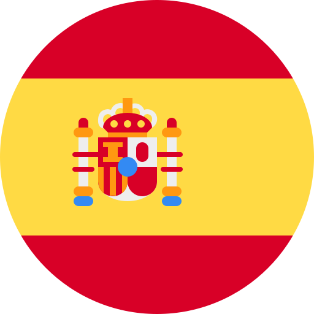 Lee esto en español</a>
  </p>
  <p align="center">
    <a href="../hi/README.md"> हिन्दी में पढ़ें</a>
    &nbsp;·&nbsp;
    <a href="../ar/README.md">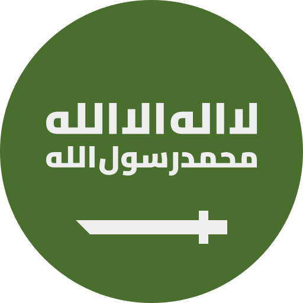 اقرأ بالعربية</a>
    &nbsp;·&nbsp;
    <a href="../pt-BR/README.md"> Leia em português</a>
    &nbsp;·&nbsp;
    <a href="../fr/README.md"> Lire en français</a>
  </p>
  <p align="center">
    <a href="../de/README.md">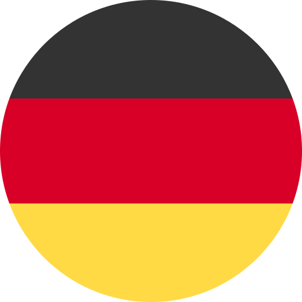 Auf Deutsch lesen</a>
    &nbsp;·&nbsp;
    <a href="../ja/README.md"> 日本語で読む</a>
    &nbsp;·&nbsp;
    <a href="../ko/README.md"> 한국어로 읽기</a>
    &nbsp;·&nbsp;
    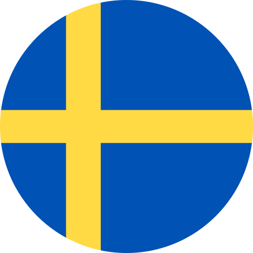 <b>Läs på svenska</b>
  </p>
<!-- i18n-bar:end -->

<p align="center"><sub>🌐 Översättning av <a href="../../../README.md">den ryska README-filen</a>. Den detaljerade dokumentationen är också översatt, och länkarna nedan leder till de översatta sidorna. Om översättningen och originalet skiljer sig åt gäller originalet. Konsolmeddelanden, skärmbilder och diagram har fortfarande ryska etiketter. Översättningen är gjord av AI och har inte granskats av personer med svenska som modersmål. Rapportera fel till <a href="https://github.com/damir-lebedev">Damir Lebedev</a> eller i <a href="https://github.com/damir-lebedev/OpenPlaneProject/issues">ärendehanteraren</a>.</sub></p>

<p align="center">
  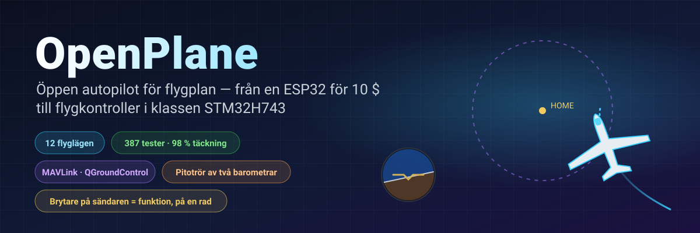
</p>

<p align="center">
  
  
  
  <br>
  
  
  
  <a href="LICENSE.md"></a>
</p>

<h3 align="center">Stäng av sändaren – och planet flyger hem av sig självt och cirklar ovanför dig.</h3>
<p align="center">Det här är ingen tecknad film: <b>hela firmwaren</b> flyger en flygplansmodell i sluten slinga – samma iBUS-byte in, samma PWM ut.</p>

<p align="center">
  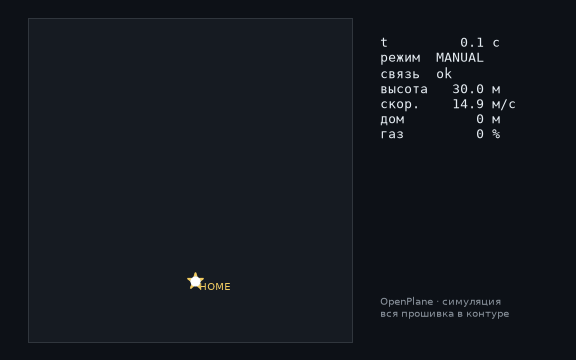
</p>

---

## ⚡ På 30 sekunder

| | |
|---|---|
| **Vad det är** | En öppen flygkontroller och autopilot för radiostyrda flygplan. Huvudkortet är STM32H743 (ett kort i Pixhawk-klassen): på ett DevEBox-kort är firmwaren **redan igång och styrs från sändaren** – [det finns en video](#-stm32h743-har-vaknat-till-liv-på-kortet), och sensorerna kopplas in just nu. Den tidigare basen är en ESP32-S3 för cirka 10 $, som klarade testbänken med alla sensorer. |
| **Vad den kan** | 12 flyglägen – från stabilisering till hemflygning, GPS-cirklar, handstart, autolandning och **termikflygning**. Ett pitotrör av två billiga barometrar. MAVLink-telemetri till QGroundControl och Mission Planner. |
| **Huvudtricket** | Vilken brytare eller ratt som helst på sändaren = vilken funktion som helst. **En rad** i `Controls.h` – och SwD är inte längre RTH utan lastsläpp. |
| **Varför man kan lita på den** | 387 automatiska tester (plus 9 på själva kortet med ett riktigt SD-kort), 98 % av koden täckt av tester, 24 bygg ”kort × sensorer” utan en enda varning, simuleringar i sluten slinga av varje läge. |
| **Ärligt talat** | Hittills har bara manuellt läge flugit (den första prototypen). STM32H743 har hittills bara provats på bänken, utan sensorer. Autopiloten är verifierad på bänken, med tester och simuleringar och väntar på flygprov – [status nedan](#-ärlig-status). |

---

## 🎛️ En brytare = en funktion. En rad.

```cpp
// include/config/Controls.h
constexpr Binding BINDINGS[] = {
    Bind::modes  (Channels::SWC, MODE_MANUAL, MODE_STABILIZE, MODE_AUTO_TAKEOFF),
    Bind::feature(Channels::SWB, Feature::FLAPS),
    Bind::mode   (Channels::SWD, MODE_RTH),              // hem, så länge den är påslagen
    Bind::knob   (Channels::VRA, Knob::STAB_GAIN),       // "mjukare / hårdare" mitt under flygningen
    Bind::knob   (Channels::VRB, Knob::CRUISE_SPEED),
};
```

Vill du ha termikflygning på SwD i stället för RTH? `Bind::mode(Channels::SWD, MODE_SOARING)`. Lastsläpp på SwB? `Bind::feature(Channels::SWB, Feature::PAYLOAD_DROP)`. Har du gjort fel – till exempel lagt två lägen på en brytare eller tagit en spak – **går bygget inte igenom**: kompilatorn kontrollerar tabellen (`static_assert`). Vid start skriver planet själv ut vad som ligger på vilken brytare.

**12 lägen · 10 funktioner · 7 rattar** – alla med exempel i [autopilotreferensen](AUTOPILOT_GUIDE.md).

---

## ✈️ Vad autopiloten kan

| | Läge | Idén |
|---|---|---|
| 🕹️ | **MANUAL** | roderytor = spakar, precis som utan flygkontroller |
| 🧭 | **STABILIZE** | spaken anger vinkeln; släpp den och planet rätar upp sig självt |
| 📏 | **ALT_HOLD** | + håller höjden med barometern |
| 🌀 | **ACRO** | spaken anger rotationshastigheten – för avancerad flygning |
| 🛣️ | **CRUISE** | kurs, höjd och fart hålls av sig själva; spakarna justerar bara |
| ⭕ | **LOITER** | cirklar över en GPS-punkt (radien ställs in med en ratt) |
| 🏠 | **RTH** | hem på 40 m och cirklar ovanför; slås på av sig självt när förbindelsen bryts |
| 🛫 | **AUTO_TAKEOFF** | start från bana med pilotens gas |
| 🤾 | **LAUNCH** | handstart: motorn startar efter kastet, sedan stigning |
| 🛬 | **AUTO_LAND** | glidflykt och flare nära marken |
| 🦅 | **SOARING** | motorn av, hittar termik och cirklar i den |
| 🆘 | **RESCUE** | ”hjälp!”: vingarna plana, nosen upp – ut ur vilken spiral som helst |

Dessutom: geofence, autotrimning för ett ”snett” plan, koordinerade svängar, överstegringsskydd med pitotröret, klaffar och luftbroms, lastsläpp, en stabiliserad kamera och en summer som säger ”hitta mig i gräset”.

---

## 📈 Varje läge flyger – i sluten slinga

Inte ”en funktion returnerade ett tal”, utan en **flygning**: sändare → iBUS-ram → firmware → PWM → roderutslag → en flygplansmodell med lyftkraft, överstegring, vind och termik → sensorer → tillbaka till firmwaren. 14 sådana flygningar ingår i de vanliga testerna (`pio test -e native`).

<p align="center">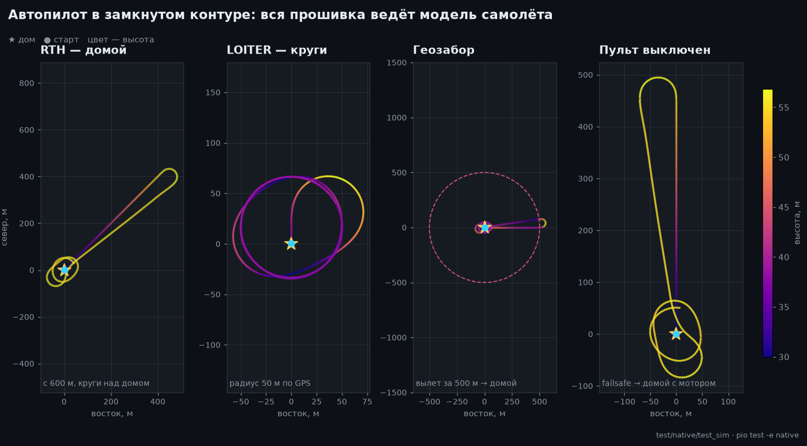</p>

<table>
  <tr>
    <td width="50%">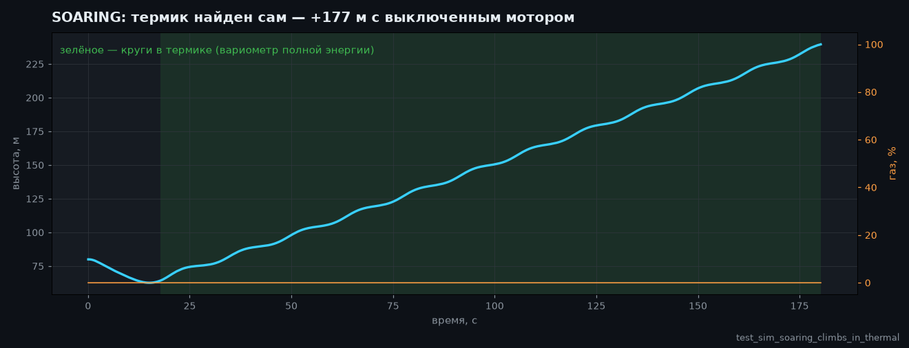</td>
    <td width="50%">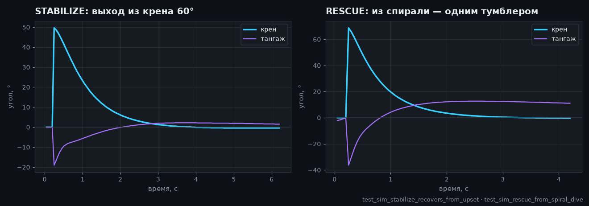</td>
  </tr>
  <tr>
    <td>🦅 Hittade termik på egen hand och vann höjd <b>med motorn avstängd</b> – totalenergivariometern förväxlar inte ”spaken bakåt” med en uppvind.</td>
    <td>🆘 60° krängning – och några sekunder senare en plan horisont. RESCUE drar ut planet ur en spiral med 70° krängning och nosen på −40°.</td>
  </tr>
  <tr>
    <td>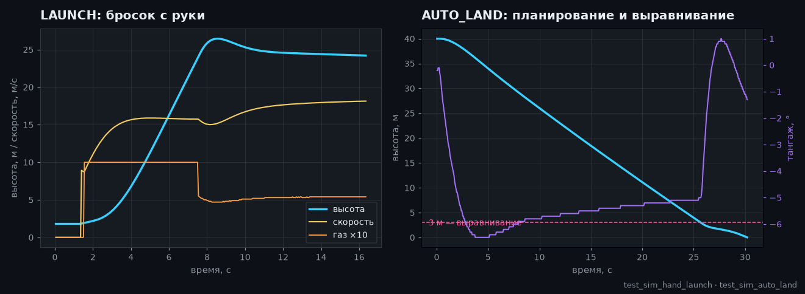</td>
    <td>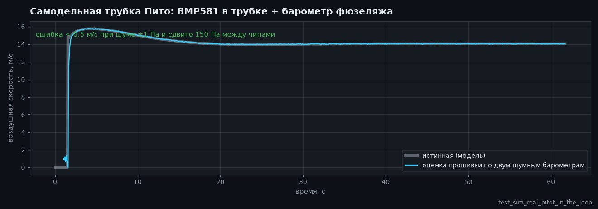</td>
  </tr>
  <tr>
    <td>🤾 Kast med handen → motorn startar först när handen är borta från propellern → stigning. 🛬 Landning: glidflykt och flare på 3 m.</td>
    <td>🌬️ Lufthastighet från ett rör av två <b>brusiga</b> barometrar med 150 Pa skillnad mellan kretsarna – felet är under 0,5 m/s.</td>
  </tr>
</table>

---

## 🌬️ Ett pitotrör för småpengar

En riktig lufthastighetssensor kostar ungefär som en halv flygkontroller. Här finns **två barometrar**: en BMP581 i röret (totaltryck) och huvudbarometern i flygkroppen (statiskt tryck). Firmwaren nollställer skillnaden mellan kretsarna på marken, filtrerar, räknar ut luftens densitet från höjd och temperatur och märker om slangarna har förväxlats. Vad det ger: CRUISE håller **luft**hastigheten, inte gasen; överstegringsskydd; en ärlig hastighet i telemetrin. Bygget beskrivs i [referensen](AUTOPILOT_GUIDE.md#ett-hemmabyggt-pitotrör).

---

## 📡 Markstation: webbläsare eller QGroundControl

<table>
  <tr>
    <td width="46%">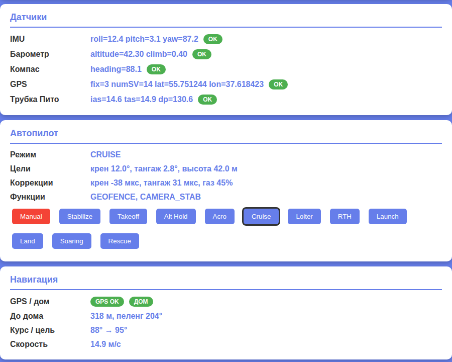</td>
    <td>
      <b>ESP32 – en webbpanel direkt från planet.</b> Åtkomstpunkt <code>OpenPlane-Debug</code>, adress <code>192.168.4.1</code>: sändarkanaler, utgångar, alla sensorer, läge, navigering, lägesbyte och PID-justering i farten. Inga appar och ingen extra hårdvara.<br><br>
      <b>STM32H743 – MAVLink via radiomodem.</b> QGroundControl och Mission Planner ser planet som ett ArduPilot-flygplan: horisont, karta med hempunkten, hastighet från pitotröret, lägen under sina ArduPlane-namn, PID från parameterfönstret, lägesbyte med en knapp. ARM från marken går inte, bara med en brytare: det är säkrare så.<br><br>
      MAVLink-ramar kontrolleras byte för byte mot referensen <code>pymavlink</code>.
    </td>
  </tr>
</table>

---

## 📼 Svart låda

Kortet registrerar varje flygning: IMU på 500 Hz, vinklar och autopilotens beslut, PID, alla utgångar, spakar, barometer, kompass, GPS, batteri och händelser – från ARM och gaspådrag till landning, med 10 sekunder före start. **ESP32-S3** skriver till sitt inbyggda flashminne (13,9 MB, cirka 11 minuter), **STM32H743** till ett SD-kort (64 MB – ungefär en timme; kortet förblir ett vanligt FAT32-kort, och firmwaren skriver i en i förväg skapad fil `BLACKBOX.BIN`). Radering sker bara på marken. Efter flygningen hämtar `python tools/blackbox.py download` flygningen via USB och delar upp den i CSV-filer; flygningar kan också avkodas från SD-kortet utan kortet: `python tools/blackbox.py ring E:/BLACKBOX.BIN`. Detaljer – [BLACKBOX.md](BLACKBOX.md).

---

## 🔩 Hårdvara: en firmware – fyra kort, tolv sensorer

| Kort | Status | Vad som har kontrollerats |
|---|---|---|
| **STM32H743VIT6** | ✅ huvudkort · 🔧 DevEBox, sensorer kopplas in + 🧪 tester | på kortet: uppstart, konsol via USB, **SD-kort och svart låda** (tester på kortet), **iBUS-mottagning, ARM och styrning av servon och motor från sändaren** (starten finns på video); på datorn – hela firmwaren: FreeRTOS-uppgifter, flash, MAVLink, I2C och SPI. Sensorer har ännu inte kopplats till kortet |
| **ESP32-S3 N16R8** | ✅ tidigare huvudkort, på bänken | alla sensorer, servon, iBUS, OLED, panelen live; hela firmwaren i tester |
| **ESP32 38-pin** | 🧪 tester | hela firmwaren i tester med ICM-45686-satsen |
| **ESP32-C3 SuperMini** | ✈️ har flugit (manuellt) | den första prototypen; bygg av alla satser |

| Sensor | Vad det är | Bussar |
|---|---|---|
| **LSM6DSV** + **QMC6309** | IMU + kompass (modul) | I2C / SPI |
| **ICM-45686** + **QMC6309** | IMU + kompass (alternativ) | I2C / SPI |
| **SPL06-001** | barometer i flygkroppen | I2C / SPI |
| **BMP581** | huvudbarometer och pitotrörets barometer | I2C / SPI |
| MPU6050/6500, ICM-42688, BMP388, BME280, QMC5883P/L | bänk och äldre | I2C / SPI |
| **u-blox M10** | GPS, 10 Hz, UBX | UART |

En sensor byts med en rad (`SENSOR_KIT_LSM6DSV_PITOT`), ett kort med en byggflagga. Alla 4 kort × 6 sensorsatser byggs utan varningar: [`tools/build_matrix.sh`](../../../tools/build_matrix.sh).

<table>
  <tr>
    <td width="50%">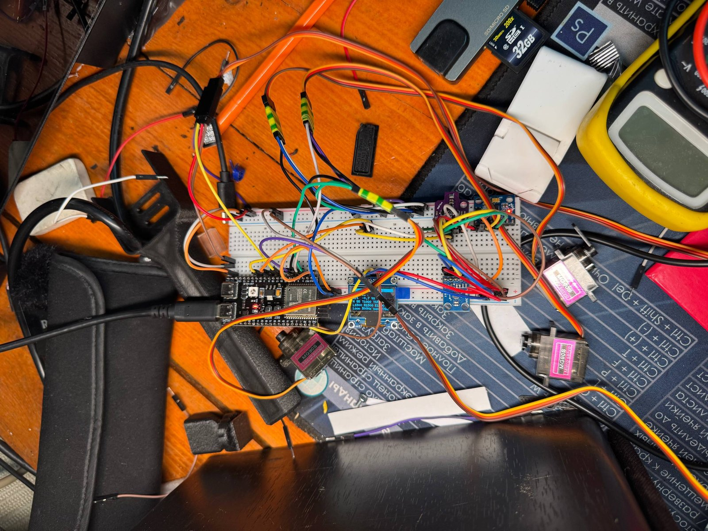</td>
    <td width="50%">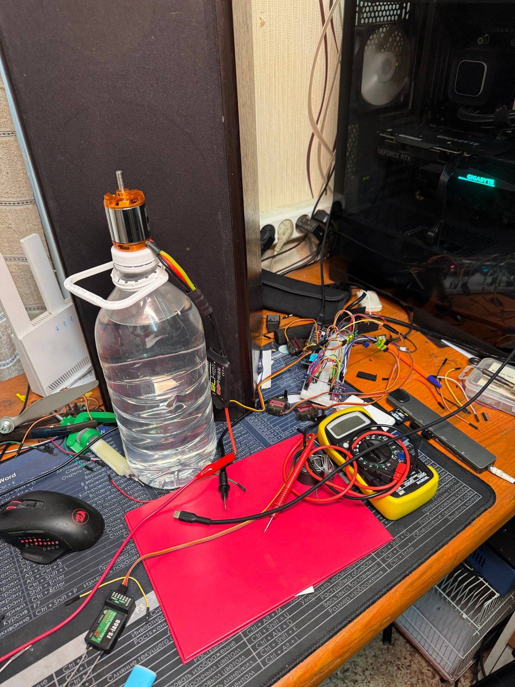</td>
  </tr>
  <tr>
    <td>ESP32-S3-bänken: IMU, barometer, kompass, OLED, servon, mottagare.</td>
    <td>Test av motor- och propellergruppen.</td>
  </tr>
</table>

### 🎥 STM32H743 har vaknat till liv på kortet

Firmwaren för STM32H743 kör på ett DevEBox-kort **utan en enda sensor** och styrs från en vanlig sändare: iBUS-mottagaren, ARM, servon och motor svarar på spakar och brytare i manuellt läge. Hela starten spelades in på video.

▶️ **[Se starten på video](https://t.me/lisnmylife/420)**

Vad det bevisar: kedjan ”sändare → iBUS → firmware → PWM” fungerar på riktig hårdvara, inte bara i tester. Vad som ännu inte är bevisat: inga sensorer (IMU, barometer, GPS) har kopplats till det här kortet, så autopilotlägena har ännu inte provats på det.

---

## 🧪 Kvalitet du kan kontrollera

| | |
|---|---|
| **387 automatiska tester** | moduler, kretsdrivrutiner kontrollerade på registernivå, flygningar i sluten slinga, firmwaren för ESP32 och STM32 **i sin helhet** på en dator; plus 9 tester på själva STM32-kortet med ett riktigt SD-kort |
| **98,3 % av raderna, 87,7 % av grenarna** | täckning med `gcovr`, inklusive STM32-koden |
| **24/24 bygg** | 4 kort × 6 sensorsatser, `-Wall -Wextra`, noll varningar |
| **0 anmärkningar** | cppcheck och clang-tidy över all kod |
| **Referenser, inte kopior av kod** | sensorformlerna följer databladen (Bosch, ST, TDK, Goertek), MAVLink följer pymavlink |

```bash
pio test -e native -e native-stm32   # alla tester, ~1,5 minuter, ingen hårdvara behövs
```

Detaljer – [TESTING.md](TESTING.md).

---

## 🧠 Hur det är uppbyggt

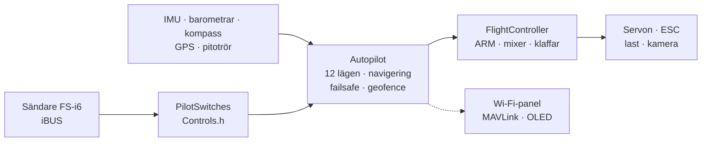

- **Header-only C++**, en enda översättningsenhet, inget dynamiskt minne i flygslingan. Föredrar du `.h/.cpp`? Det finns en parallell gren åt dig, [`feature/split-headers`](https://github.com/damir-lebedev/OpenPlaneProject/tree/feature/split-headers): ett skript genererar den från den här, och firmwaren med LTO blir lika stor.
- **HAL** – det enda lagret som känner till mikrokontrollern: ett nytt kort är en ny `Board`, inte en omskriven autopilot.
- **En sensordrivrutin känner inte till bussen**: en klass fungerar både över I2C och SPI.
- **Säkerhet genom ordningsföljd**: förlorad förbindelse > ARM > läge > gas; inget läge kan ge gas förbi ARM.

Detaljer – [ARCHITECTURE.md](ARCHITECTURE.md).

---

## 🚀 Snabbstart

```bash
pip install platformio
git clone https://github.com/damir-lebedev/OpenPlaneProject && cd OpenPlaneProject
pio run -e stm32h743-devebox -t upload                    # DevEBox H743: USB DFU, konsol via USB
pio run -e esp32-s3 -t upload && pio device monitor     # ESP32-S3
pio run -e stm32h743 -t upload                            # STM32H743 (ST-Link)
```

DevEBox: kortet har ingen BOOT0-knapp – före den första uppladdningen ansluter du stiftet BT0 till 3V3 och trycker på RST; därefter startar tangenten `D` i konsolen om kortet i bootloadern av sig självt ([detaljer](DEVELOPER_GUIDE.md#stm32h743)).

I seriemonitorn: `h` – meny, `b` – vilka kretsar som syns på bussarna, `s` – sensorer, `p` – test av utgångar (ta bort propellern!). Sedan – [pilothandboken](PILOT_GUIDE.md).

---

## 🟢 Ärlig status

| Vad | Var det har verifierats |
|---|---|
| Manuell styrning, mixer | ✈️ under flygning (första prototypen, C3) |
| ARM, failsafe, klaffar, servon, motor | 🔧 på bänken (S3) |
| STABILIZE | 🔧 på bänken: roderytorna reagerar på lutning åt rätt håll |
| Bänksensorer (MPU6500, BMP388, QMC5883P), OLED, panel | 🔧 på bänken |
| Övriga lägen, navigering, pitotrör, MAVLink | 🧪 tester och simuleringar i sluten slinga |
| Nya sensorer (LSM6DSV, ICM-45686, QMC6309, SPL06, BMP581) | 🧪 registeremulatorer byggda efter databladen |
| STM32H743: SD-kort, svart låda, konsol via USB | 🔧 på DevEBox-kortet (tester på kortet) |
| STM32H743: iBUS, ARM, PWM till servon och motor, manuell styrning | 🔧 på kortet utan sensorer, inspelat på video |
| STM32H743: sensorer (IMU, barometer, kompass, GPS) och autopilotlägen | 🧪 hela firmwaren på en dator; inga sensorer anslutna till kortet ännu |

Flygplansmodellen i simuleringarna är förenklad, och koefficienterna är startvärden. Varje nytt läge provas först på höjd, med fingret på MANUAL-brytaren.

---

## 🗺️ Färdplan

- [x] Manuell styrning, ARM, failsafe, objektorienterad firmware, webbpanel
- [x] ESP32-S3-bänk med alla sensorer – live
- [x] 12 lägen, GPS-navigering, RTH vid förlorad förbindelse, geofence
- [x] Brytare och rattar på en rad, lastsläpp, kamera, autotrimning
- [x] Pitotrör av två barometrar, överstegringsskydd
- [x] Nya sensorer: LSM6DSV, ICM-45686, QMC6309, SPL06, BMP581
- [x] STM32H743: fullständig firmware, MAVLink, inställningar i flash
- [x] Simuleringar i sluten slinga av alla lägen, hela firmwaren i tester
- [x] Svart låda: flygningar till flash (ESP32-S3) och till SD-kort (STM32H743), hämtning och avkodning till CSV
- [x] STM32H743 kör på kortet: sändare → iBUS → servon och motor (utan sensorer, på video)
- [ ] STM32H743: koppla in sensorerna och gå igenom bänken på samma sätt som med ESP32-S3
- [ ] Flygprov av autopiloten på den nya flygplansstommen
- [ ] Ett eget flygkontrollerkort ([FC_BOARD.md](FC_BOARD.md)) med STM32H743
- [ ] Flygning längs vägpunkter, MAVLink-uppdrag
- [ ] Adaptiv återkoppling (ett utkast är redan verifierat i simulering)
- [ ] Ström- och batterisensor, telemetri till sändaren (iBUS-SENS)
- [ ] Autonom leverans: rutt → lastsläpp → hem

Detaljer – [ROADMAP.md](ROADMAP.md).

---

## 💼 För partner och investerare

Små leveransflygplan och övervakningsflygplan är antingen slutna, dyra plattformar eller spridda hobbyprojekt. OpenPlane siktar på mitten: **en öppen, verifierbar autopilot på massmarknadshårdvara**, där varje funktion täcks av tester och kan anpassas till en uppgift – leverans av läkemedel till svåråtkomliga platser, övervakning av åkrar och skogar, sökinsatser.

Det som redan är gjort med egna resurser: en arkitektur som flyttar mellan kort utan att skrivas om; en autopilot med en full uppsättning lägen; en testinfrastruktur där nya funktioner kommer till snabbt och inte förstör gamla. Vad ytterligare resurser skulle påskynda: flygprov, ett eget flygkontrollerkort med STM32H743, flygning längs vägpunkter och lastsläpp. Var och varför – [ROADMAP.md](ROADMAP.md).

---

## 📚 Dokumentation

| Dokument | För vem |
|---|---|
| [AUTOPILOT_GUIDE.md](AUTOPILOT_GUIDE.md) | piloten: varje läge, funktion och ratt, hur de läggs på en brytare, pitotröret, markstationen |
| [PILOT_GUIDE.md](PILOT_GUIDE.md) | montering, stiftbeläggning, sändare, failsafe, första flygningen |
| [DEVELOPER_GUIDE.md](DEVELOPER_GUIDE.md) | utvecklaren: filer, teckenkonventioner, API, hur man lägger till en sensor, ett läge eller ett kort |
| [ARCHITECTURE.md](ARCHITECTURE.md) | lager, uppgifter, styrcykeln, tillståndsmaskiner |
| [TESTING.md](TESTING.md) | tester, simuleringar, täckning, analys |
| [reference/](reference/README.md) | en referens för varje klass |
| [FC_BOARD.md](FC_BOARD.md) · [ROADMAP.md](ROADMAP.md) | flygkontrollerkortet · vart projektet är på väg |
| [airframe/](airframe/README.md) | Astro-Cargo-stommen: Fusion 360-projekt och STL-filer för utskrift, kända brister i version v2 |

> **Närliggande projekt:** [esp32-rc-joystick](https://github.com/damir-lebedev/esp32-rc-joystick) – FS-i6-sändaren som USB-joystick för en simulator, på samma ESP32-S3: flyg först in dina timmar i simulatorn, sedan på fältet.

---

## 🤝 Bidra

Vi behöver händer och huvuden: aerodynamik och modellflyg, 3D-utskrift och hållfasthet, inbyggd C++, sensorer och autopiloter, markgränssnitt. Ärenden och pull requests går till grenen `main`; börja med [DEVELOPER_GUIDE.md](DEVELOPER_GUIDE.md).

## 📜 Licens

[OpenPlane License](LICENSE.md) är en licens baserad på MIT med ytterligare villkor. Koden, dokumentationen och modellfilerna får användas, kopieras, ändras och säljas, även i kommersiella produkter. Villkoren är:

1. **Ange upphovspersonen – Damir Lebedev (Damn / Проклятый).** Namnet ska finnas där användarna av din produkt ser det: i dokumentationen, README-filen eller på en ”Om”-sida. Behåll licenstexten tillsammans med koden.
2. **Militär användning är förbjuden.** Projektet får inte användas av arméer och paramilitära organisationer, i krig eller för att skapa vapen, ammunition eller bär- och målsökningssystem.
3. **Skada inte avsiktligt människor eller egendom utan deras skriftliga förhandsmedgivande till just den skadan.** Du får förstöra din egen utrustning om den inte hotar någon: till exempel skjuta på din egen drönare med ett luftvapen. Att lemlästa och döda människor är inte tillåtet.
4. **Följ säkerhetsreglerna och lagen** när du bygger, testar och flyger.

Om villkoren bryts upphör tillståndet att använda projektet. På grund av förbuden mot vissa typer av användning är detta inte en ”öppen” licens i OSI:s mening: koden är tillgänglig att läsa, kopiera och ändra, men formellt är projektet source-available, inte open source.

Endast den engelska texten i filen [LICENSE](LICENSE.md) har rättslig verkan: översättningar av licensen till andra språk tillhandahålls för bekvämlighetens skull.

Firmwaren styr ett luftfartyg och är inte certifierad. Allt du gör med den sker på egen risk; upphovspersonen tar inget ansvar.

```text
OpenPlane © 2026 Damir Lebedev (Damn / Проклятый) — https://github.com/damir-lebedev/OpenPlaneProject
```

<p align="center"><i>Den första prototypen gick sönder redan på sin första flygning – och därför är allt här öppet: kod, tester, problem. Bygg den, krascha den, laga den tillsammans med oss.</i></p>
