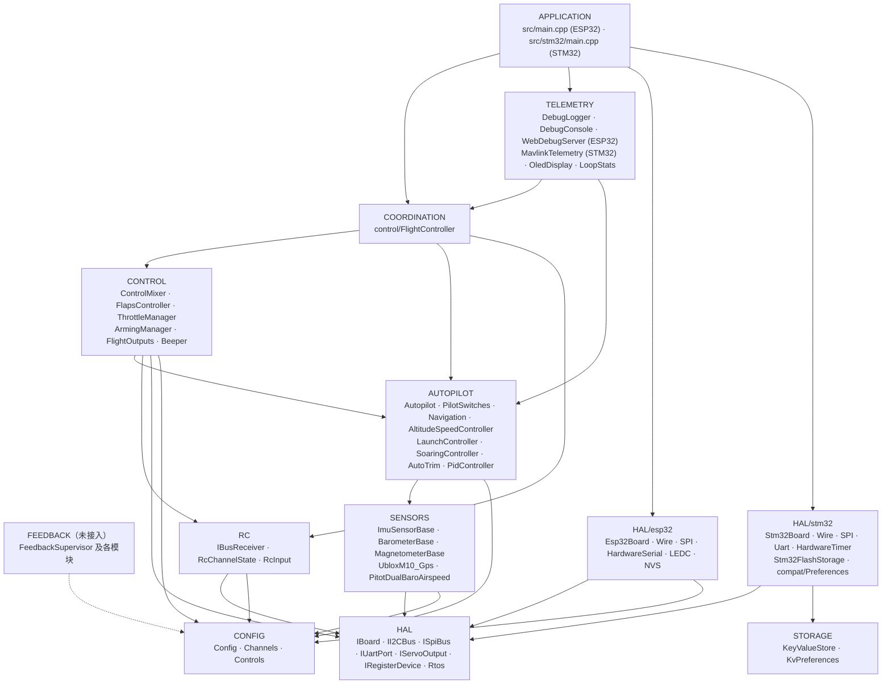
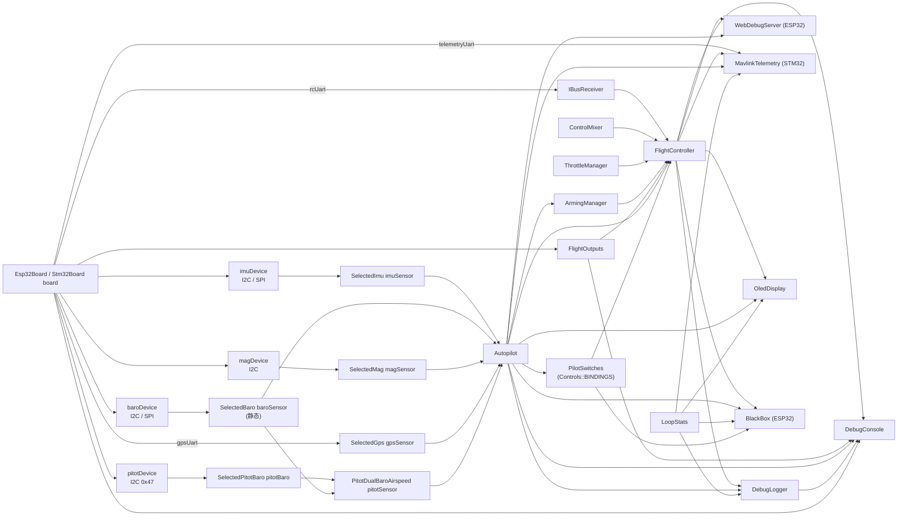
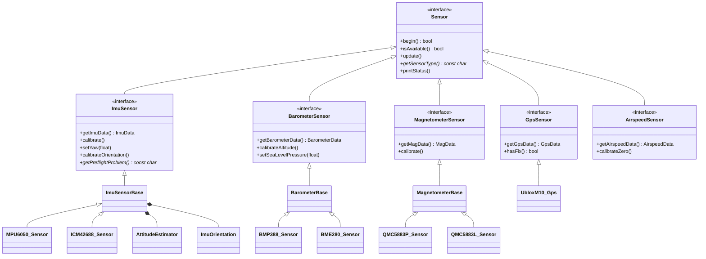
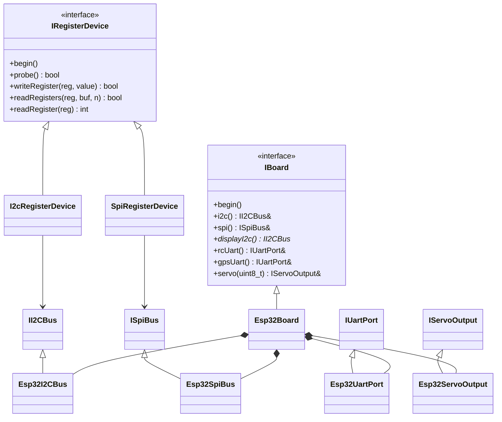
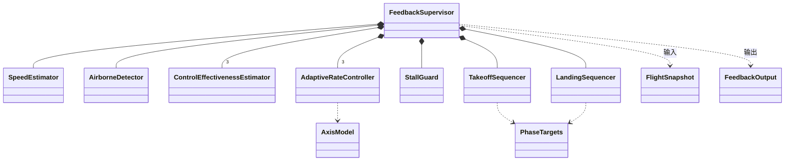
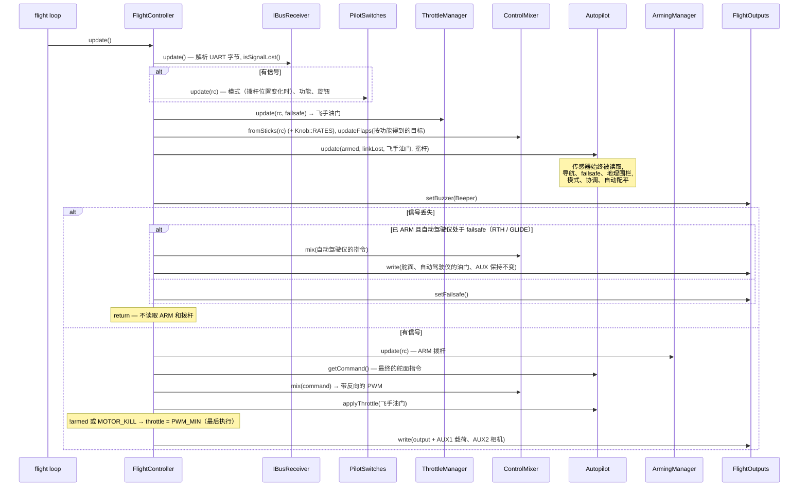
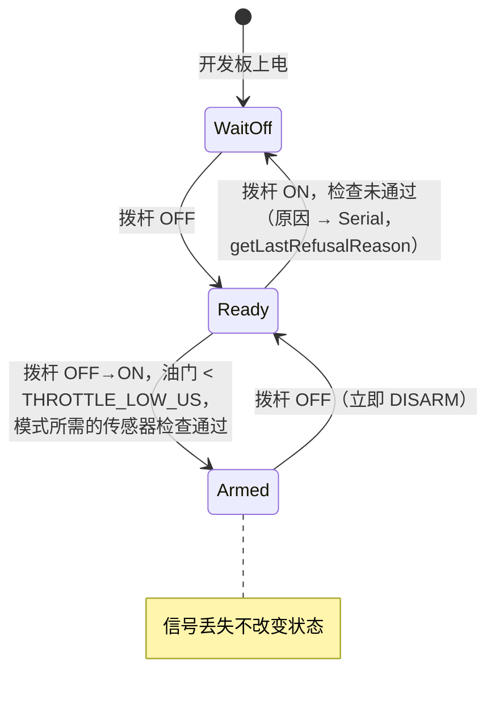
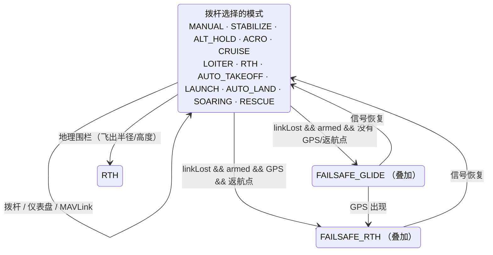
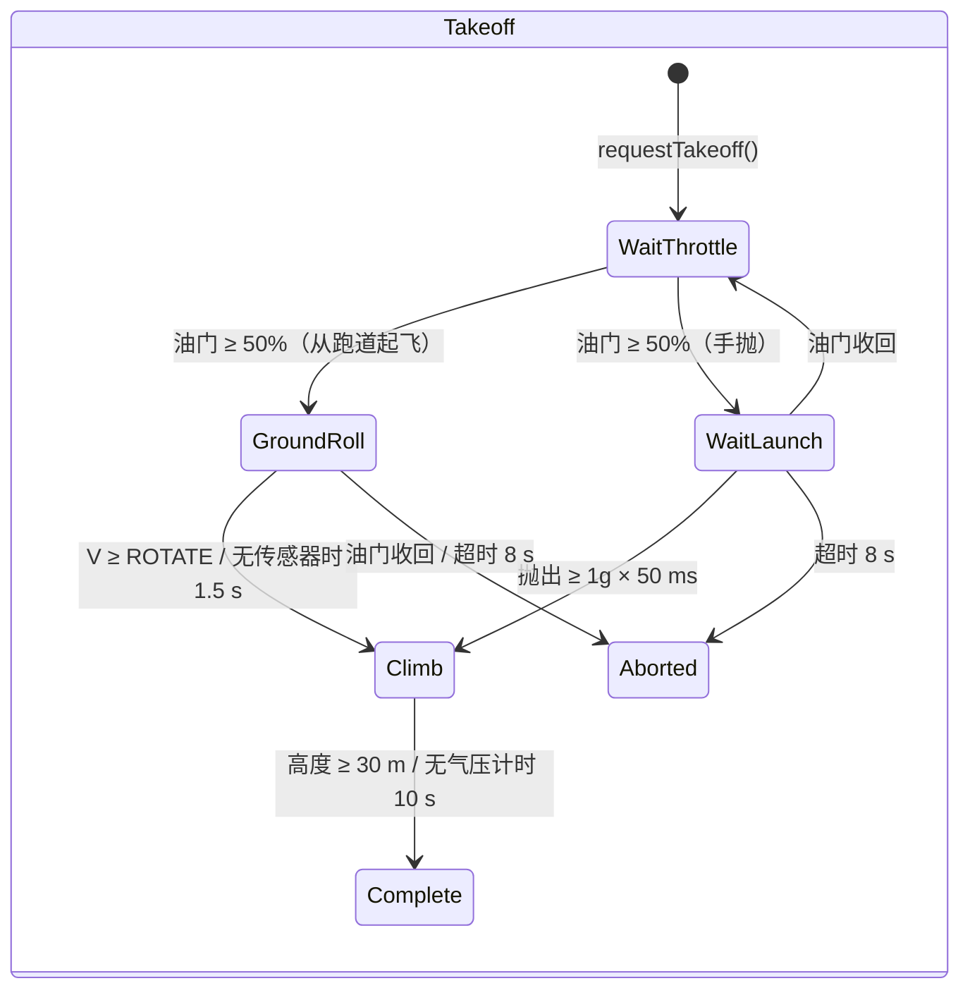
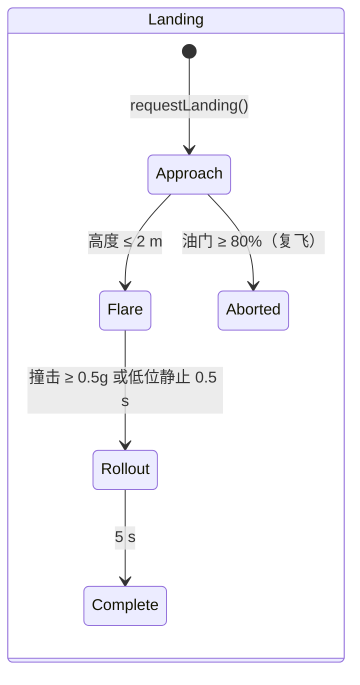

# ARCHITECTURE.md——OpenPlaneProject 固件架构

> 🌐 本页是[俄语原文](../../ARCHITECTURE.md)的译文。译文与原文如有出入，以原文为准。固件的控制台信息以俄语输出，因此文中照原样引用。 本译文由 AI 完成，未经母语者审校。如发现错误，请联系 [Damir Lebedev](https://github.com/damir-lebedev)，或在[问题追踪页](https://github.com/damir-lebedev/OpenPlaneProject/issues)中提出。

本文说明**整套固件是如何构成的**：各层及层间的依赖规则、对象图、FreeRTOS 线程模型、每个控制周期内的操作顺序、状态机、传感器容错策略和扩展点。每个类的详细参考（公开 API、字段、不变式）见 [`reference/`](reference/README.md)。

相关文档：

| 文档 | 内容 |
|---|---|
| [`DEVELOPER_GUIDE.md`](DEVELOPER_GUIDE.md) | 实用指南：符号约定、HTTP API、控制台、如何添加传感器/模式/开发板 |
| [`reference/`](reference/README.md) | 所有类、结构体和命名空间的参考 |
| [`TESTING.md`](TESTING.md) | 测试：原生测试（在电脑上，带覆盖率）和开发板上的测试 |
| [`PILOT_GUIDE.md`](PILOT_GUIDE.md) | 组装、引脚分配、遥控器、首飞 |
| [`ROADMAP.md`](ROADMAP.md) | 项目的发展方向 |

> 状态：ESP32-S3 台架已连同全部传感器验证，**自动驾驶仪尚未在飞行中试过**，反馈回路（`autopilot/feedback/`）**尚未接入**固件，只通过仿真验证。

---

## 目录

1. [原则](#1-原则)
2. [分层与依赖规则](#2-分层与依赖规则)
3. [对象图（composition root）](#3-对象图composition-root)
4. [类的层次结构](#4-类的层次结构)
5. [FreeRTOS 任务与数据隔离](#5-freertos-任务与数据隔离)
6. [控制周期：`FlightController::update()`](#6-控制周期flightcontrollerupdate)
7. [状态机](#7-状态机)
8. [容错：传感器、通信、输出](#8-容错传感器通信输出)
9. [配置与构建变体](#9-配置与构建变体)
10. [反馈回路（未接入）](#10-反馈回路未接入)
11. [扩展点](#11-扩展点)
12. [可测试性](#12-可测试性)

---

## 1. 原则

| 原则 | 实现方式 |
|---|---|
| **纯头文件 C++** | 所有类都定义在 `include/<层>/` 下的头文件中。固件唯一的编译单元是 `src/main.cpp`（ESP32）或 `src/stm32/main.cpp`（STM32）。飞行循环中不使用动态内存（`String` 字符串只出现在网页服务器和 OLED 中）。拆分为 `.h/.cpp` 的版本在单独的分支 `feature/split-headers` 中：由 `tools/split_headers.py` 生成，差异和固件大小见该分支的 `docs/SPLIT_HEADERS.md`。 |
| **Composition root** | `src/main.cpp` / `src/stm32/main.cpp` 是唯一创建对象并通过引用/指针把它们连接起来的地方。其中没有飞行逻辑。 |
| **一行一个拨杆** | 遥控器各通道的作用由表 `config/Controls.h`（`Bind::modes/mode/feature/knob`）决定，构建时用 `static_assert` 检查。 |
| **依赖倒置** | 上层依赖接口（`IBoard`、`IRegisterDevice`、`ImuSensor*` 等），而不是具体的芯片和 MCU。 |
| **可空依赖** | 自动驾驶仪、拨杆（`PilotSwitches`）和所有传感器都以指针传入，可以是 `nullptr`：没有传感器时，模式会安全地运行，而不是崩溃。 |
| **按优先级保证安全** | 周期内的操作顺序就是优先级：信号丢失 > ARM > 摇杆/自动驾驶仪 > 油门。关于油门的 ARM 检查放在最后。 |
| **统一的符号约定** | 从 IMU 到舵机全程采用航空符号约定；每个舵机的方向只在一个地方设置（`Config::*_REVERSED`）。 |
| **时间作为参数** | 只要可能（襟翼、反馈模块），时间都作为参数传入，而不是从 `millis()` 读取——这使这些类具有确定性且便于测试。 |
| **如实的诊断** | 每个传感器和输出都区分“构建中没有”（`attached`）和“有，但没有响应”（`available`）；这在 JSON、日志和 OLED 上都能看到。 |

---

## 2. 分层与依赖规则



规则：

1. **HAL 是唯一了解 MCU 的层。** 只有 `include/hal/esp32/` 和 `include/hal/stm32/` 会包含 `<Wire.h>`、`<SPI.h>`、`HardwareSerial`，并调用 `ledc*` / `HardwareTimer` / 闪存。FreeRTOS 任务通过 `hal/Rtos.h` 创建（ESP32 上固定在核心 0，STM32 上指定优先级）。设置存储：代码写的是 `<Preferences.h>`——在 ESP32 上是 NVS，在 STM32 上是基于 `storage/KeyValueStore.h` 的 `hal/stm32/compat/Preferences.h`。有意为之的例外：`SpiRegisterDevice` 用标准的 Arduino `pinMode/digitalWrite` 切换 CS（在 ESP32 和 STM32 上一致）。
2. **传感器驱动不了解总线。** 它们拿到的是 `IRegisterDevice&`（I2C 地址或 SPI 的 CS）或 `IUartPort&`。总线在 `sensors/SensorSelection.h` 中选择。
3. **RC 和 Outputs 对飞机一无所知**：iBUS 字节 → 通道；PWM 值 → 输出。
4. **Control 和 Autopilot** 是针对数据的纯逻辑：没有 UART、PWM 和 Wi-Fi。
5. **Coordination**（`FlightController`）是唯一能同时看到多个下层并决定操作顺序的类。
6. **Telemetry** 只通过 const 取值函数读取状态；来自仪表盘的命令经过“邮箱”，由飞行循环执行；MAVLink（`MavlinkTelemetry`）直接在飞行循环中运行，并自行执行命令。
7. **下层永远不包含上层。** 如果下层的类需要上层，就把这部分逻辑上移到 `FlightController`。

`ArmingManager`（CONTROL）从 `Autopilot` 读取模式——这是 CONTROL → AUTOPILOT 唯一的横向依赖：ARM 检查取决于所选模式需要哪些传感器。

---

## 3. 对象图（composition root）

所有对象都是具有静态存储期的全局对象，在 `src/main.cpp` 中创建。它们之间的引用和指针都是**非拥有**的；构造顺序与声明顺序一致（单一编译单元）。



`setup()` 中的初始化顺序：

```
Serial (ESP32: 发送缓冲 4 KB; STM32: SERIAL_TX_BUFFER_SIZE=1024), 115200 → 启动横幅
board.begin()               — I2C/SPI 总线（若有第二条 I2C 则一并初始化）
flightOutputs.begin()       — PWM 通道; 紧接着 setFailsafe()
[STM32] 从闪存读取设置      — KeyValueStore::mount(), 映像 CRC
setupSensors()              — 逐个传感器 begin(); 对有响应的做校准:
                              IMU (静止 2 s + 飞行前检查),
                              气压计 (零高度), 电子罗盘 (初始航向 → IMU yaw),
                              皮托管 (零点在循环的第一秒内采集)
autopilot.begin()           — 从 NVS/闪存读取配平
flightController.begin()    — setFailsafe() + UART iBUS
oledDisplay.begin(...)      — 独立任务 (hal/Rtos.h)
[ESP32] webDebugServer.begin() — 接入点 + 运行在核心 0 上的独立任务
[ESP32] blackBox.begin()   — blackbox 分区, PSRAM 中的队列, 运行在核心 0 上的 bbox 任务
[STM32] mavlink.begin()     — 数传电台的 UART4
[STM32] setupBlackBox()    — SD 卡, BLACKBOX.BIN 文件, blackBox.begin(), bbox 任务
pilotSwitches.printBindings() — 打印各拨杆的功能
debugLogger.begin()         — 日志设置
[STM32] flight / storage 任务 → vTaskStartScheduler()
```

---

## 4. 类的层次结构

### 传感器



基类（`ImuSensorBase`、`BarometerBase`、`MagnetometerBase`）实现了**模板方法**（Template Method）模式：公开的 `update()`/`calibrate()` 只写一次，芯片驱动只需实现受保护的“原语”（`readSample()`、`isNewSampleReady()`、`readRaw()`、比例系数）。

### HAL



### 反馈回路



---

## 5. FreeRTOS 任务与数据隔离

**ESP32**（双核，FreeRTOS 内置于 Arduino 核心）：

| 核心 | 任务 | 作用 | 周期 |
|---|---|---|---|
| 1 | Arduino `loopTask` → `loop()` | `WebDebugServer::applyPendingCommands()` → `FlightController::update()` → `DebugLogger::update()` → `DebugConsole::update()` → `LoopStats::record()` → `BlackBox::update()` | `Config::LOOP_PERIOD_MS` = 2 ms（500 Hz），`vTaskDelayUntil` |
| 0 | `web`（8 KB 栈，优先级 1） | `WebServer::handleClient()` | 每 2 ms（`vTaskDelay`） |
| 0 | `oled`（4 KB 栈，优先级 1） | 通过第二条 I2C 总线执行 `OledDisplay::draw()` | 200 ms（`vTaskDelayUntil`） |
| 0 | `bbox`（6 KB 栈，优先级 2） | `BlackBox::writerStep()`：把队列中的一页写入闪存；在地面时——擦除 | 每个周期结束后由 `loop()` 通知（否则每 20 ms 一次） |
| 0 | ESP-IDF 的 Wi-Fi 协议栈 | 接入点 | — |

**STM32H743**（单核，STM32duino FreeRTOS，按优先级抢占）：

| 优先级 | 任务 | 作用 | 周期 |
|---|---|---|---|
| 5 | `flight`（16 KB） | `FlightController::update()` → `MavlinkTelemetry::update()` → `DebugLogger::update()` → `DebugConsole::update()` → `LoopStats::record()` | 2 ms，`vTaskDelayUntil` |
| 1 | `oled`（4 KB） | 通过第二条 I2C 总线执行 `OledDisplay::draw()` | 200 ms |
| 1 | `storage`（2 KB） | `Stm32FlashStorage::service()`——擦除并写入设置扇区 | 100 ms |
| 2 | `bbox`（8 KB） | `BlackBox::writerStep()`：把队列中的一页写入 SD 卡；在地面时——擦除。会被飞行任务抢占 | 每个周期结束后通知（否则每 20 ms 一次） |

**数据隔离规则：**

- `web` 和 `oled` 任务**只读取**状态（`FlightController`、`Autopilot`、`LoopStats`、传感器），且只通过 const 取值函数。各字段都是独立的 16/32 位值，不会出现“撕裂”的读取；最坏的情况下，看到的是相邻周期的数值。
- 来自仪表盘的**命令**（`/api/setmode`、`/api/setpid`）**不会**在 `web` 任务中直接执行：它们在 `portMUX` 自旋锁保护下放入 `PendingCommands`，由飞行循环在 `applyPendingCommands()` 中取走——对自动驾驶仪的修改总是发生在拥有它的任务的上下文中。
- `LoopStats::hz/avgUs/maxUs` 是 `volatile uint32_t`；`takePeakUs()` 只在 `loop()` 中调用。
- `OledDisplay` 把总线指针保存在静态变量中（U8g2 的 C 回调不接受上下文）；机上只有一块屏幕。

**实时性：**

- 周期由 `vTaskDelayUntil` 保持，而不是在工作之后调用 `delay()`。在长时间阻塞（从控制台发起的校准，> 100 ms）之后，计时会重新开始——错过的周期不会成批追赶。
- I2C 事务的超时是 5 ms（`Wire` 默认是 50 ms）。
- `Serial` 的发送缓冲为 4 KB——一行日志不会阻塞循环。
- 黑匣子：循环只把快照放入队列（自旋锁，微秒级）；写入闪存的整页（会让两个核心停顿约 0.6–0.9 ms）由 `bbox` 任务在周期结束后立即完成——利用循环的空隙。擦除闪存只在未 ARM 且未记录时进行，在空中绝不进行。
- ESP32：写闪存（NVS、Wi-Fi 设置）会让两个核心停顿约 0.3–0.4 s，因此：Wi-Fi 使用 `persistent(false)`；日志设置只在未 ARM 时保存；校准只在未 ARM 时进行；自动配平——在 DISARM 之后、并且只有飞机静止时才写入（`Autopilot::looksLanded()`）。
- STM32：`Preferences::end()` 只是复制映像（微秒级），而擦除扇区（秒级）在 `storage` 任务中进行。设置扇区位于闪存的 bank 2，代码位于 bank 1：飞行任务可以抢占写入过程并继续运行。
- MAVLink 不会阻塞循环：只有当 UART 缓冲区有空间时（`IUartPort::availableForWrite()`）才发送帧，否则等到下一个周期。

---

## 6. 控制周期：`FlightController::update()`



控制周期的关键不变式：

- **信号丢失**——拨杆设定的模式和功能不变；ARM 既不读取也不复位；电机只按自动驾驶仪的 failsafe 决定（带电机的 RTH）或 `FAILSAFE_THROTTLE` 运转。
- **任何模式都不能让油门绕过 ARM**：`!armed` 和 `MOTOR_KILL` 时强制设为 `PWM_MIN` 的操作位于 `Autopilot::applyThrottle()` 之后。
- **自动驾驶仪给出最终指令**（`getCommand()`）；在增稳类模式中，摇杆表示期望角度；修正量 = 指令 − 摇杆（用于日志和仪表盘）。在进入混控器之前，一切都采用同一套符号（`ControlCommand`）。

---

## 7. 状态机

### ARM (`ArmingManager`)



`WaitOff` = `armed == false && switchSeenOff == false`; `Ready` =
`armed == false && switchSeenOff == true`.

### 自动驾驶仪模式（`Autopilot` + `PilotSwitches`）

共十二种模式（`AutopilotTypes.h`），各自的作用见 [AUTOPILOT_GUIDE.md](AUTOPILOT_GUIDE.md#模式)。模式由 `PilotSwitches` 按 `config/Controls.h` 表选择：模式拨杆（`Bind::modes`）和“叠加模式”拨杆（`Bind::mode`，上面的一行优先）。只有在拨杆的**最终结果发生变化**时才会调用 `setMode()`——所以从仪表盘或 GCS 选择的模式会一直保持，直到飞手拨动拨杆。



failsafe 不是单独的 `AutopilotMode`，而是叠加在当前模式之上的标志；已经开始的返航不会因为 GPS 短暂丢失而转入滑翔；信号恢复后继续执行拨杆选择的模式（自动起飞和手抛起飞——只能重新开始）。内部状态机：`LaunchController`（IDLE → READY → THROWN → CLIMB → DONE）和 `SoaringController`（GLIDE → THERMAL → MOTOR_CLIMB → RETURN）。

**AUTO_TAKEOFF**（从开始计时，在 armed 且油门 ≥ 1500 µs 时）：

| 时间 | 油门（程序设定） | 俯仰 |
|---|---|---|
| 0–1 s | 从 0 平滑增加到 100 % | 0° |
| 1–3 s | 100 % | +15° |
| > 3 s | 100 % | +10° |

### 起飞与降落（反馈回路，未接入）





---

## 8. 容错：传感器、通信、输出

### 传感器

| 传感器 | `isAvailable()` 变为 `false` 的条件 | 读取失败时的处理 |
|---|---|---|
| IMU（`ImuSensorBase`） | `begin()` 未能识别芯片，**或者**连续 50 次读取错误（500 Hz 下约 0.1 s） | 数据不会被覆盖，`errorCount++`；恢复后重新变为可用 |
| 气压计（`BarometerBase`） | 连续 100 次错误（每 5 ms 轮询一次时约 0.5 s） | 同上 |
| 电子罗盘（`MagnetometerBase`） | 连续 25 次错误（50 Hz 下约 0.5 s） | 同上 |
| GPS（`UbloxM10_Gps`） | 一次有效的 NAV-PVT 都没有，**或者**最近一次早于 `GPS_TIMEOUT_US`（2 s）之前 | — |

此外，IMU 还有**飞行前检查**（`getPreflightProblem()`）：校准陀螺仪时保持静止、|a| ≈ 1g、“上”方向与保存的安装姿态一致。检查未通过时——`Autopilot::imuReady() == false`（所有模式下修正量都为零，包括滑翔），并且 `ArmingManager` 不会为带增稳的模式执行 ARM。

各使用方的反应一致：**没有传感器（`nullptr`）或传感器不可用——不产生任何影响**，飞机按 MANUAL 方式操纵。

### 通信（`IBusReceiver::isSignalLost()`）

两个相互独立的判据：

1. 超过 `RX_TIMEOUT_US`（500 ms）没有正确的帧——或者自上电以来一帧都没有；
2. 帧中的油门低于 `RX_FAILSAFE_THROTTLE_US`（950 µs）——这是在遥控器中设定的 failsafe（FS-iA6B 在遥控器丢失时不会停止发送帧）。

CRC 错误的帧会被丢弃并计数（`getBadFrameCount()`）。

### 输出

`FlightOutputs::begin()` 之后立即执行 `setFailsafe()`——舵面回中、电机关闭，这发生在读取传感器之前。引脚为 `-1` 的输出（C3 上的方向舵）直接不接入；JSON 中的 `attached` 表示是否分配了 LEDC 通道。每个引脚上的实际脉冲由 `printPulseSelfTest()` 检查（控制台命令 `p`）。

---

## 9. 配置与构建变体

| 内容 | 位置 | 选择方式 |
|---|---|---|
| 开发板（引脚） | `include/config/Config.h` | 来自 `platformio.ini` 中 `[env:*]` 的宏 `BOARD_ESP32_S3` / `BOARD_ESP32_C3` / `BOARD_ESP32_CLASSIC` / `BOARD_STM32H743` |
| 所有设置（超时、舵面行程、反向、failsafe、Wi-Fi） | `Config.h`，命名空间 `Config` | `constexpr`，直接修改文件 |
| RC 通道的分配 | `include/config/Channels.h` | 直接修改文件 |
| 传感器与总线 | `include/sensors/SensorSelection.h` | `#define SENSOR_IMU/BARO/MAG/GPS`，也可以用 `-D` 参数指定 |
| 反馈常量 | `include/autopilot/feedback/FeedbackConfig.h` | 接入后会迁入 `Config.h` |
| IMU 的安装方式 | NVS（`imu_mpu6050` / `imu_icm42688`）或 `Config::IMU_ROTATION_CW_DEG` | 控制台命令 `o` |
| 电子罗盘校准 | NVS（`qmc5883p` / `qmc5883l`） | 控制台命令 `m` |
| 日志设置 | NVS（`debuglog`） | 控制台菜单 `l` |
| 黑匣子 | `Config.h`（`BLACKBOX_*`），`partitions_blackbox.csv` 中的 `blackbox` 分区 | 飞行记录——`tools/blackbox.py`，控制台菜单 `k` |

PlatformIO 环境：

| `env` | 用途 |
|---|---|
| `esp32-s3`（默认） | 主力飞控 |
| `esp32-c3` | 旧原型机 |
| `esp32-dev` | 经典 ESP32，台架 |
| `stm32h743` | STM32H743VIT6：完整固件（`src/stm32/main.cpp`），设置存于闪存，MAVLink，SD 上的黑匣子，FreeRTOS；已在裸板上验证——见 [reference/hal.md](reference/hal.md#stm32h743-的实现) |
| `stm32h743-devebox` | DevEBox H743：同上，控制台走 USB CDC，通过 DFU 烧录（[DEVELOPER_GUIDE](DEVELOPER_GUIDE.md#stm32h743)） |
| `native` | 在电脑上用 Arduino/ESP-IDF 模拟替身构建并运行测试，带覆盖率——见 [`TESTING.md`](TESTING.md) |

---

## 10. 反馈回路（未接入）

`include/autopilot/feedback/` 是将来用来取代 PID 增稳的部分：轴模型 `ε = b·u + a·ω + c` 由递推最小二乘在飞行中学习（`ControlEffectivenessEstimator`），控制器是通过学到的模型实现的级联：角度 → 角速度 → 角加速度 → 舵面（`AdaptiveRateController`），上层是失速保护（`StallGuard`）以及起飞/降落阶段。

唯一的输入是 `FlightSnapshot`（每个周期的快照），唯一的输出是 `FeedbackOutput`。这些模块不直接读取传感器和 RC，因此既可以在电脑上、也可以在开发板上用闭环仿真（`test/test_feedback`）来验证。

`FeedbackSupervisor::update()` 中每个周期的顺序：

1. 速度和纵向加速度（`SpeedEstimator`），是否在空中（`AirborneDetector`）；
2. 对每个轴训练模型（仅在空中、IMU 正常、襟翼不动、未失速时）；
3. 失速保护（降落时在近地面关闭）；
4. 起飞/降落阶段的目标；
5. 目标 ← 失速保护的限制；
6. 各轴控制器 → 舵面偏转；油门（仅在通信正常时）。

接入计划见 [`DEVELOPER_GUIDE.md`](DEVELOPER_GUIDE.md#接入计划)。

---

## 11. 扩展点

| 任务 | 要修改的内容 | 不必修改的内容 |
|---|---|---|
| 现有类别的新芯片 | 继承基类的新 `*_Sensor.h` + `SensorSelection.h` 中的一个分支 | `main.cpp`、`Autopilot` |
| 新的传感器类别 | `SensorInterface.h` 中的接口、`Autopilot` 中的可空指针、JSON 中的 `attached/available` 字段 | 其余代码 |
| 新的自动驾驶仪模式 | `AutopilotMode`、`handle*Mode()`、`applyThrottle()`、选择器/仪表盘、`ArmingManager::checkFailureReason()` | `FlightController` |
| 新的输出（舵机） | `FlightOutputs::outputInfo()` 中的一行、`FlightOutputState` 中的字段、`ServoChannel` 中的索引、`Esp32Board` 中的引脚和 LEDC 通道 | 写入/状态循环 |
| 新的 ESP32 开发板 | `Config.h` 中的 `#elif`、`platformio.ini` 中的 `[env:*]` | 其余全部代码 |
| 其他 MCU | 实现 `IBoard` 的 `hal/<mcu>/<Mcu>Board.h`（示例——`hal/stm32/`）、`Config.h` 中的引脚块、`[env:*]` | 传感器、飞行逻辑 |
| 其他接收机协议 | 用具有相同 API（`getState()`、`isSignalLost()`）的实现替换 `IBusReceiver` | `FlightController` |
| 新的日志通道 | `LogChannel`、`LogSettings::info()` 中的一行、`DebugLogger::format*()`、`VERSION++` | — |

---

## 12. 可测试性

得益于 HAL 接口和把时间作为参数传入，大部分逻辑无需硬件就能验证：

- **原生测试**（`pio test -e native`）在电脑上编译固件头文件，并使用 Arduino、FreeRTOS、Wire/SPI/UART/LEDC、Preferences、WebServer/WiFi 和 U8g2 的模拟替身（`test/native/support/`）。覆盖率由 `gcovr` 统计。
- **整套固件在电脑上运行**——`src/main.cpp` 配合 S3 和 38 针版的引脚分配及每一套传感器（芯片的寄存器级模拟器），`src/stm32/main.cpp`（`pio test -e native-stm32`）则运行在 STM32duino 模拟替身层之上。
- **闭环飞行仿真**（`test/native/test_sim`）：整套固件驾驶飞机模型——每一种自动驾驶仪模式都是真的在飞，而不只是“输出一串数字”。
- **构建矩阵**（`tools/build_matrix.sh`）：所有开发板 × 所有传感器，无警告。
- **开发板上的测试**（`pio test -e esp32-s3`）：同样的 `test_feedback` 和 `test_imu_orientation` 也在真实的 ESP32-S3 上运行。

详细内容、测试的结构和命令见 [`TESTING.md`](TESTING.md)。
