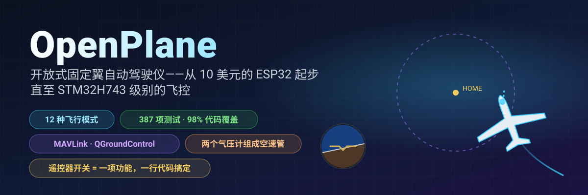
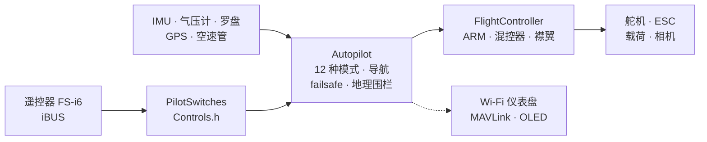

<!-- i18n-bar:start -->
  <p align="center">
    <a href="../../../README.md"> Читать на русском</a>
    &nbsp;·&nbsp;
    <a href="../en/README.md"> Read this in English</a>
    &nbsp;·&nbsp;
     <b>阅读中文版</b>
    &nbsp;·&nbsp;
    <a href="../es/README.md"> Lee esto en español</a>
  </p>
  <p align="center">
    <a href="../hi/README.md"> हिन्दी में पढ़ें</a>
    &nbsp;·&nbsp;
    <a href="../ar/README.md"> اقرأ بالعربية</a>
    &nbsp;·&nbsp;
    <a href="../pt-BR/README.md"> Leia em português</a>
    &nbsp;·&nbsp;
    <a href="../fr/README.md"> Lire en français</a>
  </p>
  <p align="center">
    <a href="../de/README.md"> Auf Deutsch lesen</a>
    &nbsp;·&nbsp;
    <a href="../ja/README.md"> 日本語で読む</a>
    &nbsp;·&nbsp;
    <a href="../ko/README.md"> 한국어로 읽기</a>
  </p>
<!-- i18n-bar:end -->

<p align="center"><sub>🌐 这是<a href="../../../README.md">俄语版 README</a> 的译文。详细文档也已翻译，下文链接指向译文页面。译文与原文如有出入，以原文为准。控制台信息、截图和图表上的文字仍为俄语。</sub></p>

<p align="center">
  
</p>

<p align="center">
  
  
  
  <br>
  
  
  
  <a href="LICENSE.md"></a>
</p>

<h3 align="center">关掉遥控器——飞机会自己飞回家，并在你头顶盘旋。</h3>
<p align="center">这不是动画：<b>整套固件</b>在闭环中驾驶一个飞机模型——输入的是同样的 iBUS 字节，输出的是同样的 PWM。</p>

<p align="center">
  
</p>

---

## ⚡ 30 秒了解

| | |
|---|---|
| **这是什么** | 面向遥控飞机的开放式飞控与自动驾驶仪。现在用的是约 10 美元的 ESP32-S3，下一步是 STM32H743（Pixhawk 级别的开发板）：完整固件已通过全套测试，并且在 DevEBox 板上**已经运行起来，可以用遥控器操控**——[有视频](#-stm32h743-在开发板上跑起来了)。 |
| **能做什么** | 12 种飞行模式——从自稳到返航、GPS 盘旋、手抛起飞、自动降落，还有**热气流翱翔**。用两个廉价气压计做成的空速管。通过 MAVLink 把遥测数据送到 QGroundControl 和 Mission Planner。 |
| **最大亮点** | 遥控器上的任何开关或旋钮 = 任何功能。在 `Controls.h` 里**改一行**，SwD 就不再是 RTH，而变成投放载荷。 |
| **为什么可以信任** | 387 项自动化测试（另有 9 项在带真实 SD 卡的开发板上运行），98% 的代码有测试覆盖，24 种“开发板 × 传感器”组合构建零警告，每种模式都有闭环仿真。 |
| **实话实说** | 目前飞过的只有手动模式（第一架原型机）。STM32H743 目前只在台架上、没有接传感器的情况下验证过。自动驾驶仪已通过台架测试、自动化测试和仿真验证，正等待试飞——[现状见下文](#-真实现状)。 |

---

## 🎛️ 开关 = 功能，只需一行

```cpp
// include/config/Controls.h
constexpr Binding BINDINGS[] = {
    Bind::modes  (Channels::SWC, MODE_MANUAL, MODE_STABILIZE, MODE_AUTO_TAKEOFF),
    Bind::feature(Channels::SWB, Feature::FLAPS),
    Bind::mode   (Channels::SWD, MODE_RTH),              // 开关打开期间就返航
    Bind::knob   (Channels::VRA, Knob::STAB_GAIN),       // “柔和 / 灵敏”，飞行中直接调
    Bind::knob   (Channels::VRB, Knob::CRUISE_SPEED),
};
```

想让 SwD 控制热气流翱翔，而不是 RTH？写 `Bind::mode(Channels::SWD, MODE_SOARING)`。想在 SwB 上投放载荷？写 `Bind::feature(Channels::SWB, Feature::PAYLOAD_DROP)`。如果搞错了——比如把两个模式挂到同一个开关上，或者占用了摇杆——**编译就无法通过**：这张表由编译器检查（`static_assert`）。开机时，飞机会自己打印出哪个开关对应什么。

**12 种模式 · 10 项功能 · 7 个旋钮**——全部配有示例，见[自动驾驶仪手册](AUTOPILOT_GUIDE.md)。

---

## ✈️ 自动驾驶仪能做什么

| | 模式 | 要点 |
|---|---|---|
| 🕹️ | **MANUAL** | 舵面 = 摇杆，和没有飞控时一样 |
| 🧭 | **STABILIZE** | 摇杆设定角度；松手后飞机自己回到水平 |
| 📏 | **ALT_HOLD** | + 用气压计定高 |
| 🌀 | **ACRO** | 摇杆设定旋转速率——用于花式飞行 |
| 🛣️ | **CRUISE** | 航向、高度和速度自己保持；摇杆只做微调 |
| ⭕ | **LOITER** | 围绕 GPS 点盘旋（半径用旋钮调节） |
| 🏠 | **RTH** | 以 40 m 高度返回起点并在头顶盘旋；失去信号时自动启用 |
| 🛫 | **AUTO_TAKEOFF** | 按飞手的油门从跑道起飞 |
| 🤾 | **LAUNCH** | 手抛起飞：抛出后才启动电机，然后爬升 |
| 🛬 | **AUTO_LAND** | 滑翔，并在贴近地面时拉平 |
| 🦅 | **SOARING** | 关闭电机，自己寻找热气流并在其中盘旋 |
| 🆘 | **RESCUE** | “救命”：机翼放平、机头抬起——从任何螺旋中改出 |

此外还有：地理围栏、给“歪”飞机用的自动配平、转弯协调、基于空速管的失速保护、襟翼和减速板、载荷投放、相机增稳，以及“来草丛里找我”的蜂鸣器。

---

## 📈 每种模式都能飞——在闭环中

这不是“某个函数返回了一个数”，而是一次真正的**飞行**：遥控器 → iBUS 帧 → 固件 → PWM → 舵面偏转 → 带有升力、失速、风和热气流的飞机模型 → 传感器 → 再回到固件。14 次这样的飞行是常规测试的一部分（`pio test -e native`）。

<p align="center"></p>

<table>
  <tr>
    <td width="50%"></td>
    <td width="50%"></td>
  </tr>
  <tr>
    <td>🦅 自己找到热气流，并<b>在电机关闭的情况下</b>爬升——总能量升降计不会把“拉杆”误认为上升气流。</td>
    <td>🆘 60° 坡度，几秒后就回到水平。RESCUE 能把飞机从 70° 坡度、机头 −40° 的螺旋中拉出来。</td>
  </tr>
  <tr>
    <td></td>
    <td></td>
  </tr>
  <tr>
    <td>🤾 手抛 → 手离开螺旋桨后才启动电机 → 爬升。🛬 降落：滑翔，并在 3 m 高度拉平。</td>
    <td>🌬️ 用两个<b>有噪声</b>的气压计做成的空速管，两颗芯片之间还有 150 Pa 的偏差——误差小于 0.5 m/s。</td>
  </tr>
</table>

---

## 🌬️ 几乎不花钱的空速管

像样的空速传感器要花掉半块飞控的价钱。这里用的是**两个气压计**：空速管里的 BMP581（测总压）和机身里的主气压计（测静压）。固件会在地面自动校零两颗芯片之间的差值，进行滤波，根据高度和温度计算空气密度，还能发现接反的气管。这样带来的好处：CRUISE 保持的是**空**速，而不是油门；有失速保护；遥测里的速度是可信的。制作方法见[手册](AUTOPILOT_GUIDE.md#自制皮托管)。

---

## 📡 地面站：浏览器或 QGroundControl

<table>
  <tr>
    <td width="46%"></td>
    <td>
      <b>ESP32——飞机上自带的网页仪表盘。</b>热点 <code>OpenPlane-Debug</code>，地址 <code>192.168.4.1</code>：遥控器通道、输出、所有传感器、模式、导航，还能在线切换模式、调整 PID。不用装应用，也不需要额外硬件。<br><br>
      <b>STM32H743——通过数传电台使用 MAVLink。</b>QGroundControl 和 Mission Planner 会把它当作 ArduPilot 飞机：地平仪、标有起点的地图、空速管测得的速度、使用 ArduPlane 名称的模式、参数窗口里的 PID、点按钮切换模式。无法从地面端解锁（ARM），只能用开关：这样更安全。<br><br>
      MAVLink 帧已与标准实现 <code>pymavlink</code> 逐字节核对。
    </td>
  </tr>
</table>

---

## 📼 黑匣子

开发板会记录每一次飞行：500 Hz 的 IMU、姿态角和自动驾驶仪的决策、PID、所有输出、摇杆、气压计、罗盘、GPS、电池和各种事件——从解锁（ARM）并推油门开始，一直到降落，并且包含起飞前的 10 秒。**ESP32-S3** 写入片上闪存（13.9 MB，约 11 分钟），**STM32H743** 写入 SD 卡（64 MB，约一小时；SD 卡仍是普通的 FAT32，固件写入预先创建好的文件 `BLACKBOX.BIN`）。擦除只在地面进行。飞行结束后，`python tools/blackbox.py download` 通过 USB 下载飞行记录并拆分成 CSV；SD 卡里的飞行记录也可以不借助开发板直接解析：`python tools/blackbox.py ring E:/BLACKBOX.BIN`。详情见 [BLACKBOX.md](BLACKBOX.md)。

---

## 🔩 硬件：一套固件——四种开发板，十二种传感器

| 开发板 | 状态 | 已验证的内容 |
|---|---|---|
| **ESP32-S3 N16R8** | ✅ 主力板，台架验证 | 所有传感器、舵机、iBUS、OLED、网页仪表盘实机运行；整套固件通过测试 |
| **ESP32 38-pin** | 🧪 测试 | 整套固件配合 ICM-45686 套件通过测试 |
| **ESP32-C3 SuperMini** | ✈️ 飞过（手动模式） | 第一架原型机；所有套件均可构建 |
| **STM32H743VIT6** | 🔧 DevEBox 板（无传感器）+ 🧪 测试 | 开发板上：启动、USB 控制台、**SD 卡和黑匣子**（板载测试）、**接收 iBUS、解锁（ARM），并用遥控器操控舵机和电机**（启动过程有视频）；电脑上：整套固件——FreeRTOS 任务、闪存、MAVLink、I2C 和 SPI。传感器尚未接到这块板上 |

| 传感器 | 是什么 | 总线 |
|---|---|---|
| **LSM6DSV** + **QMC6309** | IMU + 罗盘（模块） | I2C / SPI |
| **ICM-45686** + **QMC6309** | IMU + 罗盘（替代方案） | I2C / SPI |
| **SPL06-001** | 机身气压计 | I2C / SPI |
| **BMP581** | 空速管里的气压计（或主气压计） | I2C / SPI |
| MPU6050/6500, ICM-42688, BMP388, BME280, QMC5883P/L | 台架用和旧款 | I2C / SPI |
| **u-blox M10** | GPS，10 Hz，UBX | UART |

换传感器只需改一行（`SENSOR_KIT_LSM6DSV_PITOT`），换开发板只需一个构建标志。4 种开发板 × 6 套传感器组合全部零警告构建通过：[`tools/build_matrix.sh`](../../../tools/build_matrix.sh)。

<table>
  <tr>
    <td width="50%"></td>
    <td width="50%"></td>
  </tr>
  <tr>
    <td>ESP32-S3 台架：IMU、气压计、罗盘、OLED、舵机、接收机。</td>
    <td>动力组（电机 + 螺旋桨）测试。</td>
  </tr>
</table>

### 🎥 STM32H743 在开发板上跑起来了

STM32H743 的固件已在**没有任何传感器**的 DevEBox 板上运行，并且可以用普通遥控器操控：iBUS 接收机、解锁（ARM）、舵机和电机在手动模式下都能响应摇杆和开关。整个启动过程都拍成了视频。

▶️ **[观看启动视频](https://t.me/lisnmylife/420)**

这说明了什么：“遥控器 → iBUS → 固件 → PWM”这条链路在真实硬件上跑通了，而不只是在测试里。还没有证明的是：这块板上没有接任何传感器（IMU、气压计、GPS），所以自动驾驶仪的各种模式还没在上面试过。

---

## 🧪 可以自行验证的质量

| | |
|---|---|
| **387 项自动化测试** | 模块、按芯片寄存器层面验证的驱动、闭环飞行、在电脑上**完整运行**的 ESP32 和 STM32 固件；另外在 STM32 板上用真实 SD 卡跑 9 项测试 |
| **98.3% 的代码行，87.7% 的分支** | `gcovr` 覆盖率，包括 STM32 代码 |
| **24/24 次构建** | 4 种开发板 × 6 套传感器组合，`-Wall -Wextra`，零警告 |
| **0 条问题** | 对全部代码运行 cppcheck 和 clang-tidy |
| **以标准为准，而非照搬代码** | 传感器公式依据数据手册（Bosch、ST、TDK、Goertek），MAVLink 依据 pymavlink |

```bash
pio test -e native -e native-stm32   # 所有测试，约 1.5 分钟，不需要硬件
```

详情见 [TESTING.md](TESTING.md)。

---

## 🧠 整体结构



- **纯头文件 C++**，单一编译单元，飞行循环中不使用动态内存。更喜欢 `.h/.cpp`？为你准备了一个平行分支 [`feature/split-headers`](https://github.com/damir-lebedev/OpenPlaneProject/tree/feature/split-headers)：它由脚本从当前分支生成，启用 LTO 后固件大小相同。
- **HAL**——唯一了解 MCU 的一层：新增一块板子只需新增一个 `Board`，不用重写自动驾驶仪。
- **传感器驱动不关心总线**：同一个类既能走 I2C，也能走 SPI。
- **靠操作顺序保证安全**：失去信号 > ARM > 模式 > 油门；没有任何模式能绕过 ARM 把油门推出去。

详情见 [ARCHITECTURE.md](ARCHITECTURE.md)。

---

## 🚀 快速开始

```bash
pip install platformio
git clone https://github.com/damir-lebedev/OpenPlaneProject && cd OpenPlaneProject
pio run -e esp32-s3 -t upload && pio device monitor     # ESP32-S3
pio run -e stm32h743 -t upload                            # STM32H743 (ST-Link)
pio run -e stm32h743-devebox -t upload                    # DevEBox H743：USB DFU，通过 USB 使用控制台
```

DevEBox：板子上没有 BOOT0 按钮——第一次烧录前，把 BT0 引脚接到 3V3 并按一下 RST；之后在控制台按 `D` 键，板子就会自己重启进入引导程序（[详情](DEVELOPER_GUIDE.md#stm32h743)）。

在串口监视器里：`h`——菜单，`b`——查看总线上能看到哪些芯片，`s`——传感器，`p`——检查输出（先拆掉螺旋桨！）。接下来请阅读[飞手指南](PILOT_GUIDE.md)。

---

## 🟢 真实现状

| 项目 | 在哪里验证过 |
|---|---|
| 手动控制、混控器 | ✈️ 实际飞行验证（第一架原型机，C3） |
| ARM、failsafe、襟翼、舵机、电机 | 🔧 台架验证（S3） |
| STABILIZE | 🔧 台架验证：舵面对倾斜的响应方向正确 |
| 台架传感器（MPU6500、BMP388、QMC5883P）、OLED、网页仪表盘 | 🔧 台架验证 |
| 其他模式、导航、空速管、MAVLink | 🧪 测试和闭环仿真 |
| 新传感器（LSM6DSV、ICM-45686、QMC6309、SPL06、BMP581） | 🧪 依据数据手册编写的寄存器仿真器 |
| STM32H743：SD 卡、黑匣子、USB 控制台 | 🔧 DevEBox 板上验证（板载测试） |
| STM32H743：iBUS、ARM、舵机和电机的 PWM、手动控制 | 🔧 无传感器的板子上验证，已录制视频 |
| STM32H743：传感器（IMU、气压计、罗盘、GPS）和自动驾驶仪模式 | 🧪 整套固件在电脑上运行；传感器尚未接到板子上 |

仿真中的飞机模型是简化的，各项系数都是起始值。每个新模式都要先在高空试飞，手指放在 MANUAL 开关上。

---

## 🗺️ 路线图

- [x] 手动控制、ARM、failsafe、面向对象的固件、网页仪表盘
- [x] 装有全部传感器的 ESP32-S3 台架——实机运行
- [x] 12 种模式、GPS 导航、失去信号时 RTH、地理围栏
- [x] 开关和旋钮一行配置、载荷投放、相机、自动配平
- [x] 两个气压计组成的空速管、失速保护
- [x] 新传感器：LSM6DSV、ICM-45686、QMC6309、SPL06、BMP581
- [x] STM32H743：完整固件、MAVLink、闪存中保存设置
- [x] 所有模式的闭环仿真，整套固件纳入测试
- [x] 黑匣子：飞行记录写入闪存（ESP32-S3）和 SD 卡（STM32H743），下载并解析为 CSV
- [x] STM32H743 已在板子上运行：遥控器 → iBUS → 舵机和电机（无传感器，有视频）
- [ ] STM32H743：接上传感器，并像 ESP32-S3 一样走完台架测试
- [ ] 在新机体上对自动驾驶仪进行试飞
- [ ] 基于 STM32H743 的自研飞控板（[FC_BOARD.md](FC_BOARD.md)）
- [ ] 航点飞行、MAVLink 任务
- [ ] 自适应反馈（雏形已在仿真中验证）
- [ ] 电流和电池传感器、向遥控器回传遥测（iBUS-SENS）
- [ ] 自主送货：航线 → 投放载荷 → 返航

详情见 [ROADMAP.md](ROADMAP.md)。

---

## 💼 致合作伙伴和投资人

小型送货飞机和监测飞行器，要么是封闭而昂贵的平台，要么是零散的业余项目。OpenPlane 瞄准的是中间地带：**建立在大众化硬件上、开放且可验证的自动驾驶仪**，每项功能都有测试覆盖，可以针对具体任务进行调整——比如向偏远地区运送药品、监测农田和森林、搜救作业。

我们已经靠自己的力量完成了：可在不同开发板间移植而无需重写的架构；功能齐全的各种飞行模式；以及一套测试体系，有了它，新功能能很快加入，也不会破坏旧功能。额外的资源可以加快：试飞、基于 STM32H743 的自研飞控板、航点飞行和载荷投放。具体方向和原因见 [ROADMAP.md](ROADMAP.md)。

---

## 📚 文档

| 文档 | 适合谁 |
|---|---|
| [AUTOPILOT_GUIDE.md](AUTOPILOT_GUIDE.md) | 飞手：每种模式、功能和旋钮，如何把它们挂到开关上，空速管，地面站 |
| [PILOT_GUIDE.md](PILOT_GUIDE.md) | 组装、引脚定义、遥控器、failsafe、首飞 |
| [DEVELOPER_GUIDE.md](DEVELOPER_GUIDE.md) | 开发者：文件、符号约定、API，如何添加传感器、模式、开发板 |
| [ARCHITECTURE.md](ARCHITECTURE.md) | 分层、任务、控制周期、状态机 |
| [TESTING.md](TESTING.md) | 测试、仿真、覆盖率、分析 |
| [reference/](reference/README.md) | 每个类的参考手册 |
| [FC_BOARD.md](FC_BOARD.md) · [ROADMAP.md](ROADMAP.md) | 飞控板 · 项目的发展方向 |
| [airframe/](airframe/README.md) | Astro-Cargo 机体：Fusion 360 工程和打印用 STL 文件，v2 版本的已知缺陷 |

> **相关项目：** [esp32-rc-joystick](https://github.com/damir-lebedev/esp32-rc-joystick) —— 把 FS-i6 遥控器变成模拟器用的 USB 摇杆，同样运行在 ESP32-S3 上：先在模拟器里积累飞行时长，再去野外飞。

---

## 🤝 参与

我们需要各路人才：空气动力学和航模、3D 打印和结构强度、嵌入式 C++、传感器和自动驾驶仪、地面端界面。Issues 和 pull request 请提交到 `main` 分支；请先阅读 [DEVELOPER_GUIDE.md](DEVELOPER_GUIDE.md)。

## 📜 许可证

[OpenPlane License](LICENSE.md) 是一份以 MIT 为基础、附加了若干条件的许可证。代码、文档和模型文件可以使用、复制、修改和出售，包括用于商业产品。条件如下：

1. **请注明作者——Damir Lebedev (Damn / Проклятый)。** 署名必须出现在你的产品用户能看到的地方：文档、README 或“关于”页面。请把许可证文本与代码放在一起。
2. **禁止军事用途。** 不得将本项目用于军队和准军事组织、战争，或用于制造武器、弹药以及投送和瞄准系统。
3. **未经当事人事先书面同意，不得故意伤害人员或损坏财产。** 只要不危及任何人，你可以弄坏自己的设备：例如，用气手枪射击自己的无人机。伤害或杀死他人则不被允许。
4. **请遵守安全规程和法律**：组装、测试和飞行时均需如此。

如果违反这些条件，使用本项目的许可即告终止。由于对部分用途有禁止性规定，这并不是 OSI 意义上的“开放”许可证：代码可以阅读、复制和修改，但从形式上说，本项目属于源码可用（source-available），而不是开源（open source）。

只有 [LICENSE](LICENSE.md) 文件中的英文文本具有法律效力：其他语言的许可证译文仅供参考。

固件控制的是飞行器，未经任何认证。你用它做的一切都由你自行承担风险；作者不承担任何责任。

```text
OpenPlane © 2026 Damir Lebedev (Damn / Проклятый) — https://github.com/damir-lebedev/OpenPlaneProject
```

<p align="center"><i>第一架原型机在首飞中就损坏了——所以这里一切都摆在明处：代码、测试、问题。来组装它、折腾它、和我们一起修好它吧。</i></p>
